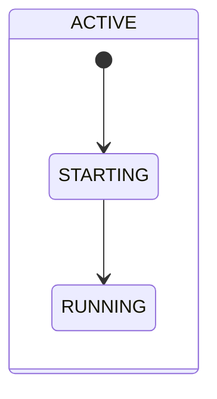
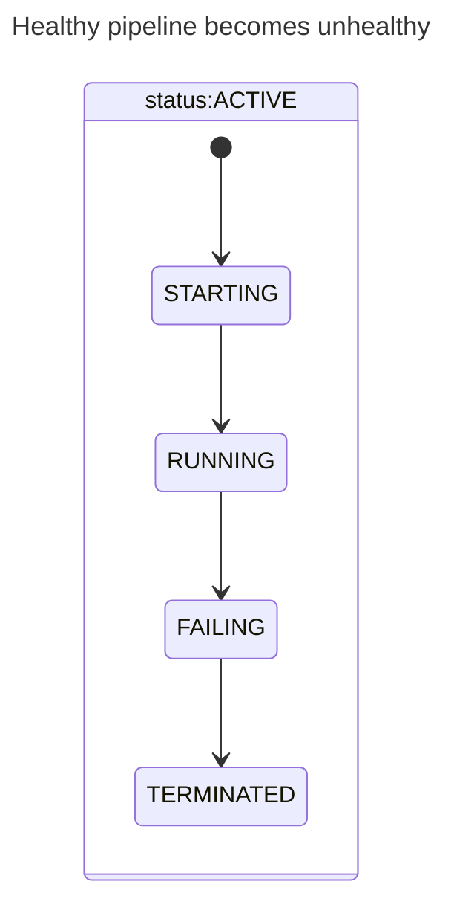
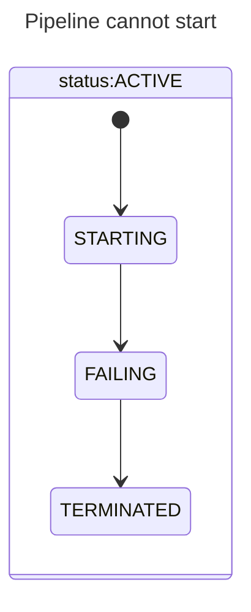
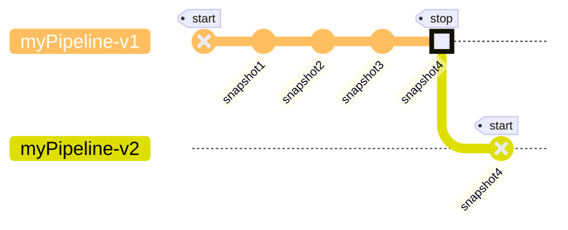

# Goldsky Documentation

Scraped from docs.goldsky.com

Total pages: 46

---

## 1. Shared vs. dedicated

**URL:** https://docs.goldsky.com/subgraphs/serverless-vs-dedicated

# Shared vs. dedicated

## Serverless subgraphs

When you make a new subgraph on Goldsky, by default it's hosted on our highly resilient **Serverless Subgraph Platform**.

The platform is fully autoscaling, with a re-engineered RPC and storage layer, and is tuned for fast indexing across the majority of use-cases. It's also completely backwards compatible and runs the same WASM engine as the vanilla open-source graph-node engine.

- Optimized RPC multi-provider layer with a global cache that uses a combination of dedicated and commercial RPC APIs for uptime
- I/O optimized database with under 1ms average commit times

## Dedicated subgraph indexers

When you need improved customizability and performance, Goldsky offers dedicated subgraph indexing nodes. Dedicated machines are provisioned for your project, allowing for customization and optimization at both the indexing and querying layers.

### Indexing enhancements

- support for any EVM-compatible private chain or app chain
- custom RPC layer optimizations methods based on subgraph needs to improve indexing speed

### Querying enhancements

- enable caching with custom rules
- custom database optimizations to speed up specific query patterns, bringing expensive queries down from seconds to milliseconds

To launch a dedicated indexer, please contact us via email at [sales@goldsky.com](mailto:sales@goldsky.com) to get started within one business day.

### Limitations

By default, dedicated indexers are disconnected from Goldsky's [Mirror](mirror/sources/subgraphs) functionality; if you'd like to index and mirror a custom EVM chain, [contact us](mailto:sales@goldsky.com).

---

## 2. Create no-code subgraphs

**URL:** https://docs.goldsky.com/subgraphs/guides/create-a-no-code-subgraph

# Create no-code subgraphs

## What you'll need

1. The contract address you're interested in indexing.
2. The ABI (Application Binary Interface) of the contract.

## Walkthrough

If the contract you’re interested in indexing is a contract you deployed, then you’ll have the contract address and ABI handy. Otherwise, you can use a mix of public explorer tools to find this information. For example, if we’re interested in indexing the [friend.tech](http://friend.tech) contract…

1.  Find the contract address from [Dappradar](https://dappradar.com/)
2.  Click through to the [block explorer](https://basescan.org/address/0xcf205808ed36593aa40a44f10c7f7c2f67d4a4d4#code) where the ABI can be found under the `Contract ABI` section.

Save the ABI to your local file system and make a note of the contract address. Also make a note of the block number the contract was deployed at, you’ll need this at a later step.

The next step is to create the Instant Subgraph configuration file (e.g. `friendtech-config.json`). This file consists of five key sections:

1.  Config version number
2.  Config name
3.  ABIs
4.  Chains
5.  Contract instances

### Version number

As of October 2023, our Instant Subgraph configuration system is on version 1.
This may change in the future. This is **not the version number of your
subgraph**, but of Goldsky's configuration file format.

### Config name

This is a name of your choice that helps you understand what this config is for. It is only used for internal debugging. For this guide, we'll use `friendtech`.

### ABIs, chains, and contract instances

These three sections are interconnected.

1.  Name your ABI and enter the path to the ABI file you saved earlier (relative to where this config file is located). In this case, `ftshares` and `abi.json`.
2.  Write out the contract instance, referencing the ABI you named earlier, address it's deployed at, chain it's on, the start block.

```json friendtech-config.json theme={null}
{
  "version": "1",
  "name": "friendtech",
  "abis": {
    "ftshares": {
      "path": "./abi.json"
    }
  },
  "instances": [
    {
      "abi": "ftshares",
      "address": "0xCF205808Ed36593aa40a44F10c7f7C2F67d4A4d4",
      "startBlock": 2430440,
      "chain": "base"
    }
  ]
}
```

The abi name in `instances` should match a key in `abis`, in this example,
`ftshares`. It is possible to have more than one `chains` and more than one
ABI. Multiple chains will result in multiple subgraphs. The file `abi.json` in
this example should contain the friendtech ABI [downloaded from
here](https://api.basescan.org/api?module=contract&action=getabi&address=0xcf205808ed36593aa40a44f10c7f7c2f67d4a4d4&format=raw).

This configuration can handle multiple contracts with distinct ABIs, the same contract across multiple chains, or multiple contracts with distinct ABIs on multiple chains.

**For a complete reference of the various properties, please see the [Instant Subgraphs references docs](/reference/config-file/instant-subgraph)**

With your configuration file ready, it's time to deploy the subgraph.

1.  Open the CLI and log in to your Goldsky account with the command: `goldsky login`.
2.  Deploy the subgraph using the command: `goldsky subgraph deploy name/version --from-abi

`, then pass in the path to the config file you created. Note - do NOT pass in the ABI itself, but rather the config file defined above. Example: `goldsky subgraph deploy friendtech/1.0 --from-abi friendtech-config.json`

Goldsky will generate all the necessary subgraph code, deploy it, and return an endpoint that you can start querying.

Clicking the endpoint link takes you to a web client where you can browse the schema and draft queries to integrate into your app.

## Extending your subgraph with enrichments

Enrichments are a powerful way to add additional data to your subgraph by performing eth calls in the middle of an event or call handler.

See the [enrichments configuration reference](/reference/config-file/instant-subgraph#instance-enrichment) for more information on how to define these enrichments, and for an [example configuration with enrichments](/reference/config-file/instant-subgraph#nouns-enrichment-with-balances-on-transfer).

### Concepts

- Enrichments are defined at the instance level, and executed at the trigger handler level. This means that you can have different enrichments for different data sources or templates and that all enrichment executions are isolated to the handler they are being called from.
- any additional imports from `@graphprotocol/graph-ts` beyond `BigInt`, `Bytes`, and `store` can be declared in the `options.imports` field of the enrichment (e.g., `BigDecimal`).
- Enrichments always begin by performing all eth calls first, if any eth calls are aborted then the enrichment as a whole is aborted.
- calls marked as `required` or having another call declare them as a `depends_on` dependency will abort if the call is not successful, otherwise the call output value will remain as `null`.
- calls marked as `declared` will configure the subgraph to execute the call prior to invoking the mapping handler. This can be useful for performance reasons, but only works for eth calls that have no mapping handler dependencies.
- calls support `pre` and `post` expressions for `conditions` to test before and after the call, if either fails the call is aborted. Since these are expressions, they can be dynamic or constant values.
- call `source` is an expression and therefore allows for dynamic values using math or concatenations. If the `source` is simply a contract address then it will be automatically converted to an `Address` type.
- call `params` is an expression list and can also be dynamic values or constants.
- Enrichments support defining new entities as well as updating existing entities. If the entity name matches the trigger entity name, then the entity field mappings will be applied to the existing entity.
- entity names should be singular and capitalized, this will ensure that the generated does not produce naming conflicts.
- entity field mapping values are expressions and can be dynamic or constant values.
- new enrichment entities are linked to the parent (trigger) entity that created them, with the parent (trigger) entity also linking to the new entity or entities in the opposite direction (always a collection type).
- note that while you can define existing entities that are not the trigger entity, you may not update existing entities only create new instances of that entity.
- entities support being created multiple times in a single enrichment, but require a unique `id` expression to be defined for each entity, `id` can by a dynamic value or a constant. this `id` is appended to the parent entity `id` to create a unique `id` for each enrichment entity in the list.
- entities can be made mutable by setting the `explicit_id` flag to `true`, this will use the value of `id` without appending it to the parent entity `id`, creating an addressable entity that can be updated.

### Snippets

Below are some various examples of configurations for different scenarios. To keep each example brief, we will only show the `enrich` section of the configuration, and in most cases only the part of the `enrich` section that is relevant. See the [enrichments configuration reference](/reference/config-file/instant-subgraph#instance-enrichment) for the full configuration reference.

#### Options

Here we are enabling debugging for the enrichment (this will output the enrichment steps to the subgraph log), as well as importing `BigDecimal` for use in a `calls` or `entities` section.

```json theme={null}
"enrich": {
 "options": {
 "imports": ["BigDecimal"],
 "debugging": true
 }
}
```

#### Call self

Here we are calling a function on the same contract as the trigger event. This means we can omit the `abi` and `source` configuration fields, as they are implied in this scenario, we only need to include the `name` and `params` fields (if the function declares paramters). We can refer to the result of this call using `calls.balance`.

```json theme={null}
"calls": {
 "balance": {
 "name": "balanceOf",
 "params": "event.params.owner"
 }
}
```

#### Call dependency

Here we are creating a 2-call dependency, where the second call depends on the first call (the params are `calls.owner` meaning we need the value of the `owner` call before we can invoke `balanceOf`). This means that if the first call fails, the second call will not be executed. Calls are always executed in the order they are configured, so the second call will have access to the output of the first call (in this example, we use that output as a parameter to the second call). We can list multiple calls in the `depends_on` array to create a dependency graph (if needed). Adding a call to the `depends_on` array will not automatically re-order the calls, so be sure to list them in the correct order.

```json theme={null}
"calls": {
 "owner": {
 "name": "ownerOf",
 "params": "event.params.id"
 },
 "balance": {
 "depends_on": ["owner"],
 "name": "balanceOf",
 "params": "calls.owner"
 }
}
```

#### External contract call for known address

Here we are calling a function on an external contract, where we know the address of the contract ahead of time. In this case, we need to include the `abi` and `source` configuration fields.

```json theme={null}
"calls": {
 "usdc_balance": {
 "abi": "erc20",
 "source": "0xA0b86991c6218b36c1d19D4a2e9Eb0cE3606eB48",
 "name": "balanceOf",
 "params": "event.params.owner"
 }
}
```

#### External contract call for dynamic address

Here we are setting up a 2 call chain to first determine the contract address, then call a function on that contract. In our example, the `contractAddress` function is returning an `Address` type so we can use the call result directly in the `source` field of the second call. If `contractAddress` was instead returning a `string` type, then we would use `"source": "Address.fromString(calls.contract_address)"`, though this would be an unusual case to observe.

```json theme={null}
"calls": {
 "contract_address": {
 "name": "contractAddress",
 "params": "event.params.id"
 },
 "balance": {
 "depends_on": ["contract_address"],
 "abi": "erc20",
 "source": "calls.contract_address",
 "name": "balanceOf",
 "params": "event.params.owner"
 }
}
```

#### Required call

Here we are marking a call as required, meaning that if the call fails then the enrichment as a whole will be aborted. This is useful when you do not want to create a new entity (or enrich an existing entity) if the call does not return any meaningful data. Also note that when using `depends_on`, the dependency call is automatically marked as required. This should be used when the address of the contract being called may not always implement the function being called.

```json theme={null}
"calls": {
 "balance": {
 "abi": "erc20",
 "name": "balanceOf",
 "source": "event.params.address",
 "params": "event.params.owner",
 "required": true
 }
}
```

#### Pre and post conditions

Here we are using conditions to prevent a call from being executed or to abort the enrichment if the call result is not satisfactory. Avoiding an eth call can have a big performance impact if the inputs to the call are often invalid. Avoiding the creation of an entity can save on entity counts if the entity is not needed or useful for various call results. Conditions are simply checked at their target site in the enrichment, and evaluated to its negation to check if an abort is necessary (e.g., `true` becomes `!(true)`, which is always false and therefore never aborts). In this example, we're excluding the call if the `owner` is in a deny list, and we're aborting the enrichment if the balance is `0`.

```json theme={null}
"calls": {
 "balance": {
 "name": "balanceOf",
 "params": "event.params.owner",
 "conditions": {
 "pre": "![Address.zero().toHexString(), \"0x9C8fF314C9Bc7F6e59A9d9225Fb22946427eDC03\"].includes(event.params.owner.toHexString())",
 "post": "result.value.gt(BigInt.zero())"
 }
 }
}
```

#### Simple entity field mapping constant

Here were are simply replicating the `id` field from the event params into our enrichment entity. This can be useful if you want to filter or sort the enrichment entities by this field.

```json theme={null}
 "MyEntity": {
 "id uint256": "event.params.id"
 },
```

#### Simple entity field mapping expression

Here we are applying a serialization function to the value of a call result. This is necessary as the enrichment code generator does not resolve the effective type of an expression, so if there is a type mismatch a serialization function must be applied (in this case `String` vs `Address`).

```json theme={null}
 "MyEntity": {
 "owner address": "calls.owner.toHexString()"
 },
```

#### Complex entity field mapping expression

Here we are conditionally setting the value of `usd_balance` on whether or not the `usdc_balance` call was successful. If the call was not successful, then we set the value to `BigDecimal.zero()`, otherwise we divide the call result by `10^6` (USDC decimals) to convert the balance to a `USD` value.

```json theme={null}
 "MyEntity": {
 "usd_balance fixed": "calls.usdc_balance === null ? BigDecimal.zero() : calls.usdc_balance!.divDecimal(BigInt.fromU32(10).pow(6).toBigDecimal())"
 },
```

Can't find what you're looking for? Reach out to us at [support@goldsky.com](mailto:support@goldsky.com) for help.

#### Multiple entity instances

Here we are creating multiple instances of an entity in a single enrichment. Each entity id will be suffixed with the provided `id` value.

```json theme={null}
 "MyEntity": [
 {
 "id": "'sender'",
 "mapping": {
 "balance fixed": "calls.balance"
 }
 },
 {
 "id": "'receiver'",
 "mapping": {
 "balance fixed": "calls.balance"
 }
 }
 ]
```

#### Addressable entity

Here we are creating an entity that is addressable by an explicit id. This means that we can update this entity with new values.

```json theme={null}
 "MyEntity": [
 {
 "id": "calls.owner.toHexString()",
 "explicit_id": true,
 "mapping": {
 "current_balance fixed": "calls.balance"
 }
 }
 ]
```

_We must use an array for our entity definition to allow setting the
`explicit_id` flag._

## Examples

Here are some examples of various instant subgraph configurations. Each example builds on the previous example.

Each of these examples can be saved locally to a file (e.g., `subgraph.json`) and deployed using `goldsky subgraph deploy nouns/1.0.0 --from-abi subgraph.json`.

### Simple NOUNS example

This is a basic instant subgraph configuration, a great starting point for learning about instant subgraphs.

```json5 simple-nouns-config.json theme={null}
{
  version: "1",
  name: "nouns/1.0.0",
  abis: {
    nouns: [
      {
        anonymous: false,
        inputs: [
          {
            indexed: true,
            internalType: "address",
            name: "from",
            type: "address",
          },
          {
            indexed: true,
            internalType: "address",
            name: "to",
            type: "address",
          },
          {
            indexed: true,
            internalType: "uint256",
            name: "tokenId",
            type: "uint256",
          },
        ],
        name: "Transfer",
        type: "event",
      },
    ],
  },
  instances: [
    {
      abi: "nouns",
      address: "0x9C8fF314C9Bc7F6e59A9d9225Fb22946427eDC03",
      startBlock: 12985438,
      chain: "mainnet",
    },
  ],
}
```

### NOUNS enrichment with receiver balance on transfer

This example describes a very simple enrichment that adds a `balance` field to a `Balance` enrichment entity. This `balance` field is populated by calling the `balanceOf` function on the `to` address of the `Transfer` event.

```json5 nouns-balance-config.json theme={null}
{
  version: "1",
  name: "nouns/1.0.0",
  abis: {
    nouns: [
      {
        anonymous: false,
        inputs: [
          {
            indexed: true,
            internalType: "address",
            name: "from",
            type: "address",
          },
          {
            indexed: true,
            internalType: "address",
            name: "to",
            type: "address",
          },
          {
            indexed: true,
            internalType: "uint256",
            name: "tokenId",
            type: "uint256",
          },
        ],
        name: "Transfer",
        type: "event",
      },
      {
        inputs: [{ internalType: "address", name: "owner", type: "address" }],
        name: "balanceOf",
        outputs: [{ internalType: "uint256", name: "", type: "uint256" }],
        stateMutability: "view",
        type: "function",
      },
    ],
  },
  instances: [
    {
      abi: "nouns",
      address: "0x9C8fF314C9Bc7F6e59A9d9225Fb22946427eDC03",
      startBlock: 12985438,
      chain: "mainnet",
      enrich: {
        handlers: {
          "Transfer(indexed address,indexed address,indexed uint256)": {
            calls: {
              balance: {
                name: "balanceOf",
                params: "event.params.to",
                required: true,
              },
            },
            entities: {
              Balance: {
                "owner address": "event.params.to.toHexString()",
                "balance uint256": "calls.balance",
              },
            },
          },
        },
      },
    },
  ],
}
```

### NOUNS enrichment with sender & receiver balance on transfer entities

This example alters our previous example by capturing the `balance` field on both `FromBalance` and `ToBalance` enrichment entities. This `balance` field is populated by calling the `balanceOf` function on both the `from` and `to` address of the `Transfer` event.

```json5 nouns-balance-config-2.json theme={null}
{
  version: "1",
  name: "nouns/1.0.0",
  abis: {
    nouns: [
      {
        anonymous: false,
        inputs: [
          {
            indexed: true,
            internalType: "address",
            name: "from",
            type: "address",
          },
          {
            indexed: true,
            internalType: "address",
            name: "to",
            type: "address",
          },
          {
            indexed: true,
            internalType: "uint256",
            name: "tokenId",
            type: "uint256",
          },
        ],
        name: "Transfer",
        type: "event",
      },
      {
        inputs: [{ internalType: "address", name: "owner", type: "address" }],
        name: "balanceOf",
        outputs: [{ internalType: "uint256", name: "", type: "uint256" }],
        stateMutability: "view",
        type: "function",
      },
    ],
  },
  instances: [
    {
      abi: "nouns",
      address: "0x9C8fF314C9Bc7F6e59A9d9225Fb22946427eDC03",
      startBlock: 12985438,
      chain: "mainnet",
      enrich: {
        handlers: {
          "Transfer(indexed address,indexed address,indexed uint256)": {
            calls: {
              from_balance: {
                name: "balanceOf",
                params: "event.params.from",
                required: true,
              },
              to_balance: {
                name: "balanceOf",
                params: "event.params.to",
                required: true,
              },
            },
            entities: {
              FromBalance: {
                "owner address": "event.params.from.toHexString()",
                "balance uint256": "calls.from_balance",
              },
              ToBalance: {
                "owner address": "event.params.to.toHexString()",
                "balance uint256": "calls.to_balance",
              },
            },
          },
        },
      },
    },
  ],
}
```

### NOUNS enrichment with mutable current balance on transfer for both sender & receiver

This example alters our previous example balance entities to become a single mutable `Balance` entity, so that both sender and receiver use the same entity.

```json5 nouns-mutable-balance-config.json theme={null}
{
  version: "1",
  name: "nouns/1.0.0",
  abis: {
    nouns: [
      {
        anonymous: false,
        inputs: [
          {
            indexed: true,
            internalType: "address",
            name: "from",
            type: "address",
          },
          {
            indexed: true,
            internalType: "address",
            name: "to",
            type: "address",
          },
          {
            indexed: true,
            internalType: "uint256",
            name: "tokenId",
            type: "uint256",
          },
        ],
        name: "Transfer",
        type: "event",
      },
      {
        inputs: [{ internalType: "address", name: "owner", type: "address" }],
        name: "balanceOf",
        outputs: [{ internalType: "uint256", name: "", type: "uint256" }],
        stateMutability: "view",
        type: "function",
      },
    ],
  },
  instances: [
    {
      abi: "nouns",
      address: "0x9C8fF314C9Bc7F6e59A9d9225Fb22946427eDC03",
      startBlock: 12985438,
      chain: "mainnet",
      enrich: {
        handlers: {
          "Transfer(indexed address,indexed address,indexed uint256)": {
            calls: {
              from_balance: {
                name: "balanceOf",
                params: "event.params.from",
                required: true,
              },
              to_balance: {
                name: "balanceOf",
                params: "event.params.to",
                required: true,
              },
            },
            entities: {
              Balance: [
                {
                  id: "event.params.from.toHexString()",
                  explicit_id: true,
                  mapping: {
                    "balance uint256": "calls.from_balance",
                  },
                },
                {
                  id: "event.params.to.toHexString()",
                  explicit_id: true,
                  mapping: {
                    "balance uint256": "calls.to_balance",
                  },
                },
              ],
            },
          },
        },
      },
    },
  ],
}
```

We can now query the `Balance` entity by the owner address (`id`) to see the current balance.

```graphql theme={null}
{
  balance(id: "0x9C8fF314C9Bc7F6e59A9d9225Fb22946427eDC03") {
    id
    balance
  }
}
```

### NOUNS enrichment with declared eth call

This example alters our previous example by adding the `declared` flag to boost performance of the `balanceOf` eth calls. declared calls only work for eth calls that have no mapping handler dependencies, in other words the call can be executed from the event params only. Also note that call handlers do not support delcared calls (yet), if `declared` is set on a call handler enrichment it will be ignored.

```json5 nouns-declared-calls-config.json theme={null}
{
  version: "1",
  name: "nouns/1.0.0",
  abis: {
    nouns: [
      {
        anonymous: false,
        inputs: [
          {
            indexed: true,
            internalType: "address",
            name: "from",
            type: "address",
          },
          {
            indexed: true,
            internalType: "address",
            name: "to",
            type: "address",
          },
          {
            indexed: true,
            internalType: "uint256",
            name: "tokenId",
            type: "uint256",
          },
        ],
        name: "Transfer",
        type: "event",
      },
      {
        inputs: [{ internalType: "address", name: "owner", type: "address" }],
        name: "balanceOf",
        outputs: [{ internalType: "uint256", name: "", type: "uint256" }],
        stateMutability: "view",
        type: "function",
      },
    ],
  },
  instances: [
    {
      abi: "nouns",
      address: "0x9C8fF314C9Bc7F6e59A9d9225Fb22946427eDC03",
      startBlock: 12985438,
      chain: "mainnet",
      enrich: {
        handlers: {
          "Transfer(indexed address,indexed address,indexed uint256)": {
            calls: {
              from_balance: {
                name: "balanceOf",
                params: "event.params.from",
                required: true,
                declared: true,
              },
              to_balance: {
                name: "balanceOf",
                params: "event.params.to",
                required: true,
                declared: true,
              },
            },
            entities: {
              Balance: [
                {
                  id: "event.params.from.toHexString()",
                  explicit_id: true,
                  mapping: {
                    "balance uint256": "calls.from_balance",
                  },
                },
                {
                  id: "event.params.to.toHexString()",
                  explicit_id: true,
                  mapping: {
                    "balance uint256": "calls.to_balance",
                  },
                },
              ],
            },
          },
        },
      },
    },
  ],
}
```

---

## 3. Create a cross-chain subgraph

**URL:** https://docs.goldsky.com/subgraphs/guides/create-a-cross-chain-subgraph

# Create a cross-chain subgraph

> Use Mirror to sync multiple subgraphs to one table.

You can use subgraphs as a pipeline source, allowing you to combine the flexibility of subgraph indexing with the expressiveness of the database of your choice. **You can also push data from _multiple subgraphs_ with the same schema into the same sink, allowing you to merge subgraphs across chains.**

## What you'll need

1. One or more subgraphs in your project - this can be from community subgraphs, a deployed subgraph, or a [no-code subgraph](/subgraphs/guides/create-a-no-code-subgraph).

{" "}

If more than one subgraph is desired, they need to have the same graphql schema.
You can use [this tool](https://www.npmjs.com/package/graphql-schema-diff) to
compare schemas.

2. A working database supported by Mirror. For more information on setting up a sink, see the [sink documentation](/mirror/sinks/).

## Walkthrough

`goldsky secret list` will show you the database secrets available on your active project.

If you need to setup a secret, you can use `goldsky secret create -h`. [Here](/mirror/manage-secrets) is an example.

Open the [Subgraphs Dashboard](https://app.goldsky.com/subgraphs) and find the deployment IDs of each subgraph you would like to use as a source.

Run the following query against the subgraph to get the deployment ID.

```graphql theme={null}
query {
  _meta {
    deployment
  }
}
```

Open a text editor create your definition, using the `subgraphEntity` source. In this example we will use subgraphs on Optimism and on BSC:

- `qidao-optimism` (`QmPuXT3poo1T4rS6agZfT51ZZkiN3zQr6n5F2o1v9dRnnr`)
- `qidao-bsc` (`QmWgW69CaTwJYwcSdu36mkXgwWY11RjvX1oMGykrxT3wDS`)

They have the same schema, and we will be syncing the `account` and `event` entities from each.

Entities may be camelCased in the GraphQL API, but here they must be
snake_cased. For example, `dailySnapshot` will be `daily_snapshot` here.

```yaml qidao-crosschain.yaml theme={null}
sources:
- type: subgraphEntity
# The deployment IDs you gathered above. If you put multiple,
# they must have the same schema
deployments:
- id: QmPuXT3poo1T4rS6agZfT51ZZkiN3zQr6n5F2o1v9dRnnr
- id: QmWgW69CaTwJYwcSdu36mkXgwWY11RjvX1oMGykrxT3wDS
# A reference name, referred to later in the `sourceStreamName` of either a transformation or a sink.
referenceName: account
entity:
# The name of the entities
name: account
- type: subgraphEntity
deployments:
- id: QmPuXT3poo1T4rS6agZfT51ZZkiN3zQr6n5F2o1v9dRnnr
- id: QmWgW69CaTwJYwcSdu36mkXgwWY11RjvX1oMGykrxT3wDS
referenceName: market_daily_snapshot
entity:
name: market_daily_snapshot
# We are just replicating data, so we don't need any SQL transforms.
transforms: []
sinks:
# In this example, we're using a postgres secret called SUPER_SECRET_SECRET.
# Feel free to change this out with any other type of sink.
- type: postgres
# The sourceStreamName matches the above `referenceNames`
sourceStreamName: account
table: qidao_accounts
schema: public
secretName: SUPER_SECRET_SECRET
- type: postgres
sourceStreamName: market_daily_snapshot
table: qidao_market_daily_snapshot
schema: public
secretName: SUPER_SECRET_SECRET
```

```shell theme={null}
goldsky pipeline create qidao-crosschain --definition-path qidao-crosschain.yaml --status ACTIVE
```

You should see a response from the server like:

```
◇ Successfully validated --definition-path file
✔ Created pipeline with name: qidao-crosschain
name: qidao-crosschain
version: 1
project_id: project_cl8ylkiw00krx0hvza0qw17vn
status: INACTIVE
resource_size: s
is_deleted: false
created_at: 1697696162607
updated_at: 1697696162607
definition:
sources:
- type: subgraphEntity
entity:
name: account
referenceName: account
deployments:
- id: QmPuXT3poo1T4rS6agZfT51ZZkiN3zQr6n5F2o1v9dRnnr
- id: QmWgW69CaTwJYwcSdu36mkXgwWY11RjvX1oMGykrxT3wDS
- type: subgraphEntity
entity:
name: market_daily_snapshot
referenceName: market_daily_snapshot
deployments:
- id: QmPuXT3poo1T4rS6agZfT51ZZkiN3zQr6n5F2o1v9dRnnr
- id: QmWgW69CaTwJYwcSdu36mkXgwWY11RjvX1oMGykrxT3wDS
...
```

Monitor the pipeline with `goldsky pipeline monitor qidao-crosschain`. The status should change from `STARTING` to `RUNNING` in a minute or so, and data will start appearing in your postgresql database.

Once you have multiple subgraphs being written into one destination database, you can set up a GraphQL API server with this database as a source; there are many options to do this:

- [Apollo Server](https://www.apollographql.com/docs/apollo-server/)
- [Express GraphQL](https://graphql.org/graphql-js/running-an-express-graphql-server/)
- [Hasura](https://hasura.io/) [recommended for quick-start]

Can't find what you're looking for? Reach out to us at [support@goldsky.com](mailto:support@goldsky.com) for help.

---

## 4. Send subgraph-driven webhooks

**URL:** https://docs.goldsky.com/subgraphs/guides/send-subgraph-driven-webhooks

# Send subgraph-driven webhooks

> Receive real-time HTTP POST requests based on your subgraphs.

Power Discord notifications, back-end operations, orderbooks, and more with webhooks for subgraphs. Receive real-time HTTP POST requests to your backends whenever a subgraph indexes a new event. Every project has webhooks enabled by default for free.

Let's speed-run a simple example of a webhook. We'll create a webhook that sends a POST request to a URL of your choice whenever a trade occurs on the X2Y2 exchange.

## What you'll need

1. One or more subgraphs in your project - this can be from community subgraphs, a deployed subgraph, or a [no-code subgraph](/subgraphs/guides/create-a-no-code-subgraph).

2. A webhook handler; making a fully functional webhook handler is out of scope for this walkthrough so we'll be using a test platform called [Webhook.site](https://webhook.site/).

## Walkthrough

Use Messari's [x2y2](https://thegraph.com/hosted-service/subgraph/messari/x2y2-ethereum) subgraph to the x2y2 exchange.

```shell theme={null}
> goldsky subgraph deploy x2y2/v1 --from-ipfs-hash Qmaj3MHPQ5AecbPuzUyLo9rFvuQwcAYpkXrf3dTUPV8rRu
Deploying Subgraph:
✔ Downloading subgraph from IPFS (This can take a while)
✔ Validating build path
✔ Packaging deployment bundle from /var/folders/p5/7qc7spd57jbfv00n84yzc97h0000gn/T/goldsky-deploy-Qmaj3MHPQ5AecbPuzUyLo9rFvuQwcAYpkXrf3dTUPV8rRu
```

Let's use a pre-made webhook handler by going to [webhook.site](https://webhook.site) and copying the URL. It may look like something like `https://webhook.site/`

Don't use format `https://webhook.site/#!/`

Any new webhook can be sent to this URL and we'll be able to see and inspect the request body.

Create a webhook to receive x2y2 trades.

```shell theme={null}
> goldsky subgraph webhook create x2y2/v1 --name x2y2-trade-webhook --entity trade --url https://webhook.site/
✔ Creating webhook

Webhook 'x2y2-trade-webhook' created.
Make sure calls to your endpoint have the following value for the 'goldsky-webhook-secret' header: whs_01GNV4RMJCFVH14S4YAFW7RGQK
```

A secret will be generated for you to use in your webhook handler. This secret is used to authenticate the webhook request. You can ignore it for the purposes for this speed run.

Inspect the webhook.site URL (or your custom handler) again, you should see events start to stream in.

Can't find what you're looking for? Reach out to us at [support@goldsky.com](mailto:support@goldsky.com) for help.

---

## 5. GraphQL Endpoints

**URL:** https://docs.goldsky.com/subgraphs/graphql-endpoints

# GraphQL Endpoints

All subgraphs come with a GraphQL interface that allows you to query the data in the subgraph. Traditionally these GraphQL
interfaces are completely public and can be accessed by anyone. Goldsky supports public GraphQL endpoints for both
subgraphs and their tags.

## Public endpoints

For example, in the Goldsky managed community project there exists the `uniswap-v3-base/1.0.0` subgraph with a tag of `prod`.
This subgraph has a [public endpoint](https://api.goldsky.com/api/public/project_cl8ylkiw00krx0hvza0qw17vn/subgraphs/uniswap-v3-base/1.0.0/gn)
and the tag `prod` also has a [public endpoint](https://api.goldsky.com/api/public/project_cl8ylkiw00krx0hvza0qw17vn/subgraphs/uniswap-v3-base/prod/gn).

In general, public endpoints come in the form of `https://api.goldsky.com/api/public/

/subgraphs///gn`

Goldsky adds rate limiting to all public endpoints to prevent abuse. We currently have a default rate limit of 50 requests per 10 seconds.
This can be unlocked by contacting us at [support@goldsky.com](mailto:support@goldsky.com).

One major downside of public endpoints is that they are completely public and can be accessed by anyone. This means that
anyone can query the data in the subgraph and potentially abuse the endpoint. This is why we also support private endpoints.

## [*BETA*] Private endpoints

Private endpoints are only accessible by authenticated users. This means that you can control who can access the data in
your subgraph. Private endpoints are only available to users who have been granted access to the subgraph. Accessing
a private endpoint requires sending an `Authorization` header with the GraphQL request. The value of the `Authorization`
header should be in the form of `Bearer ` where the `token` is an API token that has been generated through
[Goldsky project general settings](https://app.goldsky.com/dashboard/settings#general). Remember that API tokens are scoped to specific projects. This means an API
token for `projectA` cannot be used to access the private endpoints of subgraphs in `projectB`.

Private endpoints can be toggled on and off for each subgraph and tag. This means that you can have a mix of public and
private endpoints for your subgraph. For example, you can have a public endpoint for your subgraph and a private endpoint
for a specific tag.

Here's an example of how to access a private endpoint using the GraphiQL interface:

Private subgraphs endpoints follow the same format as public subgraph endpoints except they start with `/api/private`
instead of `/api/public`. For example, the private endpoint for the `prod` tag of the `uniswap-v3-base/1.0.0` subgraph
would be `https://api.goldsky.com/api/private/project_cl8ylkiw00krx0hvza0qw17vn/subgraphs/uniswap-v3-base/1.0.0/gn`.

### Revoking access

To revoke access to a private endpoint you can simply delete the API token that was used to access the endpoint. If you
don't know which key is used to access the endpoint, you'll have to revoke all API tokens for all users that have access
to the project. While this step is not ideal during this beta, this step will be addressed before this feature reaches general availability.

## Enabling and disabling public and private endpoints

By default, all new subgraphs and their tags come with the public endpoint enabled and the private endpoint disabled.
Both of these settings can be changed using the CLI and the webapp. To change either setting, you must have [`Editor` permissions](../rbac).

### CLI

To toggle one of these settings using the CLI you can use the `goldsky subgraph update` command with the
`--public-endpoint ` flag and/or the `--private-endpoint ` flag. Here's a complete example
disabling the public endpoint and enabling the private endpoint for the `prod` tag of the `uniswap-v3-base/1.0.0` subgraph:

```bash theme={null}
goldsky subgraph update uniswap-v3-base/prod --public-endpoint disabled --private-endpoint enabled
```

### Dashboard

To toggle one of these settings using the dashboard webapp you can navigate to the subgraph detail page and use the relevant
toggles to enable or disable the public or private endpoints of the subgraph or its tags.

[//]: # "TODO: add a screenshot of this once the implementation and design are complete"

### Errors

Goldsky does not enforce CORS on our GraphQL endpoints. If you see an error that references CORS, or an error with the response code 429, you're likely seeing an issue with rate limiting. Rate limits can be unlocked on a case-by-case basis on the Scale plan and above. Please [reach out to us](mailto:support@goldsky.com?subject=Rate%20limits%20or%20errors) if you need help with rate limits or any GraphQL response errors.

---

## 6. Instant subgraph configuration

**URL:** https://docs.goldsky.com/reference/config-file/instant-subgraph

# Instant subgraph configuration

## Configuration schemas

Currently there is only a single configuration schema, [version 1](#version-1). This configuration file is required for [instant / no-code subgraphs](/subgraphs/guides/create-a-no-code-subgraph).

### Version 1

- **[REQUIRED]** `version` (`string`, must be `"1"`) - The version of the configuration schema.
- **_[OPTIONAL]_** `name` (`string`) - The name of the subgraph.
- **[REQUIRED]** `abis` (map of `object`) - A map of ABI names to ABI source configurations.
- **[REQUIRED]** `path` (`string`) - The path to the ABI source, relative to the configuration file.
- **[REQUIRED]** `instances` (array of `object`) - A list of data source or data template instances to index.
- **_[OPTIONAL]_** `enableCallHandlers` (`boolean`) - Whether to enable call handler indexing for the subgraph

  _Note that `abis` also supports inline ABI definitions, either as the raw ABI
  array or as the JSON string._

#### Data source instance

Data sources are instances derived from a single contract address.

- **[REQUIRED]** `abi` (`string`) - The name of the ABI source.
- **[REQUIRED]** `address` (`string`) - The contract address to index.
- **[REQUIRED]** `startBlock` (`number`) - The block to start indexing from.
- **[REQUIRED]** `chain` (`string`) - The chain to index on.
- **_[OPTIONAL]_** `enrich` (`object`) - An object containing enrichment configurations.

#### Data template instance

Data templates are instances derived from an event emitted by a contract. The event signature must include an address parameter that contains the contract address that will be indexed.

- **[REQUIRED]** `abi` (`string`) - The name of the ABI data template instance (e.g., the pool).
- **[REQUIRED]** `source` (`object`) - The source event details to create a new data template instance.
- **[REQUIRED]** `abi` (`string`) - The name of the ABI data template source (e.g., the factory).
- **[REQUIRED]** `eventSignature` (`string`) - The event signature to listen for.
- **[REQUIRED]** `addressParam` (`string`) - The parameter to extract the contract address from.
- **_[OPTIONAL]_** `enrich` (`object`) - An object containing enrichment configurations.

#### Instance enrichment

Enrichments allow data source and template instances to be enriched by performing eth calls and mapping the outputs to one or more fields and/or entities.

- **_[OPTIONAL]_** `options` (`object`) - enrichment options.
- **_[OPTIONAL]_** `debugging` (`boolean`) - Flag to emit debugging logs.
- **_[OPTIONAL]_** `imports` (array of `string`) - List of additional imports to include in the generated mapping file. You only need to include additional imports if you are using those types within your configuration.
- **[REQUIRED]** `handlers` (map of `object`) - A map of trigger signatures to enrichment handler configurations (signature must be defined in the instance abi).
- **_[OPTIONAL]_** `calls` (map of `object`) - A map of call reference names to eth call configurations. This can be omitted if mapping expressions do not require any eth calls.
- **[REQUIRED]** `entities` (map of `object`) - A map of entity names to entity configurations.

#### Enrichment call configuration

Enrichment call configurations capture all information required to perform an eth call within the context of an existing event or call handler mapping function.

- **_[OPTIONAL]_** `abi` (`string`) - The name of the abi defining the call to perform (if omitted then we'll use the instance abi).
- **_[OPTIONAL]_** `source` (`string`) - The contract address source [expression](#enrichment-expressions) to use for the call (if omitted then we'll use the current instance source).
- **[REQUIRED]** `name` (`string`) - The name of the eth call to perform. Note that this must be the exact name as defined in the ABI. The eth call invoker will actually call the `try_` function to safely handle a potential revert and prevent any errors in the subgraph due to an invalid eth call. If the eth call is required then the subgraph will result in an error state.
- **_[OPTIONAL]_** `params` (`string`) - The parameter [expression](#enrichment-expressions) to use when performing the eth call (this can be omitted if the eth call requires no parameters, and must include all parameters separated by commas otherwise). e.g., `"event.params.owner, event.params.tokenId"`.
- **_[OPTIONAL]_** `depends_on` (array of `string`) - List of call reference names that this call depends on (this should be used if a parameter is derived from a previously defined call).
- **_[OPTIONAL]_** `required` (`boolean`) - Flag to indicate that the call must succeed for the enrichment to take place (if the call does not succeed then the enrichment is aborted and no enrichment entity mapping will take place).
- **_[OPTIONAL]_** `declared` (`boolean`) - Flag to indicate that the call should be marked as declared, meaning that the call will be executed and the result cached prior to the mapping handler function being invoked.
- **_[OPTIONAL]_** `conditions` (`object`) - Optional condition [expressions](#enrichment-expressions) to test before and after performing the call (if either condition fails then the enrichment is aborted and no enrichment entity mapping will take place).
- **_[OPTIONAL]_** `pre` (`string`) - The condition to test before performing the call.
- **_[OPTIONAL]_** `post` (`string`) - The condition to test after performing the call.

#### Enrichment entity configuration

Enrichement entity configurations are a map of field name and type to field value expressions. The configuration supports both a simplified single configuration and a multi-instance configuration. The single configuration is most likely all that is needed for most use cases, but if the need arises to describe an enriched entity where multiple instances are created within a single mapping (think of creating the same entity with different ids for the same event or call handler), then we can describe the entity as an array of configurations where each also includes an `id` expression for determining the unique `id` suffix.

- An entity field mapping key looks like ` `, e.g., `tokenId uint256`
- the field name can be any valid GraphQL schema field identifier, typically this would either be a _camelCase_ or _snake_case_ string
- the field type can be any valid ABI type name
- An entity field mapping value is an [expression](#enrichment-expressions), e.g., `calls.owner.toHexString()`
- it must return a value of the type specified in the field mapping key (i.e., `address` must be converted to `string` using `.toHexString()`)

When configuring an entity for multiple instances, the configuration takes the following form

- **[REQUIRED]** `id` (`string`) - The [expression](#enrichment-expressions) to determine the unique id suffix for the entity instance.
- **_[OPTIONAL]_** `explicit_id` (`boolean`) - Flag to indicate that the id expression should be used as the explicit id for the entity instance (if omitted then the `id` expression will be appended to the parent entity `id`).
- **[REQUIRED]** `mapping` (map of `object`) - A map of field name and type to field value expressions (as described above).

#### Enrichment expressions

Enrichment expressions are AssemblyScript expressions that can be used to produce static or dynamic values based on the available runtime context. The expression runtime context includes the `event` object (or the `call` object for call handlers), the (parent) `entity` object, and the `calls` object reference to all previously executed eth calls. Expressions can include any combination of string concatenation, type transformation, math result, or logical branching, meaning that there is a lot of customization available to the configuration when declaring an expression. Note however that static expressions may often be the most appropriate for simple enrichments.

Below each of the runtime context elements are described in more detail:

- `event` and `call` - The incoming event/call object to the mapping handler function. The parameters to this object will already be converted to the entity fields, one for each parameter defined in the corresponding ABI file.
- `entity` - The parent entity object to the mapping handler function, this entity will have already been saved before enrichment begins.
- `calls` - The object containing all previously executed eth calls. This object is used to reference the results of previous calls in the current call configuration. Calls not yet executed can still be referenced but they will be `null` until the call is invoked. Any calls that are marked `required` (or marked as a dependency of another call) will throw an error if accessed before the call is invoked.

## Explanation of common patterns

### Single source pattern

```json5 theme={null}
{
  version: "1",
  name: "TokenDeployed",
  abis: {
    TokenRegistry: {
      path: "./path/to/your/abi.json",
    },
  },
  instances: [
    {
      abi: "TokenRegistry",
      address: "0x...",
      startBlock: 13983724,
      chain: "your_chain",
    },
  ],
}
```

- `"version": "1"`: The version of this config, we only support a value of "1" right now.
- `"name": "TokenDeployed"`: The name of the event you want to track as specified in the ABI file.
- `"abis": { "TokenRegistry": { "path": "./path/to/your/abi.json" } }`: Mapping of ABIs names (can be anything you want) to ABI files.
- `"abi": "TokenRegistry"`: The ABI you want to track. This name must match a key in the `abis` object above.
- `"address": "0x...",`: The address of the contract.
- `"startBlock": 13983724`: The block from which you want your subgraph to start indexing (in most cases, this is the block that deployed your contract)
- `"chain": "your_chain"`: The chain you want to track this contract on

### Factory pattern

Some contracts create other child contracts, which then emit events that you need to track. The configuration here can handle that by allowing you specify a `source` inside an `instance` entry. The `source` tells the indexer which Factory contract event creates a new contract, and the address of the new contract as inferred from the event argument.

```json5 theme={null}
{
  version: "1",
  name: "TokenDeployed",
  abis: {
    Factory: {
      path: "./abis/factory.json",
    },
    Pool: {
      path: "./abis/pool.json",
    },
  },
  instances: [
    {
      abi: "Factory",
      address: "0xa98242820EBF3a405D265CCd22A4Ea8F64AFb281",
      startBlock: 16748800,
      chain: "bsc",
    },
    {
      abi: "Pool",
      source: {
        abi: "Factory",
        eventSignature: "PoolCreated(address,address,bool)",
        addressParam: "pool",
      },
    },
  ],
}
```

- `"Factory": { "path": "./abis/factory.json" }`: The path to the ABI for the Factory contract
- `"Pool": { "path": "./abis/pool.json"` }: The path the ABI for the contract deployed by the Factory contract
- `{ "abi": "Pool" }`: This is the main difference between the configuration for factory vs non-factory applications. In this example, the Factory contract makes new Pool contracts and the below configuration specifies that with this `source` object.
- `"source": { "abi": "Factory" }`: The ABI name which creates this contract.
- `"eventSignature": "PoolCreated(address,address,bool)",`: This is the signature of the event from the Factory contract which indicates that this contract was created.
- `"addressParam": "pool"`: The name of the parameter from the Factory contract's event that contains the new address to track.

In this pattern, there is a defined factory contract that makes many pools, and each pool needs to be tracked. We have two ABIs and the last `instance` entry looks for any `PoolCreated` event in the `Factory` ABI, gets a parameter from it, and uses that as a data source to watch for future `Pool` events in the `Pool` ABI.

### Enrichment pattern

```json5 theme={null}
{
 "version": "1",
 "name": "TokenDeployed",
 "abis": {
 "TokenRegistry": {
 "path": "./path/to/your/abi.json"
 }
 },
 "instances": [
 {
 "abi": "TokenRegistry",
 "address": "0x...",
 "startBlock": 13983724,
 "chain": "your_chain"
 "enrich": {
 "Minted(address)": {
 "calls": {
 "balance": {
 "name": "balanceOf",
 "params": "event.params.owner"
 },
 },
 "entities": {
 "Balance": {
 "owner address": "event.params.owner.toHexString()",
 "balance uint256": "calls.balance"
 }
 }
 }
 }
 }
 ]
}
```

- `"Minted(address)"`: the event signature (as defined in the `TokenRegistry` ABI) to perform the enrichment within.
- `"balance"`: the name of the call reference.
- `"name": "balanceOf"`: the name of the eth call to perform.
- `"params": "event.params.owner"`: the parameter to pass to the `balanceOf` eth call. `event` represents the incoming event object to the `Minted(address)` mapping handler function.
- `"Balance"`: the new enrichment entity name to create.
- `"owner address"`: the first field name and type for the entity. In this case we would see `Balance.owner` defined as a `String` in the generated schema because the `address` type serializes to a `String`.
- `"event.params.owner.toHexString()"`: the expression to determine the value for the `owner` field. `event` represents the incoming event object to the `Minted(address)` mapping handler function. Since `event.params.owner` is an `address` type, we need to convert it to a `String` using the `.toHexString()` method.
- `"balance uint256"`: the second field name and type for the entity. In this case we would see `Balance.balance` defined as a `BigInt` in the generated schema.
- `"calls.balance"`: the expression to determine the value for the `balance` field. `calls` represents the object containing all previously executed eth calls and `balance` refers to our call reference name.

## Examples

### Multi-chain

This example shows how to define multiple chains with many addresses.

```json theme={null}
{
  "name": "TokenDeployed",
  "abis": {
    "TokenRegistry": {
      "path": "./abis/tokenRegistryAbi.json"
    }
  },
  "instances": [
    {
      "abi": "TokenRegistry",
      "address": "0x0A6f564C5c9BeBD66F1595f1B51D1F3de6Ef3b79",
      "startBlock": 13983724,
      "chain": "mainnet"
    },
    {
      "abi": "TokenRegistry",
      "address": "0x2d6775C1673d4cE55e1f827A0D53e62C43d1F304",
      "startBlock": 13718798,
      "chain": "avalanche"
    },
    {
      "abi": "TokenRegistry",
      "address": "0x10B84C73001745D969e7056D7ca474ce1D959FE8",
      "startBlock": 59533,
      "chain": "evmos"
    },
    {
      "abi": "TokenRegistry",
      "address": "0xa7E4Fea3c1468D6C1A3A77e21e6e43Daed855C1b",
      "startBlock": 171256,
      "chain": "moonbeam"
    },
    {
      "abi": "TokenRegistry",
      "address": "0x19d4b0F5871913c714554Bbb457F2a1549f52E04",
      "startBlock": 1356181,
      "chain": "milkomedac1"
    }
  ]
}
```

This configuration results in multiple deployed subgraphs, each with an identical GraphQL schema for you to fetch data. If you prefer a combined view of the data across all deployed subgraphs, please have a look at [cross-chain subgraphs](/subgraphs/guides/create-a-cross-chain-subgraph).

### Nouns enrichment with balances on transfer

```json5 theme={null}
{
  version: "1",
  name: "nouns/1.0.0",
  abis: {
    nouns: {
      path: "./abis/nouns.json",
    },
  },
  instances: [
    {
      abi: "nouns",
      address: "0x9C8fF314C9Bc7F6e59A9d9225Fb22946427eDC03",
      startBlock: 12985438,
      chain: "mainnet",
      enrich: {
        handlers: {
          "Transfer(indexed address,indexed address,indexed uint256)": {
            calls: {
              nouns_balance: {
                name: "balanceOf",
                params: "event.params.to",
              },
            },
            entities: {
              EnrichmentBalance: {
                "tokenId uint256": "event.params.tokenId",
                "previousOwner address": "event.params.from.toHexString()",
                "owner address": "event.params.to.toHexString()",
                "nouns uint256": "calls.nouns_balance",
              },
            },
          },
        },
      },
    },
  ],
}
```

This configuration will create a new `EnrichmentBalance` entity that contains a `nouns` balance field for each `Transfer` event that occurs on the `nouns` contract. `Transfer` entities will automatically define an `enrichmentBalances` field that will yield an array of enrichment balances for each transfer event. Similarly, all `EnrichmentBalance` entities will define a `transfer` field that will yield the `Transfer` entity that triggered the enrichment. Below is an example GraphQL query to fetch transfers and enrichment balances in various ways.

```graphql theme={null}
query NounsTransfersAndBalancesDemo {
  enrichmentBalances(first: 1, orderBy: timestamp_, orderDirection: desc) {
    id
    timestamp_
    tokenId
    previousOwner
    owner
    nouns
    transfer {
      id
      transactionHash_
    }
  }
  transfers(first: 1, orderBy: timestamp_, orderDirection: desc) {
    id
    transactionHash_
    timestamp_
    tokenId
    from
    to
    enrichmentBalances {
      id
      nouns
    }
  }
}
```

---

## 7. Subgraph deploy wizard

**URL:** https://docs.goldsky.com/subgraphs/guides/subgraph-deploy-wizard

# Subgraph deploy wizard

## What you'll need

1. The contract address(es) you're interested in indexing.
2. That's it! 🎉

## Walkthrough

We're going to build a subgraph to track the [Nouns contract](https://etherscan.io/address/0x9c8ff314c9bc7f6e59a9d9225fb22946427edc03) on `mainnet`.

```
goldsky subgraph init
```

_Remember to run `goldsky login` first if you haven't already authenticated
with Goldsky._

This will launch the wizard and guide you through the process of deploying a subgraph on Goldsky.

```
┍ Goldsky Subgraph configuration wizard
```

The name must start with a letter and contain only letters, numbers, underscores, and hyphens.

e.g., `nouns-demo`

```
│
◆ Subgraph name
│ nouns-demo
┕
```

_see [related argument documentation](#nameandversion-positional-argument)_

This will default to `1.0.0`, but you can change this to anything as long as it starts with a letter or number and contains only letters, numbers, underscores, hyphens, pluses, and periods.

e.g., `1.0.0-demo+docs`

```
│
◆ Subgraph version
│ 1.0.0-demo+docs
┕
```

_see [related argument documentation](#nameandversion-positional-argument)_

This must be any valid path on your system, and will default to subgraph name and version as parent and child directories respectively. The target path is where the no-code subgraph configuration will be written, as well as where any remotely fetched files will be saved. Target path is expanded, with `~` (user home directory) and environment variables being replaced accordingly.

_If you have already run through this guide, or you already have created
`~/my-subgraphs/nouns-demo/1.0.0-demo+docs` then this step will be followed
with a prompt to confirm overwriting existing files._

e.g., `~/my-subgraphs/nouns-demo/1.0.0-demo+docs`

```
│
◇ Subgraph path
│ ~/my-subgraphs/nouns-demo/1.0.0-demo+docs
┕
```

_see [related argument documentation](#target-path)_

In most cases this can be left blank so that we automatically source ABIs from local and remote sources. If you have local path(s) that contain various ABIs, you can specify them here.

e.g., `~/my-subgraphs/abis`

_In this case, we'll leave this blank here because we haven't saved any ABIs
locally to `~/my-subgraphs/abis` yet._

```
│
◆ Contract ABI source
│ path/to/abi, leave blank to skip
┕
```

_see [related argument documentation](#abi)_

You can add any number of contract addresses here (as long as you add at least one). After entering all details about a contract, you'll be asked if you want to add another contract. Contract addresses must begin with a `0x` and be exactly `42` characters long.

e.g., `0x9C8fF314C9Bc7F6e59A9d9225Fb22946427eDC03`

```
│
◆ Contract address
│ 0x9C8fF314C9Bc7F6e59A9d9225Fb22946427eDC03
┕
```

_see [related argument documentation](#contract)_

Decide which network you would like to index for this contract, refer to our [supported networks](/chains/supported-networks) for the full list of available options. If the wrong network is selected, your contract may not exist on that network and no data will indexed.

e.g., `mainnet`

```
│
◆ Contract network
│ mainnet
┕
```

_see [related argument documentation](#network)_

The start block will be automatically determined based on the network you specified in the previous step. A remote source is interrogated to determine this start block, but not all remote sources are able to respond with a valid start block value. If the remote source is unable to acquire a valid start block then the prompt will fallback to `0` and you'll be able to manually enter a start block. If you are unsure what the start block might be, using `0` is a safe bet but may result in a longer indexing time before any data is available.

e.g., `12985438`

_In this case, the wizard should have automatically determined the start block
for our contract on `mainnet`. If there is a networking issue and the start
block is not fetched automatically, please enter `12985438` manually._

_On some networks, contracts deployed more than a year ago may not be possible
to automatically determine the start block due to a default configuration
option in a common RPC provider software._

```
│
◇ Found start block: 12985438
│
◆ Start block
│ 12985438
┕
```

_see [related argument documentation](#start-block)_

In some cases, you may want to index the same contract on multiple networks. If this is the case, you can choose `Yes` and add another network here to repeat the past `2` steps for another network. If you only want to index this contract on one network, you can choose `No` and move on to the next step.

_In this case, we only want to index this contract on the `mainnet` network,
so we'll choose `No`._

```
│
◆ Add another network?
│ ○ Yes / ● No
┕
```

The contract name will be used to produce generated subgraph code files. This should be a human-readable name that describes the contract you're indexing and must begin with a letter and contain ony letters, numbers, hypens, underscores, and spaces.

e.g., `NOUNS`

_The contract name does not need to be all caps, this is just a convention
used in this example._

```
│
◆ Contract name
│ NOUNS
┕
```

_see [related argument documentation](#contract-name)_

In some cases, you may want to index multiple contracts in the same subgraph. If this is the case, you can choose `Yes` and add another contract here to repeat all past steps since previously entering a contract for a new contract. If you only want to index this one contract, you can choose `No` and move on to the next step.

_In this case, we only want to index this one contract, so we'll choose `No`._

```
│
◆ Add another contract?
│ ○ Yes / ● No
┕
```

The subgraph description is only for your own reference and will not be used in the generated subgraph code. This can be any text you like, or left empty if no description is desired. The wizard will start with a generic default description.

e.g., `Goldsky Instant Subgraph for NOUNS`

_In this case, we'll accept the generic default description._

```
│
◆ Subgraph description
│ Goldsky Instant Subgraph for NOUNS
┕
```

_see [related argument documentation](#description)_

By enabling call handlers, the subgraph will index all contract calls in addition to events. This will increase the amount of data indexed and may result in a longer indexing time. Choose `Yes` to include calls, otherwise if you only want to index contract events you can choose `No` and move on to the next step.

_In this case, we will include call handlers, so we'll choose `Yes`._

```
│
◆ Enable subgraph call handlers?
│ ● Yes / ○ No
┕
```

_see [related argument documentation](#call-handlers)_

We've finished collecting all the necessary information to initialize your subgraph. A brief summary of all your choices as well as a note on whether build and/or deploy is enabled by default is displayed (you will still have an option to cancel before building or deploying). If you're ready to proceed, choose `Yes` to generate the no-code subgraph configuration file. If anything doesn't look quite right you can choose `No` to abort the wizard and start over.

_In this case, we're happy with all our choices and will choose `Yes` to
proceed._

```
│
◇ Subgraph configuration summary
│
│ Build and deploy will be performed
│
│ Name: nouns-demo
│ Description: Goldsky Instant Subgraph for NOUNS
│ Version: 1.0.0-demo+docs
│ TargetPath: /Users/someone/my-subgraphs/nouns-demo/1.0.0-demo+docs
│ CallHandlers: enabled
│ AbiSources:
│ - /Users/someone/my-subgraphs/nouns-demo/1.0.0-demo+docs/abis
│ Contracts:
│ - Address: 0x9C8fF314C9Bc7F6e59A9d9225Fb22946427eDC03
│ Name: NOUNS
│ Networks:
│ - Network: mainnet
│ StartBlock: 12985438
│
┝━━━
│
◆ Proceed with subgraph initialization?
│ ● Yes / ○ No
┕
```

This step is where we fetch any missing ABI's from remote sources.

Once all no-code subgraph configuration files have been written to the target path, the wizard will ask if you would like to proceed with the build stage. This will compile the generated subgraph(s) into a deployable artifact. If you choose `Yes`, the wizard will run the build stage. If you choose `No`, the wizard will exit and all configuration files will remain in the target path.

_In this case, we will choose `Yes` to proceed with the build stage._

_If you haven't yet logged in with `goldsky login`, the build step will abort
with guidance to login first._

```
│
┕ Subgraph configuration complete!

┍ Initializing subgraph nouns-demo/1.0.0-demo+docs
│
◇ Writing subgraph files to '/Users/someone/my-subgraphs/nouns-demo/1.0.0-demo+docs': All subgraph configuration files written!
│
◆ Proceed with subgraph build?
│ ● Yes / ○ No
┕
```

Once the build stage has completed, the wizard will ask if you would like to proceed with the deploy stage. This will deploy the built subgraph(s) to Goldsky for the networks configured (1 subgraph per network). If you choose `Yes`, the wizard will run the deploy stage. If you choose `No`, the wizard will exit and all configuration files will remain in the target path.

_In this case, we will choose `Yes` to proceed with the deploy stage._

```
│
◇ Building subgraphs: 1 subgraph built!
│
◆ Proceed with subgraph deploy?
│ ● Yes / ○ No
┕
```

Our subgraph has now been successfully deployed to Goldsky. The wizard provides a summary of the files written locally, the builds and deploys that were performed, and links to the subgraph dashboard and the GraphiQL web interface to query the subgraph data.

```
│
◇ Deploying 1 subgraphs
│
◇ nouns-demo-mainnet/1.0.0-demo+docs deployed
│
◇ Subgraph initialization summary
│
│ Configuration files:
│
│ • …/nouns-demo/1.0.0-demo+docs/abis/nouns.json
│ • …/nouns-demo/1.0.0-demo+docs/nouns-demo-mainnet-subgraph.json
│
│ Build:
│
│ ✔ BUILT mainnet
│
│ Deploy:
│
│ ✔ DEPLOYED nouns-demo-mainnet/1.0.0-demo+docs
│
┝━━━
│
◇ Deployed subgraph summary
│
│ nouns-demo-mainnet/1.0.0-demo+docs
│
│ • Dashboard: https://app.goldsky.com/…/dashboard/subgraphs/nouns-demo-mainnet/1.0.0-demo+docs
│ • Queries : https://api.goldsky.com/api/public/…/subgraphs/nouns-demo-mainnet/1.0.0-demo+docs/gn
│
┝━━━
│
┕ Subgraph initialization complete!
```

_Most terminals will allow you to `Cmd+click` or `Ctrl+click` on the links to
open them in your default browser._

With our subgraph deployed we can now monitor its indexing progress and stats using the Goldsky Subgraph _Dashboard_ link provided by the wizard. Over the next few minutes our subgraph will reach the edge of mainnet and our queryable data will be fully up to date.

_It could take up to a few hours for this subgraph to fully index._

We can now use the GraphiQL _Queries_ web interface link provided by the wizard to query the subgraph data. The GraphiQL web interface allows us to test out queries and inspect the indexed data for our the subgraph. The GraphiQL link is also available from the Goldsky Subgraph dashboard. We can use the following query to monitor the latest (`5`) Nouns minted as the subgraph data is indexed.

```graphql theme={null}
query LatestNouns($count: Int = 5) {
  nounCreateds(first: $count, orderBy: tokenId, orderDirection: desc) {
    id
    block_number
    transactionHash_
    timestamp_
    tokenId
    seed_background
    seed_body
    seed_accessory
    seed_head
    seed_glasses
  }
}
```

_We can query the data as it is being indexed, however until our indexing
reaches the edge of the chain we won't be able to see the most recent on-chain
data._

## Wizard CLI arguments

The wizard CLI has many optional arguments that you can use to reduce the amount of manual input required. If sufficient arguments are provided, the wizard will run in non-interactive mode and automatically generate the no-code subgraph configuration file without any prompting. If some arguments are provided but not enough for non-interactive mode, the wizard will run in interactive mode and prompt you for any missing information but automatically prepare the default response with any arguments provided so that you may hit enter to use your supplied argument value.

All arguments are optional, if none are supplied then all information will be
collected interactively.

### `nameAndVersion` positional argument

This is the only positional argument in the format `name`/`version`. It can be omitted completely, provided as only a `name`, or provided as the full `name` and `version` pair. If only the `name` is provided then the `/` should be omitted. It is not possible to only provide a `version` without a `name`.

- The `name` must start with a letter and contain only letters, numbers, underscores, and hyphens for the name portion.
- The `version` must start with a letter or number and contain only letters, numbers, underscores, hyphens, pluses, and periods

#### Examples

- `my-subgraph_2024/1.0.0`
- `my-subgraph_2024`

### `--target-path`

The target path can be an absolute or relative path to a local directory. If the directory does not yet exist then it will be created, if it does exist then the `--force` [argument](#force) must be provided to overwrite existing files.

#### Examples

All of these examples should result in the same target path (for a user named `someone`).

- `~/my-subgraphs`
- `$HOME/my-subgraphs`
- `/Users/someone/my-subgraphs`
- `$(pwd)/my-subgraphs`

### `--force`

This switch prevents the wizard from prompting you to confirm overwriting existing files, or aborting in non-interactive mode.

#### Examples

- `--force` or `--force true` to overwrite
- `--no-force` or `--force false` avoid overwriting

### `--from-config`

If you already have an existing no-code configuration file, you can provide the path to that file here. The wizard will use this file as a template and prompt you for any missing information as well as attempt to fetch any remote files that are not present. Both JSON and yaml formats are supported, and the file must conform to the [version 1 schema](#version-1).

#### Examples

- `~/my-subgraphs/my-subgraph_2024/1.0/subgraph_config.json`
- `~/my-subgraphs/my-subgraph_2024/1.0/subgraph_config.yaml`

### `--abi`

This argument provides the ABI sources, multiple sources can be provided by joining with a comma. Currently only local sources are supported. Known remote sources for ABI's on various supported networks will be automatically used if no local sources can provide an ABI.

#### Examples

- `~/my-subgraphs/abis`
- `~/my-subgraphs/abis,~/my-abis`

### `--contract`

This argument provides the contract address or addresses to index, multiple addresses can be provided by joining with a comma. Each address must begin with a `0x` and be exactly `42` characters long. When supplying multiple contract addresses, interactive mode will provide defaults for each supplied contract successively and default to adding more contracts until until all supplied contracts have been configured.

#### Examples

- `0x9C8fF314C9Bc7F6e59A9d9225Fb22946427eDC03`
- `0x9C8fF314C9Bc7F6e59A9d9225Fb22946427eDC03,0xA178b166bea52449d56895231Bb1194f20c2f102`

### `--contract-events`

This argument provides the contract events to index, multiple events can be provided by joining with a comma. Only valid event names for the contract ABI will be applied, any discrepancy will present the interactive event selector. When supplying no events the interactive event selector always appear.

#### Examples

- `NounCreated`
- `NounCreated,NounBurned`

### `--contract-calls`

This argument provides the contract calls to index, multiple calls can be provided by joining with a comma. Only valid calls names for the contract ABI will be applied, any discrepancy will present the interactive call selector. When supplying no calls the interactive call selector always appear.

#### Examples

- `approve`
- `approve,burn`

### `--network`

This argument provides the network to index the contract on. The network must be one of the supported networks, refer to our [supported networks](/chains/supported-networks) for the full list of available options. Multiple networks can be provided by joining with a comma. When supplying multiple networks, interactive mode will provide defaults for each supplied network successively and default to adding more networks until all supplied networks have been configured. Note that multiple networks will be applied to each contract supplied, so multiple networks and multiple contracts result in the cartesian product of networks and contracts.

#### Examples

- `mainnet`
- `mainnet,xdai` _(for a single contract, means 2 networks for the same contract are indexed)_
- `mainnet,xdai` _(for two contracts, means 2 contracts for each network, 4 contracts total indexed, 2 per network)_

### `--start-block`

This argument provides the start block to index from, multiple start blocks can be provided by joining with a comma. When supplying multiple start blocks, interactive mode will provide defaults for each supplied start block successively and default to adding more start blocks until all supplied start blocks have been configured. Because a start block is required for each contract and network combination, multiple contracts and multiple networks result in the cartesian product of start blocks. In cases where the start block is not known ahead of time for some contract and network pairs, it can be left empty with successive commas to allow the wizard to attempt to determine the start block from a remote source.

#### Examples

- `12985438`
- `12985438,20922867`
- `12985438,,20922867` _(for 2 contracts and 2 networks, where we know the start blocks for both contracts on the 1st network but not the 2nd network)_

### `--contract-name`

This argument provides the contract name to use in the generated subgraph code, multiple contract names can be provided by joining with a comma. If any contract names contain spaces, the whole argument must be wrapped in quotes. Each contract name must start with a letter and contain only letters, numbers, hypens, underscores, and spaces. When supplying multiple contract names, interactive mode will provide defaults for each supplied contract successively and default to adding more contracts until all supplied contracts have been configured.

#### Examples

- `My-Subgraph_Data`
- `"My Subgraph Data"`
- `"My Subgraph Data,My Other Subgraph Data"`
- `subgraph1,subgraph2`

### `--description`

This argument provides the description for the whole no-code subgraph deployment. If multiple networks are supplied the same description will be used for each subgraph deployuments on each network.

### `--call-handlers`

This switch enables call handlers for the subgraph. By default, call handlers are disabled and only events are indexed. Enabling call handlers will increase the amount of data indexed and may result in a longer indexing time but will provide more contract interaction data.

#### Examples

- `--call-handlers` or `--call-handlers true` to enable
- `--no-call-handlers` or `--call-handlers false` to disable

### `--build`

This switch enables the build stage after the wizard has completed writing the configuration files. By default, the build stage is enabled in interactive mode and disabled in non-interactive mode. Enabling the build stage will compile the generated subgraph(s) into a deployable artifact. Explicitly disabling the build stage will also prevent the deploy stage from running, `--no-build` is all that is required to stop after the write files stage.

#### Examples

- `--build` or `--build true` to enable
- `--no-build` or `--build false` to disable

### `--deploy`

This switch enables the deploy stage after the wizard has completed building the subgraph(s). By default, the deploy stage is enabled in interactive mode and disabled in non-interactive mode. Enabling the deploy stage will deploy the built subgraph(s) to the specified network(s). Enabling the deploy stage will implicitly enable the build stage, `--deploy` is all that is required to run both build and deploy stages.

#### Examples

- `--deploy` or `--deploy true` to enable
- `--no-deploy` or `--deploy false` to disable

## Non-interactive mode

If you're looking to automate the process of deploying a subgraph, you can use the wizard in non-interactive mode by passing all the necessary arguments as flags. This can be useful if you're looking to deploy a subgraph as part of a CI/CD pipeline or other automated process. The command will still write all the necessary files to your target path, but it won't prompt you for any input. If the wizard cannot determine a required input value, the command will abort.

It is recommended to use `--force` and `--build` or `--deploy` flags when running the wizard in non-interactive mode. This will ensure that existing files are overwritten and that the subgraph is built and/or deployed after initialization.

### Examples

1. Deploy the **NOUNS** subgraph on `mainnet`

```
goldsky subgraph init nouns-demo/1.0.0 \
 --contract 0x9C8fF314C9Bc7F6e59A9d9225Fb22946427eDC03 \
 --network mainnet \
 --start-block 12985438 \
 --contract-name NOUNS \
 --call-handlers \
 --deploy
```

2. Deploy the **NOUNS** subgraph on `mainnet` with the interactive event and call selectors

```
goldsky subgraph init nouns-demo/1.0.0 \
 --contract 0x9C8fF314C9Bc7F6e59A9d9225Fb22946427eDC03 \
 --contract-events \
 --contract-calls \
 --network mainnet \
 --start-block 12985438 \
 --contract-name NOUNS \
 --call-handlers \
 --deploy
```

3. Deploy the **Uniswap v3** subgraph on `mainnet`

```
goldsky subgraph init uniswap-v3/1.0.0 \
 --contract 0x1f9840a85d5aF5bf1D1762F925BDADdC4201F984 \
 --network mainnet \
 --start-block 10861674 \
 --contract-name UniswapV3 \
 --call-handlers \
 --deploy
```

## Configuration schemas

See the [Instant subgraph configuration reference](/reference/config-file/instant-subgraph) for more information on the configuration schema.

---

## 8. Subgraph webhooks

**URL:** https://docs.goldsky.com/subgraphs/webhooks

# Subgraph webhooks

> Create webhooks that trigger on every subgraph entity change

When you need to execute code or update a backend based on webhooks, you can use subgraph webhooks to send a payload to an HTTP server for every subgraph entity change.

See the [webhook quick start](/subgraphs/guides/send-subgraph-driven-webhooks) for more a step by step guide in using this feature.

If you're using this feature to push and sync data to a database, consider using [mirror](/subgraphs/guides/create-a-cross-chain-subgraph) to sync subgraph data to your backend with guaranteed data delivery.

## How it works

When a subgraph handler does something like `entity.save()`, an update is written to an intermediate db which powers the subgraph API. This update is interpreted by a real-time watcher and set to your webhook handler, with an `UPDATE`, `INSERT`, or `DELETE` operation.

### Interpreting entity updates

If you're tracking an immutable entity (as in one that does not get updated), then this section is not applicable.

Subgraphs store all versions of entities, each with a `block_range` column which shows it's valid for each block range. This allows you to distinguish between an entity changing vs a change being rolled-back due to blockchain reorgs.

### Entity updates and removals

Updates (when an existing entity's `.save()` is called) in a subgraph entity system is denoted as a new version row being created, with a corresponding update on the last version's row.

There is an entity with the `id: 1` created at block 1. A webhook will fire:

```json theme={null}
{
 op: "INSERT"
 data: {
 new: {
 id: 1,
 value: 1,
 vid: 2,
 block_range: "[1,)"
 },
 old: null
 }
}
```

In the following block number 2, the entity is updated again.

Two webhooks are then fired. One to track the new version being created,

```json theme={null}
{
 op: "INSERT"
 data: {
 new: {
 id: 1,
 value: 2,
 vid: 2,
 block_range: "[2,)"
 },
 old: null
 }
}
```

Another to track the previous version being updated,

```json theme={null}
{
 op: "UPDATE"
 data: {
 new: {
 id: 1,
 value: 1,
 vid: 1,
 block_range: "[1,2)"
 },
 old: {
 id: 1,
 value: 1,
 vid: 1,
 block_range: "[1,)"
 }
 }
}
```

Similar to updates, entity removal in a subgraph mapping handler simply involves updating the block range associated with the entity. There is no actual row deletion outside of blockchain reorganizations.

Entities with a "closed" block range (e.g., [123, 1234)) can be removed if they aren't needed for historical state.

It is recommended to maintain a "deleted_at" and "updated_at" timestamp in the local representation of the entity and keep them updated accordingly.

### Tracking the latest state

If your goal is to track the latest state of an entity for the most recent block, when you see any `CREATE` or `UPDATE` webhook, you can do an `upsert` in your database for the `id`. The `id` always tracks a unique entity. The `vid` in the payload denotes the version of the `id`, where the highest `vid` is the latest version.

### Handling Updates and Race Conditions

It is important to note that there is no guarantee of ordering between the insert and update operation webhooks, as they are part of the same atomic operation when a subgraph mapping handler runs.

An effective strategy involves utilizing the "deleted_at" and "updated_at" flags in the local representation to manage any potential race conditions.

## Reference

### Create a new webhook

To create a new webhook for a subgraph entity:

```shell theme={null}
goldsky subgraph webhook create my-subgraph/1.0.0 --name "" --url "" --entity ""
```

Optionally, you can also add `--secret "some-secret"` to have control over the secret you can use to identify valid traffic from goldsky.

### List webhooks

To see a list of already configured webhooks:

```shell theme={null}
goldsky subgraph webhook list
```

## Delete a webhook

If you no longer need a webhook, you can delete it with the following command:

```shell theme={null}
goldsky subgraph webhook delete
```

### Webhook Payload

The webhook payload is a JSON object with the following fields:

```json theme={null}
 {
 "op": "INSERT", // Can be either INSERT, UPDATE, or DELETE
 "data_source": "x2y2/v1", // The subgraph or indexer that is being tracked
 "data": {
 "old": null, // Entity Data, null if op is INSERT
 "new": { // Entity data, null if op is DELETE
 // This is an example from a subgraph tracking x2y2
 "amount": "1",
 "log_index": 268,
 "price_eth": "0.017",
 "strategy": "STANDARD_SALE",
 "collection": "0x7bdb0a896efacdd130e764f426e555d1ebb52f54",
 "seller": "0xd582a0530a1e5aee63052a68aa745657a8471504",
 "transaction_hash": "0x996d3c9cda22fa47e9bb16e4837a28fccbd5643c952ed687a80fd97ceafb69c6",
 "id": "0x996d3c9cda22fa47e9bb16e4837a28fccbd5643c952ed687a80fd97ceafb69c6-268",
 "block_number": "16322627",
 "vid": "1677156",
 "timestamp": "1672705139",
 "is_bundle": false,
 "buyer": "0x539ea5d6ec0093ff6401dbcd14d049c37a77151b",
 "block_range": "[16322627,)",
 "token_id": "383"
 }
 },
 "webhook_name": "x2y2-webhook", // Name of your webhook
 "webhook_id": "webhook_clcfdc9gb00i50hyd43qeeidu" // Uniquely generated ID for the webhook
 "id": "36a1a4a6-1411-4a13-939c-9dd6422b5674", // Unique ID for the event
 "delivery_info": {
 "max_retries": 10,
 "current_retry": 0
 },
 "entity": "trade" // The subgraph entity being tracked
}
```

---

## 9. Database secrets

**URL:** https://docs.goldsky.com/mirror/manage-secrets

# Database secrets

## Overview

In order for Goldsky to connect to your sink, you have to configure secrets. Secrets refer to your datastore credentials which are securely stored in your Goldsky account.

You can create and manage your secrets with the `goldsky secret` command. To see a list of available commands and how to use them, please refer to the output of `goldsky secret -h`.

For sink-specific secret information, please refer to the [individual sink pages](/mirror/sinks).

## Guided CLI experience

If you create a pipeline with `goldsky pipeline create

`, there is no need to create a secret beforehand. The CLI will list existing secrets and offer you the option of creating a new secret as part of the pipeline creation flow.

---

## 10. Manage endpoints with tags

**URL:** https://docs.goldsky.com/subgraphs/tags

# Manage endpoints with tags

Tags are used to maintain a consistent GraphQL endpoint. You can treat them like pointers or aliases to specific versions, allowing you to swap in new subgraphs in your app without changing your front-end code.

By default, subgraph API endpoints are named after the subgraph name and version, so if you update your subgraph to a new version, you'll need to update your front end to point to the new endpoint.

Using tags, you can manage your versions and seamlessly upgrade your subgraph version without having the URL change.

In this example, we'll assume you have already deployed a subgraph with the name and version `poap-subgraph/1.0.0`. We'll show you how to create a tag and how to move it to another subgraph version.

First, create a tag using the Goldsky CLI and associate it with your subgraph.

```shell theme={null}
goldsky subgraph tag create subgraph/1.0.0 --tag prod
```

We've now created a new tag called `prod`. Now our GraphQL endpoint will use the word `prod` instead of the version number. You should see the new GraphQL endpoint listed in your terminal after running the command.

Let's say you've upgraded your `poap-subgraph` to verison `2.0.0` and want to start querying it with your `prod` GraphQL endpoint. It's as simple as creating the tag again on the new version.

```shell theme={null}
goldsky subgraph tag create subgraph/2.0.0 --tag prod
```

Like before, you should see the GraphQL endpoint after running this command, and it should be the same as before. Now your queries will be routed to the `2.0.0` version of the subgraph seamlessly

---

## 11. Migrate from TheGraph

**URL:** https://docs.goldsky.com/subgraphs/migrate-from-the-graph

# Migrate from TheGraph

Goldsky provides a one-step migration for your subgraphs on TheGraph's decentralized network. This is a **drop-in replacement** with the following benefits:

- The same subgraph API that your apps already use, allowing for seamless, zero-downtime migration
- A load-balanced network of third-party and on-prem RPC nodes to improve performance and reliability
- Tagging and versioning to hotswap subgraphs, allowing for seamless updates on your frontend
- Alerts and auto-recovery in case of subgraph data consistency issues due to corruption from re-orgs or other issues
- A world-class team who monitors your subgraphs 24/7, with on-call engineering support to help troubleshoot any issues

## Migrate subgraphs to Goldsky

1.  Install the Goldsky CLI:

**For macOS/Linux:**

```shell theme={null}
curl https://goldsky.com | sh
```

**For Windows:**

```shell theme={null}
npm install -g @goldskycom/cli
```

Windows users need to have Node.js and npm installed first. Download from [nodejs.org](https://nodejs.org) if not already installed. 2. Go to your [Project Settings](https://app.goldsky.com/dashboard/settings) page and create an API key. 3. Back in your Goldsky CLI, log into your Project by running the command `goldsky login` and paste your API key. 4. Now that you are logged in, run `goldsky` to get started:

```shell theme={null}
goldsky
```

Use the following command to seamlessly migrate your subgraph to Goldsky via IPFS hash(visible on The Graph's Explorer page for the specified subgraph):

```bash theme={null}
goldsky subgraph deploy your-subgraph-name/your-version --from-ipfs-hash
```

You can alo get this IPFS deployment hash by querying any subgraph GraphQL endpoint with the following query:

```GraphQL theme={null}
query {
 _meta {
 deployment
 }
}
```

## Monitor indexing progress

Once you started the migration with the above command, you can monitor your subgraph's indexing status with:

```bash theme={null}
goldsky subgraph list
```

Alternatively, navigate to [app.goldsky.com](https://app.goldsky.com) to see your subgraphs, their indexing progress, and more.

---

## 12. Deploy a subgraph

**URL:** https://docs.goldsky.com/subgraphs/deploying-subgraphs

# Deploy a subgraph

There are three primary ways to deploy a subgraph on Goldsky:

1. From source code
2. Migrating from The Graph or any other subgraph host
3. Via instant, no-code subgraphs

For any of the above, you'll need to have the Goldsky CLI installed and be logged in; you can do this by following the instructions below.

1.  Install the Goldsky CLI:

**For macOS/Linux:**

```shell theme={null}
curl https://goldsky.com | sh
```

**For Windows:**

```shell theme={null}
npm install -g @goldskycom/cli
```

Windows users need to have Node.js and npm installed first. Download from [nodejs.org](https://nodejs.org) if not already installed. 2. Go to your [Project Settings](https://app.goldsky.com/dashboard/settings) page and create an API key. 3. Back in your Goldsky CLI, log into your Project by running the command `goldsky login` and paste your API key. 4. Now that you are logged in, run `goldsky` to get started:

```shell theme={null}
goldsky
```

For these examples we'll use the Ethereum contract for [POAP](https://poap.xyz).

# From source code

If you’ve developed your own subgraph, you can deploy it from the source. In our example we’ll work off of a clone of the [POAP subgraph](https://github.com/goldsky-io/poap-subgraph).

First we need to clone the Git repo.

```shell theme={null}
git clone https://github.com/goldsky-io/poap-subgraph
```

Now change into that directory. From here, we'll build the subgraph from templates. Open source subgraphs have different instructions to get them to build, so check the `README.md` or look at the `package.json` for hints as to the correct build commands. Usually it's a two step process, but since POAP is deployed on multiple chains, there's one extra step at the start to generate the correct data from templates.

```shell theme={null}
yarn prepare:mainnet
yarn codegen
yarn build
```

Then you can deploy the subgraph to Goldsky using the following command.

```shell theme={null}
goldsky subgraph deploy poap-subgraph/1.0.0 --path .
```

# From The Graph or another host

For a detailed walkthrough, follow our [dedicated
guide](/subgraphs/migrate-from-the-graph).

# Via instant, no-code subgraphs

For a detailed walkthrough, follow our [dedicated
guide](/subgraphs/guides/create-a-no-code-subgraph).

---

## 13. Untitled

**URL:** https://docs.goldsky.com/mirror/sinks

-
-
-
-
-
-
- (function(a,b,c){try{let d=localStorage.getItem(a);if(null==d)for(let c=0;c
  document.addEventListener('DOMContentLoaded', () => {
  const link = document.querySelector('link[href="https://d4tuoctqmanu0.cloudfront.net/katex.min.css"]');
  link.rel = 'stylesheet';
  });

((a,b,c,d,e,f,g,h)=>{let i=document.documentElement,j=["light","dark"];function k(b){var c;(Array.isArray(a)?a:[a]).forEach(a=>{let c="class"===a,d=c&&f?e.map(a=>f[a]||a):e;c?(i.classList.remove(...d),i.classList.add(f&&f[b]?f[b]:b)):i.setAttribute(a,b)}),c=b,h&&j.includes(c)&&(i.style.colorScheme=c)}if(d)k(d);else try{let a=localStorage.getItem(b)||c,d=g&&"system"===a?window.matchMedia("(prefers-color-scheme: dark)").matches?"dark":"light":a;k(d)}catch(a){}})("class","isDarkMode","system",null,["dark","light","true","false","system"],{"true":"dark","false":"light","dark":"dark","light":"light"},true,true):root {
--primary: 255 173 51;
--primary-light: 255 191 96;
--primary-dark: 255 173 51;
--background-light: 255 255 255;
--background-dark: 14 13 13;
--gray-50: 250 248 244;
--gray-100: 245 243 239;
--gray-200: 230 227 224;
--gray-300: 213 211 207;
--gray-400: 166 163 160;
--gray-500: 119 117 113;
--gray-600: 87 85 81;
--gray-700: 70 67 64;
--gray-800: 45 42 38;
--gray-900: 30 28 24;
--gray-950: 17 15 11;
}

Access Restricted

To gain access to this doc, provide your access code below.

Enter access code

Access

(self.**next_f=self.**next_f||[]).push([0])self.**next_f.push([1,"1:\"$Sreact.fragment\"\n2:I[47132,[],\"\"]\n3:I[55983,[\"3473\",\"static/chunks/891cff7f-2c9e6e8550c9a551.js?dpl=dpl_3oJjUFqmqAZsijDcgx3P6E6ZvVp4\",\"3558\",\"static/chunks/3558-fddc172a72b9afd8.js?dpl=dpl_3oJjUFqmqAZsijDcgx3P6E6ZvVp4\",\"7841\",\"static/chunks/7841-00fecd9e8f1bb70f.js?dpl=dpl_3oJjUFqmqAZsijDcgx3P6E6ZvVp4\",\"7261\",\"static/chunks/7261-d416a358707b6550.js?dpl=dpl_3oJjUFqmqAZsijDcgx3P6E6ZvVp4\",\"7892\",\"static/chunks/7892-e62a7cf6ffb2ccf4.js?dpl=dpl_3oJjUFqmqAZsijDcgx3P6E6ZvVp4\",\"4518\",\"static/chunks/4518-6b7118c60cd905b1.js?dpl=dpl_3oJjUFqmqAZsijDcgx3P6E6ZvVp4\",\"8039\",\"static/chunks/app/error-b040d5f8cf841de1.js?dpl=dpl_3oJjUFqmqAZsijDcgx3P6E6ZvVp4\"],\"default\",1]\n4:I[75082,[],\"\"]\n"])self.**next_f.push([1,"5:I[85506,[\"3473\",\"static/chunks/891cff7f-2c9e6e8550c9a551.js?dpl=dpl_3oJjUFqmqAZsijDcgx3P6E6ZvVp4\",\"1725\",\"static/chunks/d30757c7-de787cbe1c08669b.js?dpl=dpl_3oJjUFqmqAZsijDcgx3P6E6ZvVp4\",\"3558\",\"static/chunks/3558-fddc172a72b9afd8.js?dpl=dpl_3oJjUFqmqAZsijDcgx3P6E6ZvVp4\",\"7841\",\"static/chunks/7841-00fecd9e8f1bb70f.js?dpl=dpl_3oJjUFqmqAZsijDcgx3P6E6ZvVp4\",\"7261\",\"static/chunks/7261-d416a358707b6550.js?dpl=dpl_3oJjUFqmqAZsijDcgx3P6E6ZvVp4\",\"7545\",\"static/chunks/7545-60869a4114f7ae15.js?dpl=dpl_3oJjUFqmqAZsijDcgx3P6E6ZvVp4\",\"4436\",\"static/chunks/4436-d0ce83d5e11f11de.js?dpl=dpl_3oJjUFqmqAZsijDcgx3P6E6ZvVp4\",\"6527\",\"static/chunks/6527-0cfb2d96505d7cbd.js?dpl=dpl_3oJjUFqmqAZsijDcgx3P6E6ZvVp4\",\"9242\",\"static/chunks/9242-3e34f8ac634357ac.js?dpl=dpl_3oJjUFqmqAZsijDcgx3P6E6ZvVp4\",\"2864\",\"static/chunks/2864-04288363fc5c3c65.js?dpl=dpl_3oJjUFqmqAZsijDcgx3P6E6ZvVp4\",\"3258\",\"static/chunks/3258-4939df85402d2773.js?dpl=dpl_3oJjUFqmqAZsijDcgx3P6E6ZvVp4\",\"7498\",\"static/chunks/7498-99247f6c149997d0.js?dpl=dpl_3oJjUFqmqAZsijDcgx3P6E6ZvVp4\",\"8083\",\"static/chunks/8083-d1cd2287cdfdb928.js?dpl=dpl_3oJjUFqmqAZsijDcgx3P6E6ZvVp4\",\"7892\",\"static/chunks/7892-e62a7cf6ffb2ccf4.js?dpl=dpl_3oJjUFqmqAZsijDcgx3P6E6ZvVp4\",\"5907\",\"static/chunks/5907-97ae5c2afd50f738.js?dpl=dpl_3oJjUFqmqAZsijDcgx3P6E6ZvVp4\",\"5042\",\"static/chunks/5042-b0c5439e99785afa.js?dpl=dpl_3oJjUFqmqAZsijDcgx3P6E6ZvVp4\",\"9319\",\"static/chunks/9319-5d740d5b4131bcc5.js?dpl=dpl_3oJjUFqmqAZsijDcgx3P6E6ZvVp4\",\"1750\",\"static/chunks/1750-b8d62ab6b08d4eba.js?dpl=dpl_3oJjUFqmqAZsijDcgx3P6E6ZvVp4\",\"8047\",\"static/chunks/8047-d0623440424c2cb7.js?dpl=dpl_3oJjUFqmqAZsijDcgx3P6E6ZvVp4\",\"5456\",\"static/chunks/app/%255Fsites/%5Bsubdomain%5D/(multitenant)/layout-d6018563a37b4650.js?dpl=dpl_3oJjUFqmqAZsijDcgx3P6E6ZvVp4\"],\"ThemeProvider\"]\n"])self.**next_f.push([1,"6:I[89481,[\"3473\",\"static/chunks/891cff7f-2c9e6e8550c9a551.js?dpl=dpl_3oJjUFqmqAZsijDcgx3P6E6ZvVp4\",\"3558\",\"static/chunks/3558-fddc172a72b9afd8.js?dpl=dpl_3oJjUFqmqAZsijDcgx3P6E6ZvVp4\",\"7841\",\"static/chunks/7841-00fecd9e8f1bb70f.js?dpl=dpl_3oJjUFqmqAZsijDcgx3P6E6ZvVp4\",\"7261\",\"static/chunks/7261-d416a358707b6550.js?dpl=dpl_3oJjUFqmqAZsijDcgx3P6E6ZvVp4\",\"7892\",\"static/chunks/7892-e62a7cf6ffb2ccf4.js?dpl=dpl_3oJjUFqmqAZsijDcgx3P6E6ZvVp4\",\"2967\",\"static/chunks/app/%255Fsites/%5Bsubdomain%5D/not-found-def8880edfc41373.js?dpl=dpl_3oJjUFqmqAZsijDcgx3P6E6ZvVp4\"],\"RecommendedPagesList\"]\nd:I[71256,[],\"\"]\n:HL[\"/mintlify-assets/_next/static/media/bb3ef058b751a6ad-s.p.woff2\",\"font\",{\"crossOrigin\":\"\",\"type\":\"font/woff2\"}]\n:HL[\"/mintlify-assets/_next/static/media/e4af272ccee01ff0-s.p.woff2\",\"font\",{\"crossOrigin\":\"\",\"type\":\"font/woff2\"}]\n:HL[\"/mintlify-assets/_next/static/css/641aaa5e2088f47f.css?dpl=dpl_3oJjUFqmqAZsijDcgx3P6E6ZvVp4\",\"style\"]\n:HL[\"/mintlify-assets/_next/static/css/d910ce6c26d880b3.css?dpl=dpl_3oJjUFqmqAZsijDcgx3P6E6ZvVp4\",\"style\"]\n"])self.**next_f.push([1,"0:{\"P\":null,\"b\":\"CimFi6HHLm2JdddW11G9U\",\"p\":\"/mintlify-assets\",\"c\":[\"\",\"_sites\",\"docs.goldsky.com\",\"_hidden-login-pages\",\"login\"],\"i\":false,\"f\":[[[\"\",{\"children\":[\"%5Fsites\",{\"children\":[[\"subdomain\",\"docs.goldsky.com\",\"d\"],{\"children\":[\"(login)\",{\"children\":[\"%5Fhidden-login-pages\",{\"children\":[\"login\",{\"children\":[\"__PAGE__\",{}]}]}]}]}]}]},\"$undefined\",\"$undefined\",true],[\"\",[\"$\",\"$1\",\"c\",{\"children\":[[[\"$\",\"link\",\"0\",{\"rel\":\"stylesheet\",\"href\":\"/mintlify-assets/_next/static/css/641aaa5e2088f47f.css?dpl=dpl_3oJjUFqmqAZsijDcgx3P6E6ZvVp4\",\"precedence\":\"next\",\"crossOrigin\":\"$undefined\",\"nonce\":\"$undefined\"}],[\"$\",\"link\",\"1\",{\"rel\":\"stylesheet\",\"href\":\"/mintlify-assets/_next/static/css/d910ce6c26d880b3.css?dpl=dpl_3oJjUFqmqAZsijDcgx3P6E6ZvVp4\",\"precedence\":\"next\",\"crossOrigin\":\"$undefined\",\"nonce\":\"$undefined\"}]],[\"$\",\"html\",null,{\"suppressHydrationWarning\":true,\"lang\":\"en\",\"className\":\"__variable_8c6b06 __variable_3bbdad dark\",\"data-banner-state\":\"visible\",\"data-page-mode\":\"none\",\"children\":[[\"$\",\"head\",null,{\"children\":[[\"$\",\"script\",null,{\"type\":\"text/javascript\",\"dangerouslySetInnerHTML\":{\"__html\":\"(function(a,b,c){try{let d=localStorage.getItem(a);if(null==d)for(let c=0;c\u003clocalStorage.length;c++){let e=localStorage.key(c);if(e?.endsWith(`-${b}`)\u0026\u0026(d=localStorage.getItem(e),null!=d)){localStorage.setItem(a,d),localStorage.setItem(e,d);break}}let e=document.getElementById(\\\"banner\\\")?.innerText,f=null==d||!!e\u0026\u0026d!==e;document.documentElement.setAttribute(c,f?\\\"visible\\\":\\\"hidden\\\")}catch(a){console.error(a),document.documentElement.setAttribute(c,\\\"hidden\\\")}})(\\n \\\"__mintlify-bannerDismissed\\\",\\n \\\"bannerDismissed\\\",\\n \\\"data-banner-state\\\",\\n)\"}}],[\"$\",\"link\",null,{\"rel\":\"preload\",\"href\":\"https://d4tuoctqmanu0.cloudfront.net/katex.min.css\",\"as\":\"style\"}],[\"$\",\"script\",null,{\"type\":\"text/javascript\",\"children\":\"\\n document.addEventListener('DOMContentLoaded', () =\u003e {\\n const link = document.querySelector('link[href=\\\"https://d4tuoctqmanu0.cloudfront.net/katex.min.css\\\"]');\\n link.rel = 'stylesheet';\\n });\\n \"}]]}],[\"$\",\"body\",null,{\"children\":[[\"$\",\"$L2\",null,{\"parallelRouterKey\":\"children\",\"error\":\"$3\",\"errorStyles\":[],\"errorScripts\":[],\"template\":[\"$\",\"$L4\",null,{}],\"templateStyles\":\"$undefined\",\"templateScripts\":\"$undefined\",\"notFound\":[[\"$\",\"$L5\",null,{\"children\":[[\"$\",\"style\",null,{\"children\":\":root {\\n --primary: 22 163 74;\\n --primary-light: 74 222 128;\\n --primary-dark: 22 101 52;\\n --background-light: 255 255 255;\\n --background-dark: 10 13 13;\\n --gray-50: 243 247 245;\\n --gray-100: 238 242 240;\\n --gray-200: 223 227 224;\\n --gray-300: 206 211 208;\\n --gray-400: 159 163 160;\\n --gray-500: 112 116 114;\\n --gray-600: 80 84 82;\\n --gray-700: 63 67 64;\\n --gray-800: 38 42 39;\\n --gray-900: 23 27 25;\\n --gray-950: 10 15 12;\\n }\"}],null,null,[\"$\",\"style\",null,{\"children\":\":root {\\n --primary: 17 120 102;\\n --primary-light: 74 222 128;\\n --primary-dark: 22 101 52;\\n --background-light: 255 255 255;\\n --background-dark: 15 17 23;\\n}\"}],[\"$\",\"main\",null,{\"className\":\"h-screen bg-background-light dark:bg-background-dark text-left\",\"children\":[\"$\",\"article\",null,{\"className\":\"bg-custom bg-fixed bg-center bg-cover relative flex flex-col items-center justify-center h-full\",\"children\":[\"$\",\"div\",null,{\"className\":\"w-full max-w-xl px-10\",\"children\":[[\"$\",\"span\",null,{\"className\":\"inline-flex mb-6 rounded-full px-3 py-1 text-sm font-semibold mr-4 text-white p-1 bg-primary\",\"children\":[\"Error \",404]}],[\"$\",\"h1\",null,{\"className\":\"font-semibold mb-3 text-3xl\",\"children\":\"Page not found!\"}],[\"$\",\"p\",null,{\"className\":\"text-lg text-gray-600 dark:text-gray-400 mb-6\",\"children\":\"We couldn't find the page.\"}],[\"$\",\"$L6\",null,{}]]}]}]}]]}],[]],\"forbidden\":\"$undefined\",\"unauthorized\":\"$undefined\"}],null]}]]}]]}],{\"children\":[\"%5Fsites\",[\"$\",\"$1\",\"c\",{\"children\":[null,[\"$\",\"$L2\",null,{\"parallelRouterKey\":\"children\",\"error\":\"$undefined\",\"errorStyles\":\"$undefined\",\"errorScripts\":\"$undefined\",\"template\":[\"$\",\"$L4\",null,{}],\"templateStyles\":\"$undefined\",\"templateScripts\":\"$undefined\",\"notFound\":\"$undefined\",\"forbidden\":\"$undefined\",\"unauthorized\":\"$undefined\"}]]}],{\"children\":[[\"subdomain\",\"docs.goldsky.com\",\"d\"],\"$L7\",{\"children\":[\"(login)\",\"$L8\",{\"children\":[\"%5Fhidden-login-pages\",\"$L9\",{\"children\":[\"login\",\"$La\",{\"children\":[\"__PAGE__\",\"$Lb\",{},null,false]},null,false]},null,false]},null,false]},null,false]},null,false]},null,false],\"$Lc\",false]],\"m\":\"$undefined\",\"G\":[\"$d\",[]],\"s\":false,\"S\":true}\n"])self.__next_f.push([1,"e:I[81925,[\"3473\",\"static/chunks/891cff7f-2c9e6e8550c9a551.js?dpl=dpl_3oJjUFqmqAZsijDcgx3P6E6ZvVp4\",\"3558\",\"static/chunks/3558-fddc172a72b9afd8.js?dpl=dpl_3oJjUFqmqAZsijDcgx3P6E6ZvVp4\",\"7841\",\"static/chunks/7841-00fecd9e8f1bb70f.js?dpl=dpl_3oJjUFqmqAZsijDcgx3P6E6ZvVp4\",\"7261\",\"static/chunks/7261-d416a358707b6550.js?dpl=dpl_3oJjUFqmqAZsijDcgx3P6E6ZvVp4\",\"7892\",\"static/chunks/7892-e62a7cf6ffb2ccf4.js?dpl=dpl_3oJjUFqmqAZsijDcgx3P6E6ZvVp4\",\"4518\",\"static/chunks/4518-6b7118c60cd905b1.js?dpl=dpl_3oJjUFqmqAZsijDcgx3P6E6ZvVp4\",\"9249\",\"static/chunks/app/%255Fsites/%5Bsubdomain%5D/error-bee1299859815f18.js?dpl=dpl_3oJjUFqmqAZsijDcgx3P6E6ZvVp4\"],\"default\",1]\n10:I[50700,[],\"OutletBoundary\"]\n12:I[87748,[],\"AsyncMetadataOutlet\"]\n14:I[50700,[],\"ViewportBoundary\"]\n16:I[50700,[],\"MetadataBoundary\"]\n17:\"$Sreact.suspense\"\n"])self.**next_f.push([1,"7:[\"$\",\"$1\",\"c\",{\"children\":[null,[\"$\",\"$L2\",null,{\"parallelRouterKey\":\"children\",\"error\":\"$e\",\"errorStyles\":[],\"errorScripts\":[],\"template\":[\"$\",\"$L4\",null,{}],\"templateStyles\":\"$undefined\",\"templateScripts\":\"$undefined\",\"notFound\":[[\"$\",\"$L5\",null,{\"children\":[[\"$\",\"style\",null,{\"children\":\":root {\\n --primary: 22 163 74;\\n --primary-light: 74 222 128;\\n --primary-dark: 22 101 52;\\n --background-light: 255 255 255;\\n --background-dark: 10 13 13;\\n --gray-50: 243 247 245;\\n --gray-100: 238 242 240;\\n --gray-200: 223 227 224;\\n --gray-300: 206 211 208;\\n --gray-400: 159 163 160;\\n --gray-500: 112 116 114;\\n --gray-600: 80 84 82;\\n --gray-700: 63 67 64;\\n --gray-800: 38 42 39;\\n --gray-900: 23 27 25;\\n --gray-950: 10 15 12;\\n }\"}],null,null,[\"$\",\"style\",null,{\"children\":\":root {\\n --primary: 17 120 102;\\n --primary-light: 74 222 128;\\n --primary-dark: 22 101 52;\\n --background-light: 255 255 255;\\n --background-dark: 15 17 23;\\n}\"}],[\"$\",\"main\",null,{\"className\":\"h-screen bg-background-light dark:bg-background-dark text-left\",\"children\":[\"$\",\"article\",null,{\"className\":\"bg-custom bg-fixed bg-center bg-cover relative flex flex-col items-center justify-center h-full\",\"children\":[\"$\",\"div\",null,{\"className\":\"w-full max-w-xl px-10\",\"children\":[[\"$\",\"span\",null,{\"className\":\"inline-flex mb-6 rounded-full px-3 py-1 text-sm font-semibold mr-4 text-white p-1 bg-primary\",\"children\":[\"Error \",404]}],[\"$\",\"h1\",null,{\"className\":\"font-semibold mb-3 text-3xl\",\"children\":\"Page not found!\"}],[\"$\",\"p\",null,{\"className\":\"text-lg text-gray-600 dark:text-gray-400 mb-6\",\"children\":\"We couldn't find the page.\"}],[\"$\",\"$L6\",null,{}]]}]}]}]]}],[]],\"forbidden\":\"$undefined\",\"unauthorized\":\"$undefined\"}]]}]\n"])self.**next_f.push([1,"8:[\"$\",\"$1\",\"c\",{\"children\":[null,[\"$\",\"$L2\",null,{\"parallelRouterKey\":\"children\",\"error\":\"$undefined\",\"errorStyles\":\"$undefined\",\"errorScripts\":\"$undefined\",\"template\":[\"$\",\"$L4\",null,{}],\"templateStyles\":\"$undefined\",\"templateScripts\":\"$undefined\",\"notFound\":\"$undefined\",\"forbidden\":\"$undefined\",\"unauthorized\":\"$undefined\"}]]}]\n9:[\"$\",\"$1\",\"c\",{\"children\":[null,[\"$\",\"$L2\",null,{\"parallelRouterKey\":\"children\",\"error\":\"$undefined\",\"errorStyles\":\"$undefined\",\"errorScripts\":\"$undefined\",\"template\":[\"$\",\"$L4\",null,{}],\"templateStyles\":\"$undefined\",\"templateScripts\":\"$undefined\",\"notFound\":\"$undefined\",\"forbidden\":\"$undefined\",\"unauthorized\":\"$undefined\"}]]}]\na:[\"$\",\"$1\",\"c\",{\"children\":[null,[\"$\",\"$L2\",null,{\"parallelRouterKey\":\"children\",\"error\":\"$undefined\",\"errorStyles\":\"$undefined\",\"errorScripts\":\"$undefined\",\"template\":[\"$\",\"$L4\",null,{}],\"templateStyles\":\"$undefined\",\"templateScripts\":\"$undefined\",\"notFound\":\"$undefined\",\"forbidden\":\"$undefined\",\"unauthorized\":\"$undefined\"}]]}]\nb:[\"$\",\"$1\",\"c\",{\"children\":[\"$Lf\",null,[\"$\",\"$L10\",null,{\"children\":[\"$L11\",[\"$\",\"$L12\",null,{\"promise\":\"$@13\"}]]}]]}]\nc:[\"$\",\"$1\",\"h\",{\"children\":[null,[[\"$\",\"$L14\",null,{\"children\":\"$L15\"}],[\"$\",\"meta\",null,{\"name\":\"next-size-adjust\",\"content\":\"\"}]],[\"$\",\"$L16\",null,{\"children\":[\"$\",\"div\",null,{\"hidden\":true,\"children\":[\"$\",\"$17\",null,{\"fallback\":null,\"children\":\"$L18\"}]}]}]]}]\n"])self.**next_f.push([1,"15:[[\"$\",\"meta\",\"0\",{\"charSet\":\"utf-8\"}],[\"$\",\"meta\",\"1\",{\"name\":\"viewport\",\"content\":\"width=device-width, initial-scale=1\"}]]\n11:null\n"])self.**next_f.push([1,"13:{\"metadata\":[],\"error\":null,\"digest\":\"$undefined\"}\n"])self.__next_f.push([1,"18:\"$13:metadata\"\n"])self.__next_f.push([1,"19:I[5947,[\"3473\",\"static/chunks/891cff7f-2c9e6e8550c9a551.js?dpl=dpl_3oJjUFqmqAZsijDcgx3P6E6ZvVp4\",\"3558\",\"static/chunks/3558-fddc172a72b9afd8.js?dpl=dpl_3oJjUFqmqAZsijDcgx3P6E6ZvVp4\",\"7841\",\"static/chunks/7841-00fecd9e8f1bb70f.js?dpl=dpl_3oJjUFqmqAZsijDcgx3P6E6ZvVp4\",\"4436\",\"static/chunks/4436-d0ce83d5e11f11de.js?dpl=dpl_3oJjUFqmqAZsijDcgx3P6E6ZvVp4\",\"7892\",\"static/chunks/7892-e62a7cf6ffb2ccf4.js?dpl=dpl_3oJjUFqmqAZsijDcgx3P6E6ZvVp4\",\"5907\",\"static/chunks/5907-97ae5c2afd50f738.js?dpl=dpl_3oJjUFqmqAZsijDcgx3P6E6ZvVp4\",\"5715\",\"static/chunks/app/%255Fsites/%5Bsubdomain%5D/(login)/%255Fhidden-login-pages/login/page-c53c4924f574dfeb.js?dpl=dpl_3oJjUFqmqAZsijDcgx3P6E6ZvVp4\"],\"LoginComponent\",1]\n"])self.__next_f.push([1,"f:[\"$\",\"$L19\",null,{\"docsConfig\":{\"name\":\"Goldsky\",\"logo\":{\"light\":\"https://mintcdn.com/goldsky-38/djvhUUMseW21frQF/images/logo/light.svg?fit=max\u0026auto=format\u0026n=djvhUUMseW21frQF\u0026q=85\u0026s=33b340d73ed215a5536d400e3d607cb3\",\"dark\":\"https://mintcdn.com/goldsky-38/djvhUUMseW21frQF/images/logo/dark.svg?fit=max\u0026auto=format\u0026n=djvhUUMseW21frQF\u0026q=85\u0026s=eddd3726aa53fad9b3361c401056302e\"},\"favicon\":\"/images/favicon.svg\",\"colors\":{\"primary\":\"#FFAD33\",\"light\":\"#FFBF60\",\"dark\":\"#FFAD33\"},\"navigation\":[]},\"favicons\":{\"icons\":[{\"rel\":\"apple-touch-icon\",\"sizes\":\"180x180\",\"type\":\"image/png\",\"href\":\"https://mintcdn.com/goldsky-38/2G5ZPIp8LG_P-NaW/_generated/favicon/apple-touch-icon.png?fit=max\u0026n=2G5ZPIp8LG_P-NaW\u0026s=09996433c8201e0a5eb43f8d8b4f4c9c\"},{\"rel\":\"icon\",\"sizes\":\"16x16\",\"type\":\"image/png\",\"media\":\"(prefers-color-scheme: light)\",\"href\":\"https://mintcdn.com/goldsky-38/2G5ZPIp8LG_P-NaW/_generated/favicon/favicon-16x16.png?fit=max\u0026n=2G5ZPIp8LG_P-NaW\u0026s=522a08e0ddb5a6acc9fcf33696751827\"},{\"rel\":\"icon\",\"sizes\":\"32x32\",\"type\":\"image/png\",\"media\":\"(prefers-color-scheme: light)\",\"href\":\"https://mintcdn.com/goldsky-38/2G5ZPIp8LG_P-NaW/_generated/favicon/favicon-32x32.png?fit=max\u0026n=2G5ZPIp8LG_P-NaW\u0026s=6040c9e88bce5763db673bc2291eaa3e\"},{\"rel\":\"shortcut icon\",\"type\":\"image/x-icon\",\"media\":\"(prefers-color-scheme: light)\",\"href\":\"https://mintcdn.com/goldsky-38/2G5ZPIp8LG_P-NaW/_generated/favicon/favicon.ico?fit=max\u0026n=2G5ZPIp8LG_P-NaW\u0026s=3b89f06df79a32c9f08298c5058fc14f\"},{\"rel\":\"icon\",\"sizes\":\"16x16\",\"type\":\"image/png\",\"media\":\"(prefers-color-scheme: dark)\",\"href\":\"https://mintcdn.com/goldsky-38/2G5ZPIp8LG_P-NaW/_generated/favicon-dark/favicon-16x16.png?fit=max\u0026n=2G5ZPIp8LG_P-NaW\u0026s=d37aca0145322b46c2444222e2723b4a\"},{\"rel\":\"icon\",\"sizes\":\"32x32\",\"type\":\"image/png\",\"media\":\"(prefers-color-scheme: dark)\",\"href\":\"https://mintcdn.com/goldsky-38/2G5ZPIp8LG_P-NaW/_generated/favicon-dark/favicon-32x32.png?fit=max\u0026n=2G5ZPIp8LG_P-NaW\u0026s=07bf28f7a5f633613713acfe9f912881\"},{\"rel\":\"shortcut icon\",\"type\":\"image/x-icon\",\"media\":\"(prefers-color-scheme: dark)\",\"href\":\"https://mintcdn.com/goldsky-38/2G5ZPIp8LG_P-NaW/_generated/favicon-dark/favicon.ico?fit=max\u0026n=2G5ZPIp8LG_P-NaW\u0026s=1ba2820bf5f50836f071b29e31c5c2df\"}],\"browserconfig\":\"https://mintcdn.com/goldsky-38/2G5ZPIp8LG_P-NaW/_generated/favicon/browserconfig.xml?n=2G5ZPIp8LG_P-NaW\u0026s=d8b37c4f486be14a74e54063080ca70f\"},\"subdomain\":\"goldsky-38\"}]\n"])

---

## 14. Index onchain data with Subgraphs

**URL:** https://docs.goldsky.com/subgraphs/introduction

# Index onchain data with Subgraphs

Goldsky provides a completely backwards-compatible subgraph indexing solution. The core of the indexing uses exactly the same WASM processing layer, but in addition, Goldsky offers:

- a rewritten RPC layer, autoscaling query layer, and storage optimizations to improve reliability (99.9%+ uptime) and performance (up to 6x faster)
- webhooks support out-the-box to enable notifications, messaging, and other push-based use cases
- support for custom EVM chains so you can index your own rollup or private blockchain seamlessly

Deploy a subgraph to Goldsky's shared indexing infrastructure in a number of different ways.

Migrate a subgraph from The Graph's hosted service or any other subgraph host.

Use Tags to manage your subgraph endpoints and swap them in/out seamlessly.

Learn the pros and cons of Goldsky's dedicated indexing infrastructure.

Can't find what you're looking for? Reach out to us at [support@goldsky.com](mailto:support@goldsky.com) for help.

---

## 15. Declared eth_calls

**URL:** https://docs.goldsky.com/subgraphs/guides/declared-eth-calls

# Declared eth_calls

> Improve your subgraph performance by declaring eth_calls

[Declarative eth_calls](https://thegraph.com/docs/en/subgraphs/developing/creating/advanced/#declared-eth_call) allow eth_calls to be executed ahead of time which significantly improves the indexing performance.
Check out [this example](https://github.com/goldsky-io/documentation-examples/tree/main/goldsky-subgraphs/declared-eth-call-subgraph) for a practical implementation of this method using an ERC-20 subgraph on the Taiko network

---

## 16. Getting started

**URL:** https://docs.goldsky.com/mirror/create-a-pipeline

# Getting started

> Step by step instructions on how to create a Goldsky Mirror pipeline.

You have two options to create a Goldsky Mirror pipeline:

1. **[Goldsky Flow](/mirror/create-a-pipeline#goldsky-flow)**: With a guided web experience in the dashboard
2. **[CLI](/mirror/create-a-pipeline#creating-mirror-pipelines-with-the-cli)**: interactively or by providing a pipeline configuration

## Goldsky Flow

Flow allows you to deploy pipelines by simply dragging and dropping its component into a canvas. You can open up Flow by going to the [Pipelines page](https://app.goldsky.com/dashboard/pipelines) on the dashboard and clicking on the `New pipeline` button.

You'll be redirected to Goldsky Flow, which starts with an empty canvas representing the initial state.

The draggable components that will make up the pipeline are located on the left side menu.

Let's now look at how we can deploy a simple pipeline; in the following section we are going to see the steps needed to stream Ethereum raw logs into a ClickHouse database. Since the steps are the same for any pipeline, feel free to adapt the components to fit your specific use case.

1. **Select the Data Source**

Start by dragging and dropping a `Data Source` card onto the canvas. Once you do that, you'll to need select the chain you are interested in. We currently support [100+ chains](/chains/supported-networks). For this example we are going to choose `Ethereum`.

Next, we need to define the type of data source we want to use:

- Onchain datasets: these are [Direct Indexing datasets](/mirror/sources/direct-indexing) representing both raw data (e.g. Raw Blocks) as well as curated datasets (e.g. ERC-20 Transfers)
- [Subgraphs](/mirror/sources/subgraphs): this can be community subgraphs or existing subgraphs in your project for the choosen network

For this example, we are going to choose `Raw Logs`.

After selecting the data source, you have some optional configuration fields to use, in the case of `Onchain Datasets` you can configure:

- `Start indexing at`: here you can define whether you want to do a full backfill (`Beginning`) or read from edge (`Current`)
- `Filter by contract address`: optional contract address (in lowercase) to filter from
- `Filter by topics`: optional list of topics (in lowercase) to filter from, separated by commas.
- `View Schema`: view the data schema to get a better idea of the shape of the data as well as see some sample records.

2. **(Optional) Select a Transform**

Optionally select a Transform for your data by clicking on the `+` button at the top right edge of the `Data Source` card and you'll have the option to add a Transform or a Sink.

Tranforms are optional intermediate compute processors that allow you to modify the original data (you can find more information on the support Transform types [here](/mirror/transforms/transforms-overview)). For this example, we are going to create a simple SQL transform to select a subset of the available
data in the source. To do that, select `Custom SQL`.

Click on the `Query` field of the card to bring up the SQL editor.

In this inline editor you can define the logic of your transformation and run the
SQL code at the top right corner to experiment with the data and see the result of your queries. For this example we are adding `SELECT id, block_number, transaction_hash, data FROM source_1`

If you click on the `Run` button on the top right corner you'll see a preview of the final shape of the data. Once satisfied with the results in your Transforms, press `Save` to add it to the pipeline.

3. **Select the Sink**

The last pipeline component to define is the [Sink](/mirror/sinks/supported-sinks), this is, the destination of our data. Click on the `+` button at the top right edge of the `Transform Card` and select a Sink.

If you already have configured any sinks previously (for more information, see [Mirror Secrets](/mirror/manage-secrets)) you'll be able to
choose it from the list. Alternatively, you'll need to create a new sink by creating its corresponding secret. In our example, we’ll use an existing sink to a ClickHouse database.

Once you select the sink, you'll have some configuration options available to define how the data will be written into your database as well as anoter `Preview Output` button to see the what the final shape of the data will be; this is a very convenient utility
in cases where you might have multiple sources and transforms in your pipeline and you want to iterate on its logic without having to redeploy the actual pipeline every time.

4. **Confirm and deploy**

Last but not least, we need to define a name for the pipeline. You can do that at the top center input of your screen. For this example, we are going to call it `ethereum-raw-logs`
Up to this point, your canvas should look similar to this:

Click on the `Deploy` button on the top right corner and specify the [resource size](/mirror/about-pipeline#resource-sizing); for this example you can choose the default `Small`.

You should now be redirected to the pipelines details page

Congratulations, you just deployed your first pipeline using Goldsky Flow! 🥳

Assuming the sink is properly configured you should start seeing data flowing into your database after a few seconds.

If you would like to update the components of your pipeline and deploy a newer version (more on this topic [here](/mirror/about-pipeline))
you can click on the `Update Pipeline` button on the top right corner of the page and it will take you back onto the Flow canvas so you can do any updates on it.

There's a couple of things about Flow worth highlighting:

- Pipelines are formally defined using [configuration files](/reference/config-file/pipeline) in YAML. Goldsky Flow abstract that complexity for us so that we can just
  create the pipeline by dragging and dropping its components. You can at any time see the current configuration definition of the pipeline by switching the view to `YAML` on the top left corner. This is quite useful
  in cases where you'd like to version control your pipeline logic and/or automate its deployment via CI/CD using the CLI (as explained in next section)

- Pipeline components are interconnected via reference names: in our example, the source has a default reference name of `source_1`; the transform (`sql_1`) reads from `source_1` in its SQL query; the sink (`sink_1`)
  reads the result from the transform (see its `Input source` value) to finally emit the data into the destination. You can modify the reference names of every component of the pipeline on the canvas, just bear in mind
  the connecting role these names play.

Read on the following sections if you would like to know how to deploy pipelines using the CLI.

## Goldsky CLI

1.  Install the Goldsky CLI:

**For macOS/Linux:**

```shell theme={null}
curl https://goldsky.com | sh
```

**For Windows:**

```shell theme={null}
npm install -g @goldskycom/cli
```

Windows users need to have Node.js and npm installed first. Download from [nodejs.org](https://nodejs.org) if not already installed. 2. Go to your [Project Settings](https://app.goldsky.com/dashboard/settings) page and create an API key. 3. Back in your Goldsky CLI, log into your Project by running the command `goldsky login` and paste your API key. 4. Now that you are logged in, run `goldsky` to get started:

```shell theme={null}
goldsky
```

There are two ways in which you can create pipelines with the CLI:

- Interactive
- Non-Interactive

### Guided CLI experience

This is a simple and guided way to create pipelines via the CLI.
Run `goldsky pipeline create ` in your terminal and follow the prompts.

In short, the CLI guides you through the following process:

1. Select one or more source(s)
2. Depending on the selected source(s), define transforms
3. Configure one or more sink(s)

### Custom Pipeline Configuration File

This is an advanced way to create a new pipeline. Instead of using the guided CLI experience (see above), you create the pipeline configuration on your own.
A pipeline configuration is a YAML structure with the following top-level properties:

```yaml theme={null}
name:
apiVersion: 3
sources: {}
transforms: {}
sinks: {}
```

Both `sources` and `sinks` are required with a minimum of one entry each. `transforms` is optional and an empty object (`{}`) can be used if no transforms are needed.

Full configuration details for Pipelines is available in the [reference](/reference/config-file/pipeline) page.

As an example, see below a pipeline configuration which uses the Ethereum Decoded Logs dataset as source, uses a transform to select specific data fields and sinks that data into a Postgres database whose connection details are stored within the `A_POSTGRESQL_SECRET` secret:

```yaml pipeline.yaml theme={null}
name: ethereum-decoded-logs
apiVersion: 3
sources:
ethereum_decoded_logs:
dataset_name: ethereum.decoded_logs
version: 1.0.0
type: dataset
start_at: latest

transforms:
select_relevant_fields:
sql: |
SELECT
id,
address,
event_signature,
event_params,
raw_log.block_number as block_number,
raw_log.block_hash as block_hash,
raw_log.transaction_hash as transaction_hash
FROM
ethereum_decoded_logs
primary_key: id

sinks:
postgres:
type: postgres
table: eth_logs
schema: goldsky
secret_name: A_POSTGRESQL_SECRET
from: select_relevant_fields
```

Note that to create a pipeline from configuration that sinks to your datastore, you need to have a [secret](/mirror/manage-secrets) already configured on your Goldsky project and reference it in the sink configuration.

Run `goldsky pipeline apply ` in your terminal to create a pipeline.

Once your pipeline is created, run `goldsky pipeline start ` to start your pipeline.

## Monitor a pipeline

When you create a new pipeline, the CLI automatically starts to monitor the status and outputs it in a table format.

If you want to monitor an existing pipeline at a later time, use the `goldsky pipeline monitor ` CLI command. It refreshes every ten seconds and gives you insights into how your pipeline performs.

Or you may monitor in the Pipeline Dashboard page at `https://app.goldsky.com/dashboard/pipelines/stream/

/`where you can see the pipeline's`status`, `logs`, `metrics`.

---

## 17. Pipeline configuration

**URL:** https://docs.goldsky.com/reference/config-file/pipeline

# Pipeline configuration

> Schema details for pipeline configurations

We recently released v3 of pipeline configurations which uses a more intuitive
and user friendly format to define and configure pipelines using a yaml file.
For backward compatibility purposes, we will still support the previous v2
format. This is why you will find references to each format in each yaml file
presented across the documentation. Feel free to use whichever is more
comfortable for you but we encourage you to start migrating to v3 format.

This page includes info on the full Pipeline configuration schema. For conceuptal learning about Pipelines, please refer to the [about Pipeline](/mirror/about-pipeline) page.

Name of the pipeline. Must only contain lowercase letters, numbers, hyphens
and should be less than 50 characters.

[Sources](/reference/config-file#sources) represent origin of the data into the pipeline.

Supported source types:

- [Subgraph Entities](/reference/config-file/pipeline#subgraphentity)
- [Datasets](/reference/config-file/pipeline#dataset)

[Transforms](/reference/config-file#transforms) represent data transformation logic to be applied to either a source and/or transform in the pipeline.
If your pipeline does not need to transform data, this attribute can be an empty object.

Supported transform types:

- [SQL](/reference/config-file/pipeline#sql)
- [Handler](/reference/config-file/pipeline#handler)

[Sinks](/reference/config-file#sinks) represent destination for source and/or transform data out of the pipeline.

Supported sink types:

- [PostgreSQL](/reference/config-file/pipeline#postgresql)
- [Clickhouse](/reference/config-file/pipeline#clickhouse)
- [MySQL](/reference/config-file/pipeline#mysql)
- [Elastic Search](/reference/config-file/pipeline#elasticsearch)
- [Open Search](/reference/config-file/pipeline#opensearch)
- [Kafka](/reference/config-file/pipeline#kafka)
- [File](/reference/config-file/pipeline#file)
- [SQS](/reference/config-file/pipeline#sqs)
- [DynamoDb](/reference/config-file/pipeline#dynamodb)
- [Webhook](/reference/config-file/pipeline#webhook)

It defines the amount of compute power to add to the pipeline. It can take one
of the following values: "s", "m", "l", "xl", "xxl". For new pipeline
creation, it defaults to "s". For updates, it defaults to the current
resource_size of the pipeline.

Description of the pipeline.

## Sources

Represents the origin of the data into the pipeline. Each source has a unique name to be used as a reference in transforms/sinks.

`sources.` is used as the referenceable name in other transforms and sinks.

`definition.sources[idx].referenceName` is used as the referenceable name in other transforms and sinks.

### Subgraph Entity

Use your [subgraph](/mirror/sources/subgraphs) as a source for your pipeline.

#### Example

In the sources section of your pipeline configuration, you can add a `subgraph_entity` per subgraph entity that you want to use.

```yaml theme={null}
sources:
subgraph_account:
type: subgraph_entity
name: account
subgraphs:
- name: qidao-optimism
version: 1.1.0
subgraph_market_daily_snapshot:
type: subgraph_entity
name: market_daily_snapshot
subgraphs:
- name: qidao-optimism
version: 1.1.0
```

In the sources section of your pipeline definition, you can add a `subgraphEntity` per subgraph entity that you want to use.

```yaml theme={null}
sources:
- type: subgraphEntity
# The deployment IDs you gathered above. If you put multiple,
# they must have the same schema
deployments:
- id: QmPuXT3poo1T4rS6agZfT51ZZkiN3zQr6n5F2o1v9dRnnr
# A name, referred to later in the `sourceStreamName` of a transformation or sink
referenceName: account
entity:
# The name of the entities
name: account
- type: subgraphEntity
deployments:
- id: QmPuXT3poo1T4rS6agZfT51ZZkiN3zQr6n5F2o1v9dRnnr
referenceName: market_daily_snapshot
entity:
name: market_daily_snapshot
```

#### Schema

" type="string" required>
Unique name of the source. This is a user provided value.

Defines the type of the source, for Subgraph Entity sources, it is always `subgraph_entity`.

Description of the source

Entity `name` in your subgraph.

`earliest` processes data from the first block.

`latest` processes data from the latest block at pipeline start time.

Defaults to `latest`

Filter expression that does a [fast scan](/reference/config-file/pipeline#fast-scan) on the dataset. Only useful when `start_at` is set to `earliest`.

Expression follows the SQL standard for what comes after the WHERE clause. Few examples:

```yaml theme={null}
address = '0x21552aeb494579c772a601f655e9b3c514fda960'
address = '0xb794f5ea0ba39494ce839613ff2qasdf34353dga' OR address = '0x21552aeb494579c772a601f655e9b3c514fda960'
address = '0xb794f5ea0ba39494ce839613ff2qasdf34353dga' AND amount > 500
```

References deployed subgraphs(s) that have the entity mentioned in the `name` attribute.

```yaml theme={null}
subgraphs:
  - name: polymarket
version: 1.0.0
```

Supports subgraphs deployed across multiple chains aka cross-chain usecase.

```yaml theme={null}
subgraphs:
- name: polymarket
version: 1.0.0
- name: base
version: 1.1.0
```

[Cross-chain subgraph full example](/mirror/guides/merging-crosschain-subgraphs)

Unique name of the source. This is a user provided value.

Defines the type of the source, for Subgraph Entity sources, it is always `subgraphEntity`.

Description of the source

`earliest` processes data from the first block.

`latest` processes data from the latest block at pipeline start time.

Defaults to `latest`

Filter expression that does a [fast scan](/reference/config-file/pipeline#fast-scan) on the dataset. Only useful when `start_at` is set to `earliest`.

Expression follows the SQL standard for what comes after the WHERE clause. Few examples:

```yaml theme={null}
address = '0x21552aeb494579c772a601f655e9b3c514fda960'
address = '0xb794f5ea0ba39494ce839613ff2qasdf34353dga' OR address = '0x21552aeb494579c772a601f655e9b3c514fda960'
address = '0xb794f5ea0ba39494ce839613ff2qasdf34353dga' AND amount > 500
```

References the entity of the deployed subgraph.

```yaml theme={null}
entity:
name: fixed_product_market_maker
```

References deployed subgraphs(s) that have the entity mentioned in the `entity.name` attribute.

The value for the `id` is the ipfs hash of the subgraph.

```yaml theme={null}
deployments:
  - id: QmVcgRByfiFSzZfi7RZ21gkJoGKG2jeRA1DrpvCQ6ficNb
```

Supports subgraphs deployed across multiple chains aka cross-chain usecase:

```yaml theme={null}
deployments:
  - id: QmVcgRByfiFSzZfi7RZ21gkJoGKG2jeRA1DrpvCQ6ficNb
  - id: QmaA9c8QcavxHJ7iZw6om2GHnmisBJFrnRm8E1ihBoAYjX
```

[Cross-chain subgraph full example](/mirror/guides/merging-crosschain-subgraphs)

### Dataset

Dataset lets you define [Direct Indexing](/mirror/sources/direct-indexing) sources. These data sources are curated by the Goldsky team, with automated QA guaranteeing correctness.

#### Example

```yaml theme={null}
sources:
base_logs:
type: dataset
dataset_name: base.logs
version: 1.0.0
```

```
sources:
- type: dataset
referenceName: base.logs
version: 1.0.0
```

#### Schema

" type="string" required>
Unique name of the source. This is a user provided value.

Defines the type of the source, for Dataset sources, it is always `dataset`

Description of the source

Name of a goldsky dataset. Please use `goldsky dataset list` and select your chain of choice.

Please refer to [supported chains](/mirror/sources/direct-indexing#supported-chains) for an overview of what data is available for individual chains.

Version of the goldsky dataset in `dataset_name`.

`earliest` processes data from the first block.

`latest` processes data from the latest block at pipeline start time.

Defaults to `latest`

Filter expression that does a [fast scan](/reference/config-file/pipeline#fast-scan) on the dataset. Only useful when `start_at` is set to `earliest`.

Expression follows the SQL standard for what comes after the WHERE clause. Few examples:

```yaml theme={null}
address = '0x21552aeb494579c772a601f655e9b3c514fda960'
address = '0xb794f5ea0ba39494ce839613ff2qasdf34353dga' OR address = '0x21552aeb494579c772a601f655e9b3c514fda960'
address = '0xb794f5ea0ba39494ce839613ff2qasdf34353dga' AND amount > 500
```

Unique name of the source. This is a user provided value.

Defines the type of the source, for Dataset sources, it is always `dataset`

Description of the source

Version of the goldsky dataset in `dataset_name`.

`earliest` processes data from the first block.

`latest` processes data from the latest block at pipeline start time.

Defaults to `latest`

Filter expression that does a [fast scan](/reference/config-file/pipeline#fast-scan) on the dataset. Only useful when `start_at` is set to `earliest`.

Expression follows the SQL standard for what comes after the WHERE clause. Few examples:

- `address = '0x21552aeb494579c772a601f655e9b3c514fda960'`
- `address = '0xb794f5ea0ba39494ce839613ff2qasdf34353dga' OR address = '0x21552aeb494579c772a601f655e9b3c514fda960'`
- `address = '0xb794f5ea0ba39494ce839613ff2qasdf34353dga' AND amount > 500`

#### Fast Scan

Processing full datasets (starting from `earliest`) (aka doing a **Backfill**) requires the pipeline to process significant amount of data which affects how quickly it reaches at edge (latest record in the dataset). This is especially true for datasets for larger chains.

However, in many use-cases, pipeline may only be interested in a small-subset of the historical data. In such cases, you can enable **Fast Scan** on your pipeline by defining the `filter` attribute in the `dataset` source.

The filter is pre-applied at the source level; making the initial ingestion of historical data much faster. When defining a `filter` please be sure to use attributes that exist in the dataset. You can get the schema of the dataset by running `goldsky dataset get `.

See example below where we pre-apply a filter based on contract address:

```yaml theme={null}
sources:
base_logs:
type: dataset
dataset_name: base.logs
version: 1.0.0
filter: address = '0x21552aeb494579c772a601f655e9b3c514fda960'
```

```
sources:
- type: dataset
referenceName: base.logs
version: 1.0.0
filter: address = '0x21552aeb494579c772a601f655e9b3c514fda960'
```

## Transforms

Represents data transformation logic to be applied to either a source and/or transform in the pipeline. Each transform has a unique name to be used as a reference in transforms/sinks.

`transforms.` is used as the referenceable name in other transforms and sinks.

`definition.transforms[idx].referenceName` is used as the referenceable name in other transforms and sinks.

### SQL

SQL query that transforms or filters the data from a `source` or another `transform`.

#### Example

```yaml theme={null}
transforms:
negative_fpmm_scaled_liquidity_parameter:
sql: SELECT id FROM polymarket.fixed_product_market_maker WHERE scaled_liquidity_parameter
```

transforms:

- referenceName: negative_fpmm_scaled_liquidity_parameter
  type: sql
  sql: SELECT id FROM polygon.fixed_product_market_maker WHERE scaled_liquidity_parameter

#### Schema

" type="string" required>
Unique name of the transform. This is a user provided value.

Defines the type of the transform, for SQL transforms it is always `sql`

The SQL query to be executed on either source or transform in the pipeline.

The source data for sql transform is determined by the `FROM ` part of the query. Any source or transform can be referenced as SQL table.

The primary key for the transformation. If there are any two rows with the same primary_key, the pipeline will override it with the latest value.

Unique name of the transform. This is a user provided value.

Defines the type of the transform, for SQL transforms it is always `sql`

The SQL query to be executed on either source or transform in the pipeline.

The source data for sql transform is determined by the `FROM ` part of the query. Any source or transform can be referenced as SQL table.

The primary key for the transformation. If there are any two rows with the same primaryKey, the pipeline will override it with the latest value.

### Handler

Lets you transform data by sending data to a [handler](/mirror/transforms/external-handlers) endpoint.

#### Example

```yaml theme={null}
transforms:
my_external_handler_transform:
type: handler
primary_key: id
url: http://example-url/example-transform-route
from: ethereum.raw_blocks
```

#### Schema

" type="string" required>
Unique name of the transform. This is a user provided value.

Defines the type of the transform, for Handler transforms it is always `handler`

Endpoint to send the data for transformation.

Data source for the transform. Reference a source/transform defined in this pipeline.

Data sent to your handler will have the same schema as this source/transform.

The primary key for the transformation. If there are any two rows with the same primary_key, the pipeline will override it with the latest value.

The primary key for the transformation. If there are any two rows with the same primary_key, the pipeline will override it with the latest value.

Allows overriding the schema of the response data returned by the handler. Default is to expect the same schema as `source|transform` referenced in the `from` attribute.

A map of column names to Flink SQL datatypes. If the handler response schema changes the pipeline needs to be re-deployed with this attribute updated.

To add a new attribute: `new_attribute_name: datatype`
To remove an existing attribute: `existing_attribute_name: null`
To change an existing attribute's datatype: `existing_attribute_name: datatype`

| Data Type     | Notes                               |
| ------------- | ----------------------------------- |
| STRING        |                                     |
| BOOLEAN       |                                     |
| BYTE          |                                     |
| DECIMAL       | Supports fixed precision and scale. |
| SMALLINT      |                                     |
| INTEGER       |                                     |
| BIGINT        |                                     |
| FLOAT         |                                     |
| DOUBLE        |                                     |
| TIME          | Supports only a precision of 0.     |
| TIMESTAMP     |                                     |
| TIMESTAMP_LTZ |                                     |
| ARRAY         |                                     |
| ROW           |                                     |

Headers to be sent in the request from the pipeline to the handler endpoint.

A common use case is to pass any tokens your server requires for authentication or any metadata.

Goldksy secret name that contains credentials for calls between the pipeline and the handler.
For handler transform, use the `httpauth` secret type.

Unique name of the transform. This is a user provided value.

Defines the type of the transform, for SQL transforms it is always `sql`

The SQL query to be executed on either source or transform in the pipeline.

The source data for sql transform is determined by the `FROM ` part of the query. Any source or transform can be referenced as SQL table.

The primary key for the transformation. If there are any two rows with the same primaryKey, the pipeline will override it with the latest value.

## Sinks

Represents destination for source and/or transform data out of the pipeline. Since sinks represent the end of the dataflow in the pipeline, unlike source and transform, it does not need to be referenced elsewhere in the configuration.

Most sinks are either databases such as `postgresql`, `dynamodb` etc. Or channels such as `kafka`, `sqs` etc.

Also, most sinks are provided by the user, hence the pipeline needs credentials to be able to write data to a sink. Thus, users need to create a Goldsky Secret and reference it in the sink.

### PostgreSQL

Lets you sink data to a [PostgreSQL](/mirror/sinks/postgres) table.

#### Example

```yaml theme={null}
sinks:
postgres_test_negative_fpmm_scaled_liquidity_parameter:
type: postgres
from: negative_fpmm_scaled_liquidity_parameter
table: test_negative_fpmm_scaled_liquidity_parameter
schema: public
secret_name: API_POSTGRES_CREDENTIALS
```

```
sinks:
- type: postgres
sourceStreamName: negative_fpmm_scaled_liquidity_parameter
referenceName: postgres_test_negative_fpmm_scaled_liquidity_parameter
table: test_negative_fpmm_scaled_liquidity_parameter
schema: public
secretName: API_POSTGRES_CREDENTIALS
```

#### Schema

" type="string" required>
Unique name of the sink. This is a user provided value.

Defines the type of the sink, for postgresql it is always `postgressql`

User provided description.

Data source for the sink. Reference to either a source or a transform defined in this pipeline.

The destination table. It will be created if it doesn't exist. Schema is defined in the secret credentials.

Goldksy secret name that contains credentials for calls between the pipeline and the sink.
For postgres sink, use the `jdbc` secret type.

The number of records the pipeline will send together in a batch. Default `100`

The maximum time the pipeline will batch records before flushing to sink. Default: '1s'

Enables auto commit. Default: `true`

Rewrite individual insert statements into multi-value insert statements. Default `true`

Optional column that will be used to select the 'correct' row in case of conflict using the 'greater' wins strategy: - ie later date, higher number.
The column must be numeric.

Unique name of the sink. This is a user provided value.

Defines the type of the sink, for postgresql it is always `postgressql`

User provided description.

Data source for the sink. Reference to either a source or a transform defined in this pipeline.

The destination table. It will be created if it doesn't exist. Schema is defined in the secret credentials.

Goldksy secret name that contains credentials for calls between the pipeline and the sink.
For postgres sink, use the `jdbc` secret type.

The maximum time (in milliseconds) the pipeline will batch events. Default `100`

The maximum time the pipeline will batch events before flushing to sink. Default: '1s'

Enables auto commit. Default: `true`

Rewrite individual insert statements into multi-value insert statements. Default `true`

Optional column that will be used to select the 'correct' row in case of conflict using the 'greater' wins strategy: - ie later date, higher number.
The column must be numeric.

### Clickhouse

Lets you sink data to a [Clickhouse](/mirror/sinks/clickhouse) table.

#### Example

v3 example

to do v2 example

#### Schema

" type="string" required>
Unique name of the sink. This is a user provided value.

Defines the type of the sink, for Clickhouse it is always `clickhouse`

User provided description.

Data source for the sink. Reference to either a source or a transform defined in this pipeline.

Goldksy secret name that contains credentials for calls between the pipeline and the sink.
For postgres sink, use the `jdbc` secret type.

The destination table. It will be created if it doesn't exist. Schema is defined in the secret credentials.

The maximum time (in milliseconds) the pipeline will batch records. Default `1000`

The maximum time the pipeline will batch records before flushing to sink. Default: '1s'

Only do inserts on the table and not update or delete.
Increases insert speed and reduces Flush exceptions (which happen when too many mutations are queued up).
More details in the [Clickhouse](/mirror/sinks/clickhouse#append-only-mode) guide. Default `true`.

Column name to be used as a version number. Only used in `append_only_mode = true`.

Use a different primary key than the one that automatically inferred from the source and/or transform.

Ability to override the automatic schema propagation from the pipeline to Clickhouse. Map of `column_name -> clickhouse_datatype`

Useful in situations when data type is incompatible between the pipeline and Clickhouse. Or when wanting to use specific type for a column.

Unique name of the sink. This is a user provided value.

Defines the type of the sink, for Clickhouse it is always `clickhouse`

User provided description.

Data source for the sink. Reference to either a source or a transform defined in this pipeline.

Goldksy secret name that contains credentials for calls between the pipeline and the sink.
For postgres sink, use the `jdbc` secret type.

The destination table. It will be created if it doesn't exist. Schema is defined in the secret credentials.

The maximum time (in milliseconds) the pipeline will batch records. Default `1000`

The maximum time the pipeline will batch records before flushing to sink. Default: '1s'

Only do inserts on the table and not update or delete.
Increases insert speed and reduces Flush exceptions (which happen when too many mutations are queued up).
More details in the [Clickhouse](/mirror/sinks/clickhouse#append-only-mode) guide. Default `true`.

Column name to be used as a version number. Only used in `append_only_mode = true`.

Use a different primary key than the one that automatically inferred from the source and/or transform.

Ability to override the automatic schema propagation from the pipeline to Clickhouse. Map of `column_name -> clickhouse_datatype`

Useful in situations when data type is incompatible between the pipeline and Clickhouse. Or when wanting to use specific type for a column.

### MySQL

Lets you sink data to a [MySQL](/mirror/sinks/mysql) table.

#### Example

```yaml theme={null}
sinks:
postgres_test_negative_fpmm_scaled_liquidity_parameter:
type: postgres
from: negative_fpmm_scaled_liquidity_parameter
table: test_negative_fpmm_scaled_liquidity_parameter
schema: public
secret_name: API_POSTGRES_CREDENTIALS
```

```
sinks:
- type: postgres
sourceStreamName: negative_fpmm_scaled_liquidity_parameter
referenceName: postgres_test_negative_fpmm_scaled_liquidity_parameter
table: test_negative_fpmm_scaled_liquidity_parameter
schema: public
secretName: API_POSTGRES_CREDENTIALS
```

#### Schema

" type="string" required>
Unique name of the sink. This is a user provided value.

Defines the type of the sink, for postgresql it is always `postgressql`

User provided description.

Data source for the sink. Reference to either a source or a transform defined in this pipeline.

Database name

The destination table. It will be created if it doesn't exist. Schema is defined in the secret credentials.

Goldksy secret name that contains credentials for calls between the pipeline and the sink.
For postgres sink, use the `jdbc` secret type.

The maximum time (in milliseconds) the pipeline will batch events. Default `100`

The maximum time the pipeline will batch events before flushing to sink. Default: '1s'

Enables auto commit. Default: `true`

Rewrite individual insert statements into multi-value insert statements. Default `true`

Optional column that will be used to select the 'correct' row in case of conflict using the 'greater' wins strategy: - ie later date, higher number.
The column must be numeric.

" type="string" required>
Unique name of the sink. This is a user provided value.

Defines the type of the sink, for postgresql it is always `postgressql`

User provided description.

Data source for the sink. Reference to either a source or a transform defined in this pipeline.

Database name

The destination table. It will be created if it doesn't exist. Schema is defined in the secret credentials.

Goldksy secret name that contains credentials for calls between the pipeline and the sink.
For postgres sink, use the `jdbc` secret type.

The maximum time (in milliseconds) the pipeline will batch events. Default `100`

The maximum time the pipeline will batch events before flushing to sink. Default: '1s'

Enables auto commit. Default: `true`

Rewrite individual insert statements into multi-value insert statements. Default `true`

Optional column that will be used to select the 'correct' row in case of conflict using the 'greater' wins strategy: - ie later date, higher number.
The column must be numeric.

### Elastic Search

Lets you sink data to a [Elastic Search](/mirror/sinks/postgres) index.

#### Example

v3 example

v2 example

#### Schema

" type="string" required>
Unique name of the sink. This is a user provided value.

Defines the type of the sink, for Elastic Search it is always `elasticsearch`

User provided description.

Data source for the sink. Reference to either a source or a transform defined in this pipeline.

Elastic search index to write to.

Goldksy secret name that contains credentials for calls between the pipeline and the sink.
For Elastic Search sink, use the `elasticSearch` secret type.

Unique name of the sink. This is a user provided value.

Defines the type of the sink, for Elastic Search it is always `elasticsearch`

User provided description.

Data source for the sink. Reference to either a source or a transform defined in this pipeline.

Elastic search index to write to.

Goldksy secret name that contains credentials for calls between the pipeline and the sink.
For Elastic Search sink, use the `elasticSearch` secret type.

### Open Search

#### Example

```yaml theme={null}
sinks:
my_elasticsearch_sink:
description: Type.Optional(Type.String())
type: elasticsearch
from: Type.String()
index: Type.String()
secret_name: Type.String()
```

```
sinks:
- type: elasticsearch
sourceStreamName: negative_fpmm_scaled_liquidity_parameter
referenceName: postgres_test_negative_fpmm_scaled_liquidity_parameter
index: test_negative_fpmm_scaled_liquidity_parameter
secretName: API_POSTGRES_CREDENTIALS
```

#### Schema

" type="string" required>
Unique name of the sink. This is a user provided value.

Defines the type of the sink, for Elastic Search it is always `elasticsearch`

User provided description.

Data source for the sink. Reference to either a source or a transform defined in this pipeline.

Elastic search index to write to.

Goldksy secret name that contains credentials for calls between the pipeline and the sink.
For Elastic Search sink, use the `elasticSearch` secret type.

Unique name of the sink. This is a user provided value.

Defines the type of the sink, for Elastic Search it is always `elasticsearch`

User provided description.

Data source for the sink. Reference to either a source or a transform defined in this pipeline.

Elastic search index to write to.

Goldksy secret name that contains credentials for calls between the pipeline and the sink.
For Elastic Search sink, use the `elasticSearch` secret type.

### Kafka

Lets you sink data to a [Kafka](/mirror/extensions/channels/kafka) topic.

#### Example

```yaml theme={null}
sinks:
kafka_topic_sink:
type: kafka
from: my_source
topic: accounts
secret_name: KAFKA_SINK_SECRET_CR343D
topic_partitions: 2
```

```yaml theme={null}
sinks:
  - type: kafka
sourceStreamName: my_source
topic: accounts
secretName: KAFKA_SINK_SECRET_CR343D
topicPartitions: 2
```

#### Schema

" type="string" required>
Unique name of the sink. This is a user provided value.

Defines the type of the sink, for Kafka sink it is always `kafka`

User provided description.

Data source for the sink. Reference to either a source or a transform defined in this pipeline.

Kafka topic name to write to. Will be created if it does not exist.

Number of paritions to be set in the topic. Only applicable if topic does not exists.

When set to `true`, the sink will emit tombstone messages (null values) for DELETE operations instead of the actual payload. This is useful for maintaining the state in Kafka topics where the latest state of a key is required, and older states should be logically deleted. Default `false`

Format of the record in the topic. Supported types: `json`, `avro`. Requires Schema Registry credentials in the secret for `avro` type.

Goldksy secret name that contains credentials for calls between the pipeline and the sink.
For Kafka sink, use the `kafka` secret type.

Unique name of the sink. This is a user provided value.

Defines the type of the sink, for Kafka sink it is always `kafka`

User provided description.

Data source for the sink. Reference to either a source or a transform defined in this pipeline.

Kafka topic name to write to.

To be used when creating the topic, in case it does not exist.

When set to `true`, the sink will emit tombstone messages (null values) for DELETE operations instead of the actual payload. This is useful for maintaining the state in Kafka topics where the latest state of a key is required, and older states should be logically deleted. Default `false`

Format of the record in the topic. Supported types: `json`, `avro`. Requires Schema Registry credentials in the secret for `avro` type.

Default: `avro`

Goldksy secret name that contains credentials for calls between the pipeline and the sink.
For Kafka sink, use the `kafka` secret type.

### File

#### Example

```yaml theme={null}
sinks:
s3_write:
type: file
path: s3://goldsky/linea/traces/
format: parquet
from: linea.traces
secret_name: GOLDSKY_S3_CREDS
```

```
sinks:
- type: file
sourceStreamName: linea.traces
referenceName: s3_write
path: s3://goldsky/linea/traces/
secretName: GOLDSKY_S3_CREDS
```

#### Schema

" type="string" required>
Unique name of the sink. This is a user provided value.

Defines the type of the sink, for File sink it is always `file`

User provided description.

Data source for the sink. Reference to either a source or a transform defined in this pipeline.

Path to write to. Use prefix `s3://`. Currently, only `S3` is supported.

Format of the output file. Supported types: `parquet`, `csv`.

Enables auto-compaction which helps optimize the output file size. Default `false`

Columns to be used for partitioning. Multiple columns are comma separated. For eg: `"col1,col2"`

The maximum sink file size before creating a new one. Default: `128MB`

The maximum time the pipeline will batch records before flushing to sink. Default: `30min`

Unique name of the sink. This is a user provided value.

Defines the type of the sink, for File sink it is always `file`

User provided description.

Data source for the sink. Reference to either a source or a transform defined in this pipeline.

Path to write to. Use prefix `s3://`. Currently, only `S3` is supported.

Format of the output file. Supported types: `parquet`, `csv`.

Enables auto-compaction which helps optimize the output file size. Default `false`

Columns to be used for partitioning. Multiple columns are comma separated. For eg: `"col1,col2"`

The maximum sink file size before creating a new one. Default: `128MB`

The maximum time the pipeline will batch records before flushing to sink. Default: `30min`

### DynamoDB

#### Example

```yaml theme={null}
sinks:
postgres_test_negative_fpmm_scaled_liquidity_parameter:
type: postgres
from: negative_fpmm_scaled_liquidity_parameter
table: test_negative_fpmm_scaled_liquidity_parameter
schema: public
secret_name: API_POSTGRES_CREDENTIALS
```

```
sinks:
- type: postgres
sourceStreamName: negative_fpmm_scaled_liquidity_parameter
referenceName: postgres_test_negative_fpmm_scaled_liquidity_parameter
table: test_negative_fpmm_scaled_liquidity_parameter
schema: public
secretName: API_POSTGRES_CREDENTIALS
```

#### Schema

" type="string" required>
Unique name of the sink. This is a user provided value.

Defines the type of the sink, for Clickhouse it is always `clickhouse`

User provided description.

Data source for the sink. Reference to either a source or a transform defined in this pipeline.

Goldksy secret name that contains credentials for calls between the pipeline and the sink.
For DynamoDB sink, use the `dynamodb` secret type.

The destination table. It will be created if it doesn't exist.

Endpoint override, useful when writing to a DynamoDB VPC

Maximum number of requests in flight. Default `50`

Batch max size. Default: `25`

Maximum number of records to buffer. Default: `10000`

Fail the sink on write error. Default `false`

Unique name of the sink. This is a user provided value.

Defines the type of the sink, for Clickhouse it is always `clickhouse`

User provided description.

Data source for the sink. Reference to either a source or a transform defined in this pipeline.

Goldksy secret name that contains credentials for calls between the pipeline and the sink.
For DynamoDB sink, use the `dynamodb` secret type.

The destination table. It will be created if it doesn't exist.

Endpoint override, useful when writing to a DynamoDB VPC

Maximum number of requests in flight. Default `50`

Batch max size. Default: `25`

Maximum number of records to buffer. Default: `10000`

Fail the sink on write error. Default `false`

### Webhook

#### Example

```yaml theme={null}
sinks:
webhook_publish:
type: webhook
from: base.logs
url: https://webhook.site/d06324e8-d273-45b4-a18b-c4ad69c6e7e6
secret_name: WEBHOOK_SECRET_CM3UPDBJC0
```

```
sinks:
- type: webhook
sourceStreamName: base.logs
referenceName: webhook_publish
url: https://webhook.site/d06324e8-d273-45b4-a18b-c4ad69c6e7e6
secretName: WEBHOOK_SECRET_CM3UPDBJC0
```

#### Schema

" type="string" required>
Unique name of the sink. This is a user provided value.

Defines the type of the sink, for Webhook sinks it is always `webhook`

Defines the URL to send the record(s) to.

Send only one record per call to the provided url

Goldksy secret name that contains credentials for calls between the pipeline and the sink.
Use this if you do not want to expose authenciation details in plain text in the `headers` attribute.

For webhook sink, use the `httpauth` secret type.

Headers to be sent in the request from the pipeline to the url

User provided description.

Unique name of the sink. This is a user provided value.

Defines the type of the sink, for Webhook sinks it is always `webhook`

Defines the URL to send the record(s) to.

Send only one record per call to the provided url

Goldksy secret name that contains credentials for calls between the pipeline and the sink.
Use this if you do not want to expose authenciation details in plain text in the `headers` attribute.

Use `httpauth` secret type.

Headers to be sent in the request from the pipeline to the url

User provided description.

### SQS

Lets you sink data to a [AWS SQS](/mirror/extensions/channels/aws-sqs) topic.

#### Example

```yaml theme={null}
sinks:
my_sqs_sink:
type: sqs
url: https://sqs.us-east-1.amazonaws.com/335342423/dev-logs
secret_name: SQS_SECRET_IAM
from: my_transform
```

```yaml theme={null}
sinks:
  - type: sqs
referenceName: my_sqs_sink
url: https://sqs.us-east-1.amazonaws.com/335342423/dev-logs
secretName: SQS_SECRET_IAM
sourceStreamName: my_transform
```

#### Schema

" type="string" required>
Unique name of the sink. This is a user provided value.

Defines the type of the sink, for postgresql it is always `postgressql`

User provided description.

Data source for the sink. Reference to either a source or a transform defined in this pipeline.

Goldksy secret name that contains credentials for calls between the pipeline and the sink.
Use this if you do not want to expose authenciation details in plain text in the `headers` attribute.

For sqs sink, use the `sqs` secret type.

SQS topic URL

Fail the sink on write error. Default `false`

Unique name of the sink. This is a user provided value.

Defines the type of the sink, for postgresql it is always `postgressql`

User provided description.

Data source for the sink. Reference to either a source or a transform defined in this pipeline.

Goldksy secret name that contains credentials for calls between the pipeline and the sink.
Use this if you do not want to expose authenciation details in plain text in the `headers` attribute.

For sqs sink, use the `sqs` secret type.

SQS topic URL

Fail the sink on write error. Default `false`

## Pipeline runtime attributes

While sources, transforms and sinks define the business logic of your pipeline. There are attributes that change the pipeline execution/runtime.

If you need a refresher on the of pipelines make sure to check out [About Pipeline](/mirror/about-pipeline), here we'll just focus on specific attributes.

Following are request-level attributes that only controls the behavior of a particular request on the pipeline. These attributes should be passed via arguments to the `goldsky pipeline apply ` command.

Defines the desired status for the pipeline which can be one of the three: "ACTIVE", "INACTIVE", "PAUSED". If not provided it will default to the current status of the pipeline.

Defines whether the pipeline should attempt to create a fresh snapshot before this configuration is applied. The pipeline needs to be in a healthy state for snapshot to be created successfully. It defaults to `true`.

Defines whether the pipeline should be started from the latest available snapshot. This attribute is useful in restarting scenarios.
To restart a pipeline from scratch, use `--use_latest_snapshot false`. It defaults to `true`.

Instructs the pipeline to restart. Useful in scenarios where the pipeline needs to be restarted but no configuration change is needed. It defaults to `undefined`.

## Pipeline Runtime Commands

Commands that change the pipeline runtime. Many commands aim to abstract away the above attributes into meaningful actions.

#### Start

There are multiple ways to do this:

- `goldsky pipeline start `
- `goldsky pipeline apply --status ACTIVE`

This command will have no effect on pipeline that already has a desired status of `ACTIVE`.

#### Pause

Pause will attempt to take a snapshot and stop the pipeline so that it can be resumed later.

There are multiple ways to do this:

- `goldsky pipeline pause `
- `goldsky pipeline apply --status PAUSED`

#### Stop

Stopping a pipeline does not attempt to take a snapshot.

There are multiple ways to do this:

- `goldsky pipeline stop

`

- `goldsky pipeline apply

  --status INACTIVE --from-snapshot none`

- `goldsky pipeline apply

  --status INACTIVE --save-progress false`(prior to CLI version`11.0.0`)

#### Update

Make any needed changes to the pipeline configuration file and run `goldsky pipeline apply `.

By default any update on a `RUNNING` pipeline will attempt to take a snapshot before applying the update.

If you'd like to avoid taking snapshot as part of the update, run:

- `goldsky pipeline apply --from-snapshot last`
- `goldsky pipeline apply --save-progress false` (prior to CLI version `11.0.0`)

This is useful in a situations where the pipeline is running into issues, hence the snapshot will not succeed, blocking the update that is to fix the issue.

#### Resize

Useful in scenarios where the pipeline is running into resource constraints.

There are multiple ways to do this:

- `goldsky pipeline resize `
- `goldsky pipeline apply ` with the config file having the attribute:

```
resource_size: xl
```

#### Restart

Useful in the scenarios where a restart is needed but there are no changes in the configuration. For example, pipeline sink's database connection got stuck because the database has restarted.

There are multiple ways to restart a RUNNING pipeline without any configuration changes:

1. `goldsky pipeline restart

--from-snapshot last|none`

The above command will attempt to restart the pipeline.

To restart with no snapshot aka from scratch, provide the `--from-snapshot none` option.
To restart with last available snapshot, provide the `--from-snapshot last` option.

2. `goldsky pipeline apply

--restart` (CLI version below 10.0.0)

By default, the above command will will attempt a new snapshot and start the pipeline from that particular snapshot.

To avoid using any existing snapshot or triggering a new one (aka starting from scratch) add the `--from-snapshot none` or `--save-progress false --use-latest-snapshot false` if you are using CLI version older than `11.0.0`.

#### Monitor

Provides pipeline runtime information that is helpful for monitoring/developing a pipeline. Although this command does not change the runtime, it provides info like status, metrics, logs etc. that helps with devleloping a pipeline.

`goldsky pipeline monitor `

---

## 18. CLI Reference

**URL:** https://docs.goldsky.com/reference/cli

# CLI Reference

> Goldsky's command line interface reference

```
goldsky args
```

How to use:

```
goldsky args

Commands:
 goldsky Get started with Goldsky [default]
 goldsky login Log in to Goldsky to enable authenticated CLI commands
 goldsky logout Log out of Goldsky on this computer
 goldsky subgraph Commands related to subgraphs
 goldsky project Commands related to project management
 goldsky pipeline Commands related to Goldsky pipelines
 goldsky dataset Commands related to Goldsky datasets
 goldsky indexed Analyze blockchain data with indexed.xyz
 goldsky secret Commands related to secret management
 goldsky telemetry Commands related to CLI telemetry

Options:
 --token CLI Auth Token [string] [default: ""]
 --color Colorize output [boolean] [default: true]
 -v, --version Show version number [boolean]
 -h, --help Show help [boolean]

```

## login

```
goldsky login
```

How to use:

```
goldsky login

Log in to Goldsky to enable authenticated CLI commands

Options:
 --token CLI Auth Token [string] [default: ""]
 --color Colorize output [boolean] [default: true]
 -h, --help Show help [boolean]

```

## logout

```
goldsky logout
```

How to use:

```
goldsky logout

Log out of Goldsky on this computer

Options:
 --token CLI Auth Token [string] [default: ""]
 --color Colorize output [boolean] [default: true]
 -h, --help Show help [boolean]

```

## subgraph

```
goldsky subgraph
```

How to use:

```
goldsky subgraph

Commands related to subgraphs

Commands:
 goldsky subgraph deploy Deploy a subgraph to Goldsky
 goldsky subgraph list [nameAndVersion] View deployed subgraphs and tags
 goldsky subgraph delete Delete a subgraph from Goldsky
 goldsky subgraph tag Commands related to tags
 goldsky subgraph webhook Commands related to webhooks
 goldsky subgraph log Tail a subgraph's logs
 goldsky subgraph pause Pause a subgraph
 goldsky subgraph start Start a subgraph
 goldsky subgraph update Update a subgraph
 goldsky subgraph init [nameAndVersion] Initialize a new subgraph project with basic scaffolding

Options:
 --token CLI Auth Token [string] [default: ""]
 --color Colorize output [boolean] [default: true]
 -h, --help Show help [boolean]

```

### subgraph deploy

```
goldsky subgraph deploy
```

How to use:

```
goldsky subgraph deploy

Deploy a subgraph to Goldsky

Positionals:
 nameAndVersion Name and version of the subgraph, e.g. 'my-subgraph/1.0.0' [string] [required]

Options:
 --token CLI Auth Token [string] [default: ""]
 --color Colorize output [boolean] [default: true]
 --path Path to subgraph [string]
 --description Description/notes for the subgraph [string]
 --from-ipfs-hash IPFS hash of a publicly deployed subgraph [string]
 --ipfs-gateway IPFS gateway to use if downloading the subgraph from IPFS [string] [default: "https://ipfs.network.thegraph.com"]
 --from-abi Generate a subgraph from an ABI [string]
 --from-url GraphQL endpoint for a publicly deployed subgraph [string]
 --remove-graft Remove grafts from the subgraph prior to deployment [boolean] [default: false]
 --start-block Change start block of your subgraph prior to deployment. If used in conjunction with --graft-from, this will be the graft block as well. [number]
 --graft-from Graft from the latest block of an existing subgraph in the format / [string]
 --enable-call-handlers Generate a subgraph from an ABI with call handlers enabled. Only meaningful when used with --from-abi [boolean] [default: false]
 --tag Tag the subgraph after deployment, comma separated for multiple tags [string]
 -h, --help Show help [boolean]

```

### subgraph list

```
goldsky subgraph list [nameAndVersion]
```

How to use:

```
goldsky subgraph list [nameAndVersion]

View deployed subgraphs and tags

Positionals:
 nameAndVersion Name and version of the subgraph, e.g. 'my-subgraph/1.0.0' [string]

Options:
 --token CLI Auth Token [string] [default: ""]
 --color Colorize output [boolean] [default: true]
 --filter Limit results to just tags or deployments [choices: "tags", "deployments"]
 --summary Summarize subgraphs & versions without all their details [boolean] [default: false]
 -h, --help Show help [boolean]

```

### subgraph delete

```
goldsky subgraph delete
```

How to use:

```
goldsky subgraph delete

Delete a subgraph from Goldsky

Positionals:
 nameAndVersion Name and version of the subgraph, e.g. 'my-subgraph/1.0.0' [string] [required]

Options:
 --token CLI Auth Token [string] [default: ""]
 --color Colorize output [boolean] [default: true]
 -f, --force Force the deletion without prompting for confirmation [boolean] [default: false]
 -h, --help Show help [boolean]

```

### subgraph tag

```
goldsky subgraph tag
```

How to use:

```
goldsky subgraph tag

Commands related to tags

Commands:
 goldsky subgraph tag create Create a new tag
 goldsky subgraph tag delete Delete a tag

Options:
 --token CLI Auth Token [string] [default: ""]
 --color Colorize output [boolean] [default: true]
 -h, --help Show help [boolean]

```

#### subgraph tag create

```
goldsky subgraph tag create
```

How to use:

```
goldsky subgraph tag create

Create a new tag

Positionals:
 nameAndVersion Name and version of the subgraph, e.g. 'my-subgraph/1.0.0' [string] [required]

Options:
 --token CLI Auth Token [string] [default: ""]
 --color Colorize output [boolean] [default: true]
 -t, --tag The name of the tag [string] [required]
 -h, --help Show help [boolean]

```

#### subgraph tag delete

```
goldsky subgraph tag delete
```

How to use:

```
goldsky subgraph tag delete

Delete a tag

Positionals:
 nameAndVersion Name and version of the subgraph, e.g. 'my-subgraph/1.0.0' [string] [required]

Options:
 --token CLI Auth Token [string] [default: ""]
 --color Colorize output [boolean] [default: true]
 -t, --tag The name of the tag to delete [string] [required]
 -f, --force Force the deletion without prompting for confirmation [boolean] [default: false]
 -h, --help Show help [boolean]

```

### subgraph webhook

```
goldsky subgraph webhook
```

How to use:

```
goldsky subgraph webhook

Commands related to webhooks

Commands:
 goldsky subgraph webhook create Create a webhook
 goldsky subgraph webhook delete [webhook-name] Delete a webhook
 goldsky subgraph webhook list List webhooks
 goldsky subgraph webhook list-entities List possible webhook entities for a subgraph

Options:
 --token CLI Auth Token [string] [default: ""]
 --color Colorize output [boolean] [default: true]
 -h, --help Show help [boolean]

```

#### subgraph webhook create

```
goldsky subgraph webhook create
```

How to use:

```
goldsky subgraph webhook create

Create a webhook

Positionals:
 nameAndVersion Name and version of the subgraph, e.g. 'my-subgraph/1.0.0' [string] [required]

Options:
 --token CLI Auth Token [string] [default: ""]
 --color Colorize output [boolean] [default: true]
 --name Name of the webhook, must be unique [string] [required]
 --url URL to send events to [string] [required]
 --entity Subgraph entity to send events for [string] [required]
 --secret The secret you will receive with each webhook request Goldsky sends [string]
 -h, --help Show help [boolean]

```

#### subgraph webhook delete

```
goldsky subgraph webhook delete [webhook-name]
```

How to use:

```
goldsky subgraph webhook delete [webhook-name]

Delete a webhook

Positionals:
 webhook-name Name of the webhook to delete [string]

Options:
 --token CLI Auth Token [string] [default: ""]
 --color Colorize output [boolean] [default: true]
 --name Name of the webhook to delete [deprecated: Please use the positional argument instead.] [string]
 -f, --force Force the deletion without prompting for confirmation [boolean] [default: false]
 -h, --help Show help [boolean]

```

#### subgraph webhook list

```
goldsky subgraph webhook list
```

How to use:

```
goldsky subgraph webhook list

List webhooks

Options:
 --token CLI Auth Token [string] [default: ""]
 --color Colorize output [boolean] [default: true]
 -h, --help Show help [boolean]

```

#### subgraph webhook list-entities

```
goldsky subgraph webhook list-entities
```

How to use:

```
goldsky subgraph webhook list-entities

List possible webhook entities for a subgraph

Positionals:
 nameAndVersion Name and version of the subgraph, e.g. 'my-subgraph/1.0.0' [string] [required]

Options:
 --token CLI Auth Token [string] [default: ""]
 --color Colorize output [boolean] [default: true]
 -h, --help Show help [boolean]

```

### subgraph log

```
goldsky subgraph log
```

How to use:

```
goldsky subgraph log

Tail a subgraph's logs

Positionals:
 nameAndVersion Name and version of the subgraph, e.g. 'my-subgraph/1.0.0' [string] [required]

Options:
 --token CLI Auth Token [string] [default: ""]
 --color Colorize output [boolean] [default: true]
 --since Return logs newer than a relative duration like now, 5s, 2m, or 3h [default: "1m"]
 --format The format used to output logs, use text or json for easier parsed output, use pretty for more readable console output [choices: "pretty", "json", "text"] [default: "text"]
 --filter The minimum log level to output [choices: "error", "warn", "info", "debug"] [default: "info"]
 --levels The explicit comma separated log levels to include (error, warn, info, debug)
 --interval The time in seconds to wait between checking for new logs [number] [default: 5]
 -h, --help Show help [boolean]

```

### subgraph pause

```
goldsky subgraph pause
```

How to use:

```
goldsky subgraph pause

Pause a subgraph

Positionals:
 nameAndVersion Name and version of the subgraph, e.g. 'my-subgraph/1.0.0' [string] [required]

Options:
 --token CLI Auth Token [string] [default: ""]
 --color Colorize output [boolean] [default: true]
 -h, --help Show help [boolean]

```

### subgraph start

```
goldsky subgraph start
```

How to use:

```
goldsky subgraph start

Start a subgraph

Positionals:
 nameAndVersion Name and version of the subgraph, e.g. 'my-subgraph/1.0.0' [string] [required]

Options:
 --token CLI Auth Token [string] [default: ""]
 --color Colorize output [boolean] [default: true]
 -h, --help Show help [boolean]

```

### subgraph update

```
goldsky subgraph update
```

How to use:

```
goldsky subgraph update

Update a subgraph

Positionals:
 nameAndVersion Name and version of the subgraph, e.g. 'my-subgraph/1.0.0' [string] [required]

Options:
 --token CLI Auth Token [string] [default: ""]
 --color Colorize output [boolean] [default: true]
 --public-endpoint Toggle public endpoint for the subgraph [string] [choices: "enabled", "disabled"]
 --private-endpoint Toggle private endpoint for the subgraph [string] [choices: "enabled", "disabled"]
 --description Description/notes for the subgraph [string]
 -h, --help Show help [boolean]

```

### subgraph init

```
goldsky subgraph init [nameAndVersion]
```

How to use:

```
goldsky subgraph init [nameAndVersion]

Initialize a new subgraph project with basic scaffolding

Positionals:
 nameAndVersion Name and version of the subgraph, e.g. 'my-subgraph/1.0.0' [string]

Options:
 --token CLI Auth Token [string] [default: ""]
 --color Colorize output [boolean] [default: true]
 --target-path Target path to write subgraph files to [string]
 --force Overwrite existing files at the target path [boolean] [default: false]
 --from-config Path to instant subgraph JSON configuration file [string]
 --abi ABI source(s) for contract(s) [string]
 --contract Contract address(es) to watch for events [string]
 --contract-events Event names to index for the contract(s) [string]
 --contract-calls Call names to index for the contract(s) [string]
 --network Network(s) to use for contract(s) reference our docs for supported subgraph networks: https://docs.goldsky.com/chains/supported-networks [string]
 --contract-name Name of the contract(s) [string]
 --start-block Block to start at for a contract on a specific network [string]
 --description Subgraph description [string]
 --call-handlers Enable call handlers for the subgraph [boolean]
 --build Build the subgraph after writing files [boolean]
 --deploy Deploy the subgraph after build [boolean]
 -h, --help Show help [boolean]

```

## project

```
goldsky project
```

How to use:

```
goldsky project

Commands related to project management

Commands:
 goldsky project users Commands related to the users of a project
 goldsky project leave Leave a project
 goldsky project list List all of the projects you belong to
 goldsky project update Update a project
 goldsky project create Create a project

Options:
 --token CLI Auth Token [string] [default: ""]
 --color Colorize output [boolean] [default: true]
 -h, --help Show help [boolean]

```

### project users

```
goldsky project users
```

How to use:

```
goldsky project users

Commands related to the users of a project

Commands:
 goldsky project users list List all users for this project
 goldsky project users invite Invite a user to your project
 goldsky project users remove Remove a user from your project
 goldsky project users update Update a user's project permissions

Options:
 --token CLI Auth Token [string] [default: ""]
 --color Colorize output [boolean] [default: true]
 -h, --help Show help [boolean]

```

#### project users list

```
goldsky project users list
```

How to use:

```
goldsky project users list

List all users for this project

Options:
 --token CLI Auth Token [string] [default: ""]
 --color Colorize output [boolean] [default: true]
 -h, --help Show help [boolean]

```

#### project users invite

```
goldsky project users invite
```

How to use:

```
goldsky project users invite

Invite a user to your project

Options:
 --token CLI Auth Token [string] [default: ""]
 --color Colorize output [boolean] [default: true]
 --emails emails of users to invite [array] [required]
 --role desired role of invited user(s) [string] [required] [choices: "Owner", "Admin", "Editor", "Viewer"] [default: "Viewer"]
 -h, --help Show help [boolean]

```

#### project users remove

```
goldsky project users remove
```

How to use:

```
goldsky project users remove

Remove a user from your project

Options:
 --token CLI Auth Token [string] [default: ""]
 --color Colorize output [boolean] [default: true]
 --email email of user to remove [string] [required]
 -h, --help Show help [boolean]

```

#### project users update

```
goldsky project users update
```

How to use:

```
goldsky project users update

Update a user's project permissions

Options:
 --token CLI Auth Token [string] [default: ""]
 --color Colorize output [boolean] [default: true]
 --email email of user to remove [string] [required]
 --role role of user to update [string] [required] [choices: "Owner", "Admin", "Editor", "Viewer"]
 -h, --help Show help [boolean]

```

### project leave

```
goldsky project leave
```

How to use:

```
goldsky project leave

Leave a project

Options:
 --token CLI Auth Token [string] [default: ""]
 --color Colorize output [boolean] [default: true]
 --projectId the ID of the project you want to leave [string] [required]
 -h, --help Show help [boolean]

```

### project list

```
goldsky project list
```

How to use:

```
goldsky project list

List all of the projects you belong to

Options:
 --token CLI Auth Token [string] [default: ""]
 --color Colorize output [boolean] [default: true]
 -h, --help Show help [boolean]

```

### project update

```
goldsky project update
```

How to use:

```
goldsky project update

Update a project

Options:
 --token CLI Auth Token [string] [default: ""]
 --color Colorize output [boolean] [default: true]
 --name the new name of the project [string] [required]
 -h, --help Show help [boolean]

```

### project create

```
goldsky project create
```

How to use:

```
goldsky project create

Create a project

Options:
 --token CLI Auth Token [string] [default: ""]
 --color Colorize output [boolean] [default: true]
 --name the name of the new project [string] [required]
 -h, --help Show help [boolean]

```

## pipeline

```
goldsky pipeline
```

How to use:

```
goldsky pipeline

Commands related to Goldsky pipelines

Commands:
 goldsky pipeline get Get a pipeline
 goldsky pipeline export [name] Export pipeline configurations
 goldsky pipeline apply Apply the provided pipeline yaml config. This command creates the pipeline if it doesn't exist or updates the existing pipeline. This command is idempotent.
 goldsky pipeline get-definition [deprecated] Get a shareable pipeline definition. Use "pipeline get --definition" instead.
 goldsky pipeline create Create a pipeline
 goldsky pipeline update [deprecated] Update a pipeline. Use "pipeline apply" instead.
 goldsky pipeline delete Delete a pipeline
 goldsky pipeline list List all pipelines
 goldsky pipeline monitor Monitor a pipeline runtime
 goldsky pipeline pause Pause a pipeline
 goldsky pipeline start Start a pipeline
 goldsky pipeline stop Stop a pipeline
 goldsky pipeline info Display pipeline information
 goldsky pipeline resize Resize a pipeline
 goldsky pipeline validate [config-path] Validate a pipeline definition or config.
 goldsky pipeline cancel-update Cancel in-flight update request
 goldsky pipeline restart Restart a pipeline. Useful in scenarios where pipeline needs to be restarted without any configuration changes.
 goldsky pipeline snapshots Commands related to snapshots [aliases: snapshot]

Options:
 --token CLI Auth Token [string] [default: ""]
 --color Colorize output [boolean] [default: true]
 -h, --help Show help [boolean]

```

### pipeline get

```
goldsky pipeline get
```

How to use:

```
goldsky pipeline get

Get a pipeline

Positionals:
 nameOrConfigPath pipeline name or config file path [string] [required]

Options:
 --token CLI Auth Token [string] [default: ""]
 --color Colorize output [boolean] [default: true]
 --outputFormat, --output format of the output. Either json or table. Defaults to json. [deprecated] [string] [choices: "json", "table", "yaml"] [default: "yaml"]
 --definition print the pipeline's definition only (sources, transforms, sinks) [boolean]
 -v, --version pipeline version. Returns latest version of the pipeline if not set. [string]
 -h, --help Show help [boolean]

```

### pipeline export

```
goldsky pipeline export [name]
```

How to use:

```
goldsky pipeline export [name]

Export pipeline configurations

Positionals:
 name pipeline name [string]

Options:
 --token CLI Auth Token [string] [default: ""]
 --color Colorize output [boolean] [default: true]
 --all Export pipeline configurations for all available pipelines [boolean]
 -h, --help Show help [boolean]

```

### pipeline apply

```
goldsky pipeline apply
```

How to use:

```
goldsky pipeline apply

Apply the provided pipeline yaml config. This command creates the pipeline if it doesn't exist or updates the existing pipeline. This command is idempotent.

Positionals:
 config-path path to the yaml pipeline config file. [string] [required]

Options:
 --token CLI Auth Token [string] [default: ""]
 --color Colorize output [boolean] [default: true]
 --from-snapshot Snapshot that will be used to start the pipeline. Applicable values are: 'last', 'new', 'none' or a snapshot-id. 'last' uses latest available snapshot. 'new' creates a new snapshot to use. 'none': does not use any snapshot aka starts from scratch. Including the option without any argument will start an interactive mode to select from a list of available snapshots. Defaults to 'new' [string]
 --save-progress Attempt a snapshot of the pipeline before applying the update. Only applies if the pipeline already has status: ACTIVE and is running without issues. Defaults to saving progress unless pipeline is being updated to status=INACTIVE. [deprecated: Use '--from-snapshot'] [boolean]
 --skip-transform-validation skips the validation of the transforms when updating the pipeline. Defaults to false [boolean]
 --skip-validation skips the validation of the transforms when updating the pipeline. Defaults to false [deprecated] [boolean]
 --use-latest-snapshot attempts to use the latest available snapshot. [deprecated: Use '--from-snapshot'] [boolean]
 --status Status of the pipeline [string] [choices: "ACTIVE", "INACTIVE", "PAUSED"]
 --force Forces apply without any prompts, useful for using apply in CI [boolean]
 -h, --help Show help [boolean]

```

### pipeline get-definition

```
goldsky pipeline get-definition
```

How to use:

```
goldsky pipeline get-definition

[deprecated] Get a shareable pipeline definition. Use "pipeline get --definition" instead.

Positionals:
 name pipeline name [string] [required]

Options:
 --token CLI Auth Token [string] [default: ""]
 --color Colorize output [boolean] [default: true]
 --outputFormat, --output format of the output. Either json or yaml. Defaults to yaml. [deprecated] [string] [choices: "json", "yaml"] [default: "yaml"]
 -h, --help Show help [boolean]

```

### pipeline create

```
goldsky pipeline create
```

How to use:

```
goldsky pipeline create

Create a pipeline

Positionals:
 name name of the new pipeline [string] [required]

Options:
 --token CLI Auth Token [string] [default: ""]
 --color Colorize output [boolean] [default: true]
 --output, --outputFormat format of the output. Either json or table. Defaults to table. [string] [choices: "json", "table", "yaml"] [default: "yaml"]
 --resource-size, --resourceSize runtime resource size for when the pipeline runs [deprecated: Use 'pipeline resize'] [string] [required] [choices: "s", "m", "l", "xl", "xxl", "mem.l", "mem.xl", "mem.xxl"] [default: "s"]
 --skip-transform-validation skips the validation of the transforms when creating the pipeline. [boolean]
 --description the description of the new pipeline [deprecated: Use 'pipeline apply'] [string]
 --definition definition of the pipeline that includes sources, transforms, sinks. Provided as json eg: `{sources: [], transforms: [], sinks:[]}` [deprecated: Use 'pipeline apply'] [string]
 --definition-path path to a json/yaml file with the definition of the pipeline that includes sources, transforms, sinks. [deprecated: Use 'pipeline apply'] [string]
 --status the desired status of the pipeline [deprecated: Use 'pipeline start/stop/pause'] [string] [choices: "ACTIVE", "INACTIVE"] [default: "ACTIVE"]
 --use-dedicated-ip Whether the pipeline should use dedicated egress IPs [boolean] [required] [default: false]
 -h, --help Show help [boolean]

```

### pipeline update

```
goldsky pipeline update
```

How to use:

```
goldsky pipeline update

[deprecated] Update a pipeline. Use "pipeline apply" instead.

Positionals:
 name name of the pipeline to update. [string] [required]

Options:
 --token CLI Auth Token [string] [default: ""]
 --color Colorize output [boolean] [default: true]
 --outputFormat, --output format of the output. Either json or table. Defaults to json. [deprecated] [string] [required] [choices: "json", "table", "yaml"] [default: "yaml"]
 --resource-size, --resourceSize runtime resource size for when the pipeline runs [string] [choices: "s", "m", "l", "xl", "xxl", "mem.l", "mem.xl", "mem.xxl"]
 --status status of the pipeline [string] [choices: "ACTIVE", "INACTIVE", "PAUSED"]
 --save-progress takes a snapshot of the pipeline before applying the update. Only applies if the pipeline already has status: ACTIVE. Defaults to saving progress unless pipeline is being updated to status=INACTIVE. [boolean]
 --skip-transform-validation skips the validation of the transforms when updating the pipeline. [boolean]
 --use-latest-snapshot attempts to use the latest available snapshot. [boolean]
 --definition definition of the pipeline that includes sources, transforms, sinks. Provided as json eg: `{sources: [], transforms: [], sinks:[]}` [string]
 --definition-path path to a json/yaml file with the definition of the pipeline that includes sources, transforms, sinks. [string]
 --description description of the pipeline` [string]
 -h, --help Show help [boolean]

```

### pipeline delete

```
goldsky pipeline delete
```

How to use:

```
goldsky pipeline delete

Delete a pipeline

Positionals:
 nameOrConfigPath pipeline name or config file path [string] [required]

Options:
 --token CLI Auth Token [string] [default: ""]
 --color Colorize output [boolean] [default: true]
 -f, --force Force the deletion without prompting for confirmation [boolean] [default: false]
 -h, --help Show help [boolean]

```

### pipeline list

```
goldsky pipeline list
```

How to use:

```
goldsky pipeline list

List all pipelines

Options:
 --token CLI Auth Token [string] [default: ""]
 --color Colorize output [boolean] [default: true]
 --output, --outputFormat format of the output. Either json or table. Defaults to json. [string] [choices: "json", "table", "yaml"] [default: "table"]
 --outputVerbosity Either summary or all. Defaults to summary. [string] [choices: "summary", "usablewithapplycmd", "all"] [default: "summary"]
 --include-runtime-details includes runtime details for each pipeline like runtime status and errors. Defaults to false. [boolean] [default: false]
 -h, --help Show help [boolean]

```

### pipeline monitor

```
goldsky pipeline monitor
```

How to use:

```
goldsky pipeline monitor

Monitor a pipeline runtime

Positionals:
 nameOrConfigPath pipeline name or config file path [string] [required]

Options:
 --token CLI Auth Token [string] [default: ""]
 --color Colorize output [boolean] [default: true]
 --update-request monitor update request [boolean]
 --max-refreshes, --maxRefreshes max. number of data refreshes. [number]
 -v, --version pipeline version, uses latest version if not set. [string]
 -h, --help Show help [boolean]

```

### pipeline pause

```
goldsky pipeline pause
```

How to use:

```
goldsky pipeline pause

Pause a pipeline

Positionals:
 nameOrConfigPath pipeline name or config file path [string] [required]

Options:
 --token CLI Auth Token [string] [default: ""]
 --color Colorize output [boolean] [default: true]
 -h, --help Show help [boolean]

```

### pipeline start

```
goldsky pipeline start
```

How to use:

```
goldsky pipeline start

Start a pipeline

Positionals:
 nameOrConfigPath pipeline name or config path [string] [required]

Options:
 --token CLI Auth Token [string] [default: ""]
 --color Colorize output [boolean] [default: true]
 --use-latest-snapshot attempts to use the latest available snapshot. [deprecated: Use '--from-snapshot'] [boolean]
 --from-snapshot Snapshot that will be used to start the pipeline. Applicable values are: 'last', 'new', 'none' or a snapshot-id. 'last' uses latest available snapshot. 'new' creates a new snapshot to use. 'none': does not use any snapshot aka starts from scratch. Including the option without any argument will start an interactive mode to select from a list of available snapshots. Defaults to 'new' [string]
 -h, --help Show help [boolean]

```

### pipeline stop

```
goldsky pipeline stop
```

How to use:

```
goldsky pipeline stop

Stop a pipeline

Positionals:
 nameOrConfigPath pipeline name or config file path [string] [required]

Options:
 --token CLI Auth Token [string] [default: ""]
 --color Colorize output [boolean] [default: true]
 -h, --help Show help [boolean]

```

### pipeline info

```
goldsky pipeline info
```

How to use:

```
goldsky pipeline info

Display pipeline information

Positionals:
 nameOrConfigPath pipeline name or config file path [string] [required]

Options:
 --token CLI Auth Token [string] [default: ""]
 --color Colorize output [boolean] [default: true]
 -v, --version pipeline version. Returns latest version of the pipeline if not set. [string]
 -h, --help Show help [boolean]

```

### pipeline resize

```
goldsky pipeline resize
```

How to use:

```
goldsky pipeline resize

Resize a pipeline

Positionals:
 nameOrConfigPath pipeline name or config file path [string] [required]
 resource-size, resourceSize runtime resource size [string] [choices: "s", "m", "l", "xl", "xxl", "mem.l", "mem.xl", "mem.xxl"] [default: "s"]

Options:
 --token CLI Auth Token [string] [default: ""]
 --color Colorize output [boolean] [default: true]
 -h, --help Show help [boolean]

```

### pipeline validate

```
goldsky pipeline validate [config-path]
```

How to use:

```
goldsky pipeline validate [config-path]

Validate a pipeline definition or config.

Positionals:
 config-path path to the yaml pipeline config file. [string]

Options:
 --token CLI Auth Token [string] [default: ""]
 --color Colorize output [boolean] [default: true]
 --definition definition of the pipeline that includes sources, transforms, sinks. Provided as json eg: `{sources: [], transforms: [], sinks:[]}` [deprecated: use config-path positional instead.] [string]
 --definition-path path to a json/yaml file with the definition of the pipeline that includes sources, transforms, sinks. [deprecated: use config-path positional instead.] [string]
 -h, --help Show help [boolean]

```

### pipeline cancel-update

```
goldsky pipeline cancel-update
```

How to use:

```
goldsky pipeline cancel-update

Cancel in-flight update request

Positionals:
 nameOrConfigPath pipeline name or config file path [string] [required]

Options:
 --token CLI Auth Token [string] [default: ""]
 --color Colorize output [boolean] [default: true]
 -h, --help Show help [boolean]

```

### pipeline restart

```
goldsky pipeline restart
```

How to use:

```
goldsky pipeline restart

Restart a pipeline. Useful in scenarios where pipeline needs to be restarted without any configuration changes.

Positionals:
 nameOrConfigPath pipeline name or config path [string] [required]

Options:
 --token CLI Auth Token [string] [default: ""]
 --color Colorize output [boolean] [default: true]
 --from-snapshot Snapshot that will be used to start the pipeline. Applicable values are: 'last', 'new', 'none' or a snapshot-id. 'last' uses latest available snapshot. 'new' creates a new snapshot to use. 'none': does not use any snapshot aka starts from scratch. Including the option without any argument will start an interactive mode to select from a list of available snapshots. Defaults to 'new' [string] [required]
 --disable-monitoring Disables monitoring after the command is run. Defaults to false. [boolean] [default: false]
 -h, --help Show help [boolean]

```

### pipeline snapshots

```
goldsky pipeline snapshots
```

How to use:

```
undefined
```

#### pipeline snapshots list

```
goldsky pipeline snapshots list
```

How to use:

```
goldsky pipeline snapshots list

List snapshots in a pipeline

Positionals:
 nameOrConfigPath pipeline name or config file path [string] [required]

Options:
 --token CLI Auth Token [string] [default: ""]
 --color Colorize output [boolean] [default: true]
 -v, --version pipeline version. Returns snapshots across all versions if not set. [string]
 -h, --help Show help [boolean]

```

#### pipeline snapshots create

```
goldsky pipeline snapshots create
```

How to use:

```
goldsky pipeline snapshots create

Attempts to take a snapshot of the pipeline

Positionals:
 nameOrConfigPath pipeline name or config file path [string] [required]

Options:
 --token CLI Auth Token [string] [default: ""]
 --color Colorize output [boolean] [default: true]
 -h, --help Show help [boolean]

```

## dataset

```
goldsky dataset
```

How to use:

```
goldsky dataset

Commands related to Goldsky datasets

Commands:
 goldsky dataset get Get a dataset
 goldsky dataset list List datasets

Options:
 --token CLI Auth Token [string] [default: ""]
 --color Colorize output [boolean] [default: true]
 -h, --help Show help [boolean]

```

### dataset get

```
goldsky dataset get
```

How to use:

```
goldsky dataset get

Get a dataset

Positionals:
 name dataset name [string] [required]

Options:
 --token CLI Auth Token [string] [default: ""]
 --color Colorize output [boolean] [default: true]
 --outputFormat the output format. Either json or yaml. Defaults to yaml [string]
 -v, --version dataset version [string]
 -h, --help Show help [boolean]

```

### dataset list

```
goldsky dataset list
```

How to use:

```
goldsky dataset list

List datasets

Options:
 --token CLI Auth Token [string] [default: ""]
 --color Colorize output [boolean] [default: true]
 -h, --help Show help [boolean]

```

## indexed

```
goldsky indexed
```

How to use:

```
goldsky indexed

Analyze blockchain data with indexed.xyz

Commands:
 goldsky indexed sync Commands related to syncing indexed.xyz real-time raw & decoded crypto datasets

Options:
 --token CLI Auth Token [string] [default: ""]
 --color Colorize output [boolean] [default: true]
 -h, --help Show help [boolean]

```

### indexed sync

```
goldsky indexed sync
```

How to use:

```
goldsky indexed sync

Commands related to syncing indexed.xyz real-time raw & decoded crypto datasets

Commands:
 goldsky indexed sync decoded-logs Sync decoded logs for a smart contract from a network to this computer
 goldsky indexed sync raw-blocks Sync all blocks from a network
 goldsky indexed sync raw-logs Sync all logs from a network
 goldsky indexed sync raw-transactions Sync all transactions from a network

Options:
 --token CLI Auth Token [string] [default: ""]
 --color Colorize output [boolean] [default: true]
 -h, --help Show help [boolean]

```

#### indexed sync decoded-logs

```
goldsky indexed sync decoded-logs
```

How to use:

```
goldsky indexed sync decoded-logs

Sync decoded logs for a smart contract from a network to this computer

Options:
 --token CLI Auth Token [string] [default: ""]
 --color Colorize output [boolean] [default: true]
 --contract-address The contract address you are interested in [string] [default: ""]
 --network The network of indexed.xyz data to synchronize [string] [default: "ethereum"]
 -h, --help Show help [boolean]

```

#### indexed sync raw-blocks

```
goldsky indexed sync raw-blocks
```

How to use:

```
goldsky indexed sync raw-blocks

Sync all blocks from a network

Options:
 --token CLI Auth Token [string] [default: ""]
 --color Colorize output [boolean] [default: true]
 --network The network of indexed.xyz data to synchronize [string] [default: "ethereum"]
 -h, --help Show help [boolean]

```

#### indexed sync raw-logs

```
goldsky indexed sync raw-logs
```

How to use:

```
goldsky indexed sync raw-logs

Sync all logs from a network

Options:
 --token CLI Auth Token [string] [default: ""]
 --color Colorize output [boolean] [default: true]
 --contract-address The contract address you are interested in [string] [default: ""]
 --network The network of indexed.xyz data to synchronize [string] [default: "ethereum"]
 -h, --help Show help [boolean]

```

#### indexed sync raw-transactions

```
goldsky indexed sync raw-transactions
```

How to use:

```
goldsky indexed sync raw-transactions

Sync all transactions from a network

Options:
 --token CLI Auth Token [string] [default: ""]
 --color Colorize output [boolean] [default: true]
 --network The network of indexed.xyz data to synchronize [string] [default: "ethereum"]
 -h, --help Show help [boolean]

```

## secret

```
goldsky secret
```

How to use:

```
goldsky secret

Commands related to secret management

Commands:
 goldsky secret create create a secret
 goldsky secret list list all secrets
 goldsky secret reveal reveal a secret
 goldsky secret update update a secret
 goldsky secret delete delete a secret

Options:
 --token CLI Auth Token [string] [default: ""]
 --color Colorize output [boolean] [default: true]
 -h, --help Show help [boolean]

```

### secret create

```
goldsky secret create
```

How to use:

```
goldsky secret create

create a secret

Options:
 --token CLI Auth Token [string] [default: ""]
 --color Colorize output [boolean] [default: true]
 --name the name of the new secret [string]
 --value the value of the new secret in json [string]
 --description the description of the new secret [string]
 -h, --help Show help [boolean]

```

### secret list

```
goldsky secret list
```

How to use:

```
goldsky secret list

list all secrets

Options:
 --token CLI Auth Token [string] [default: ""]
 --color Colorize output [boolean] [default: true]
 -h, --help Show help [boolean]

```

### secret reveal

```
goldsky secret reveal
```

How to use:

```
goldsky secret reveal

reveal a secret

Positionals:
 name the name of the secret [string] [required]

Options:
 --token CLI Auth Token [string] [default: ""]
 --color Colorize output [boolean] [default: true]
 -h, --help Show help [boolean]

```

### secret update

```
goldsky secret update
```

How to use:

```
goldsky secret update

update a secret

Positionals:
 name the name of the secret [string] [required]

Options:
 --token CLI Auth Token [string] [default: ""]
 --color Colorize output [boolean] [default: true]
 --value the new value of the secret [string]
 --description the new description of the secret [string]
 -h, --help Show help [boolean]

```

### secret delete

```
goldsky secret delete
```

How to use:

```
goldsky secret delete

delete a secret

Positionals:
 name the name of the secret to delete [string] [required]

Options:
 --token CLI Auth Token [string] [default: ""]
 --color Colorize output [boolean] [default: true]
 -f, --force Force the deletion without prompting for confirmation [boolean] [default: false]
 -h, --help Show help [boolean]

```

## telemetry

```
goldsky telemetry
```

How to use:

```
goldsky telemetry

Commands related to CLI telemetry

Commands:
 goldsky telemetry status Display the CLI telemetry status
 goldsky telemetry enable Enable anonymous CLI telemetry
 goldsky telemetry disable Disable anonymous CLI telemetry

Options:
 --token CLI Auth Token [string] [default: ""]
 --color Colorize output [boolean] [default: true]
 -h, --help Show help [boolean]

```

### telemetry status

```
goldsky telemetry status
```

How to use:

```
goldsky telemetry status

Display the CLI telemetry status

Options:
 --token CLI Auth Token [string] [default: ""]
 --color Colorize output [boolean] [default: true]
 -h, --help Show help [boolean]

```

### telemetry enable

```
goldsky telemetry enable
```

How to use:

```
goldsky telemetry enable

Enable anonymous CLI telemetry

Options:
 --token CLI Auth Token [string] [default: ""]
 --color Colorize output [boolean] [default: true]
 -h, --help Show help [boolean]

```

### telemetry disable

```
goldsky telemetry disable
```

How to use:

```
goldsky telemetry disable

Disable anonymous CLI telemetry

Options:
 --token CLI Auth Token [string] [default: ""]
 --color Colorize output [boolean] [default: true]
 -h, --help Show help [boolean]

```

---

## 19. About Mirror pipelines

**URL:** https://docs.goldsky.com/mirror/about-pipeline

# About Mirror pipelines

We recently released v3 of pipeline configurations which uses a more intuitive
and user friendly format to define and configure pipelines using a yaml file.
For backward compatibility purposes, we will still support the previous v2
format. This is why you will find references to each format in each yaml file
presented across the documentation. Feel free to use whichever is more
comfortable for you but we encourage you to start migrating to v3 format.

## Overview

A Mirror Pipeline defines flow of data from `sources -> transforms -> sinks`. It is configured in a `yaml` file which adheres to Goldsky's pipeline schema.

The core logic of the pipeline is defined in `sources`, `transforms` and `sinks` attributes.

- `sources` represent origin of the data into the pipeline.
- `transforms` represent data transformation/filter logic to be applied to either a source and/or transform in the pipeline.
- `sinks` represent destination for the source and/or transform data out of the pipeline.

Each `source` and `transform` has a unique name which is referenceable in other `transform` and/or `sink`, determining dataflow within the pipeline.

While the pipeline is configured in yaml, [goldsky pipeline CLI commands](/reference/cli#pipeline) are used to take actions on the pipeline such as: `start`, `stop`, `get`, `delete`, `monitor` etc.

Below is an example pipeline configuration which sources from `base.logs` Goldsky dataset, filters the data using `sql` and sinks to a `postgresql` table:

```yaml base-logs.yaml theme={null}
apiVersion: 3
name: base-logs-pipeline
resource_size: s
sources:
base.logs:
dataset_name: base.logs
version: 1.0.0
type: dataset
description: Enriched logs for events emitted from contracts. Contains the contract address, data, topics, decoded event and metadata for blocks and transactions.
display_name: Logs
transforms:
filter_logs_by_block_number:
sql: SELECT * FROM base.logs WHERE block_number > 5000
primary_key: id
sinks:
postgres_base_logs:
type: postgres
table: base_logs
schema: public
secret_name: GOLDSKY_SECRET
description: "Postgres sink for: base.logs"
from: filter_logs_by_block_number
```

Keys in v3 format for sources, transforms and sinks are user provided
values. In the above example, the source reference name `base.logs`
matches the actual dataset name. This is the convention that you'll
typically see across examples and autogenerated configurations. However,
you can use a custom name as the key.

```yaml base-logs.yaml theme={null}
name: base-logs-pipeline
resource_size: s
apiVersion: 3
definition:
sources:
  - referenceName: base.logs
type: dataset
version: 1.0.0
transforms: []
sinks:
  - type: postgres
table: base_logs
schema: public
secretName: GOLDSKY_SECRET
description: "Postgres sink for: base.logs"
sourceStreamName: base.logs
referenceName: postgres_base_logs
```

You can find the complete Pipeline configuration schema in the [reference](/reference/config-file/pipeline) page.

## Development workflow

Similar to the software development workflow of `edit -> compile -> run`, there's an implict iterative workflow of `configure -> apply -> monitor` for developing pipelines.

1. `configure`: Create/edit the configuration yaml file.
2. `apply`: Apply the configuration aka run the pipeline.
3. `monitor`: Monitor how the pipeline behaves. This will help create insights that'll generate ideas for the first step.

Eventually, you'll end up with a configuration that works for your use case.

Creating a Pipeline configuration from scratch is challenging. However, there are tools/guides/examples that make it easier to [get started](/mirror/create-a-pipeline).

## Understanding Pipeline Runtime Lifecycle

The `status` attribute represents the desired status of the pipeline and is provided by the user. Applicable values are:

- `ACTIVE` means the user wants to start the pipeline.
- `INACTIVE` means the user wants to stop the pipeline.
- `PAUSED` means the user wants to save-progress made by the pipeline so far and stop it.

A pipeline with status `ACTIVE` has a runtime status as well. Runtime represents the execution of the pipeline. Applicable runtime status values are:

- `STARTING` means the pipeline is being setup.
- `RUNNING` means the pipeline has been setup and is processing records.
- `FAILING` means the pipeline has encountered errors that prevents it from running successfully.
- `TERMINATED` means the pipeline has failed and the execution has been terminated.

There are several [goldsky pipeline CLI commands](/reference/config-file/pipeline#pipeline-runtime-commands) that help with pipeline execution.

For now, let's see how these states play out on successful and unsuccessful scenarios.

### Successful pipeline lifecycle

In this scenario the pipeline is succesfully setup and processing data without encountering any issues.
We consider the pipeline to be in a healthy state which translates into the following statuses:

- Desired `status` in the pipeline configuration is `ACTIVE`
- Runtime Status goes from `STARTING` to `RUNNING`



Let's look at a simple example below where we configure a pipeline that consumes Logs from Base chain and streams them into a Postgres database:

```yaml base-logs.yaml theme={null}
name: base-logs-pipeline
resource_size: s
apiVersion: 3
sources:
base.logs:
dataset_name: base.logs
version: 1.0.0
type: dataset
description: Enriched logs for events emitted from contracts. Contains the contract address, data, topics, decoded event and metadata for blocks and transactions.
display_name: Logs
transforms: {}
sinks:
postgres_base_logs:
type: postgres
table: base_logs
schema: public
secret_name: GOLDSKY_SECRET
description: "Postgres sink for: base.logs"
from: base.logs
```

```yaml base-logs.yaml theme={null}
name: base-logs-pipeline
definition:
sources:
  - referenceName: base.logs
type: dataset
version: 1.0.0
transforms: []
sinks:
  - type: postgres
table: base_logs
schema: public
secretName: GOLDSKY_SECRET
description: "Postgres sink for: base.logs"
sourceStreamName: base.logs
referenceName: postgres_base_logs
```

Let's attempt to run it using the command `goldsky pipeline apply base-logs.yaml --status ACTIVE` or `goldsky pipeline start base-logs.yaml`

```
❯ goldsky pipeline apply base-logs.yaml --status ACTIVE
│
◇ Successfully validated config file
│
◇ Successfully applied config to pipeline: base-logs-pipeline

To monitor the status of your pipeline:

Using the CLI: `goldsky pipeline monitor base-logs-pipeline`
Using the dashboard: https://app.goldsky.com/dashboard/pipelines/stream/base-logs-pipeline/1
```

At this point we have set the desired status to `ACTIVE`. We can confirm this using `goldsky pipeline list`:

```
❯ goldsky pipeline list
✔ Listing pipelines
────────────────────────────────────────
│ Name │ Version │ Status │ Resource │
│ │ │ │ Size │
│───────────────────────────────────────
│ base-logs-pipeline │ 1 │ ACTIVE │ s │
────────────────────────────────────────

```

We can then check the runtime status of this pipeline using the `goldsky pipeline monitor base-logs-pipeline` command:

We can see how the pipeline starts in `STARTING` status and becomes `RUNNING` as it starts processing data successfully into our Postgres sink.
This pipeline will start processing the historical data of the source dataset, reach its edge and continue streaming data in real time until we either stop it or it encounters error(s) that interrupts it's execution.

### Unsuccessful pipeline lifecycle

Let's now consider the scenario where the pipeline encounters errors during its lifetime and ends up failing.

There can be multitude of reasons for a pipeline to encounter errors such as:

- secrets not being correctly configured
- sink availability issues
- policy rules on the sink preventing the pipeline from writing records
- resource size incompatiblity
- and many more

These failure scenarios prevents a pipeline from getting-into or staying-in a `RUNNING` runtime status.





A Pipeline can be in an `ACTIVE` desired status but a `TERMINATED` runtime status in scenarios that lead to terminal failure.

Let's see an example where we'll use the same configuration as above but set a `secret_name` that does not exist.

```yaml bad-base-logs.yaml theme={null}
name: bad-base-logs-pipeline
resource_size: s
apiVersion: 3
sources:
base.logs:
dataset_name: base.logs
version: 1.0.0
type: dataset
description: Enriched logs for events emitted from contracts. Contains the contract address, data, topics, decoded event and metadata for blocks and transactions.
display_name: Logs
transforms: {}
sinks:
postgres_base_logs:
type: postgres
table: base_logs
schema: public
secret_name: YOUR_DATABASE_SECRET
description: "Postgres sink for: base.logs"
from: base.logs
```

```yaml bad-base-logs.yaml theme={null}
name: bad-base-logs-pipeline
definition:
sources:
  - referenceName: base.logs
type: dataset
version: 1.0.0
transforms: []
sinks:
  - type: postgres
table: base_logs
schema: public
secretName: YOUR_DATABASE_SECRET
description: "Postgres sink for: base.logs"
sourceStreamName: base.logs
referenceName: postgres_base_logs
```

Let's start it using the command `goldsky pipeline apply bad-base-logs.yaml`.

```
❯ goldsky pipeline apply bad-base-logs.yaml
│
◇ Successfully validated config file
│
◇ Successfully applied config to pipeline: base-logs-pipeline

To monitor the status of your pipeline:

Using the CLI: `goldsky pipeline monitor bad-base-logs-pipeline`
Using the dashboard: https://app.goldsky.com/dashboard/pipelines/stream/bad-base-logs-pipeline/1
```

The pipeline configuration is valid, however, the pipeline runtime will encounter error since the secret that contains credentials to communicate with the sink does not exist.

Running `goldsky pipeline monitor bad-base-logs-pipeline` we see:

As expected, the pipeline has encountered a terminal error. Please note that the desired status is still `ACTIVE` even though the pipeline runtime status is `TERMINATED`

```
❯ goldsky pipeline list
✔ Listing pipelines
─────────────────────────────────────────
│ Name │ Version │ Status │ Resource │
│ │ │ │ Size │
─────────────────────────────────────────
│ bad-base-logs-pipeline │ 1 │ ACTIVE │ s │
─────────────────────────────────────────
```

## Runtime visibility

Pipeline runtime visibility is an important part of the pipeline development workflow. Mirror pipelines expose:

1. Runtime status and error messages
2. Logs emitted by the pipeline
3. Metrics on `Records received`, which counts all the records the pipeline has received from source(s) and, `Records written` which counts all records the pipeline has written to sink(s).
4. [Email notifications](/mirror/about-pipeline#email-notifications)

Runtime status, error messages and metrics can be seen via two methods:

1. Pipeline dashboard at `https://app.goldsky.com/dashboard/pipelines/stream/

/`2.`goldsky pipeline monitor ` CLI command

Logs can only be seen in the pipeline dashboard.

Mirror attempts to surface appropriate and actionable error message and status for users, however, there is always room for imporovements. Please [reachout](/getting-support) if you think the experience can be improved.

### Email notifications

If a pipeline fails terminally the project members will get notified via an email.

You can configure this nofication in the [Notifications section](https://app.goldsky.com/dashboard/settings#notifications) of your project

## Error handling

There are two broad categories of errors.

**Pipeline configuration schema error**

This means the schema of the pipeline configuration is not valid. These errors are usually caught before pipeline execution. Some possible scenarios:

- a required attribute is missing
- transform SQL has syntax errors
- pipeline name is invalid

**Pipeline runtime error**

This means the pipeline encountered error during execution at runtime.

Some possible scenarios:

- credentails stored in the secret are incorrect or do not have needed access privilages
- sink availability issues
- poison-pill record that breaks the business logic in the transforms
- `resource_size` limitation

Transient errors are automatically retried as per retry-policy (for upto 6 hours) whearas non-transient ones immediately terminate the pipeline.

While many errors can be resolved by user intervention, there is a possibility of platform errors as well. Please [reachout to support](/getting-support) for investigation.

## Resource sizing

`resource_size` represents the compute (vCPUs and RAM) available to the pipeline. There are several options for pipeline sizes: `s, m, l, xl, xxl`. This attribute influences [pricing](/pricing/summary#mirror) as well.

Resource sizing depends on a few different factors such as:

- number of sources, transforms, sinks
- expected amount of data to be processed.
- transform sql involves joining multiple sources and/or transforms

Here's some general information that you can use as reference:

- A `small` resource size is usually enough in most use case: it can handle full backfill of small chain datasets and write to speeds of up to 300K records per second. For pipelines using
  subgraphs as source it can reliably handle up to 8 subgraphs.
- Larger resource sizes are usually needed when backfilling large chains or when doing large JOINS (example: JOIN between accounts and transactions datasets in Solana)
- It's recommended to always follow a defensive approach: start small and scale up if needed.

## Snapshots

A Pipeline snapshot captures a point-in-time state of a `RUNNING` pipeline allowing users to resume from it in the future.

It can be useful in various scenarios:

- evolving your `RUNNING` pipeline (eg: adding a new source, sink) without losing progress made so far.
- recover from new bug introductions where the user fix the bug and resume from an earlier snapshot to reprocess data.

Please note that snapshot only contains info about the progress made in reading the source(s) and the sql transform's state. It isn't representative of the state of the source/sink. For eg: if all data in the sink database table is deleted, resuming the pipeline from a snapshot does not recover it.

Currently, a pipeline can only be resumed from the latest available snapshot. If you need to resume from older snapshots, please [reachout to support](/getting-support)

Snapshots are closely tied to pipeline runtime in that all [commands](/reference/config-file/pipeline#pipeline-runtime-commands) that changes pipeline runtime has options to trigger a new snapshot and/or resume from the latest one.



### When are snapshots taken?

1. When updating a `RUNNING` pipeline, a snapshot is created before applying the update. This is to ensure that there's an up-to-date snapshot in case the update introduces issues.
2. When pausing a pipeline.
3. Automatically on regular intervals. For `RUNNING` pipelines in healthy state, automatic snapshots are taken every 4 hours to ensure minimal data loss in case of errors.
4. Users can request snapshot creation via the following CLI command:

- `goldsky pipeline snapshot create `
- `goldsky pipeline apply --from-snapshot new`
- `goldsky pipeline apply --save-progress true` (CLI version \`

### How long does it take to create a snapshot

The amount of time it takes for a snapshot to be created depends largly on two factors. First, the amount of state accumulated during pipeline execution. Second, how fast records are being processed end-end in the pipeline.

In case of a long running snapshot that was triggered as part of an update to the pipeline, any future updates are blocked until snapshot is completed. Users do have an option to cancel the update request.

There is a scenario where the the pipeline was healthy at the time of starting the snapshot however, became unhealthy later preventing snapshot creation. Here, the pipeline will attempt to recover however, may need user intervention that involves restarting from last successful snapshot.

### Scenarios and Snapshot Behavior

Happy Scenario:

- Suppose a pipeline is at 50% progress, and an automatic snapshot is taken.
- The pipeline then progresses to 60% and is in a healthy state. If you pause the pipeline at this point, a new snapshot is taken.
- You can later start the pipeline from the 60% snapshot, ensuring continuity from the last known healthy state.

Bad Scenario:

- If the pipeline reaches 50%, and an automatic snapshot is taken.
- It then progresses to 60% but enters a bad state. Attempting to pause the pipeline in this state will fail.
- If you restart the pipeline, it will resume from the last successful snapshot at 50%, there was no snapshot created at 60%

Can't find what you're looking for? Reach out to us at [support@goldsky.com](mailto:support@goldsky.com) for help.

---

## 20. EVM chains' data schemas

**URL:** https://docs.goldsky.com/reference/schema/EVM-schemas

# EVM chains' data schemas

### Blocks

| Field             |     | Type   |
| ----------------- | --- | ------ |
| id                |     | STRING |
| number            |     | LONG   |
| hash              |     | STRING |
| parent_hash       |     | STRING |
| nonce             |     | STRING |
| sha3_uncles       |     | STRING |
| logs_bloom        |     | STRING |
| transactions_root |     | STRING |
| state_root        |     | STRING |
| receipts_root     |     | STRING |
| miner             |     | STRING |
| difficulty        |     | DOUBLE |
| total_difficulty  |     | DOUBLE |
| size              |     | LONG   |
| extra_data        |     | STRING |
| gas_limit         |     | LONG   |
| gas_used          |     | LONG   |
| timestamp         |     | LONG   |
| transaction_count |     | LONG   |
| base_fee_per_gas  |     | LONG   |
| withdrawals_root  |     | STRING |

### Enriched Transactions

| Field                           |     | Type    |
| ------------------------------- | --- | ------- |
| id                              |     | STRING  |
| hash                            |     | STRING  |
| nonce                           |     | LONG    |
| block_hash                      |     | STRING  |
| block_number                    |     | LONG    |
| transaction_index               |     | LONG    |
| from_address                    |     | STRING  |
| to_address                      |     | STRING  |
| value                           |     | DECIMAL |
| gas                             |     | DECIMAL |
| gas_price                       |     | DECIMAL |
| input                           |     | STRING  |
| max_fee_per_gas                 |     | DECIMAL |
| max_priority_fee_per_gas        |     | DECIMAL |
| transaction_type                |     | LONG    |
| block_timestamp                 |     | LONG    |
| receipt_cumulative_gas_used     |     | DECIMAL |
| receipt_gas_used                |     | DECIMAL |
| receipt_contract_address        |     | STRING  |
| receipt_status                  |     | LONG    |
| receipt_effective_gas_price     |     | DECIMAL |
| receipt_root_hash               |     | STRING  |
| receipt_l1_fee                  |     | DECIMAL |
| receipt_l1_gas_used             |     | DECIMAL |
| receipt_l1_gas_price            |     | DECIMAL |
| receipt_l1_fee_scalar           |     | DOUBLE  |
| receipt_l1_blob_base_fee        |     | DECIMAL |
| receipt_l1_blob_base_fee_scalar |     | LONG    |
| blob_versioned_hashes           |     | ARRAY   |
| max_fee_per_blob_gas            |     | DECIMAL |
| receipt_l1_block_number         |     | LONG    |
| receipt_l1_base_fee_scalar      |     | LONG    |
| gateway_fee                     |     | LONG    |
| fee_currency                    |     | STRING  |
| gateway_fee_recipient           |     | STRING  |

### Logs

| Field             |     | Type   |
| ----------------- | --- | ------ |
| id                |     | STRING |
| block_number      |     | LONG   |
| block_hash        |     | STRING |
| transaction_hash  |     | STRING |
| transaction_index |     | LONG   |
| log_index         |     | LONG   |
| address           |     | STRING |
| data              |     | STRING |
| topics            |     | STRING |
| block_timestamp   |     | LONG   |

### Raw traces

| Field             |     | Type    |
| ----------------- | --- | ------- |
| id                |     | STRING  |
| block_number      |     | LONG    |
| block_hash        |     | STRING  |
| transaction_hash  |     | STRING  |
| transaction_index |     | LONG    |
| from_address      |     | STRING  |
| to_address        |     | STRING  |
| value             |     | DECIMAL |
| input             |     | STRING  |
| output            |     | STRING  |
| trace_type        |     | STRING  |
| call_type         |     | STRING  |
| reward_type       |     | STRING  |
| gas               |     | LONG    |
| gas_used          |     | LONG    |
| subtraces         |     | LONG    |
| trace_address     |     | STRING  |
| error             |     | STRING  |
| status            |     | LONG    |
| trace_id          |     | STRING  |
| block_timestamp   |     | LONG    |

---

## 21. Webhook

**URL:** https://docs.goldsky.com/mirror/sinks/webhook

# Webhook

A Webhook sink allows you to send data to an external service via HTTP. This provides considerable flexibility for forwarding pipeline results to your application server, a third-party API, or a bot.

Webhook sinks ensure at least once delivery and manage back-pressure, meaning data delivery adapts based on the responsiveness of your endpoints. The pipeline sends a POST request with a JSON payload to a specified URL, and the receiver only needs to return a 200 status code to confirm successful delivery.

Here is a snippet of YAML that specifies a Webhook sink:

## Pipeline configuration

```yaml theme={null}
sinks:
my_webhook_sink:
type: webhook

# The webhook url
url: Type.String()

# The object key coming from either a source or transform.
# Example: ethereum.raw_blocks.
from: Type.String()

# The name of a goldsky httpauth secret you created which contains a header that can be used for authentication. More on how to create these in the section below.
secret_name: Type.Optional(Type.String())

# Optional metadata that you want to send on every request.
headers:
SOME-HEADER-KEY: Type.Optional(Type.String())

# Whether to send only one row per http request (better for compatibility with third-party integrations - e.g bots) or to mini-batch it (better for throughput).
one_row_per_request: Type.Optional(Type.Boolean())

# The number of records the sink will send together in a batch. Default `100`
batch_size: Type.Optional(Type.Integer())

# The maximum time the sink will batch records before flushing. Examples: 60s, 1m, 1h. Default: '1s'
batch_flush_interval: Type.Optional(Type.String())
```

```yaml theme={null}
sinks:
myWebhookSink:
type: webhook

# The webhook url
url: Type.String()

# The object key coming from either a source or transform.
# Example: ethereum.raw_blocks.
from: Type.String()

# The name of a goldsky httpauth secret you created which contains a header that can be used for authentication. More on how to create these in the section below.
secretName: Type.Optional(Type.String())

# Optional metadata that you want to send on every request.
headers:
SOME-HEADER-KEY: Type.Optional(Type.String())

# Whether to send only one row per http request (better for compatibility with third-party integrations - e.g bots) or to mini-batch it (better for throughput).
oneRowPerRequest: Type.Optional(Type.Boolean())

# The number of records the sink will send together in a batch. Default `100`
batchSize: Type.Optional(Type.Integer())

# The maximum time the sink will batch records before flushing. Examples: 60s, 1m, 1h. Default: '1s'
batchFlushInterval: Type.Optional(Type.String())
```

## Key considerations

- **Failure Handling:** In case of failures, the pipeline retries requests indefinitely with exponential backoff.
- **Networking & Performance:** For optimal performance, deploy your webhook server in a region close to where the pipelines are deployed (we use aws `us-west-2`). Aim to keep p95 latency under 100 milliseconds for best results.
- **Latency vs Throughput:** Use lower batch_size/batch_flush_interval to achive low latency and higher values to achieve high throughput (useful when backfilling/bootstraping).
- **Connection & Response times**: The maximum allowed response time is 5 minutes and the maximum allowed time to establish a connection is 1 minute.

## Secret creation

Create a httpauth secret with the following CLI command:

```shell theme={null}
goldsky secret create
```

Select `httpauth` as the secret type and then follow the prompts to finish creating your httpauth secret.

## Example Webhook sink configuration

```yaml theme={null}
sinks:
  my_webhook_sink:
  type: webhook
  url: https://my-webhook-service.com/webhook-1
  from: ethereum.raw_blocks
  secret_name: ETH_BLOCKS_SECRET
```

---

## 22. Timescale

**URL:** https://docs.goldsky.com/mirror/sinks/timescale

# Timescale

**Closed Beta**

This feature is in closed beta and only available for our enterprise customers.

Please contact us at [support@goldsky.com](mailto:support@goldsky.com) to request access to this feature.

We partner with [Timescale](https://www.timescale.com) to provide teams with real-time data access on on-chain data, using a database powerful enough for time series analytical queries and fast enough for transactional workloads like APIs.

Timescale support is in the form of hypertables - any dataset that has a `timestamp`-like field can be used to create a Timescale hypertable.

You can also use the traditional JDBC/postgres sink with Timecale - you would just need to create the hypertable yourself.

You use TimescaleDB for anything you would use PostgreSQL for, including directly serving APIs and other simple indexed table look-ups. With Timescale Hypertables, you can also make complex database queries like time-windowed aggregations, continuous group-bys, and more.

Learn more about Timescale here: [https://docs.timescale.com/api/latest/](https://docs.timescale.com/api/latest/)

---

## 23. Elasticsearch

**URL:** https://docs.goldsky.com/mirror/sinks/elasticsearch

# Elasticsearch

Give your users blazing-fast auto-complete suggestions, full-text fuzzy searches, and scored recommendations based off of on-chain data.

[Elasticsearch](https://www.elastic.co/) is the leading search datastore, used for a wide variety of usecase for billions of datapoints a day, including search, roll-up aggregations, and ultra-fast lookups on text data.

Goldsky supports real-time insertion into Elasticsearch, with event data updating in Elasticsearch indexes as soon as it gets finalized on-chain.

See the [Elasticsearch docs](https://www.elastic.co/guide/en/elasticsearch/reference/7.17/elasticsearch-intro.html) to see more of what it can do!

Full configuration details for Elasticsearch sink is available in the [reference](/reference/config-file/pipeline#elasticsearch) page.

Contact us at [sales@goldsky.com](mailto:sales@goldsky.com) to learn more about how we can power search for your on-chain data!

## Secrets

Create an Elasticsearch secret with the following CLI command:

```shell theme={null}
goldsky secret create --name AN_ELASTICSEARCH_SECRET --value '{
 "host": "Type.String()",
 "username": "Type.String()",
 "password": "Type.String()",
 "type": "elasticsearch"
}'
```

---

## 24. AWS SQS

**URL:** https://docs.goldsky.com/mirror/extensions/channels/aws-sqs

# AWS SQS

When you need to react to every new event coming from the blockchain or subgraph, SQS can be a simple and resilient way get started. SQS works with any mirror source, including subgraph updates and on-chain events.

Mirror Pipelines will send events to an SQS queue of your choosing. You can then use AWS's SDK to process events, or even create a lambda to do serverless processing of the events.

SQS is append-only, so any events will be sent with the metadata needed to handle mutations as needed.

Full configuration details for SQS sink is available in the [reference](/reference/config-file/pipeline#sqs) page.

## Secrets

Create an AWS SQS secret with the following CLI command:

```shell theme={null}
goldsky secret create --name AN_AWS_SQS_SECRET --value '{
 "accessKey": "Type.String()",
 "secretAccessKey": "Type.String()",
 "region": "Type.String()",
 "type": "sqs"
}'
```

Secret requires `sqs:SendMessage` permission. Refer to [AWS SQS permissions
documentation](https://docs.aws.amazon.com/AWSSimpleQueueService/latest/SQSDeveloperGuide/sqs-api-permissions-reference.html)
for more information.

## Processing Data

Typically, you would use SQS sync to cue data up and process for one reason or another.

The data will have two high level fields:

- `op`: The operation type like `c` for create, `u` for update, `d` for delete)
- `body`: The actual row data

In a normal pipeline driven by blockchain events, or one sending transactions, logs, blocks or traces, when you see `op` = `d`, typically it means it's processing a fork or reorganization.

By default, the `id` of each of our datasets is consistent and meant for deterministic processing of blockchain forks. If you see a `d`, you can issue a delete for your downstream logic to negate the writing or processing of the data. The full body is provided for easy negation of aggregations.

If you're enriching the data and then writing it into a database, you can just do upsert logic for `c` and `u` and then delete for `d`.

---

## 25. Kafka

**URL:** https://docs.goldsky.com/mirror/extensions/channels/kafka

# Kafka

[Kafka](https://kafka.apache.org/) is a distributed streaming platform that is used to build real-time data pipelines and streaming applications. It is designed to be fast, scalable, and durable.

You can use Kafka to deeply integrate into your existing data ecosystem. Goldsky supplies a message format that allows you to handle blockchain forks and reorganizations with your downstream data pipelines.

Kafka has a rich ecosystem of SDKs and connectors you can make use of to do advanced data processing.

**Less Magic Here**

The Kafka integration is less end to end - while Goldsky will handle a ton of the topic partitioning balancing and other details, using Kafka is a bit more involved compared to getting data directly mirrored into a database.

Full configuration details for Kafka sink is available in the [reference](/reference/config-file/pipeline#kafka) page.

## Secrets

```shell theme={null}

goldsky secret create --name A_KAFKA_SECRET --value '{
 "type": "kafka",
 "bootstrapServers": "Type.String()",
 "securityProtocol": "Type.Enum(SecurityProtocol)",
 "saslMechanism": "Type.Optional(Type.Enum(SaslMechanism))",
 "saslJaasUsername": "Type.Optional(Type.String())",
 "saslJaasPassword": "Type.Optional(Type.String())",
 "schemaRegistryUrl": "Type.Optional(Type.String())",
 "schemaRegistryUsername": "Type.Optional(Type.String())",
 "schemaRegistryPassword": "Type.Optional(Type.String())"
}'
```

---

## 26. External Handler Transforms

**URL:** https://docs.goldsky.com/mirror/transforms/external-handlers

# External Handler Transforms

> Transforming data with an external http service.

With external handler transforms, you can send data from your Mirror pipeline to an external service via HTTP and return the processed results back into the pipeline. This opens up a world of possibilities by allowing you to bring your own custom logic, programming languages, and external services into the transformation process.

[In this repo](https://github.com/goldsky-io/documentation-examples/tree/main/mirror-pipelines/goldsky-enriched-erc20-pipeline) you can see an example implementation of enriching ERC-20 Transfer Events with an HTTP service.

**Key Features of External Handler Transforms:**

- Send data to external services via HTTP.
- Supports a wide variety of programming languages and external libraries.
- Handle complex processing outside the pipeline and return results in real time.
- Guaranteed at least once delivery and back-pressure control to ensure data integrity.

### How External Handlers work

1. The pipeline sends a POST request to the external handler with a mini-batch of JSON rows.
2. The external handler processes the data and returns the transformed rows in the same format and order as received.

### Example workflow

1. The pipeline sends data to an external service (e.g. a custom API).
2. The service processes the data and returns the results to the pipeline.
3. The pipeline continues processing the enriched data downstream.

### Example HTTP Request

```json theme={null}
 POST /external-handler
 [
 {"id": 1, "value": "abc"},
 {"id": 2, "value": "def"}
 ]
```

### Example HTTP Response

```json theme={null}
[
  { "id": 1, "transformed_value": "xyz" },
  { "id": 2, "transformed_value": "uvw" }
]
```

### YAML config with an external transform

```YAML theme={null}
transforms:
my_external_handler_transform:
type: handler # the transform type. [required]
primary_key: hash # [required]
url: http://example-url/example-transform-route # url that your external handler is bound to. [required]
headers: # [optional]
	 Some-Header: some_value # use http headers to pass any tokens your server requires for authentication or any metadata that you think is useful.
from: ethereum.raw_blocks # the input for the handler. Data sent to your handler will have the same schema as this source/transform. [required]
# A schema override signals to the pipeline that the handler will respond with a schema that differs from the upstream source/transform (in this case ethereum.raw_blocks).
# No override means that the handler will do some processing, but that its output will maintain the upstream schema.
# The return type of the handler is equal to the upstream schema after the override is applied. Make sure that your handler returns a response with rows that follow this schema.
schema_override: # [optional]
new_column_name: datatype # if you want to add a new column, do so by including its name and datatype.
existing_column_name: new_datatype # if you want to change the type of an existing column (e.g. cast an int to string), do so by including its name and the new datatype
other_existing_column_name: null # if you want to drop an existing column, do so by including its name and setting its datatype to null
# The number of records the pipeline will send together in a batch. Default `100`
batch_size: Type.Optional(Type.Integer())
# The maximum time the pipeline will batch records before flushing. Examples: 60s, 1m, 1h. Default: '1s'
batch_flush_interval: Type.Optional(Type.String())
```

### Schema override datatypes

When overriding the schema of the data returned by the handler it’s important to get the datatypes for each column right. The schema_override property is a map of column names to Flink SQL datatypes.

Data types are nullable by default. If you need non-nullable types use \ NOT NULL. For example: STRING NOT NULL.

| Data Type     | Notes                               |
| :------------ | :---------------------------------- |
| STRING        |                                     |
| BOOLEAN       |                                     |
| BYTE          |                                     |
| DECIMAL       | Supports fixed precision and scale. |
| SMALLINT      |                                     |
| INTEGER       |                                     |
| BIGINT        |                                     |
| FLOAT         |                                     |
| DOUBLE        |                                     |
| TIME          | Supports only a precision of 0.     |
| TIMESTAMP     |                                     |
| TIMESTAMP_LTZ |                                     |
| ARRAY         |                                     |
| ROW           |                                     |

### Key considerations

- **Schema Changes:** If the external handler’s output schema changes, you will need to redeploy the pipeline with the relevant schema_override.
- **Failure Handling:** In case of failures, the pipeline retries requests indefinitely with exponential backoff.
- **Networking & Performance:** For optimal performance, deploy your handler in a region close to where the pipelines are deployed (we use aws `us-west-2`). Aim to keep p95 latency under 100 milliseconds for best results.
- **Latency vs Throughput:** Use lower batch_size/batch_flush_interval to achive low latency and higher values to achieve high throughput (useful when backfilling/bootstraping).
- **Connection & Response times**: The maximum allowed response time is 5 minutes and the maximum allowed time to establish a connection is 1 minute.

### In-order mode for external handlers

In-Order mode allows for subgraph-style processing inside mirror. Records are emitted to the handler in the order that they appear on-chain.

**How to get started**

1. Make sure that the sources that you want to use currently support [Fast Scan](/mirror/sources/direct-indexing). If they don’t, submit a request to support.
2. In your pipeline definition specify the `filter` and `in_order` attributes for your source.
3. Declare a transform of type handler or a sink of type webhook.

Simple transforms (e.g filtering) in between the source and the handler/webhook are allowed, but other complex transforms (e.g. aggregations, joins) can cause loss of ordering.

**Example YAML config, with in-order mode**

```YAML theme={null}
name: in-order-pipeline
sources:
ethereum.raw_transactions:
dataset_name: ethereum.raw_transactions
version: 1.1.0
type: dataset
filter: block_number > 21875698 # [required]
in_order: true # [required] enables in-order mode on the given source and its downstream transforms and sinks.
sinks:
my_in_order_sink:
type: webhook
url: https://my-handler.com/process-in-order
headers:
WEBHOOK-SECRET: secret_two
secret_name: HTTPAUTH_SECRET_TWO
from: another_transform
my_sink:
type: webhook
url: https://python-handler.fly.dev/echo
from: ethereum.raw_transactions
```

**Example in-order webhook sink**

```javascript theme={null}
const express = require("express");
const { Pool } = require("pg");

const app = express();
app.use(express.json());

// Database connection settings
const pool = new Pool({
  user: "your_user",
  host: "localhost",
  database: "your_database",
  password: "your_password",
  port: 5432,
});

async function isDuplicate(client, key) {
  const res = await client.query("SELECT 1 FROM processed_messages WHERE key = $1", [key]);
  return res.rowCount > 0;
}

app.post("/webhook", async (req, res) => {
  const client = await pool.connect();
  try {
    await client.query("BEGIN");

    const payload = req.body;
    const metadata = payload.metadata || {};
    const data = payload.data || {};
    const op = metadata.op;
    const key = metadata.key;

    if (!key || !op || !data) {
      await client.query("ROLLBACK");
      return res.status(400).json({ error: "Invalid payload" });
    }

    if (await isDuplicate(client, key)) {
      await client.query("ROLLBACK");
      return res.status(200).json({ message: "Duplicate request processed without write side effects" });
    }

    if (op === "INSERT") {
      const fields = Object.keys(data);
      const values = Object.values(data);
      const placeholders = fields.map((_, i) => `$${i + 1}`).join(", ");
      const query = `INSERT INTO my_table (${fields.join(", ")}) VALUES (${placeholders})`;
      await client.query(query, values);
    } else if (op === "DELETE") {
      const conditions = Object.keys(data)
        .map((key, i) => `${key} = $${i + 1}`)
        .join(" AND ");
      const values = Object.values(data);
      const query = `DELETE FROM my_table WHERE ${conditions}`;
      await client.query(query, values);
    } else {
      await client.query("ROLLBACK");
      return res.status(400).json({ error: "Invalid operation" });
    }

    await client.query("INSERT INTO processed_messages (key) VALUES ($1)", [key]);
    await client.query("COMMIT");
    return res.status(200).json({ message: "Success" });
  } catch (e) {
    await client.query("ROLLBACK");
    return res.status(500).json({ error: e.message });
  } finally {
    client.release();
  }
});

app.listen(5000, () => {
  console.log("Server running on port 5000");
});
```

**In-order mode tips**

- To observe records in order, either have a single instance of your handler responding to requests OR introduce some coordination mechanism to make sure that only one replica of the service can answer at a time.
- When deploying your service, avoid having old and new instances running at the same time. Instead, discard the current instance and incur a little downtime to preserve ordering.
- When receiving messages that have already been processed in the handler (pre-existing idempotency key or previous index (e.g already seen block number)) **don't** introduce any side effects on your side, but **do** respond to the message as usual (i.e., processed messages for handlers, success code for webhook sink) so that the pipeline knows to keep going.

### Useful tips

Schema Changes: A change in the output schema of the external handler requires redeployment with schema_override.

- **Failure Handling:** The pipeline retries indefinitely with exponential backoff.
- **Networking:** Deploy the handler close to where the pipeline runs for better performance.
- **Latency:** Keep handler response times under 100ms to ensure smooth operation.

---

## 27. Merging cross chain subgraphs

**URL:** https://docs.goldsky.com/mirror/guides/merging-crosschain-subgraphs

# Merging cross chain subgraphs

This pipeline is named `poap-extended-1`. It pulls data from two `subgraph_entity` sources, does not perform any transformations, and stores the result into two separate PostgreSQL sinks.

```yaml cross-chain-pipeline.yaml theme={null}
name: poap-extended-1
apiVersion: 3
sources:
hashflow_cross_chain.pool_created:
type: subgraph_entity
name: pool_created
subgraphs:
- name: polymarket
version: 1.0.0
- name: hashflow
version: 1.0.0
hashflow_cross_chain.update_router_permissions:
type: subgraph_entity
name: update_router_permissions
subgraphs:
- name: polymarket
version: 1.0.0
- name: hashflow
version: 1.0.0
transforms: {}
sinks:
pool_created_sink:
type: postgres
from: hashflow_cross_chain.pool_created
table: test_pool_created
schema: public
secret_name: API_POSTGRES_CREDENTIALS
update_router_permissions_sink:
type: postgres
from: hashflow_cross_chain.update_router_permissions
table: test_update_router_permissions
schema: public
secret_name: API_POSTGRES_CREDENTIALS
```

```yaml theme={null}
sources:
- type: subgraphEntity
deployments:
- id: QmbsFSmqsWFFcbxnGedXifyeTbKBSypczRcwPrBxdQdyXE
- id: QmNSwC6QjZSFcSm2Tmoy6Van7g6zSEqD3yz4tDWRFdZiKh
- id: QmZUh5Rp3edMhYj3wCH58zSNvZvrPSQyeM6AN5HTmyw2Ch
referenceName: hashflow_cross_chain.pool_created
entity:
name: pool_created
- type: subgraphEntity
deployments:
- id: QmbsFSmqsWFFcbxnGedXifyeTbKBSypczRcwPrBxdQdyXE
- id: QmNSwC6QjZSFcSm2Tmoy6Van7g6zSEqD3yz4tDWRFdZiKh
- id: QmZUh5Rp3edMhYj3wCH58zSNvZvrPSQyeM6AN5HTmyw2Ch
referenceName: hashflow_cross_chain.update_router_permissions
entity:
name: update_router_permissions
transforms: []
sinks:
- type: postgres
sourceStreamName: hashflow_cross_chain.pool_created
table: test_pool_created
schema: public
secretName: API_POSTGRES_CREDENTIALS
referenceName: pool_created_sink
- type: postgres
sourceStreamName: hashflow_cross_chain.update_router_permissions
table: test_update_router_permissions
schema: public
secretName: API_POSTGRES_CREDENTIALS
referenceName: update_router_permissions_sink
```

You can run the above example by copying the file into a local yaml file and running the following Goldsky CLI command:

```bash theme={null}
goldsky pipeline apply

 --status ACTIVE
```

---

## 28. ClickHouse

**URL:** https://docs.goldsky.com/mirror/sinks/clickhouse

# ClickHouse

[ClickHouse](https://clickhouse.com/) is a highly performant and cost-effective OLAP database that can support real-time inserts. Mirror pipelines can write subgraph or blockchain data directly into ClickHouse with full data guarantees and reorganization handling.

Mirror can work with any ClickHouse setup, but we have several strong defaults. From our experimentation, the `ReplacingMergeTree` table engine with `append_only_mode` offers the best real-time data performance for large datasets.

[ReplacingMergeTree](https://clickhouse.com/docs/en/engines/table-engines/mergetree-family/replacingmergetree) engine is used for all sink tables by default. If you don't want to use a ReplacingMergeTree, you can pre-create the table with any data engine you'd like. If you don't want to use a ReplacingMergeTree, you can disable `append_only_mode`.

Full configuration details for Clickhouse sink is available in the [reference](/reference/config-file/pipeline#clickhouse) page.

## Secrets

**Use HTTP**
Mirror writes to ClickHouse via the `http` interface (often port `8443`), rather than the `tcp` interface (often port `9000`).

```shell theme={null}

goldsky secret create --name A_CLICKHOUSE_SECRET --value '{
 "url": "clickhouse://blah.host.com:8443?ssl=true",
 "type": "clickHouse",
 "username": "default",
 "password": "qwerty123",
 "databaseName": "myDatabase"
}'
```

## Required permissions

The user will need the following permissions for the target database.

- CREATE DATABASE permissions for that database
- INSERT, SELECT, CREATE, DROP table permissions for tables within that database

```sql theme={null}
CREATE USER 'username' IDENTIFIED WITH password 'user_password';

GRANT CREATE DATABASE ON goldsky.* TO 'username';
GRANT SELECT, INSERT, DROP, CREATE ON goldsky.* TO 'username';
```

It's highly recommended to assign a ROLE to the user as well, and restrict the amount of total memory and CPU the pipeline has access to. The pipeline will take what it needs to insert as fast as possible, and while that may be desired for a backfill, in a production scenario you may want to isolate those resources.

## Data consistency with ReplacingMergeTrees

With `ReplacingMergeTree` tables, we can write, overwrite, and flag rows with the same primary key for deletes without actually mutating. As a result, the actual raw data in the table may contain duplicates.

ClickHouse allows you to clean up duplicates and deletes from the table by running

```sql theme={null}
OPTIMIZE FINAL;
```

which will merge rows with the same primary key into one. This may not be deterministic and fully clean all data up, so it's recommended to also add the `FINAL` keyword after the table name for queries.

```SQL theme={null}
SELECT
FROM FINAL
```

This will run a clean-up process, though there may be performance considerations.

## Append-Only Mode

**Proceed with Caution**

Without `append_only_mode=true` (v2: `appendOnlyMode=true`), the pipeline may hit ClickHouse mutation flush limits. Write speed will also be slower due to mutations.

Append-only mode means the pipeline will only _write_ and not _update_ or _delete_ tables. There will be no mutations, only inserts.

This drastically increases insert speed and reduces Flush exceptions (which happen when too many mutations are queued up).

It's highly recommended as it can help you operate a large dataset with many writes with a small ClickHouse instance.

When `append_only_mode` (v2: `appendOnlyMode`) is `true` (default and recommended for ReplacingMergeTrees), the sink behaves the following way:

- All updates and deletes are converted to inserts.
- `is_deleted` column is automatically added to a table. It contains `1` in case of deletes, `0` otherwise.
- If `versionColumnName` is specified, it's used as a [version number column](https://clickhouse.com/docs/en/engines/table-engines/mergetree-family/replacingmergetree#ver) for deduplication. If it's not specified, `insert_time` column is automatically added to a table. It contains insertion time and is used for deduplication.
- Primary key is used in the `ORDER BY` clause.

This allows us to handle blockchain reorganizations natively while providing high insert speeds.

When `append_only_mode` (v2: `appendOnlyMode`) is `false`:

- All updates and deletes are propagated as is.
- No extra columns are added.
- Primary key is used in the `PRIMARY KEY` clause.

---

## 29. MySQL

**URL:** https://docs.goldsky.com/mirror/sinks/mysql

# MySQL

[MySQL](https://www.mysql.com/) is a powerful, open source object-relational database system used for OLTP workloads.

Mirror supports MySQL as a sink, allowing you to write data directly into MySQL. This provides a robust and flexible solution for both mid-sized analytical workloads and high performance REST and GraphQL APIs.

When you create a new pipeline, a table will be automatically created with columns from the source dataset. If a table is already created, the pipeline will write to it. As an example, you can set up partitions before you setup the pipeline, allowing you to scale MySQL even further.

MySQL also supports Timescale hypertables, if the hypertable is already setup. We have a separate Timescale sink in technical preview that will automatically setup hypertables for you - contact [support@goldsky.com](mailto:support@goldsky.com) for access.

Full configuration details for MySQL sink is available in the [reference](/reference/config-file/pipeline#mysql) page.

## Role Creation

Here is an example snippet to give the permissions needed for pipelines.

```sql theme={null}

CREATE ROLE goldsky_writer WITH LOGIN PASSWORD 'supersecurepassword';

-- Allow the pipeline to create schemas.
-- This is needed even if the schemas already exist
GRANT CREATE ON DATABASE mysql TO goldsky_writer;

-- For existing schemas that you want the pipeline to write to:
GRANT USAGE, CREATE ON SCHEMA TO goldsky_writer;

```

## Secret Creation

Create a MySQL secret with the following CLI command:

```shell theme={null}
goldsky secret create --name A_MYSQL_SECRET --value '{
 "type": "jdbc",
 "protocol": "mysql",
 "host": "db.host.com",
 "port": 5432,
 "databaseName": "myDatabase",
 "user": "myUser",
 "password": "myPassword"
}'
```

## Examples

### Getting an edge-only stream of decoded logs

This definition gets real-time edge stream of decoded logs straight into a MySQL table named `eth_logs` in the `goldsky` schema, with the secret `A_MYSQL_SECRET` created above.

```yaml theme={null}
name: ethereum-decoded-logs-to-mysql
apiVersion: 3
sources:
my_ethereum_decoded_logs:
dataset_name: ethereum.decoded_logs
version: 1.0.0
type: dataset
start_at: latest
transforms:
logs:
sql: |
SELECT
id,
address,
event_signature,
event_params,
raw_log.block_number as block_number,
raw_log.block_hash as block_hash,
raw_log.transaction_hash as transaction_hash
FROM
my_ethereum_decoded_logs
primary_key: id
sinks:
my_mysql_sink:
type: mysql
table: eth_logs
schema: goldsky
secret_name: A_MYSQL_SECRET
from: logs
```

```yaml theme={null}
sources:
- name: ethereum.decoded_logs
version: 1.0.0
type: dataset
startAt: latest

transforms:
- sql: |
SELECT
id,
address,
event_signature,
event_params,
raw_log.block_number as block_number,
raw_log.block_hash as block_hash,
raw_log.transaction_hash as transaction_hash
FROM
ethereum.decoded_logs
name: logs
type: sql
primaryKey: id

sinks:
- type: mysql
table: eth_logs
schema: goldsky
secretName: A_MYSQL_SECRET
sourceStreamName: logs
```

## Tips for backfilling large datasets into MySQL

While MySQL offers fast access of data, writing large backfills into MySQL can sometimes be hard to scale.

Often, pipelines are bottlenecked against sinks.

Here are some things to try:

### Avoid indexes on tables until _after_ the backfill

Indexes increase the amount of writes needed for each insert. When doing many writes, inserts can slow down the process significantly if we're hitting resources limitations.

### Bigger batch_sizes for the inserts

The `sink_buffer_max_rows` setting controls how many rows are batched into a single insert statement. Depending on the size of the events, you can increase this to help with write performance. `1000` is a good number to start with. The pipeline will collect data until the batch is full, or until the `sink_buffer_interval` is met.

### Temporarily scale up the database

Take a look at your database stats like CPU and Memory to see where the bottlenecks are. Often, big writes aren't blocked on CPU or RAM, but rather on network or disk I/O.

For Google Cloud SQL, there are I/O burst limits that you can surpass by increasing the amount of CPU.

For AWS RDS instances (including Aurora), the network burst limits are documented for each instance. A rule of thumb is to look at the `EBS baseline I/O` performance as burst credits are easily used up in a backfill scenario.

### Aurora Tips

When using Aurora, for large datasets, make sure to use `Aurora I/O optimized`, which charges for more storage, but gives you immense savings on I/O credits. If you're streaming the entire chain into your database, or have a very active subgraph, these savings can be considerable, and the disk performance is significantly more stable and results in more stable CPU usage pattern.

---

## 30. Hosted PostgreSQL

**URL:** https://docs.goldsky.com/mirror/sinks/hosted-postgres

# Hosted PostgreSQL

[PostgreSQL](https://www.postgresql.org/) is a powerful, open source object-relational database system used for OLTP workloads.

Mirror now supports hosted PostgreSQL as a sink, allowing you to write data directly into a PostgreSQL hosted by Goldsky via [NeonDB](https://neon.tech). This database will scale as you grow and you'll always be able to request a data export when and if you need it.

This simplifies development and allows you to not worry about database administration. We securely store, host and scale the database for you.

## Connecting

After you create a hosted Postgres database, we will display connection information so that you can access your data and run queries on it.

You can alsways reference the sink section of the web dashboard to view connection info for your hosted databases.

## Billing

Please see the[ pricing page](<https://docs.goldsky.com/pricing/summary#hosted-databases-(beta)>) for hosted Postgres pricing.

---

## 31. Untitled

**URL:** https://docs.goldsky.com/reference/config-file

-
-
-
-
-
-
- (function(a,b,c){try{let d=localStorage.getItem(a);if(null==d)for(let c=0;c
  document.addEventListener('DOMContentLoaded', () => {
  const link = document.querySelector('link[href="https://d4tuoctqmanu0.cloudfront.net/katex.min.css"]');
  link.rel = 'stylesheet';
  });

((a,b,c,d,e,f,g,h)=>{let i=document.documentElement,j=["light","dark"];function k(b){var c;(Array.isArray(a)?a:[a]).forEach(a=>{let c="class"===a,d=c&&f?e.map(a=>f[a]||a):e;c?(i.classList.remove(...d),i.classList.add(f&&f[b]?f[b]:b)):i.setAttribute(a,b)}),c=b,h&&j.includes(c)&&(i.style.colorScheme=c)}if(d)k(d);else try{let a=localStorage.getItem(b)||c,d=g&&"system"===a?window.matchMedia("(prefers-color-scheme: dark)").matches?"dark":"light":a;k(d)}catch(a){}})("class","isDarkMode","system",null,["dark","light","true","false","system"],{"true":"dark","false":"light","dark":"dark","light":"light"},true,true):root {
--primary: 255 173 51;
--primary-light: 255 191 96;
--primary-dark: 255 173 51;
--background-light: 255 255 255;
--background-dark: 14 13 13;
--gray-50: 250 248 244;
--gray-100: 245 243 239;
--gray-200: 230 227 224;
--gray-300: 213 211 207;
--gray-400: 166 163 160;
--gray-500: 119 117 113;
--gray-600: 87 85 81;
--gray-700: 70 67 64;
--gray-800: 45 42 38;
--gray-900: 30 28 24;
--gray-950: 17 15 11;
}

Access Restricted

To gain access to this doc, provide your access code below.

Enter access code

Access

(self.**next_f=self.**next_f||[]).push([0])self.**next_f.push([1,"1:\"$Sreact.fragment\"\n2:I[47132,[],\"\"]\n3:I[55983,[\"3473\",\"static/chunks/891cff7f-2c9e6e8550c9a551.js?dpl=dpl_3oJjUFqmqAZsijDcgx3P6E6ZvVp4\",\"3558\",\"static/chunks/3558-fddc172a72b9afd8.js?dpl=dpl_3oJjUFqmqAZsijDcgx3P6E6ZvVp4\",\"7841\",\"static/chunks/7841-00fecd9e8f1bb70f.js?dpl=dpl_3oJjUFqmqAZsijDcgx3P6E6ZvVp4\",\"7261\",\"static/chunks/7261-d416a358707b6550.js?dpl=dpl_3oJjUFqmqAZsijDcgx3P6E6ZvVp4\",\"7892\",\"static/chunks/7892-e62a7cf6ffb2ccf4.js?dpl=dpl_3oJjUFqmqAZsijDcgx3P6E6ZvVp4\",\"4518\",\"static/chunks/4518-6b7118c60cd905b1.js?dpl=dpl_3oJjUFqmqAZsijDcgx3P6E6ZvVp4\",\"8039\",\"static/chunks/app/error-b040d5f8cf841de1.js?dpl=dpl_3oJjUFqmqAZsijDcgx3P6E6ZvVp4\"],\"default\",1]\n4:I[75082,[],\"\"]\n"])self.**next_f.push([1,"5:I[85506,[\"3473\",\"static/chunks/891cff7f-2c9e6e8550c9a551.js?dpl=dpl_3oJjUFqmqAZsijDcgx3P6E6ZvVp4\",\"1725\",\"static/chunks/d30757c7-de787cbe1c08669b.js?dpl=dpl_3oJjUFqmqAZsijDcgx3P6E6ZvVp4\",\"3558\",\"static/chunks/3558-fddc172a72b9afd8.js?dpl=dpl_3oJjUFqmqAZsijDcgx3P6E6ZvVp4\",\"7841\",\"static/chunks/7841-00fecd9e8f1bb70f.js?dpl=dpl_3oJjUFqmqAZsijDcgx3P6E6ZvVp4\",\"7261\",\"static/chunks/7261-d416a358707b6550.js?dpl=dpl_3oJjUFqmqAZsijDcgx3P6E6ZvVp4\",\"7545\",\"static/chunks/7545-60869a4114f7ae15.js?dpl=dpl_3oJjUFqmqAZsijDcgx3P6E6ZvVp4\",\"4436\",\"static/chunks/4436-d0ce83d5e11f11de.js?dpl=dpl_3oJjUFqmqAZsijDcgx3P6E6ZvVp4\",\"6527\",\"static/chunks/6527-0cfb2d96505d7cbd.js?dpl=dpl_3oJjUFqmqAZsijDcgx3P6E6ZvVp4\",\"9242\",\"static/chunks/9242-3e34f8ac634357ac.js?dpl=dpl_3oJjUFqmqAZsijDcgx3P6E6ZvVp4\",\"2864\",\"static/chunks/2864-04288363fc5c3c65.js?dpl=dpl_3oJjUFqmqAZsijDcgx3P6E6ZvVp4\",\"3258\",\"static/chunks/3258-4939df85402d2773.js?dpl=dpl_3oJjUFqmqAZsijDcgx3P6E6ZvVp4\",\"7498\",\"static/chunks/7498-99247f6c149997d0.js?dpl=dpl_3oJjUFqmqAZsijDcgx3P6E6ZvVp4\",\"8083\",\"static/chunks/8083-d1cd2287cdfdb928.js?dpl=dpl_3oJjUFqmqAZsijDcgx3P6E6ZvVp4\",\"7892\",\"static/chunks/7892-e62a7cf6ffb2ccf4.js?dpl=dpl_3oJjUFqmqAZsijDcgx3P6E6ZvVp4\",\"5907\",\"static/chunks/5907-97ae5c2afd50f738.js?dpl=dpl_3oJjUFqmqAZsijDcgx3P6E6ZvVp4\",\"5042\",\"static/chunks/5042-b0c5439e99785afa.js?dpl=dpl_3oJjUFqmqAZsijDcgx3P6E6ZvVp4\",\"9319\",\"static/chunks/9319-5d740d5b4131bcc5.js?dpl=dpl_3oJjUFqmqAZsijDcgx3P6E6ZvVp4\",\"1750\",\"static/chunks/1750-b8d62ab6b08d4eba.js?dpl=dpl_3oJjUFqmqAZsijDcgx3P6E6ZvVp4\",\"8047\",\"static/chunks/8047-d0623440424c2cb7.js?dpl=dpl_3oJjUFqmqAZsijDcgx3P6E6ZvVp4\",\"5456\",\"static/chunks/app/%255Fsites/%5Bsubdomain%5D/(multitenant)/layout-d6018563a37b4650.js?dpl=dpl_3oJjUFqmqAZsijDcgx3P6E6ZvVp4\"],\"ThemeProvider\"]\n"])self.**next_f.push([1,"6:I[89481,[\"3473\",\"static/chunks/891cff7f-2c9e6e8550c9a551.js?dpl=dpl_3oJjUFqmqAZsijDcgx3P6E6ZvVp4\",\"3558\",\"static/chunks/3558-fddc172a72b9afd8.js?dpl=dpl_3oJjUFqmqAZsijDcgx3P6E6ZvVp4\",\"7841\",\"static/chunks/7841-00fecd9e8f1bb70f.js?dpl=dpl_3oJjUFqmqAZsijDcgx3P6E6ZvVp4\",\"7261\",\"static/chunks/7261-d416a358707b6550.js?dpl=dpl_3oJjUFqmqAZsijDcgx3P6E6ZvVp4\",\"7892\",\"static/chunks/7892-e62a7cf6ffb2ccf4.js?dpl=dpl_3oJjUFqmqAZsijDcgx3P6E6ZvVp4\",\"2967\",\"static/chunks/app/%255Fsites/%5Bsubdomain%5D/not-found-def8880edfc41373.js?dpl=dpl_3oJjUFqmqAZsijDcgx3P6E6ZvVp4\"],\"RecommendedPagesList\"]\nd:I[71256,[],\"\"]\n:HL[\"/mintlify-assets/_next/static/media/bb3ef058b751a6ad-s.p.woff2\",\"font\",{\"crossOrigin\":\"\",\"type\":\"font/woff2\"}]\n:HL[\"/mintlify-assets/_next/static/media/e4af272ccee01ff0-s.p.woff2\",\"font\",{\"crossOrigin\":\"\",\"type\":\"font/woff2\"}]\n:HL[\"/mintlify-assets/_next/static/css/641aaa5e2088f47f.css?dpl=dpl_3oJjUFqmqAZsijDcgx3P6E6ZvVp4\",\"style\"]\n:HL[\"/mintlify-assets/_next/static/css/d910ce6c26d880b3.css?dpl=dpl_3oJjUFqmqAZsijDcgx3P6E6ZvVp4\",\"style\"]\n"])self.**next_f.push([1,"0:{\"P\":null,\"b\":\"CimFi6HHLm2JdddW11G9U\",\"p\":\"/mintlify-assets\",\"c\":[\"\",\"_sites\",\"docs.goldsky.com\",\"_hidden-login-pages\",\"login\"],\"i\":false,\"f\":[[[\"\",{\"children\":[\"%5Fsites\",{\"children\":[[\"subdomain\",\"docs.goldsky.com\",\"d\"],{\"children\":[\"(login)\",{\"children\":[\"%5Fhidden-login-pages\",{\"children\":[\"login\",{\"children\":[\"__PAGE__\",{}]}]}]}]}]}]},\"$undefined\",\"$undefined\",true],[\"\",[\"$\",\"$1\",\"c\",{\"children\":[[[\"$\",\"link\",\"0\",{\"rel\":\"stylesheet\",\"href\":\"/mintlify-assets/_next/static/css/641aaa5e2088f47f.css?dpl=dpl_3oJjUFqmqAZsijDcgx3P6E6ZvVp4\",\"precedence\":\"next\",\"crossOrigin\":\"$undefined\",\"nonce\":\"$undefined\"}],[\"$\",\"link\",\"1\",{\"rel\":\"stylesheet\",\"href\":\"/mintlify-assets/_next/static/css/d910ce6c26d880b3.css?dpl=dpl_3oJjUFqmqAZsijDcgx3P6E6ZvVp4\",\"precedence\":\"next\",\"crossOrigin\":\"$undefined\",\"nonce\":\"$undefined\"}]],[\"$\",\"html\",null,{\"suppressHydrationWarning\":true,\"lang\":\"en\",\"className\":\"__variable_8c6b06 __variable_3bbdad dark\",\"data-banner-state\":\"visible\",\"data-page-mode\":\"none\",\"children\":[[\"$\",\"head\",null,{\"children\":[[\"$\",\"script\",null,{\"type\":\"text/javascript\",\"dangerouslySetInnerHTML\":{\"__html\":\"(function(a,b,c){try{let d=localStorage.getItem(a);if(null==d)for(let c=0;c\u003clocalStorage.length;c++){let e=localStorage.key(c);if(e?.endsWith(`-${b}`)\u0026\u0026(d=localStorage.getItem(e),null!=d)){localStorage.setItem(a,d),localStorage.setItem(e,d);break}}let e=document.getElementById(\\\"banner\\\")?.innerText,f=null==d||!!e\u0026\u0026d!==e;document.documentElement.setAttribute(c,f?\\\"visible\\\":\\\"hidden\\\")}catch(a){console.error(a),document.documentElement.setAttribute(c,\\\"hidden\\\")}})(\\n \\\"__mintlify-bannerDismissed\\\",\\n \\\"bannerDismissed\\\",\\n \\\"data-banner-state\\\",\\n)\"}}],[\"$\",\"link\",null,{\"rel\":\"preload\",\"href\":\"https://d4tuoctqmanu0.cloudfront.net/katex.min.css\",\"as\":\"style\"}],[\"$\",\"script\",null,{\"type\":\"text/javascript\",\"children\":\"\\n document.addEventListener('DOMContentLoaded', () =\u003e {\\n const link = document.querySelector('link[href=\\\"https://d4tuoctqmanu0.cloudfront.net/katex.min.css\\\"]');\\n link.rel = 'stylesheet';\\n });\\n \"}]]}],[\"$\",\"body\",null,{\"children\":[[\"$\",\"$L2\",null,{\"parallelRouterKey\":\"children\",\"error\":\"$3\",\"errorStyles\":[],\"errorScripts\":[],\"template\":[\"$\",\"$L4\",null,{}],\"templateStyles\":\"$undefined\",\"templateScripts\":\"$undefined\",\"notFound\":[[\"$\",\"$L5\",null,{\"children\":[[\"$\",\"style\",null,{\"children\":\":root {\\n --primary: 22 163 74;\\n --primary-light: 74 222 128;\\n --primary-dark: 22 101 52;\\n --background-light: 255 255 255;\\n --background-dark: 10 13 13;\\n --gray-50: 243 247 245;\\n --gray-100: 238 242 240;\\n --gray-200: 223 227 224;\\n --gray-300: 206 211 208;\\n --gray-400: 159 163 160;\\n --gray-500: 112 116 114;\\n --gray-600: 80 84 82;\\n --gray-700: 63 67 64;\\n --gray-800: 38 42 39;\\n --gray-900: 23 27 25;\\n --gray-950: 10 15 12;\\n }\"}],null,null,[\"$\",\"style\",null,{\"children\":\":root {\\n --primary: 17 120 102;\\n --primary-light: 74 222 128;\\n --primary-dark: 22 101 52;\\n --background-light: 255 255 255;\\n --background-dark: 15 17 23;\\n}\"}],[\"$\",\"main\",null,{\"className\":\"h-screen bg-background-light dark:bg-background-dark text-left\",\"children\":[\"$\",\"article\",null,{\"className\":\"bg-custom bg-fixed bg-center bg-cover relative flex flex-col items-center justify-center h-full\",\"children\":[\"$\",\"div\",null,{\"className\":\"w-full max-w-xl px-10\",\"children\":[[\"$\",\"span\",null,{\"className\":\"inline-flex mb-6 rounded-full px-3 py-1 text-sm font-semibold mr-4 text-white p-1 bg-primary\",\"children\":[\"Error \",404]}],[\"$\",\"h1\",null,{\"className\":\"font-semibold mb-3 text-3xl\",\"children\":\"Page not found!\"}],[\"$\",\"p\",null,{\"className\":\"text-lg text-gray-600 dark:text-gray-400 mb-6\",\"children\":\"We couldn't find the page.\"}],[\"$\",\"$L6\",null,{}]]}]}]}]]}],[]],\"forbidden\":\"$undefined\",\"unauthorized\":\"$undefined\"}],null]}]]}]]}],{\"children\":[\"%5Fsites\",[\"$\",\"$1\",\"c\",{\"children\":[null,[\"$\",\"$L2\",null,{\"parallelRouterKey\":\"children\",\"error\":\"$undefined\",\"errorStyles\":\"$undefined\",\"errorScripts\":\"$undefined\",\"template\":[\"$\",\"$L4\",null,{}],\"templateStyles\":\"$undefined\",\"templateScripts\":\"$undefined\",\"notFound\":\"$undefined\",\"forbidden\":\"$undefined\",\"unauthorized\":\"$undefined\"}]]}],{\"children\":[[\"subdomain\",\"docs.goldsky.com\",\"d\"],\"$L7\",{\"children\":[\"(login)\",\"$L8\",{\"children\":[\"%5Fhidden-login-pages\",\"$L9\",{\"children\":[\"login\",\"$La\",{\"children\":[\"__PAGE__\",\"$Lb\",{},null,false]},null,false]},null,false]},null,false]},null,false]},null,false]},null,false],\"$Lc\",false]],\"m\":\"$undefined\",\"G\":[\"$d\",[]],\"s\":false,\"S\":true}\n"])self.__next_f.push([1,"e:I[81925,[\"3473\",\"static/chunks/891cff7f-2c9e6e8550c9a551.js?dpl=dpl_3oJjUFqmqAZsijDcgx3P6E6ZvVp4\",\"3558\",\"static/chunks/3558-fddc172a72b9afd8.js?dpl=dpl_3oJjUFqmqAZsijDcgx3P6E6ZvVp4\",\"7841\",\"static/chunks/7841-00fecd9e8f1bb70f.js?dpl=dpl_3oJjUFqmqAZsijDcgx3P6E6ZvVp4\",\"7261\",\"static/chunks/7261-d416a358707b6550.js?dpl=dpl_3oJjUFqmqAZsijDcgx3P6E6ZvVp4\",\"7892\",\"static/chunks/7892-e62a7cf6ffb2ccf4.js?dpl=dpl_3oJjUFqmqAZsijDcgx3P6E6ZvVp4\",\"4518\",\"static/chunks/4518-6b7118c60cd905b1.js?dpl=dpl_3oJjUFqmqAZsijDcgx3P6E6ZvVp4\",\"9249\",\"static/chunks/app/%255Fsites/%5Bsubdomain%5D/error-bee1299859815f18.js?dpl=dpl_3oJjUFqmqAZsijDcgx3P6E6ZvVp4\"],\"default\",1]\n10:I[50700,[],\"OutletBoundary\"]\n12:I[87748,[],\"AsyncMetadataOutlet\"]\n14:I[50700,[],\"ViewportBoundary\"]\n16:I[50700,[],\"MetadataBoundary\"]\n17:\"$Sreact.suspense\"\n"])self.**next_f.push([1,"7:[\"$\",\"$1\",\"c\",{\"children\":[null,[\"$\",\"$L2\",null,{\"parallelRouterKey\":\"children\",\"error\":\"$e\",\"errorStyles\":[],\"errorScripts\":[],\"template\":[\"$\",\"$L4\",null,{}],\"templateStyles\":\"$undefined\",\"templateScripts\":\"$undefined\",\"notFound\":[[\"$\",\"$L5\",null,{\"children\":[[\"$\",\"style\",null,{\"children\":\":root {\\n --primary: 22 163 74;\\n --primary-light: 74 222 128;\\n --primary-dark: 22 101 52;\\n --background-light: 255 255 255;\\n --background-dark: 10 13 13;\\n --gray-50: 243 247 245;\\n --gray-100: 238 242 240;\\n --gray-200: 223 227 224;\\n --gray-300: 206 211 208;\\n --gray-400: 159 163 160;\\n --gray-500: 112 116 114;\\n --gray-600: 80 84 82;\\n --gray-700: 63 67 64;\\n --gray-800: 38 42 39;\\n --gray-900: 23 27 25;\\n --gray-950: 10 15 12;\\n }\"}],null,null,[\"$\",\"style\",null,{\"children\":\":root {\\n --primary: 17 120 102;\\n --primary-light: 74 222 128;\\n --primary-dark: 22 101 52;\\n --background-light: 255 255 255;\\n --background-dark: 15 17 23;\\n}\"}],[\"$\",\"main\",null,{\"className\":\"h-screen bg-background-light dark:bg-background-dark text-left\",\"children\":[\"$\",\"article\",null,{\"className\":\"bg-custom bg-fixed bg-center bg-cover relative flex flex-col items-center justify-center h-full\",\"children\":[\"$\",\"div\",null,{\"className\":\"w-full max-w-xl px-10\",\"children\":[[\"$\",\"span\",null,{\"className\":\"inline-flex mb-6 rounded-full px-3 py-1 text-sm font-semibold mr-4 text-white p-1 bg-primary\",\"children\":[\"Error \",404]}],[\"$\",\"h1\",null,{\"className\":\"font-semibold mb-3 text-3xl\",\"children\":\"Page not found!\"}],[\"$\",\"p\",null,{\"className\":\"text-lg text-gray-600 dark:text-gray-400 mb-6\",\"children\":\"We couldn't find the page.\"}],[\"$\",\"$L6\",null,{}]]}]}]}]]}],[]],\"forbidden\":\"$undefined\",\"unauthorized\":\"$undefined\"}]]}]\n"])self.**next_f.push([1,"8:[\"$\",\"$1\",\"c\",{\"children\":[null,[\"$\",\"$L2\",null,{\"parallelRouterKey\":\"children\",\"error\":\"$undefined\",\"errorStyles\":\"$undefined\",\"errorScripts\":\"$undefined\",\"template\":[\"$\",\"$L4\",null,{}],\"templateStyles\":\"$undefined\",\"templateScripts\":\"$undefined\",\"notFound\":\"$undefined\",\"forbidden\":\"$undefined\",\"unauthorized\":\"$undefined\"}]]}]\n9:[\"$\",\"$1\",\"c\",{\"children\":[null,[\"$\",\"$L2\",null,{\"parallelRouterKey\":\"children\",\"error\":\"$undefined\",\"errorStyles\":\"$undefined\",\"errorScripts\":\"$undefined\",\"template\":[\"$\",\"$L4\",null,{}],\"templateStyles\":\"$undefined\",\"templateScripts\":\"$undefined\",\"notFound\":\"$undefined\",\"forbidden\":\"$undefined\",\"unauthorized\":\"$undefined\"}]]}]\na:[\"$\",\"$1\",\"c\",{\"children\":[null,[\"$\",\"$L2\",null,{\"parallelRouterKey\":\"children\",\"error\":\"$undefined\",\"errorStyles\":\"$undefined\",\"errorScripts\":\"$undefined\",\"template\":[\"$\",\"$L4\",null,{}],\"templateStyles\":\"$undefined\",\"templateScripts\":\"$undefined\",\"notFound\":\"$undefined\",\"forbidden\":\"$undefined\",\"unauthorized\":\"$undefined\"}]]}]\nb:[\"$\",\"$1\",\"c\",{\"children\":[\"$Lf\",null,[\"$\",\"$L10\",null,{\"children\":[\"$L11\",[\"$\",\"$L12\",null,{\"promise\":\"$@13\"}]]}]]}]\nc:[\"$\",\"$1\",\"h\",{\"children\":[null,[[\"$\",\"$L14\",null,{\"children\":\"$L15\"}],[\"$\",\"meta\",null,{\"name\":\"next-size-adjust\",\"content\":\"\"}]],[\"$\",\"$L16\",null,{\"children\":[\"$\",\"div\",null,{\"hidden\":true,\"children\":[\"$\",\"$17\",null,{\"fallback\":null,\"children\":\"$L18\"}]}]}]]}]\n"])self.**next_f.push([1,"15:[[\"$\",\"meta\",\"0\",{\"charSet\":\"utf-8\"}],[\"$\",\"meta\",\"1\",{\"name\":\"viewport\",\"content\":\"width=device-width, initial-scale=1\"}]]\n11:null\n"])self.**next_f.push([1,"13:{\"metadata\":[],\"error\":null,\"digest\":\"$undefined\"}\n"])self.__next_f.push([1,"18:\"$13:metadata\"\n"])self.__next_f.push([1,"19:I[5947,[\"3473\",\"static/chunks/891cff7f-2c9e6e8550c9a551.js?dpl=dpl_3oJjUFqmqAZsijDcgx3P6E6ZvVp4\",\"3558\",\"static/chunks/3558-fddc172a72b9afd8.js?dpl=dpl_3oJjUFqmqAZsijDcgx3P6E6ZvVp4\",\"7841\",\"static/chunks/7841-00fecd9e8f1bb70f.js?dpl=dpl_3oJjUFqmqAZsijDcgx3P6E6ZvVp4\",\"4436\",\"static/chunks/4436-d0ce83d5e11f11de.js?dpl=dpl_3oJjUFqmqAZsijDcgx3P6E6ZvVp4\",\"7892\",\"static/chunks/7892-e62a7cf6ffb2ccf4.js?dpl=dpl_3oJjUFqmqAZsijDcgx3P6E6ZvVp4\",\"5907\",\"static/chunks/5907-97ae5c2afd50f738.js?dpl=dpl_3oJjUFqmqAZsijDcgx3P6E6ZvVp4\",\"5715\",\"static/chunks/app/%255Fsites/%5Bsubdomain%5D/(login)/%255Fhidden-login-pages/login/page-c53c4924f574dfeb.js?dpl=dpl_3oJjUFqmqAZsijDcgx3P6E6ZvVp4\"],\"LoginComponent\",1]\n"])self.__next_f.push([1,"f:[\"$\",\"$L19\",null,{\"docsConfig\":{\"name\":\"Goldsky\",\"logo\":{\"light\":\"https://mintcdn.com/goldsky-38/djvhUUMseW21frQF/images/logo/light.svg?fit=max\u0026auto=format\u0026n=djvhUUMseW21frQF\u0026q=85\u0026s=33b340d73ed215a5536d400e3d607cb3\",\"dark\":\"https://mintcdn.com/goldsky-38/djvhUUMseW21frQF/images/logo/dark.svg?fit=max\u0026auto=format\u0026n=djvhUUMseW21frQF\u0026q=85\u0026s=eddd3726aa53fad9b3361c401056302e\"},\"favicon\":\"/images/favicon.svg\",\"colors\":{\"primary\":\"#FFAD33\",\"light\":\"#FFBF60\",\"dark\":\"#FFAD33\"},\"navigation\":[]},\"favicons\":{\"icons\":[{\"rel\":\"apple-touch-icon\",\"sizes\":\"180x180\",\"type\":\"image/png\",\"href\":\"https://mintcdn.com/goldsky-38/2G5ZPIp8LG_P-NaW/_generated/favicon/apple-touch-icon.png?fit=max\u0026n=2G5ZPIp8LG_P-NaW\u0026s=09996433c8201e0a5eb43f8d8b4f4c9c\"},{\"rel\":\"icon\",\"sizes\":\"16x16\",\"type\":\"image/png\",\"media\":\"(prefers-color-scheme: light)\",\"href\":\"https://mintcdn.com/goldsky-38/2G5ZPIp8LG_P-NaW/_generated/favicon/favicon-16x16.png?fit=max\u0026n=2G5ZPIp8LG_P-NaW\u0026s=522a08e0ddb5a6acc9fcf33696751827\"},{\"rel\":\"icon\",\"sizes\":\"32x32\",\"type\":\"image/png\",\"media\":\"(prefers-color-scheme: light)\",\"href\":\"https://mintcdn.com/goldsky-38/2G5ZPIp8LG_P-NaW/_generated/favicon/favicon-32x32.png?fit=max\u0026n=2G5ZPIp8LG_P-NaW\u0026s=6040c9e88bce5763db673bc2291eaa3e\"},{\"rel\":\"shortcut icon\",\"type\":\"image/x-icon\",\"media\":\"(prefers-color-scheme: light)\",\"href\":\"https://mintcdn.com/goldsky-38/2G5ZPIp8LG_P-NaW/_generated/favicon/favicon.ico?fit=max\u0026n=2G5ZPIp8LG_P-NaW\u0026s=3b89f06df79a32c9f08298c5058fc14f\"},{\"rel\":\"icon\",\"sizes\":\"16x16\",\"type\":\"image/png\",\"media\":\"(prefers-color-scheme: dark)\",\"href\":\"https://mintcdn.com/goldsky-38/2G5ZPIp8LG_P-NaW/_generated/favicon-dark/favicon-16x16.png?fit=max\u0026n=2G5ZPIp8LG_P-NaW\u0026s=d37aca0145322b46c2444222e2723b4a\"},{\"rel\":\"icon\",\"sizes\":\"32x32\",\"type\":\"image/png\",\"media\":\"(prefers-color-scheme: dark)\",\"href\":\"https://mintcdn.com/goldsky-38/2G5ZPIp8LG_P-NaW/_generated/favicon-dark/favicon-32x32.png?fit=max\u0026n=2G5ZPIp8LG_P-NaW\u0026s=07bf28f7a5f633613713acfe9f912881\"},{\"rel\":\"shortcut icon\",\"type\":\"image/x-icon\",\"media\":\"(prefers-color-scheme: dark)\",\"href\":\"https://mintcdn.com/goldsky-38/2G5ZPIp8LG_P-NaW/_generated/favicon-dark/favicon.ico?fit=max\u0026n=2G5ZPIp8LG_P-NaW\u0026s=1ba2820bf5f50836f071b29e31c5c2df\"}],\"browserconfig\":\"https://mintcdn.com/goldsky-38/2G5ZPIp8LG_P-NaW/_generated/favicon/browserconfig.xml?n=2G5ZPIp8LG_P-NaW\u0026s=d8b37c4f486be14a74e54063080ca70f\"},\"subdomain\":\"goldsky-38\"}]\n"])

---

## 32. PostgreSQL

**URL:** https://docs.goldsky.com/mirror/sinks/postgres

# PostgreSQL

[PostgreSQL](https://www.postgresql.org/) is a powerful, open source object-relational database system used for OLTP workloads.

Mirror supports PostgreSQL as a sink, allowing you to write data directly into PostgreSQL. This provides a robust and flexible solution for both mid-sized analytical workloads and high performance REST and GraphQL APIs.

When you create a new pipeline, a table will be automatically created with columns from the source dataset. If a table is already created, the pipeline will write to it. As an example, you can set up partitions before you setup the pipeline, allowing you to scale PostgreSQL even further.

The PostgreSQL also supports Timescale hypertables, if the hypertable is already setup. We have a separate Timescale sink in technical preview that will automatically setup hypertables for you - contact [support@goldsky.com](mailto:support@goldsky.com) for access.

Full configuration details for PostgreSQL sink is available in the [reference](/reference/config-file/pipeline#postgresql) page.

## Role Creation

Here is an example snippet to give the permissions needed for pipelines.

```sql theme={null}

CREATE ROLE goldsky_writer WITH LOGIN PASSWORD 'supersecurepassword';

-- Allow the pipeline to create schemas.
-- This is needed even if the schemas already exist
GRANT CREATE ON DATABASE postgres TO goldsky_writer;

-- For existing schemas that you want the pipeline to write to:
GRANT USAGE, CREATE ON SCHEMA TO goldsky_writer;
```

## Secret Creation

Create a PostgreSQL secret with the following CLI command:

```shell theme={null}
goldsky secret create --name A_POSTGRESQL_SECRET --value '{
 "type": "jdbc",
 "protocol": "postgresql",
 "host": "db.host.com",
 "port": 5432,
 "databaseName": "myDatabase",
 "user": "myUser",
 "password": "myPassword"
}'
```

## Examples

### Getting an edge-only stream of decoded logs

This definition gets real-time edge stream of decoded logs straight into a postgres table named `eth_logs` in the `goldsky` schema, with the secret `A_POSTGRESQL_SECRET` created above.

```yaml theme={null}
name: ethereum-decoded-logs-to-postgres
apiVersion: 3
sources:
my_ethereum_decoded_logs:
dataset_name: ethereum.decoded_logs
version: 1.0.0
type: dataset
start_at: latest
transforms:
logs:
sql: |
SELECT
id,
address,
event_signature,
event_params,
raw_log.block_number as block_number,
raw_log.block_hash as block_hash,
raw_log.transaction_hash as transaction_hash
FROM
my_ethereum_decoded_logs
primary_key: id
sinks:
my_postgres_sink:
type: postgres
table: eth_logs
schema: goldsky
secret_name: A_POSTGRESQL_SECRET
from: logs
```

```yaml theme={null}
sources:
- name: ethereum.decoded_logs
version: 1.0.0
type: dataset
startAt: latest

transforms:
- sql: |
SELECT
id,
address,
event_signature,
event_params,
raw_log.block_number as block_number,
raw_log.block_hash as block_hash,
raw_log.transaction_hash as transaction_hash
FROM
ethereum.decoded_logs
name: logs
type: sql
primaryKey: id

sinks:
- type: postgres
table: eth_logs
schema: goldsky
secretName: A_POSTGRESQL_SECRET
sourceStreamName: logs
```

## Tips for backfilling large datasets into PostgreSQL

While PostgreSQL offers fast access of data, writing large backfills into PostgreSQL can sometimes be hard to scale.

Often, pipelines are bottlenecked against sinks.

Here are some things to try:

### Avoid indexes on tables until _after_ the backfill

Indexes increase the amount of writes needed for each insert. When doing many writes, inserts can slow down the process significantly if we're hitting resources limitations.

### Bigger batch_sizes for the inserts

The `sink_buffer_max_rows` setting controls how many rows are batched into a single insert statement. Depending on the size of the events, you can increase this to help with write performance. `1000` is a good number to start with. The pipeline will collect data until the batch is full, or until the `sink_buffer_interval` is met.

### Temporarily scale up the database

Take a look at your database stats like CPU and Memory to see where the bottlenecks are. Often, big writes aren't blocked on CPU or RAM, but rather on network or disk I/O.

For Google Cloud SQL, there are I/O burst limits that you can surpass by increasing the amount of CPU.

For AWS RDS instances (including Aurora), the network burst limits are documented for each instance. A rule of thumb is to look at the `EBS baseline I/O` performance as burst credits are easily used up in a backfill scenario.

# Provider Specific Notes

### AWS Aurora Postgres

When using Aurora, for large datasets, make sure to use `Aurora I/O optimized`, which charges for more storage, but gives you immense savings on I/O credits. If you're streaming the entire chain into your database, or have a very active subgraph, these savings can be considerable, and the disk performance is significantly more stable and results in more stable CPU usage pattern.

### Supabase

Supabase's direct connection URLs only support IPv6 connections and will not work with our default validation. There are two solutions

1. Use `Session Pooling`. In the connection screen, scroll down to see the connection string for the session pooler. This will be included in all Supabase plans and will work for most people. However, sessions will expire, and may lead to some warning logs in your pipeline logs. These will be dealt with gracefully and no action is needed. No data will be lost due to a session disconnection.

2. Alternatively, buy the IPv4 add-on, if session pooling doesn't fit your needs. It can lead to more persistent direct connections,

---

## 33. Subgraphs

**URL:** https://docs.goldsky.com/mirror/sources/subgraphs

# Subgraphs

You can use subgraphs as a pipeline source, allowing you to combined the flexibility of subgraph indexing with the expressiveness of the database of your choice.

This enables a lot of powerful use-cases:

- Reuse all your existing subgraph entities.
- Increase querying speeds drastically compared to graphql-engines.
- Flexible aggregations that weren't possible with just GraphQL.
- Analytics on protocols through Clickhouse, and more.
- Plug into BI tools, train AI, and export data for your users

Full configuration details for Subgraph Entity source is available in the [reference](/reference/config-file/pipeline#subgraph-entity) page.

## Automatic Deduplication

Subgraphs natively support time travel queries. This means every historical version of every entity is stored. To do this, each row has an `id`, `vid`, and `block_range`.

When you update an entity in a subgraph mapping handler, a new row in the database is created with the same ID, but new VID and block_range, and the old row's `block_range` is updated to have an end.

By default, pipelines **deduplicate** on `id`, to show only the latest row per `id`. In other words, historical entity state is not kept in the sink database. This saves a lot of database space and makes for easier querying, as additional deduplication logic is not needed for simple queries. In a postgres database for example, the pipeline will update existing rows with the values from the newest block.

This deduplication happens through setting the primary key in the data going through the pipeline. By default, the primary key is `id`.

If historical data is desired, you can set the primary key to `vid` through a transform.

```yaml theme={null}
name: qidao-optimism-subgraph-to-postgrse
apiVersion: 3
sources:
subgraph_account:
type: subgraph_entity
name: account
subgraphs:
- name: qidao-optimism
version: 1.1.0
transforms:
historical_accounts:
sql: >-
select * from subgraph_account
primary_key: vid
sinks:
postgres_account:
type: postgres
table: historical_accounts
schema: goldsky
secret_name: A_POSTGRESQL_SECRET
from: historical_accounts
```

```yaml theme={null}
sources:
- type: subgraphEntity
# The deployment IDs you gathered above. If you put multiple,
# they must have the same schema
deployments:
- id: QmPuXT3poo1T4rS6agZfT51ZZkiN3zQr6n5F2o1v9dRnnr
# A name, referred to later in the `sourceStreamName` of a transformation or sink
referenceName: account
entity:
# The name of the entities
name: account

transforms:
- referenceName: historical_accounts
type: sql
# The `account` referenced here is the referenceName set in the source
sql: >-
select * from account
primaryKey: vid


sinks:
- type: postgres
table: historical_accounts
schema: goldsky
secretName: A_POSTGRESQL_SECRET
# the `historical_accounts` is the referenceKey of the transformation made above
sourceStreamName: historical_accounts
```

In this case, all historical versions of the entity will be retained in the pipeline sink. If there was no table, tables will be automatically created as well.

## Using the wizard

### Subgraphs from your project

Use any of your own subgraphs as a pipeline source. Use `goldsky pipeline create

`and select`Project Subgraph`, and push subgraph data into any of our supported sinks.

### Community subgraphs

When you create a new pipeline with `goldsky pipeline create `, select **Community Subgraphs** as the source type. This will display a list of available subgraphs to choose from. Select the one you are interested in and follow the prompts to complete the pipeline creation.

This will get load the subgraph into your project and create a pipeline with that subgraph as the source.

---

## 34. Direct indexing

**URL:** https://docs.goldsky.com/mirror/sources/direct-indexing

# Direct indexing

With mirror pipelines, you can access to indexed on-chain data. Define them as a source and pipe them into any sink we support.

## Use-cases

- Mirror specific logs and traces from a set of contracts into a postgres database to build an API for your protocol
- ETL data into a data warehouse to run analytics
- Push the full blockchain into Kafka or S3 to build a datalake for ML

## Supported Chains

### EVM chains

For EVM chains we support the following 4 datasets:

| Dataset               | Description                                                                                                                        |
| --------------------- | ---------------------------------------------------------------------------------------------------------------------------------- |
| Blocks                | Metadata for each block on the chain including hashes, transaction count, difficulty, and gas used.                                |
| Logs                  | Raw logs for events emitted from contracts. Contains the contract address, data, topics, and metadata for blocks and transactions. |
| Enriched Transactions | Transaction data including input, value, from and to address, and metadata for the block, gas, and receipts.                       |
| Traces                | Traces of all function calls made on the chain including metadata for block, trace, transaction, and gas.                          |

### Fast Scan

Some datasets have support for [Fast Scan](/mirror/sources/direct-indexing#backfill-vs-fast-scan) which allows you to more quickly backfill filtered data. If a chain has partial support for Fast Scan, the dataset that doesn't support fast scan will have an asterisk `*` next to it.

Here's a breakdown of the EVM chains we support and their corresponding datasets:

|                      | Blocks | Enriched Transactions | Logs | Traces | Fast Scan |
| -------------------- | ------ | --------------------- | ---- | ------ | --------- |
| 0G                   | ✓      | ✓                     | ✓    | ✗      | ✗         |
| 0G Galileo Testnet   | ✓      | ✓                     | ✓    | ✗      | ✗         |
| Abstract             | ✓      | ✓                     | ✓    | ✗      | ✗         |
| Align Testnet        | ✓      | ✓                     | ✓    | ✓      | ✓         |
| Apechain             | ✓      | ✓                     | ✓    | ✗      | ✗         |
| Apechain Curtis      | ✓      | ✓                     | ✓    | ✓\*    | ✓         |
| Proof of Play Apex   | ✓      | ✓                     | ✓    | ✗      | ✓         |
| Arbitrum Nova        | ✓      | ✓                     | ✓    | ✗      | ✓         |
| Arbitrum One         | ✓      | ✓                     | ✓    | ✓\*    | ✓         |
| Arbitrum Sepolia     | ✓      | ✓                     | ✓    | ✗      | ✓         |
| Arena-Z              | ✓      | ✓                     | ✓    | ✓      | ✗         |
| Arena-Z Testnet      | ✓      | ✓                     | ✓    | ✓      | ✗         |
| Arweave \*           | ✓      | ✓                     | N/A  | N/A    | ✗         |
| Automata             | ✓      | ✓                     | ✓    | ✓      | ✗         |
| Automata Testnet     | ✓      | ✓                     | ✓    | ✗      | ✗         |
| Avalanche            | ✓      | ✓                     | ✓    | ✓      | ✓         |
| B3                   | ✓      | ✓                     | ✓    | ✓      | ✗         |
| B3 Sepolia           | ✓      | ✓                     | ✓    | ✓      | ✗         |
| Base                 | ✓      | ✓                     | ✓    | ✓      | ✓         |
| Base Sepolia         | ✓      | ✓                     | ✓    | ✓      | ✓         |
| Berachain Bepolia    | ✓      | ✓                     | ✓    | ✓      | ✗         |
| Berachain Mainnet    | ✓      | ✓                     | ✓    | ✓      | ✗         |
| Bitcoin              | ✓      | ✓                     | ✗    | ✗      | ✗         |
| Blast                | ✓      | ✓                     | ✓    | ✓      | ✓         |
| Build on Bitcoin     | ✓      | ✓                     | ✓    | ✓      | ✓         |
| Binance Smart Chain  | ✓      | ✓                     | ✓    | ✓      | ✓         |
| Camp Testnet         | ✓      | ✓                     | ✓    | ✓      | ✓         |
| Celo                 | ✓\*    | ✓\*                   | ✓    | ✓      | ✓         |
| Celo Dango Testnet   | ✓      | ✓                     | ✓    | ✓      | ✗         |
| Codex                | ✓      | ✓                     | ✓    | ✓      | ✗         |
| Corn Maizenet        | ✓      | ✓                     | ✓    | ✓      | ✗         |
| Cronos zkEVM         | ✓      | ✓                     | ✓    | ✗      | ✗         |
| Cronos zkEVM Sepolia | ✓      | ✓                     | ✓    | ✗      | ✗         |
| Cyber                | ✓      | ✓                     | ✓    | ✓      | ✓         |
| Cyber Testnet        | ✓      | ✓                     | ✓    | ✓      | ✗         |
| Degen                | ✓      | ✓                     | ✓    | ✓      | ✗         |
| Ethena Testnet       | ✓      | ✓                     | ✓    | ✗      | ✗         |
| Ethereum             | ✓      | ✓                     | ✓    | ✓      | ✓         |
| Ethereum Holesky     | ✓      | ✓                     | ✓    | ✓      | ✓         |
| Ethereum Sepolia     | ✓      | ✓                     | ✓    | ✓      | ✓         |
| Etherlink            | ✓      | ✓                     | ✓    | ✓      | ✗         |
| Etherlink Testnet    | ✓      | ✓                     | ✓    | ✗      | ✗         |
| Ethernity            | ✓      | ✓                     | ✓    | ✓      | ✗         |
| Ethernity Testnet    | ✓      | ✓                     | ✓    | ✓      | ✗         |
| Fantom               | ✓      | ✓                     | ✓    | ✓      | ✓         |
| Flare                | ✓      | ✓                     | ✓    | ✗      | ✗         |
| Flare Testnet        | ✓      | ✓                     | ✓    | ✗      | ✗         |
| Fluent Devnet        | ✓      | ✓                     | ✓    | ✓      | ✗         |
| Forma                | ✓      | ✓                     | ✓    | ✓      | ✓         |
| Frax                 | ✓      | ✓                     | ✓    | ✓      | ✓         |
| Gnosis               | ✓      | ✓                     | ✓    | ✓      | ✗         |
| Gravity              | ✓      | ✓                     | ✓    | ✓      | ✗         |
| Ham                  | ✓      | ✓                     | ✓    | ✓      | ✗         |
| HashKey              | ✓      | ✓                     | ✓    | ✗      | ✗         |
| HyperEVM             | ✓      | ✓                     | ✓    | ✗      | ✗         |
| Immutable Testnet    | ✓      | ✓                     | ✓    | ✗      | ✗         |
| Immutable zkEVM      | ✓      | ✓                     | ✓    | ✗      | ✗         |
| Ink                  | ✓      | ✓                     | ✓    | ✓      | ✗         |
| Ink Sepolia          | ✓      | ✓                     | ✓    | ✓      | ✗         |
| IOTA EVM             | ✓      | ✓                     | ✓    | ✓      | ✗         |
| Kroma                | ✓      | ✓                     | ✓    | ✓      | ✗         |
| Linea                | ✓      | ✓                     | ✓    | ✓      | ✗         |
| Lisk                 | ✓      | ✓                     | ✓    | ✓      | ✗         |
| Lisk Sepolia         | ✓      | ✓                     | ✓    | ✓      | ✗         |
| Lith Testnet         | ✓      | ✓                     | ✓    | ✓      | ✓         |
| Lyra                 | ✓      | ✓                     | ✓    | ✓      | ✗         |
| Lyra Testnet         | ✓      | ✓                     | ✓    | ✓      | ✗         |
| MegaETH Testnet      | ✓      | ✓                     | ✓    | ✗      | ✗         |
| Metal                | ✓      | ✓                     | ✓    | ✓      | ✗         |
| Metal Testnet        | ✓      | ✓                     | ✓    | ✓      | ✗         |
| Mezo                 | ✓      | ✓                     | ✓    | ✓      | ✗         |
| Mezo Testnet         | ✓      | ✓                     | ✓    | ✗      | ✗         |
| Midnight Devnet      | ✓      | ✓                     | ✓    | ✗      | ✗         |
| Mint                 | ✓      | ✓                     | ✓    | ✓      | ✓         |
| Mint Sepolia         | ✓      | ✓                     | ✓    | ✓      | ✗         |
| Mode                 | ✓      | ✓                     | ✓    | ✓      | ✓         |
| Mode Testnet         | ✓      | ✓                     | ✓    | ✓      | ✓         |
| Monad Testnet        | ✓      | ✓                     | ✓    | ✓      | ✗         |
| Morph                | ✓      | ✓                     | ✓    | ✗      | ✗         |
| Neura Testnet        | ✓      | ✓                     | ✓    | ✗      | ✗         |
| Oasys Homeverse      | ✓      | ✓                     | ✓    | ✓\*    | ✓         |
| Optimism             | ✓      | ✓                     | ✓    | ✓      | ✓         |
| Optimism Sepolia     | ✓      | ✓                     | ✓    | ✓      | ✓         |
| Orderly              | ✓      | ✓                     | ✓    | ✓      | ✗         |
| Orderly Sepolia      | ✓      | ✓                     | ✓    | ✓      | ✗         |
| Palm                 | ✓      | ✓                     | ✓    | ✓      | ✓         |
| Palm Testnet         | ✓      | ✓                     | ✓    | ✓      | ✗         |
| Plasma               | ✓      | ✓                     | ✓    | ✓      | ✗         |
| Plasma Testnet       | ✓      | ✓                     | ✓    | ✓      | ✗         |
| Plume                | ✓      | ✓                     | ✓    | ✗      | ✗         |
| Pharos Devnet        | ✓      | ✓                     | ✓    | ✗      | ✗         |
| Pharos Testnet       | ✓      | ✓                     | ✓    | ✓      | ✗         |
| Polygon              | ✓      | ✓                     | ✓    | ✓      | ✗         |
| Polynomial           | ✓      | ✓                     | ✓    | ✓      | ✗         |
| Proof of Play Barret | ✓      | ✓                     | ✓    | ✓      | ✗         |
| Proof of Play Boss   | ✓      | ✓                     | ✓    | ✓      | ✗         |
| Proof of Play Cloud  | ✓      | ✓                     | ✓    | ✓      | ✗         |
| Public Good Network  | ✓      | ✓                     | ✓    | ✓      | ✓         |
| Race                 | ✓      | ✓                     | ✓    | ✓      | ✗         |
| Rari                 | ✓      | ✓                     | ✓    | ✓      | ✓         |
| Redstone             | ✓      | ✓                     | ✓    | ✓      | ✓         |
| Reya                 | ✓      | ✓                     | ✓    | ✗      | ✓         |
| Rise Sepolia         | ✓      | ✓                     | ✓    | ✓      | ✗         |
| Ruby Testnet         | ✓      | ✓                     | ✓    | ✗      | ✓         |
| Scroll               | ✓      | ✓                     | ✓    | ✓      | ✓         |
| Scroll Sepolia       | ✓      | ✓                     | ✓    | ✓      | ✗         |
| Sei                  | ✓      | ✓                     | ✓    | ✓      | ✗         |
| Settlus              | ✓      | ✓                     | ✓    | ✓      | ✗         |
| Shape                | ✓      | ✓                     | ✓    | ✓      | ✓         |
| Shape Sepolia        | ✓      | ✓                     | ✓    | ✓      | ✗         |
| Shrapnel             | ✓      | ✓                     | ✓    | ✗      | ✓         |
| SNAXchain            | ✓      | ✓                     | ✓    | ✓      | ✗         |
| Soneium              | ✓      | ✓                     | ✓    | ✗      | ✗         |
| Soneium Minato       | ✓      | ✓                     | ✓    | ✗      | ✗         |
| Sonic                | ✓      | ✓                     | ✓    | ✗      | ✗         |
| Sophon               | ✓      | ✓                     | ✓    | ✓      | ✗         |
| Sophon Testnet       | ✓      | ✓                     | ✓    | ✗      | ✗         |
| Story                | ✓      | ✓                     | ✓    | ✓      | ✗         |
| Story Aeneid Testnet | ✓      | ✓                     | ✓    | ✓      | ✗         |
| Superseed            | ✓      | ✓                     | ✓    | ✓      | ✗         |
| Superseed Sepolia    | ✓      | ✓                     | ✓    | ✓      | ✓         |
| Swan                 | ✓      | ✓                     | ✓    | ✓      | ✗         |
| Swellchain           | ✓      | ✓                     | ✓    | ✗      | ✗         |
| Swellchain Testnet   | ✓      | ✓                     | ✓    | ✗      | ✗         |
| TAC                  | ✓      | ✓                     | ✓    | ✗      | ✗         |
| TAC Turin Testnet    | ✓      | ✓                     | ✓    | ✗      | ✗         |
| Taiko Hoodi Testnet  | ✓      | ✓                     | ✓    | ✗      | ✗         |
| TRON                 | ✓      | ✓                     | ✓    | ✗      | ✗         |
| Unichain             | ✓      | ✓                     | ✓    | ✓      | ✗         |
| Unichain Sepolia     | ✓      | ✓                     | ✓    | ✗      | ✗         |
| Viction              | ✓      | ✓                     | ✓    | ✗      | ✗         |
| World Chain          | ✓      | ✓                     | ✓    | ✗      | ✗         |
| XPLA                 | ✓      | ✓                     | ✓    | ✗      | ✗         |
| XR Sepolia           | ✓      | ✓                     | ✓    | ✗      | ✗         |
| Xterio               | ✓      | ✓                     | ✓    | ✓      | ✗         |
| Zero                 | ✓      | ✓                     | ✓    | ✓      | ✗         |
| Zero Sepolia         | ✓      | ✓                     | ✓    | ✗      | ✗         |
| Zetachain            | ✓      | ✓                     | ✓    | ✓      | ✓         |
| zkSync Era           | ✓      | ✓                     | ✓    | ✓      | ✓         |
| Zora                 | ✓      | ✓                     | ✓    | ✓      | ✓         |
| Zora Sepolia         | ✓      | ✓                     | ✓    | ✓      | ✗         |

\* The Arweave dataset includes bundled/L2 data.

### Non-EVM chains

#### Beacon

| Dataset                                    | Description                                                                         |
| ------------------------------------------ | ----------------------------------------------------------------------------------- |
| Attestations                               | Attestations (votes) from validators for the block.                                 |
| Attester Slashing                          | Metadata for attester slashing.                                                     |
| Blocks                                     | Metadata for each block on the chain including hashes, deposit count, and gas used. |
| BLS Signature to Execution Address Changes | BLS Signature to Execution Address Changes.                                         |
| Deposits                                   | Metadata for deposits.                                                              |
| Proposer Slashing                          | Metadata for proposer slashing.                                                     |
| Voluntary Exits                            | Metadata for voluntary exits.                                                       |
| Withdrawls                                 | Metadata for withdrawls.                                                            |

#### Fogo

| Dataset                        | Description                                                                                              |
| ------------------------------ | -------------------------------------------------------------------------------------------------------- |
| Transactions with Instructions | Enriched transaction data including instructions, accounts, balance changes, and metadata for the block. |
| Rewards                        | Records of rewards distributed to validators for securing and validating the network.                    |
| Blocks                         | Metadata for each block on the chain including hashes, transaction count, slot and leader rewards.       |

#### IOTA

| Dataset      | Description                                                                                                                                                                                                  |
| ------------ | ------------------------------------------------------------------------------------------------------------------------------------------------------------------------------------------------------------ |
| Checkpoints  | A checkpoint is a periodic, finalized snapshot of the blockchain's state in the Movement VM, batching transactions to ensure consistency and scalability across the network.                                 |
| Epochs       | An epoch is a defined time period in the Movement VM during which a fixed set of validators processes transactions and manages governance, with transitions enabling validator rotation and network updates. |
| Events       | Events in the Movement VM are structured data emissions from smart contracts, recorded on the blockchain to log significant actions or state changes for external monitoring and interaction.                |
| Move Calls   | Move calls are a function invocation within a Move smart contract, executed by the Movement VM to perform specific operations or state transitions on the blockchain.                                        |
| Transactions | A transaction in the Movement VM is a signed instruction executed by the Move smart contract to modify the blockchain's state, such as transferring assets or invoking contract functions.                   |

#### Movement

| Dataset                     | Description                                                                                                |
| --------------------------- | ---------------------------------------------------------------------------------------------------------- |
| Account Transactions        | All raw onchain transactions involving account-level actions (e.g., transaction version, account address). |
| Block Metadata Transactions | Metadata about blocks and block-level transactions (e.g., block height, epoch, version).                   |
| Fungible Asset Balances     | Real-time balances of fungible tokens across accounts.                                                     |
| Current Token Data          | Latest metadata for tokens - includes name, description, supply, etc.                                      |
| Current Token Ownerships    | Snapshot of token ownership across the chain.                                                              |
| Events                      | All emitted contract event logs - useful for indexing arbitrary contract behavior.                         |
| Fungible Asset Activities   | Track activity for fungible tokens - owner address, amount, and type.                                      |
| Fungible Asset Balances     | Historical balance tracking for fungible assets (not just the current state).                              |
| Fungible Asset Metadata     | Static metadata for fungible tokens - like decimals, symbol, and name.                                     |
| Signatures                  | Cryptographic signature data from transactions, useful for validating sender authenticity.                 |
| Token Activities            | Detailed logs of token movements and interactions across tokens and NFTs.                                  |

#### Solana

| Dataset                             | Description                                                                                                                                                      |
| ----------------------------------- | ---------------------------------------------------------------------------------------------------------------------------------------------------------------- |
| Edge Accounts                       | Contains details of all active accounts on the Solana blockchain, including balance and owner information. Live data from slot 271611201.                        |
| Edge Blocks                         | Metadata for each block on the chain including hashes, transaction count, difficulty, and gas used. Live data from slot 271611201.                               |
| Edge Instructions                   | Specific operations within transactions that describe the actions to be performed on the Solana blockchain. Live data from slot 271611201.                       |
| Edge Rewards                        | Records of rewards distributed to validators for securing and validating the Solana network. Live data from slot 271611201.                                      |
| Edge Token Transfers                | Transactions involving the movement of tokens between accounts on the Solana blockchain. Live data from slot 271611201.                                          |
| Edge Tokens                         | Information about different token types issued on the Solana blockchain, including metadata and supply details. Live data from slot 271611201.                   |
| Edge Transactions                   | Enriched transaction data including input, value, from and to address, and metadata for the block, gas and receipt. Live data from slot 271611201.               |
| Edge Transactions with Instructions | Enriched transaction data including instructions, input, value, from and to address, and metadata for the block, gas and receipt. Live data from slot 316536533. |

You can interact with these Solana datasets at no cost at
[https://crypto.clickhouse.com/](https://crypto.clickhouse.com/)

#### Starknet

| Dataset      | Description                                                                                                  |
| ------------ | ------------------------------------------------------------------------------------------------------------ |
| Blocks       | Metadata for each block on the chain including hashes, transaction count, difficulty, and gas used.          |
| Events       | Consists of raw event data from the blockchain, documenting various on-chain activities and triggers.        |
| Messages     | Messaging data from the Starknet blockchain, used for L2 & L1 communication.                                 |
| Transactions | Transaction data including input, value, from and to address, and metadata for the block, gas, and receipts. |

#### Stellar

| Dataset         | Description                                                                                                                                                         |
| --------------- | ------------------------------------------------------------------------------------------------------------------------------------------------------------------- |
| Assets          | Contains information about all assets issued on the Stellar network, including details like asset codes, issuers, and related metadata.                             |
| Contract Events | Records events related to smart contract execution on the Stellar network, detailing the interactions and state changes within contracts.                           |
| Effects         | Captures the effects of various operations on the Stellar ledger, such as changes in balances, creation of accounts, and other state modifications.                 |
| Ledgers         | Provides a comprehensive record of all ledger entries, summarizing the state of the blockchain at each ledger close, including transaction sets and ledger headers. |

#### Sui

| Dataset      | Description                                                                                                                           |
| ------------ | ------------------------------------------------------------------------------------------------------------------------------------- |
| Checkpoints  | Contains raw data of blockchain checkpoints capturing the state of the ledger at specific intervals.                                  |
| Epochs       | Includes raw data detailing the various epochs in the blockchain, which mark significant periods or phases in the network's operation |
| Events       | Consists of raw event data from the blockchain, documenting various on-chain activities and triggers                                  |
| Packages     | Contains raw data about the deployed smart contract packages on the blockchain                                                        |
| Transactions | Transaction data including effects, events, senders, recipients, balance and object changes, and other metadata.                      |

### Curated Datasets

Beyond onchain datasets, the Goldsky team continuosly curates and publishes derived datasets that serve a specific audience or use case. Here's the list:

#### Token Transfers

You can expect every EVM chain to have the following datasets available:

| Dataset  | Description                                       |
| -------- | ------------------------------------------------- |
| ERC_20   | Every transfer event for all fungible tokens.     |
| ERC_721  | Every transfer event for all non-fungible tokens. |
| ERC_1155 | Every transfer event for all ERC-1155 tokens.     |

#### Polymarket datasets

| Dataset              | Description                                                                                                                                                                                                                                                                                                                                        |
| -------------------- | -------------------------------------------------------------------------------------------------------------------------------------------------------------------------------------------------------------------------------------------------------------------------------------------------------------------------------------------------- |
| Global Open Interest | Keeps track of global open interest.                                                                                                                                                                                                                                                                                                               |
| Market Open Interest | Keeps track of open interest for each market.                                                                                                                                                                                                                                                                                                      |
| Order Filled         | This event is emitted when a single Polymarket order is partially or completely filled. For example: a 50c YES buy for 100 YES matched against a 50c YES sell for 100 YES will emit 2 Orderi Filled events, from the perspective of the YES buy and of the YES sell. This is useful for granular tracking of trading activity and history.         |
| Orders Matched       | This event is emitted when a Polymarket taker order is matched against a set of Polymarket maker(limit) orders. For example: a 50c YES buy for 200 YES matched against 2 50c YES sells for 100 YES each will emit a single Orders Matched event. Orders Matched gives a more high level view of trading activity as it only tracks taker activity. |
| User Balances        | This event keeps track of all user outcome token positions.                                                                                                                                                                                                                                                                                        |
| User Positions       | Keeps track of outcome token positions along with pnl specific data including average price and realized pnl.                                                                                                                                                                                                                                      |

Additional chains, including roll-ups, can be indexed on demand. Contact us at [sales@goldsky.com](mailto:sales@goldsky.com) to learn more.

## Schema

The schema for each of these datasets can be found [here](/reference/schema/EVM-schemas).

## Backfill vs Fast Scan

Goldsky allows you either backfill the entire datasets or alternatively pre-filter the data based on specific attributes.
This allows for an optimal cost and time efficient streaming experience based on your specific use case.

For more information on how to enable each streaming mode in your pipelines visit our [reference documentation](/reference/config-file/pipeline#backfill-vs-fast-scan).

---

## 35. Overview

**URL:** https://docs.goldsky.com/mirror/extensions/channels/overview

# Overview

> Use channels to integrate Mirror into your existing data stack.

## What are channels?

Channels are a special type of [Sink](/mirror/sinks/supported-sinks) that represent intermediate storage layers designed to absorb the Goldsky
firehose. They aren't designed to be queryable on their own - instead, you
should plan to connect them to your existing data stack or sink that's not
currently supported by Goldsky.

AWS S3 offers unparalleled scalability and durability for storing vast
amounts of data.

AWS SQS provides reliable message queuing for decoupling distributed systems
with ease.

Kafka excels in handling high-throughput, real-time data streams with strong
fault tolerance.

## What should I use?

### For durable storage

Goldsky supports export of raw blockchain or custom data to [AWS S3](/mirror/extensions/channels/aws-s3) or GCS, either in Iceberg format or in plain Parquet format. GCS support is currently available upon request, please reach out to us at [support@goldsky.com](mailto:support@goldsky.com).

Keep in mind that the blockchain is eventually consistent, so reorgs in append-only mode is portrayed differently.

Once data is in S3, you can use a solution like AWS Athena to query, or merge with existing spark pipelines.

### For processing events as they come

If your backend needs to process and receive data as it appears on the blockchain, you can consider using our SQS or Kafka channel sinks. These sinks are append-only, so chain reorgs are not handled for you, but you do receive all the metadata required to handle reorgs yourself.

An example architecture would have:

1. An SQS queue
2. An AWS Lambda function processing said queue

Mirror will send each event as a message into the SQS queue, and the lambda function can process it however you need through making additional enrichments, calling discord/telegram bots, or inserting into another datastore that we don’t yet support.

### For more processing

In addition to AWS S3, we support direct emits to [Kafka](/mirror/extensions/channels/kafka). Kafka can store messages at scale, making it a great choice as an initial holding place for data before you do further processing.

Our team can work with many different strategies and can give guidance on how to integrate with our data format inside Kafka. Reach out to our support team at [support@goldsky.com](mailto:support@goldsky.com) if you'd like to learn more.

---

## 36. Mirror - Supported sinks

**URL:** https://docs.goldsky.com/mirror/sinks/supported-sinks

# Mirror - Supported sinks

Sinks define the destination of your data. We support two broad categories of sinks based on their functionality and applicability:

- Standard Sinks: These sinks are destinations readily available for querying and analysis, such as traditional databases.
- Channel Sinks: These sinks serve as intermediate storage layers, facilitating further integration into your data stack. Examples: Kafka, AWS S3, or AWS SQS.

## Standard Sinks

Standard Sinks are the default and most popular type of sinks for Mirror. They are optimized for immediate querying and analysis, providing a seamless experience for real-time data access and operations. These sinks are:

Postgres stands out with its advanced features, extensibility, and strong
ACID compliance.

Hosted Postgres managed by Goldsky via NeonDB. Store data securely, scale infinitely and export your data if you need it.

MySQL stands out with its advanced features, extensibility, and strong
ACID compliance.

ClickHouse delivers exceptional performance for OLAP queries with its
columnar storage format.

Elasticsearch is a powerful tool for real-time search and analytics on large
datasets.

Timescale offers powerful time-series data management and analytics with
PostgreSQL compatibility.

Goldsky Channels are storage layers designed to absorb the Goldsky firehose and let you stream data into alternative sinks. These channels are AWS S3, AWS SQS and Kafka.

A Webhook sink enables sending data to an external service via HTTP. This allows you to output pipeline results to your application server, to a third-party API, or a bot.

### What should I use?

#### For APIs for apps

For sub-second queries, typically you would choose a database that has row-based storage (i.e. it stores each row as it is instead of applying any sort of compression).

The drawbacks are that they take more space. This means large, non-indexed scans can take longer and storage costs can be higher.

1. [Postgres](/mirror/sinks/postgres) is the gold standard for application databases. It can scale almost infinitely with some management (You can use a Goldsky hosted version so you don't have to worrry about scaling), and can support very fast point-lookups with proper indexing.

If you require super fast lookups by `transaction_hash` or a specific column, Postgres is a very safe choice to start with. It’s great as a backend for live data APIs.

However, it can be slow for analytics queries with a lot of aggregations. For that, you may want to look for an analytical database.

Great hosted solutions for Postgres include [NeonDB](https://neon.tech/), [AWS Aurora](https://aws.amazon.com/rds/aurora/), and [GCP CloudSQL](https://cloud.google.com/sql). 2. [Elasticsearch](/mirror/sinks/elasticsearch) is a no-sql database that allows for blazing fast lookups and searches. Elasticsearch is built around super-fast non-indexed scanning, meaning it can look at every single record to find the one you want. As a result, you can do queries like fuzzy matches and wildcard lookups with millisecond latency.

Common applications include search on multiple columns, ‘instant’ auto-complete, and more.

#### For Analytics

1. [ClickHouse](/mirror/sinks/clickhouse) is a very efficient choice for storage. You can store the entire Ethereum blockchain and pay around \$50 in storage.

We recommend considering ClickHouse as an alternative to Snowflake or BigQuery - it supports many of the same use cases, and has additional features such as materialized views. We’ve seen our customers save tens of thousands of dollars using Goldsky and ClickHouse as a solution.

The pricing for managing ClickHouse is based on storage cost, then compute cost. The compute cost is constant and isn’t based on the amount of data scanned, so you can run concurrent queries without increasing cost.

## Channel Sinks

Channel Sinks act as an extension of the default sinks, providing intermediate storage for more complex data integration scenarios. They are designed to handle high-throughput data streams and enable further processing within your data stack. Examples include:

- AWS S3: A scalable object storage service.
- AWS SQS: A fully managed message queue for microservices, distributed systems, and serverless applications.
- Kafka: A distributed event streaming platform.

For more information on Channel Sinks and how to integrate them, visit our [Channels documentation](/mirror/extensions/channels/overview).

---

## 37. Overview

**URL:** https://docs.goldsky.com/mirror/transforms/transforms-overview

# Overview

> Learn about Mirror's powerful transformation capabilities.

While the simple pipelines let you get real-time data from one of our data sets into your own destination, most teams also do enrichment and filtering using transforms.

With transforms, you can decode check external API is call contracts storage and more. You can even call your own APIs in order to tie the pipeline into your existing system seamlessly.

## [SQL Transforms](/mirror/transforms/sql-transforms)

SQL transforms allow you to write SQL queries to modify and shape data from multiple sources within the pipeline. This is ideal for operations that need to be performed within the data pipeline itself, such as filtering, aggregating, or joining datasets.

Depending on how you choose to [source](/mirror/sources/supported-sources) your data, you might find that you run into 1 of 2 challenges:

1. **You only care about a few contracts**

Rather than fill up your database with a ton of extra data, you'd rather **_filter_** down your data to a smaller set. 2. **The data is still a bit raw**

Maybe you'd rather track gwei rounded to the nearest whole number instead of wei. You're looking to **_map_** data to a different format so you don't have to run this calculation over and over again.

## [External Handler Transforms](/mirror/transforms/external-handlers)

With external handler transforms, you can send data from your Mirror pipeline to an external service via HTTP and return the processed results back into the pipeline. This opens up a world of possibilities by allowing you to bring your own custom logic, programming languages, and external services into the transformation process.

Key Features of External Handler Transforms:

- Send data to external services via HTTP.
- Supports a wide variety of programming languages and external libraries.
- Handle complex processing outside the pipeline and return results in real time.
- Guaranteed at least once delivery and back-pressure control to ensure data integrity.

### How External Handlers work

1. The pipeline sends a POST request to the external handler with a mini-batch of JSON rows.
2. The external handler processes the data and returns the transformed rows in the same format and order as received

---

## 38. Mirror - Supported sources

**URL:** https://docs.goldsky.com/mirror/sources/supported-sources

# Mirror - Supported sources

Mirror data from community subgraphs or from your own custom subgraphs into any sink.

Mirror entire chains into your database for analysis, or filter/transform them to what you need.

---

## 39. Stream onchain data with Mirror

**URL:** https://docs.goldsky.com/mirror/introduction

# Stream onchain data with Mirror

Mirror streams **onchain data directly to your database**, with \

You can [source](/mirror/sources/supported-sources) the data you want via
a subgraph or direct indexing, then use
[transforms](/mirror/transforms/transforms-overview) to further filter or
map that data.

Mirror can minimize your latency if you're [running an
app](/mirror/sinks/supported-sinks#for-apis-for-apps), or maximize your
efficiency if you're [calculating
analytics](/mirror/sinks/supported-sinks#for-analytics). You can even send
data to a [channel](/mirror/extensions/channels/overview) to level up your
data team.

Behind the scenes, Mirror automatically creates and runs data pipelines for you off a `.yaml` config file. Pipelines:

1. Are reorg-aware and update your datastores with the latest information
2. Fully manage backfills + edge streaming so you can focus on your product
3. Benefit from quality checks and automated fixes & improvements
4. Work with data across chains, harmonizing timestamps, etc. automatically

Set up your first database by [creating a pipeline](/mirror/create-a-pipeline) in 5 minutes.

Can't find what you're looking for? Reach out to us at [support@goldsky.com](mailto:support@goldsky.com) for help.

---

## 40. Object Storage (S3/GCS/R2)

**URL:** https://docs.goldsky.com/mirror/extensions/channels/aws-s3

# Object Storage (S3/GCS/R2)

The sub-second realtime and reorg-aware advantages of mirror are greatly
diminished when using our S3 connector due to the constraints of file-based
storage. If possible, it's highly recommended to use one of the other channels
or sinks instead!

The files are created in [Parquet](https://parquet.apache.org/) format.

Files will be emitted on an interval, essentially mimicing a mini-batch system.

Data will also be append-only, so if there is a reorg, data with the same id will be emitted. It's up to the downstream consumers of this data to deduplicate the data.

Full configuration details for this sink is available in the [reference](/reference/config-file/pipeline#file) page.

## Secrets

Create an AWS S3 secret with the following CLI command:

```shell theme={null}
goldsky secret create --name AN_AWS_S3_SECRET --value '{
 "accessKeyId": "Type.String()",
 "secretAccessKey": "Type.String()",
 "region": "Type.String()",
 "type": "s3"
}'
```

## Partitioning

This sink supports folder-based partitioning through the `partition_columns` option.

In this example, it will store files in a different file for each day, based on the `block_timestamp` of each Base transfer.

`s3://test-bucket/base/transfers/erc20/`

```yaml theme={null}
name: example-partition
apiVersion: 3
sources:
 base.transfers:
 dataset_name: base.erc20_transfers
 version: 1.2.0
 type: dataset
 start_at: latest
transforms:
 transform_transactions:
 type: sql
 primary_key: id
 sql: |-
 select *, from_unixtime(block_timestamp/1000, 'yyyy-MM-dd') as dt
 from base.transfers
sinks:
 filesink_transform_transactions:
 secret_name: S3_SECRET
 path: s3://test-bucket/base/transfers/erc20/
 type: file
 format: parquet
 partition_columns: dt
 from: transform_transactions
```

---

## 41. SQL Transforms

**URL:** https://docs.goldsky.com/mirror/transforms/sql-transforms

# SQL Transforms

> Transforming blockchain data with Streaming SQL

## SQL Transforms

SQL transforms allow you to write SQL queries to modify and shape data from multiple sources within the pipeline. This is ideal for operations that need to be performed within the data pipeline itself, such as filtering, aggregating, or joining datasets.

Depending on how you choose to [source](/mirror/sources/supported-sources) your data, you might find that you run into 1 of 2 challenges:

1. **You only care about a few contracts**

Rather than fill up your database with a ton of extra data, you'd rather **_filter_** down your data to a smaller set. 2. **The data is still a bit raw**

Maybe you'd rather track gwei rounded to the nearest whole number instead of wei. You're looking to **_map_** data to a different format so you don't have to run this calculation over and over again.

### The SQL Solution

You can use SQL-based transforms to solve both of these challenges that normally would have you writing your own indexer or data pipeline. Instead, Goldsky can automatically run these for you using just 3 pieces of info:

- `name`: **A shortname for this transform**

You can refer to this from sinks via `from` or treat it as a table in SQL from other transforms.

- `sql`: **The actual SQL**

To filter your data, use a `WHERE` clause, e.g. `WHERE liquidity > 1000`.

To map your data, use an `AS` clause combined with `SELECT`, e.g. `SELECT wei / 1000000000 AS gwei`.

- `primary_key`: **A unique ID**

This should be unique, but you can also use this to intentionally de-duplicate data - the latest row with the same ID will replace all the others.

Combine them together into your [config](/reference/config-file/pipeline):

````yaml theme={null}
transforms:
negative_fpmm_scaled_liquidity_parameter:
sql: SELECT id FROM polymarket.fixed_product_market_maker WHERE scaled_liquidity_parameter


```yaml theme={null}
transforms:
- referenceName: negative_fpmm_scaled_liquidity_parameter
type: sql
sql: SELECT id FROM polygon.fixed_product_market_maker WHERE scaled_liquidity_parameter


That's it. You can now filter and map data to exactly what you need.

---

## 42. Untitled

**URL:** https://docs.goldsky.com/login?redirect=%2Fmirror%2Fextensions%2Fchannels%2Fwebhook

-
-
-
-
-
-
- (function(a,b,c){try{let d=localStorage.getItem(a);if(null==d)for(let c=0;c
document.addEventListener('DOMContentLoaded', () => {
const link = document.querySelector('link[href="https://d4tuoctqmanu0.cloudfront.net/katex.min.css"]');
link.rel = 'stylesheet';
});


((a,b,c,d,e,f,g,h)=>{let i=document.documentElement,j=["light","dark"];function k(b){var c;(Array.isArray(a)?a:[a]).forEach(a=>{let c="class"===a,d=c&&f?e.map(a=>f[a]||a):e;c?(i.classList.remove(...d),i.classList.add(f&&f[b]?f[b]:b)):i.setAttribute(a,b)}),c=b,h&&j.includes(c)&&(i.style.colorScheme=c)}if(d)k(d);else try{let a=localStorage.getItem(b)||c,d=g&&"system"===a?window.matchMedia("(prefers-color-scheme: dark)").matches?"dark":"light":a;k(d)}catch(a){}})("class","isDarkMode","system",null,["dark","light","true","false","system"],{"true":"dark","false":"light","dark":"dark","light":"light"},true,true):root {
--primary: 255 173 51;
--primary-light: 255 191 96;
--primary-dark: 255 173 51;
--background-light: 255 255 255;
--background-dark: 14 13 13;
--gray-50: 250 248 244;
--gray-100: 245 243 239;
--gray-200: 230 227 224;
--gray-300: 213 211 207;
--gray-400: 166 163 160;
--gray-500: 119 117 113;
--gray-600: 87 85 81;
--gray-700: 70 67 64;
--gray-800: 45 42 38;
--gray-900: 30 28 24;
--gray-950: 17 15 11;
}


Access Restricted

To gain access to this doc, provide your access code below.


Enter access code


Access


(self.__next_f=self.__next_f||[]).push([0])self.__next_f.push([1,"1:\"$Sreact.fragment\"\n2:I[47132,[],\"\"]\n3:I[55983,[\"3473\",\"static/chunks/891cff7f-2c9e6e8550c9a551.js?dpl=dpl_3oJjUFqmqAZsijDcgx3P6E6ZvVp4\",\"3558\",\"static/chunks/3558-fddc172a72b9afd8.js?dpl=dpl_3oJjUFqmqAZsijDcgx3P6E6ZvVp4\",\"7841\",\"static/chunks/7841-00fecd9e8f1bb70f.js?dpl=dpl_3oJjUFqmqAZsijDcgx3P6E6ZvVp4\",\"7261\",\"static/chunks/7261-d416a358707b6550.js?dpl=dpl_3oJjUFqmqAZsijDcgx3P6E6ZvVp4\",\"7892\",\"static/chunks/7892-e62a7cf6ffb2ccf4.js?dpl=dpl_3oJjUFqmqAZsijDcgx3P6E6ZvVp4\",\"4518\",\"static/chunks/4518-6b7118c60cd905b1.js?dpl=dpl_3oJjUFqmqAZsijDcgx3P6E6ZvVp4\",\"8039\",\"static/chunks/app/error-b040d5f8cf841de1.js?dpl=dpl_3oJjUFqmqAZsijDcgx3P6E6ZvVp4\"],\"default\",1]\n4:I[75082,[],\"\"]\n"])self.__next_f.push([1,"5:I[85506,[\"3473\",\"static/chunks/891cff7f-2c9e6e8550c9a551.js?dpl=dpl_3oJjUFqmqAZsijDcgx3P6E6ZvVp4\",\"1725\",\"static/chunks/d30757c7-de787cbe1c08669b.js?dpl=dpl_3oJjUFqmqAZsijDcgx3P6E6ZvVp4\",\"3558\",\"static/chunks/3558-fddc172a72b9afd8.js?dpl=dpl_3oJjUFqmqAZsijDcgx3P6E6ZvVp4\",\"7841\",\"static/chunks/7841-00fecd9e8f1bb70f.js?dpl=dpl_3oJjUFqmqAZsijDcgx3P6E6ZvVp4\",\"7261\",\"static/chunks/7261-d416a358707b6550.js?dpl=dpl_3oJjUFqmqAZsijDcgx3P6E6ZvVp4\",\"7545\",\"static/chunks/7545-60869a4114f7ae15.js?dpl=dpl_3oJjUFqmqAZsijDcgx3P6E6ZvVp4\",\"4436\",\"static/chunks/4436-d0ce83d5e11f11de.js?dpl=dpl_3oJjUFqmqAZsijDcgx3P6E6ZvVp4\",\"6527\",\"static/chunks/6527-0cfb2d96505d7cbd.js?dpl=dpl_3oJjUFqmqAZsijDcgx3P6E6ZvVp4\",\"9242\",\"static/chunks/9242-3e34f8ac634357ac.js?dpl=dpl_3oJjUFqmqAZsijDcgx3P6E6ZvVp4\",\"2864\",\"static/chunks/2864-04288363fc5c3c65.js?dpl=dpl_3oJjUFqmqAZsijDcgx3P6E6ZvVp4\",\"3258\",\"static/chunks/3258-4939df85402d2773.js?dpl=dpl_3oJjUFqmqAZsijDcgx3P6E6ZvVp4\",\"7498\",\"static/chunks/7498-99247f6c149997d0.js?dpl=dpl_3oJjUFqmqAZsijDcgx3P6E6ZvVp4\",\"8083\",\"static/chunks/8083-d1cd2287cdfdb928.js?dpl=dpl_3oJjUFqmqAZsijDcgx3P6E6ZvVp4\",\"7892\",\"static/chunks/7892-e62a7cf6ffb2ccf4.js?dpl=dpl_3oJjUFqmqAZsijDcgx3P6E6ZvVp4\",\"5907\",\"static/chunks/5907-97ae5c2afd50f738.js?dpl=dpl_3oJjUFqmqAZsijDcgx3P6E6ZvVp4\",\"5042\",\"static/chunks/5042-b0c5439e99785afa.js?dpl=dpl_3oJjUFqmqAZsijDcgx3P6E6ZvVp4\",\"9319\",\"static/chunks/9319-5d740d5b4131bcc5.js?dpl=dpl_3oJjUFqmqAZsijDcgx3P6E6ZvVp4\",\"1750\",\"static/chunks/1750-b8d62ab6b08d4eba.js?dpl=dpl_3oJjUFqmqAZsijDcgx3P6E6ZvVp4\",\"8047\",\"static/chunks/8047-d0623440424c2cb7.js?dpl=dpl_3oJjUFqmqAZsijDcgx3P6E6ZvVp4\",\"5456\",\"static/chunks/app/%255Fsites/%5Bsubdomain%5D/(multitenant)/layout-d6018563a37b4650.js?dpl=dpl_3oJjUFqmqAZsijDcgx3P6E6ZvVp4\"],\"ThemeProvider\"]\n"])self.__next_f.push([1,"6:I[89481,[\"3473\",\"static/chunks/891cff7f-2c9e6e8550c9a551.js?dpl=dpl_3oJjUFqmqAZsijDcgx3P6E6ZvVp4\",\"3558\",\"static/chunks/3558-fddc172a72b9afd8.js?dpl=dpl_3oJjUFqmqAZsijDcgx3P6E6ZvVp4\",\"7841\",\"static/chunks/7841-00fecd9e8f1bb70f.js?dpl=dpl_3oJjUFqmqAZsijDcgx3P6E6ZvVp4\",\"7261\",\"static/chunks/7261-d416a358707b6550.js?dpl=dpl_3oJjUFqmqAZsijDcgx3P6E6ZvVp4\",\"7892\",\"static/chunks/7892-e62a7cf6ffb2ccf4.js?dpl=dpl_3oJjUFqmqAZsijDcgx3P6E6ZvVp4\",\"2967\",\"static/chunks/app/%255Fsites/%5Bsubdomain%5D/not-found-def8880edfc41373.js?dpl=dpl_3oJjUFqmqAZsijDcgx3P6E6ZvVp4\"],\"RecommendedPagesList\"]\nd:I[71256,[],\"\"]\n:HL[\"/mintlify-assets/_next/static/media/bb3ef058b751a6ad-s.p.woff2\",\"font\",{\"crossOrigin\":\"\",\"type\":\"font/woff2\"}]\n:HL[\"/mintlify-assets/_next/static/media/e4af272ccee01ff0-s.p.woff2\",\"font\",{\"crossOrigin\":\"\",\"type\":\"font/woff2\"}]\n:HL[\"/mintlify-assets/_next/static/css/641aaa5e2088f47f.css?dpl=dpl_3oJjUFqmqAZsijDcgx3P6E6ZvVp4\",\"style\"]\n:HL[\"/mintlify-assets/_next/static/css/d910ce6c26d880b3.css?dpl=dpl_3oJjUFqmqAZsijDcgx3P6E6ZvVp4\",\"style\"]\n"])self.__next_f.push([1,"0:{\"P\":null,\"b\":\"CimFi6HHLm2JdddW11G9U\",\"p\":\"/mintlify-assets\",\"c\":[\"\",\"_sites\",\"docs.goldsky.com\",\"_hidden-login-pages\",\"login\"],\"i\":false,\"f\":[[[\"\",{\"children\":[\"%5Fsites\",{\"children\":[[\"subdomain\",\"docs.goldsky.com\",\"d\"],{\"children\":[\"(login)\",{\"children\":[\"%5Fhidden-login-pages\",{\"children\":[\"login\",{\"children\":[\"__PAGE__\",{}]}]}]}]}]}]},\"$undefined\",\"$undefined\",true],[\"\",[\"$\",\"$1\",\"c\",{\"children\":[[[\"$\",\"link\",\"0\",{\"rel\":\"stylesheet\",\"href\":\"/mintlify-assets/_next/static/css/641aaa5e2088f47f.css?dpl=dpl_3oJjUFqmqAZsijDcgx3P6E6ZvVp4\",\"precedence\":\"next\",\"crossOrigin\":\"$undefined\",\"nonce\":\"$undefined\"}],[\"$\",\"link\",\"1\",{\"rel\":\"stylesheet\",\"href\":\"/mintlify-assets/_next/static/css/d910ce6c26d880b3.css?dpl=dpl_3oJjUFqmqAZsijDcgx3P6E6ZvVp4\",\"precedence\":\"next\",\"crossOrigin\":\"$undefined\",\"nonce\":\"$undefined\"}]],[\"$\",\"html\",null,{\"suppressHydrationWarning\":true,\"lang\":\"en\",\"className\":\"__variable_8c6b06 __variable_3bbdad dark\",\"data-banner-state\":\"visible\",\"data-page-mode\":\"none\",\"children\":[[\"$\",\"head\",null,{\"children\":[[\"$\",\"script\",null,{\"type\":\"text/javascript\",\"dangerouslySetInnerHTML\":{\"__html\":\"(function(a,b,c){try{let d=localStorage.getItem(a);if(null==d)for(let c=0;c\u003clocalStorage.length;c++){let e=localStorage.key(c);if(e?.endsWith(`-${b}`)\u0026\u0026(d=localStorage.getItem(e),null!=d)){localStorage.setItem(a,d),localStorage.setItem(e,d);break}}let e=document.getElementById(\\\"banner\\\")?.innerText,f=null==d||!!e\u0026\u0026d!==e;document.documentElement.setAttribute(c,f?\\\"visible\\\":\\\"hidden\\\")}catch(a){console.error(a),document.documentElement.setAttribute(c,\\\"hidden\\\")}})(\\n \\\"__mintlify-bannerDismissed\\\",\\n \\\"bannerDismissed\\\",\\n \\\"data-banner-state\\\",\\n)\"}}],[\"$\",\"link\",null,{\"rel\":\"preload\",\"href\":\"https://d4tuoctqmanu0.cloudfront.net/katex.min.css\",\"as\":\"style\"}],[\"$\",\"script\",null,{\"type\":\"text/javascript\",\"children\":\"\\n document.addEventListener('DOMContentLoaded', () =\u003e {\\n const link = document.querySelector('link[href=\\\"https://d4tuoctqmanu0.cloudfront.net/katex.min.css\\\"]');\\n link.rel = 'stylesheet';\\n });\\n \"}]]}],[\"$\",\"body\",null,{\"children\":[[\"$\",\"$L2\",null,{\"parallelRouterKey\":\"children\",\"error\":\"$3\",\"errorStyles\":[],\"errorScripts\":[],\"template\":[\"$\",\"$L4\",null,{}],\"templateStyles\":\"$undefined\",\"templateScripts\":\"$undefined\",\"notFound\":[[\"$\",\"$L5\",null,{\"children\":[[\"$\",\"style\",null,{\"children\":\":root {\\n --primary: 22 163 74;\\n --primary-light: 74 222 128;\\n --primary-dark: 22 101 52;\\n --background-light: 255 255 255;\\n --background-dark: 10 13 13;\\n --gray-50: 243 247 245;\\n --gray-100: 238 242 240;\\n --gray-200: 223 227 224;\\n --gray-300: 206 211 208;\\n --gray-400: 159 163 160;\\n --gray-500: 112 116 114;\\n --gray-600: 80 84 82;\\n --gray-700: 63 67 64;\\n --gray-800: 38 42 39;\\n --gray-900: 23 27 25;\\n --gray-950: 10 15 12;\\n }\"}],null,null,[\"$\",\"style\",null,{\"children\":\":root {\\n --primary: 17 120 102;\\n --primary-light: 74 222 128;\\n --primary-dark: 22 101 52;\\n --background-light: 255 255 255;\\n --background-dark: 15 17 23;\\n}\"}],[\"$\",\"main\",null,{\"className\":\"h-screen bg-background-light dark:bg-background-dark text-left\",\"children\":[\"$\",\"article\",null,{\"className\":\"bg-custom bg-fixed bg-center bg-cover relative flex flex-col items-center justify-center h-full\",\"children\":[\"$\",\"div\",null,{\"className\":\"w-full max-w-xl px-10\",\"children\":[[\"$\",\"span\",null,{\"className\":\"inline-flex mb-6 rounded-full px-3 py-1 text-sm font-semibold mr-4 text-white p-1 bg-primary\",\"children\":[\"Error \",404]}],[\"$\",\"h1\",null,{\"className\":\"font-semibold mb-3 text-3xl\",\"children\":\"Page not found!\"}],[\"$\",\"p\",null,{\"className\":\"text-lg text-gray-600 dark:text-gray-400 mb-6\",\"children\":\"We couldn't find the page.\"}],[\"$\",\"$L6\",null,{}]]}]}]}]]}],[]],\"forbidden\":\"$undefined\",\"unauthorized\":\"$undefined\"}],null]}]]}]]}],{\"children\":[\"%5Fsites\",[\"$\",\"$1\",\"c\",{\"children\":[null,[\"$\",\"$L2\",null,{\"parallelRouterKey\":\"children\",\"error\":\"$undefined\",\"errorStyles\":\"$undefined\",\"errorScripts\":\"$undefined\",\"template\":[\"$\",\"$L4\",null,{}],\"templateStyles\":\"$undefined\",\"templateScripts\":\"$undefined\",\"notFound\":\"$undefined\",\"forbidden\":\"$undefined\",\"unauthorized\":\"$undefined\"}]]}],{\"children\":[[\"subdomain\",\"docs.goldsky.com\",\"d\"],\"$L7\",{\"children\":[\"(login)\",\"$L8\",{\"children\":[\"%5Fhidden-login-pages\",\"$L9\",{\"children\":[\"login\",\"$La\",{\"children\":[\"__PAGE__\",\"$Lb\",{},null,false]},null,false]},null,false]},null,false]},null,false]},null,false]},null,false],\"$Lc\",false]],\"m\":\"$undefined\",\"G\":[\"$d\",[]],\"s\":false,\"S\":true}\n"])self.__next_f.push([1,"e:I[81925,[\"3473\",\"static/chunks/891cff7f-2c9e6e8550c9a551.js?dpl=dpl_3oJjUFqmqAZsijDcgx3P6E6ZvVp4\",\"3558\",\"static/chunks/3558-fddc172a72b9afd8.js?dpl=dpl_3oJjUFqmqAZsijDcgx3P6E6ZvVp4\",\"7841\",\"static/chunks/7841-00fecd9e8f1bb70f.js?dpl=dpl_3oJjUFqmqAZsijDcgx3P6E6ZvVp4\",\"7261\",\"static/chunks/7261-d416a358707b6550.js?dpl=dpl_3oJjUFqmqAZsijDcgx3P6E6ZvVp4\",\"7892\",\"static/chunks/7892-e62a7cf6ffb2ccf4.js?dpl=dpl_3oJjUFqmqAZsijDcgx3P6E6ZvVp4\",\"4518\",\"static/chunks/4518-6b7118c60cd905b1.js?dpl=dpl_3oJjUFqmqAZsijDcgx3P6E6ZvVp4\",\"9249\",\"static/chunks/app/%255Fsites/%5Bsubdomain%5D/error-bee1299859815f18.js?dpl=dpl_3oJjUFqmqAZsijDcgx3P6E6ZvVp4\"],\"default\",1]\n10:I[50700,[],\"OutletBoundary\"]\n12:I[87748,[],\"AsyncMetadataOutlet\"]\n14:I[50700,[],\"ViewportBoundary\"]\n16:I[50700,[],\"MetadataBoundary\"]\n17:\"$Sreact.suspense\"\n"])self.__next_f.push([1,"7:[\"$\",\"$1\",\"c\",{\"children\":[null,[\"$\",\"$L2\",null,{\"parallelRouterKey\":\"children\",\"error\":\"$e\",\"errorStyles\":[],\"errorScripts\":[],\"template\":[\"$\",\"$L4\",null,{}],\"templateStyles\":\"$undefined\",\"templateScripts\":\"$undefined\",\"notFound\":[[\"$\",\"$L5\",null,{\"children\":[[\"$\",\"style\",null,{\"children\":\":root {\\n --primary: 22 163 74;\\n --primary-light: 74 222 128;\\n --primary-dark: 22 101 52;\\n --background-light: 255 255 255;\\n --background-dark: 10 13 13;\\n --gray-50: 243 247 245;\\n --gray-100: 238 242 240;\\n --gray-200: 223 227 224;\\n --gray-300: 206 211 208;\\n --gray-400: 159 163 160;\\n --gray-500: 112 116 114;\\n --gray-600: 80 84 82;\\n --gray-700: 63 67 64;\\n --gray-800: 38 42 39;\\n --gray-900: 23 27 25;\\n --gray-950: 10 15 12;\\n }\"}],null,null,[\"$\",\"style\",null,{\"children\":\":root {\\n --primary: 17 120 102;\\n --primary-light: 74 222 128;\\n --primary-dark: 22 101 52;\\n --background-light: 255 255 255;\\n --background-dark: 15 17 23;\\n}\"}],[\"$\",\"main\",null,{\"className\":\"h-screen bg-background-light dark:bg-background-dark text-left\",\"children\":[\"$\",\"article\",null,{\"className\":\"bg-custom bg-fixed bg-center bg-cover relative flex flex-col items-center justify-center h-full\",\"children\":[\"$\",\"div\",null,{\"className\":\"w-full max-w-xl px-10\",\"children\":[[\"$\",\"span\",null,{\"className\":\"inline-flex mb-6 rounded-full px-3 py-1 text-sm font-semibold mr-4 text-white p-1 bg-primary\",\"children\":[\"Error \",404]}],[\"$\",\"h1\",null,{\"className\":\"font-semibold mb-3 text-3xl\",\"children\":\"Page not found!\"}],[\"$\",\"p\",null,{\"className\":\"text-lg text-gray-600 dark:text-gray-400 mb-6\",\"children\":\"We couldn't find the page.\"}],[\"$\",\"$L6\",null,{}]]}]}]}]]}],[]],\"forbidden\":\"$undefined\",\"unauthorized\":\"$undefined\"}]]}]\n"])self.__next_f.push([1,"8:[\"$\",\"$1\",\"c\",{\"children\":[null,[\"$\",\"$L2\",null,{\"parallelRouterKey\":\"children\",\"error\":\"$undefined\",\"errorStyles\":\"$undefined\",\"errorScripts\":\"$undefined\",\"template\":[\"$\",\"$L4\",null,{}],\"templateStyles\":\"$undefined\",\"templateScripts\":\"$undefined\",\"notFound\":\"$undefined\",\"forbidden\":\"$undefined\",\"unauthorized\":\"$undefined\"}]]}]\n9:[\"$\",\"$1\",\"c\",{\"children\":[null,[\"$\",\"$L2\",null,{\"parallelRouterKey\":\"children\",\"error\":\"$undefined\",\"errorStyles\":\"$undefined\",\"errorScripts\":\"$undefined\",\"template\":[\"$\",\"$L4\",null,{}],\"templateStyles\":\"$undefined\",\"templateScripts\":\"$undefined\",\"notFound\":\"$undefined\",\"forbidden\":\"$undefined\",\"unauthorized\":\"$undefined\"}]]}]\na:[\"$\",\"$1\",\"c\",{\"children\":[null,[\"$\",\"$L2\",null,{\"parallelRouterKey\":\"children\",\"error\":\"$undefined\",\"errorStyles\":\"$undefined\",\"errorScripts\":\"$undefined\",\"template\":[\"$\",\"$L4\",null,{}],\"templateStyles\":\"$undefined\",\"templateScripts\":\"$undefined\",\"notFound\":\"$undefined\",\"forbidden\":\"$undefined\",\"unauthorized\":\"$undefined\"}]]}]\nb:[\"$\",\"$1\",\"c\",{\"children\":[\"$Lf\",null,[\"$\",\"$L10\",null,{\"children\":[\"$L11\",[\"$\",\"$L12\",null,{\"promise\":\"$@13\"}]]}]]}]\nc:[\"$\",\"$1\",\"h\",{\"children\":[null,[[\"$\",\"$L14\",null,{\"children\":\"$L15\"}],[\"$\",\"meta\",null,{\"name\":\"next-size-adjust\",\"content\":\"\"}]],[\"$\",\"$L16\",null,{\"children\":[\"$\",\"div\",null,{\"hidden\":true,\"children\":[\"$\",\"$17\",null,{\"fallback\":null,\"children\":\"$L18\"}]}]}]]}]\n"])self.__next_f.push([1,"15:[[\"$\",\"meta\",\"0\",{\"charSet\":\"utf-8\"}],[\"$\",\"meta\",\"1\",{\"name\":\"viewport\",\"content\":\"width=device-width, initial-scale=1\"}]]\n11:null\n"])self.__next_f.push([1,"13:{\"metadata\":[],\"error\":null,\"digest\":\"$undefined\"}\n"])self.__next_f.push([1,"18:\"$13:metadata\"\n"])self.__next_f.push([1,"19:I[5947,[\"3473\",\"static/chunks/891cff7f-2c9e6e8550c9a551.js?dpl=dpl_3oJjUFqmqAZsijDcgx3P6E6ZvVp4\",\"3558\",\"static/chunks/3558-fddc172a72b9afd8.js?dpl=dpl_3oJjUFqmqAZsijDcgx3P6E6ZvVp4\",\"7841\",\"static/chunks/7841-00fecd9e8f1bb70f.js?dpl=dpl_3oJjUFqmqAZsijDcgx3P6E6ZvVp4\",\"4436\",\"static/chunks/4436-d0ce83d5e11f11de.js?dpl=dpl_3oJjUFqmqAZsijDcgx3P6E6ZvVp4\",\"7892\",\"static/chunks/7892-e62a7cf6ffb2ccf4.js?dpl=dpl_3oJjUFqmqAZsijDcgx3P6E6ZvVp4\",\"5907\",\"static/chunks/5907-97ae5c2afd50f738.js?dpl=dpl_3oJjUFqmqAZsijDcgx3P6E6ZvVp4\",\"5715\",\"static/chunks/app/%255Fsites/%5Bsubdomain%5D/(login)/%255Fhidden-login-pages/login/page-c53c4924f574dfeb.js?dpl=dpl_3oJjUFqmqAZsijDcgx3P6E6ZvVp4\"],\"LoginComponent\",1]\n"])self.__next_f.push([1,"f:[\"$\",\"$L19\",null,{\"docsConfig\":{\"name\":\"Goldsky\",\"logo\":{\"light\":\"https://mintcdn.com/goldsky-38/djvhUUMseW21frQF/images/logo/light.svg?fit=max\u0026auto=format\u0026n=djvhUUMseW21frQF\u0026q=85\u0026s=33b340d73ed215a5536d400e3d607cb3\",\"dark\":\"https://mintcdn.com/goldsky-38/djvhUUMseW21frQF/images/logo/dark.svg?fit=max\u0026auto=format\u0026n=djvhUUMseW21frQF\u0026q=85\u0026s=eddd3726aa53fad9b3361c401056302e\"},\"favicon\":\"/images/favicon.svg\",\"colors\":{\"primary\":\"#FFAD33\",\"light\":\"#FFBF60\",\"dark\":\"#FFAD33\"},\"navigation\":[]},\"favicons\":{\"icons\":[{\"rel\":\"apple-touch-icon\",\"sizes\":\"180x180\",\"type\":\"image/png\",\"href\":\"https://mintcdn.com/goldsky-38/2G5ZPIp8LG_P-NaW/_generated/favicon/apple-touch-icon.png?fit=max\u0026n=2G5ZPIp8LG_P-NaW\u0026s=09996433c8201e0a5eb43f8d8b4f4c9c\"},{\"rel\":\"icon\",\"sizes\":\"16x16\",\"type\":\"image/png\",\"media\":\"(prefers-color-scheme: light)\",\"href\":\"https://mintcdn.com/goldsky-38/2G5ZPIp8LG_P-NaW/_generated/favicon/favicon-16x16.png?fit=max\u0026n=2G5ZPIp8LG_P-NaW\u0026s=522a08e0ddb5a6acc9fcf33696751827\"},{\"rel\":\"icon\",\"sizes\":\"32x32\",\"type\":\"image/png\",\"media\":\"(prefers-color-scheme: light)\",\"href\":\"https://mintcdn.com/goldsky-38/2G5ZPIp8LG_P-NaW/_generated/favicon/favicon-32x32.png?fit=max\u0026n=2G5ZPIp8LG_P-NaW\u0026s=6040c9e88bce5763db673bc2291eaa3e\"},{\"rel\":\"shortcut icon\",\"type\":\"image/x-icon\",\"media\":\"(prefers-color-scheme: light)\",\"href\":\"https://mintcdn.com/goldsky-38/2G5ZPIp8LG_P-NaW/_generated/favicon/favicon.ico?fit=max\u0026n=2G5ZPIp8LG_P-NaW\u0026s=3b89f06df79a32c9f08298c5058fc14f\"},{\"rel\":\"icon\",\"sizes\":\"16x16\",\"type\":\"image/png\",\"media\":\"(prefers-color-scheme: dark)\",\"href\":\"https://mintcdn.com/goldsky-38/2G5ZPIp8LG_P-NaW/_generated/favicon-dark/favicon-16x16.png?fit=max\u0026n=2G5ZPIp8LG_P-NaW\u0026s=d37aca0145322b46c2444222e2723b4a\"},{\"rel\":\"icon\",\"sizes\":\"32x32\",\"type\":\"image/png\",\"media\":\"(prefers-color-scheme: dark)\",\"href\":\"https://mintcdn.com/goldsky-38/2G5ZPIp8LG_P-NaW/_generated/favicon-dark/favicon-32x32.png?fit=max\u0026n=2G5ZPIp8LG_P-NaW\u0026s=07bf28f7a5f633613713acfe9f912881\"},{\"rel\":\"shortcut icon\",\"type\":\"image/x-icon\",\"media\":\"(prefers-color-scheme: dark)\",\"href\":\"https://mintcdn.com/goldsky-38/2G5ZPIp8LG_P-NaW/_generated/favicon-dark/favicon.ico?fit=max\u0026n=2G5ZPIp8LG_P-NaW\u0026s=1ba2820bf5f50836f071b29e31c5c2df\"}],\"browserconfig\":\"https://mintcdn.com/goldsky-38/2G5ZPIp8LG_P-NaW/_generated/favicon/browserconfig.xml?n=2G5ZPIp8LG_P-NaW\u0026s=d8b37c4f486be14a74e54063080ca70f\"},\"subdomain\":\"goldsky-38\"}]\n"])

---

## 43. Untitled

**URL:** https://docs.goldsky.com/login?redirect=%2Fmirror%2Ftransforms%2Fexternal-handler-transforms

-
-
-
-
-
-
- (function(a,b,c){try{let d=localStorage.getItem(a);if(null==d)for(let c=0;c
document.addEventListener('DOMContentLoaded', () => {
const link = document.querySelector('link[href="https://d4tuoctqmanu0.cloudfront.net/katex.min.css"]');
link.rel = 'stylesheet';
});


((a,b,c,d,e,f,g,h)=>{let i=document.documentElement,j=["light","dark"];function k(b){var c;(Array.isArray(a)?a:[a]).forEach(a=>{let c="class"===a,d=c&&f?e.map(a=>f[a]||a):e;c?(i.classList.remove(...d),i.classList.add(f&&f[b]?f[b]:b)):i.setAttribute(a,b)}),c=b,h&&j.includes(c)&&(i.style.colorScheme=c)}if(d)k(d);else try{let a=localStorage.getItem(b)||c,d=g&&"system"===a?window.matchMedia("(prefers-color-scheme: dark)").matches?"dark":"light":a;k(d)}catch(a){}})("class","isDarkMode","system",null,["dark","light","true","false","system"],{"true":"dark","false":"light","dark":"dark","light":"light"},true,true):root {
--primary: 255 173 51;
--primary-light: 255 191 96;
--primary-dark: 255 173 51;
--background-light: 255 255 255;
--background-dark: 14 13 13;
--gray-50: 250 248 244;
--gray-100: 245 243 239;
--gray-200: 230 227 224;
--gray-300: 213 211 207;
--gray-400: 166 163 160;
--gray-500: 119 117 113;
--gray-600: 87 85 81;
--gray-700: 70 67 64;
--gray-800: 45 42 38;
--gray-900: 30 28 24;
--gray-950: 17 15 11;
}


Access Restricted

To gain access to this doc, provide your access code below.


Enter access code


Access


(self.__next_f=self.__next_f||[]).push([0])self.__next_f.push([1,"1:\"$Sreact.fragment\"\n2:I[47132,[],\"\"]\n3:I[55983,[\"3473\",\"static/chunks/891cff7f-2c9e6e8550c9a551.js?dpl=dpl_3oJjUFqmqAZsijDcgx3P6E6ZvVp4\",\"3558\",\"static/chunks/3558-fddc172a72b9afd8.js?dpl=dpl_3oJjUFqmqAZsijDcgx3P6E6ZvVp4\",\"7841\",\"static/chunks/7841-00fecd9e8f1bb70f.js?dpl=dpl_3oJjUFqmqAZsijDcgx3P6E6ZvVp4\",\"7261\",\"static/chunks/7261-d416a358707b6550.js?dpl=dpl_3oJjUFqmqAZsijDcgx3P6E6ZvVp4\",\"7892\",\"static/chunks/7892-e62a7cf6ffb2ccf4.js?dpl=dpl_3oJjUFqmqAZsijDcgx3P6E6ZvVp4\",\"4518\",\"static/chunks/4518-6b7118c60cd905b1.js?dpl=dpl_3oJjUFqmqAZsijDcgx3P6E6ZvVp4\",\"8039\",\"static/chunks/app/error-b040d5f8cf841de1.js?dpl=dpl_3oJjUFqmqAZsijDcgx3P6E6ZvVp4\"],\"default\",1]\n4:I[75082,[],\"\"]\n"])self.__next_f.push([1,"5:I[85506,[\"3473\",\"static/chunks/891cff7f-2c9e6e8550c9a551.js?dpl=dpl_3oJjUFqmqAZsijDcgx3P6E6ZvVp4\",\"1725\",\"static/chunks/d30757c7-de787cbe1c08669b.js?dpl=dpl_3oJjUFqmqAZsijDcgx3P6E6ZvVp4\",\"3558\",\"static/chunks/3558-fddc172a72b9afd8.js?dpl=dpl_3oJjUFqmqAZsijDcgx3P6E6ZvVp4\",\"7841\",\"static/chunks/7841-00fecd9e8f1bb70f.js?dpl=dpl_3oJjUFqmqAZsijDcgx3P6E6ZvVp4\",\"7261\",\"static/chunks/7261-d416a358707b6550.js?dpl=dpl_3oJjUFqmqAZsijDcgx3P6E6ZvVp4\",\"7545\",\"static/chunks/7545-60869a4114f7ae15.js?dpl=dpl_3oJjUFqmqAZsijDcgx3P6E6ZvVp4\",\"4436\",\"static/chunks/4436-d0ce83d5e11f11de.js?dpl=dpl_3oJjUFqmqAZsijDcgx3P6E6ZvVp4\",\"6527\",\"static/chunks/6527-0cfb2d96505d7cbd.js?dpl=dpl_3oJjUFqmqAZsijDcgx3P6E6ZvVp4\",\"9242\",\"static/chunks/9242-3e34f8ac634357ac.js?dpl=dpl_3oJjUFqmqAZsijDcgx3P6E6ZvVp4\",\"2864\",\"static/chunks/2864-04288363fc5c3c65.js?dpl=dpl_3oJjUFqmqAZsijDcgx3P6E6ZvVp4\",\"3258\",\"static/chunks/3258-4939df85402d2773.js?dpl=dpl_3oJjUFqmqAZsijDcgx3P6E6ZvVp4\",\"7498\",\"static/chunks/7498-99247f6c149997d0.js?dpl=dpl_3oJjUFqmqAZsijDcgx3P6E6ZvVp4\",\"8083\",\"static/chunks/8083-d1cd2287cdfdb928.js?dpl=dpl_3oJjUFqmqAZsijDcgx3P6E6ZvVp4\",\"7892\",\"static/chunks/7892-e62a7cf6ffb2ccf4.js?dpl=dpl_3oJjUFqmqAZsijDcgx3P6E6ZvVp4\",\"5907\",\"static/chunks/5907-97ae5c2afd50f738.js?dpl=dpl_3oJjUFqmqAZsijDcgx3P6E6ZvVp4\",\"5042\",\"static/chunks/5042-b0c5439e99785afa.js?dpl=dpl_3oJjUFqmqAZsijDcgx3P6E6ZvVp4\",\"9319\",\"static/chunks/9319-5d740d5b4131bcc5.js?dpl=dpl_3oJjUFqmqAZsijDcgx3P6E6ZvVp4\",\"1750\",\"static/chunks/1750-b8d62ab6b08d4eba.js?dpl=dpl_3oJjUFqmqAZsijDcgx3P6E6ZvVp4\",\"8047\",\"static/chunks/8047-d0623440424c2cb7.js?dpl=dpl_3oJjUFqmqAZsijDcgx3P6E6ZvVp4\",\"5456\",\"static/chunks/app/%255Fsites/%5Bsubdomain%5D/(multitenant)/layout-d6018563a37b4650.js?dpl=dpl_3oJjUFqmqAZsijDcgx3P6E6ZvVp4\"],\"ThemeProvider\"]\n"])self.__next_f.push([1,"6:I[89481,[\"3473\",\"static/chunks/891cff7f-2c9e6e8550c9a551.js?dpl=dpl_3oJjUFqmqAZsijDcgx3P6E6ZvVp4\",\"3558\",\"static/chunks/3558-fddc172a72b9afd8.js?dpl=dpl_3oJjUFqmqAZsijDcgx3P6E6ZvVp4\",\"7841\",\"static/chunks/7841-00fecd9e8f1bb70f.js?dpl=dpl_3oJjUFqmqAZsijDcgx3P6E6ZvVp4\",\"7261\",\"static/chunks/7261-d416a358707b6550.js?dpl=dpl_3oJjUFqmqAZsijDcgx3P6E6ZvVp4\",\"7892\",\"static/chunks/7892-e62a7cf6ffb2ccf4.js?dpl=dpl_3oJjUFqmqAZsijDcgx3P6E6ZvVp4\",\"2967\",\"static/chunks/app/%255Fsites/%5Bsubdomain%5D/not-found-def8880edfc41373.js?dpl=dpl_3oJjUFqmqAZsijDcgx3P6E6ZvVp4\"],\"RecommendedPagesList\"]\nd:I[71256,[],\"\"]\n:HL[\"/mintlify-assets/_next/static/media/bb3ef058b751a6ad-s.p.woff2\",\"font\",{\"crossOrigin\":\"\",\"type\":\"font/woff2\"}]\n:HL[\"/mintlify-assets/_next/static/media/e4af272ccee01ff0-s.p.woff2\",\"font\",{\"crossOrigin\":\"\",\"type\":\"font/woff2\"}]\n:HL[\"/mintlify-assets/_next/static/css/641aaa5e2088f47f.css?dpl=dpl_3oJjUFqmqAZsijDcgx3P6E6ZvVp4\",\"style\"]\n:HL[\"/mintlify-assets/_next/static/css/d910ce6c26d880b3.css?dpl=dpl_3oJjUFqmqAZsijDcgx3P6E6ZvVp4\",\"style\"]\n"])self.__next_f.push([1,"0:{\"P\":null,\"b\":\"CimFi6HHLm2JdddW11G9U\",\"p\":\"/mintlify-assets\",\"c\":[\"\",\"_sites\",\"docs.goldsky.com\",\"_hidden-login-pages\",\"login\"],\"i\":false,\"f\":[[[\"\",{\"children\":[\"%5Fsites\",{\"children\":[[\"subdomain\",\"docs.goldsky.com\",\"d\"],{\"children\":[\"(login)\",{\"children\":[\"%5Fhidden-login-pages\",{\"children\":[\"login\",{\"children\":[\"__PAGE__\",{}]}]}]}]}]}]},\"$undefined\",\"$undefined\",true],[\"\",[\"$\",\"$1\",\"c\",{\"children\":[[[\"$\",\"link\",\"0\",{\"rel\":\"stylesheet\",\"href\":\"/mintlify-assets/_next/static/css/641aaa5e2088f47f.css?dpl=dpl_3oJjUFqmqAZsijDcgx3P6E6ZvVp4\",\"precedence\":\"next\",\"crossOrigin\":\"$undefined\",\"nonce\":\"$undefined\"}],[\"$\",\"link\",\"1\",{\"rel\":\"stylesheet\",\"href\":\"/mintlify-assets/_next/static/css/d910ce6c26d880b3.css?dpl=dpl_3oJjUFqmqAZsijDcgx3P6E6ZvVp4\",\"precedence\":\"next\",\"crossOrigin\":\"$undefined\",\"nonce\":\"$undefined\"}]],[\"$\",\"html\",null,{\"suppressHydrationWarning\":true,\"lang\":\"en\",\"className\":\"__variable_8c6b06 __variable_3bbdad dark\",\"data-banner-state\":\"visible\",\"data-page-mode\":\"none\",\"children\":[[\"$\",\"head\",null,{\"children\":[[\"$\",\"script\",null,{\"type\":\"text/javascript\",\"dangerouslySetInnerHTML\":{\"__html\":\"(function(a,b,c){try{let d=localStorage.getItem(a);if(null==d)for(let c=0;c\u003clocalStorage.length;c++){let e=localStorage.key(c);if(e?.endsWith(`-${b}`)\u0026\u0026(d=localStorage.getItem(e),null!=d)){localStorage.setItem(a,d),localStorage.setItem(e,d);break}}let e=document.getElementById(\\\"banner\\\")?.innerText,f=null==d||!!e\u0026\u0026d!==e;document.documentElement.setAttribute(c,f?\\\"visible\\\":\\\"hidden\\\")}catch(a){console.error(a),document.documentElement.setAttribute(c,\\\"hidden\\\")}})(\\n \\\"__mintlify-bannerDismissed\\\",\\n \\\"bannerDismissed\\\",\\n \\\"data-banner-state\\\",\\n)\"}}],[\"$\",\"link\",null,{\"rel\":\"preload\",\"href\":\"https://d4tuoctqmanu0.cloudfront.net/katex.min.css\",\"as\":\"style\"}],[\"$\",\"script\",null,{\"type\":\"text/javascript\",\"children\":\"\\n document.addEventListener('DOMContentLoaded', () =\u003e {\\n const link = document.querySelector('link[href=\\\"https://d4tuoctqmanu0.cloudfront.net/katex.min.css\\\"]');\\n link.rel = 'stylesheet';\\n });\\n \"}]]}],[\"$\",\"body\",null,{\"children\":[[\"$\",\"$L2\",null,{\"parallelRouterKey\":\"children\",\"error\":\"$3\",\"errorStyles\":[],\"errorScripts\":[],\"template\":[\"$\",\"$L4\",null,{}],\"templateStyles\":\"$undefined\",\"templateScripts\":\"$undefined\",\"notFound\":[[\"$\",\"$L5\",null,{\"children\":[[\"$\",\"style\",null,{\"children\":\":root {\\n --primary: 22 163 74;\\n --primary-light: 74 222 128;\\n --primary-dark: 22 101 52;\\n --background-light: 255 255 255;\\n --background-dark: 10 13 13;\\n --gray-50: 243 247 245;\\n --gray-100: 238 242 240;\\n --gray-200: 223 227 224;\\n --gray-300: 206 211 208;\\n --gray-400: 159 163 160;\\n --gray-500: 112 116 114;\\n --gray-600: 80 84 82;\\n --gray-700: 63 67 64;\\n --gray-800: 38 42 39;\\n --gray-900: 23 27 25;\\n --gray-950: 10 15 12;\\n }\"}],null,null,[\"$\",\"style\",null,{\"children\":\":root {\\n --primary: 17 120 102;\\n --primary-light: 74 222 128;\\n --primary-dark: 22 101 52;\\n --background-light: 255 255 255;\\n --background-dark: 15 17 23;\\n}\"}],[\"$\",\"main\",null,{\"className\":\"h-screen bg-background-light dark:bg-background-dark text-left\",\"children\":[\"$\",\"article\",null,{\"className\":\"bg-custom bg-fixed bg-center bg-cover relative flex flex-col items-center justify-center h-full\",\"children\":[\"$\",\"div\",null,{\"className\":\"w-full max-w-xl px-10\",\"children\":[[\"$\",\"span\",null,{\"className\":\"inline-flex mb-6 rounded-full px-3 py-1 text-sm font-semibold mr-4 text-white p-1 bg-primary\",\"children\":[\"Error \",404]}],[\"$\",\"h1\",null,{\"className\":\"font-semibold mb-3 text-3xl\",\"children\":\"Page not found!\"}],[\"$\",\"p\",null,{\"className\":\"text-lg text-gray-600 dark:text-gray-400 mb-6\",\"children\":\"We couldn't find the page.\"}],[\"$\",\"$L6\",null,{}]]}]}]}]]}],[]],\"forbidden\":\"$undefined\",\"unauthorized\":\"$undefined\"}],null]}]]}]]}],{\"children\":[\"%5Fsites\",[\"$\",\"$1\",\"c\",{\"children\":[null,[\"$\",\"$L2\",null,{\"parallelRouterKey\":\"children\",\"error\":\"$undefined\",\"errorStyles\":\"$undefined\",\"errorScripts\":\"$undefined\",\"template\":[\"$\",\"$L4\",null,{}],\"templateStyles\":\"$undefined\",\"templateScripts\":\"$undefined\",\"notFound\":\"$undefined\",\"forbidden\":\"$undefined\",\"unauthorized\":\"$undefined\"}]]}],{\"children\":[[\"subdomain\",\"docs.goldsky.com\",\"d\"],\"$L7\",{\"children\":[\"(login)\",\"$L8\",{\"children\":[\"%5Fhidden-login-pages\",\"$L9\",{\"children\":[\"login\",\"$La\",{\"children\":[\"__PAGE__\",\"$Lb\",{},null,false]},null,false]},null,false]},null,false]},null,false]},null,false]},null,false],\"$Lc\",false]],\"m\":\"$undefined\",\"G\":[\"$d\",[]],\"s\":false,\"S\":true}\n"])self.__next_f.push([1,"e:I[81925,[\"3473\",\"static/chunks/891cff7f-2c9e6e8550c9a551.js?dpl=dpl_3oJjUFqmqAZsijDcgx3P6E6ZvVp4\",\"3558\",\"static/chunks/3558-fddc172a72b9afd8.js?dpl=dpl_3oJjUFqmqAZsijDcgx3P6E6ZvVp4\",\"7841\",\"static/chunks/7841-00fecd9e8f1bb70f.js?dpl=dpl_3oJjUFqmqAZsijDcgx3P6E6ZvVp4\",\"7261\",\"static/chunks/7261-d416a358707b6550.js?dpl=dpl_3oJjUFqmqAZsijDcgx3P6E6ZvVp4\",\"7892\",\"static/chunks/7892-e62a7cf6ffb2ccf4.js?dpl=dpl_3oJjUFqmqAZsijDcgx3P6E6ZvVp4\",\"4518\",\"static/chunks/4518-6b7118c60cd905b1.js?dpl=dpl_3oJjUFqmqAZsijDcgx3P6E6ZvVp4\",\"9249\",\"static/chunks/app/%255Fsites/%5Bsubdomain%5D/error-bee1299859815f18.js?dpl=dpl_3oJjUFqmqAZsijDcgx3P6E6ZvVp4\"],\"default\",1]\n10:I[50700,[],\"OutletBoundary\"]\n12:I[87748,[],\"AsyncMetadataOutlet\"]\n14:I[50700,[],\"ViewportBoundary\"]\n16:I[50700,[],\"MetadataBoundary\"]\n17:\"$Sreact.suspense\"\n"])self.__next_f.push([1,"7:[\"$\",\"$1\",\"c\",{\"children\":[null,[\"$\",\"$L2\",null,{\"parallelRouterKey\":\"children\",\"error\":\"$e\",\"errorStyles\":[],\"errorScripts\":[],\"template\":[\"$\",\"$L4\",null,{}],\"templateStyles\":\"$undefined\",\"templateScripts\":\"$undefined\",\"notFound\":[[\"$\",\"$L5\",null,{\"children\":[[\"$\",\"style\",null,{\"children\":\":root {\\n --primary: 22 163 74;\\n --primary-light: 74 222 128;\\n --primary-dark: 22 101 52;\\n --background-light: 255 255 255;\\n --background-dark: 10 13 13;\\n --gray-50: 243 247 245;\\n --gray-100: 238 242 240;\\n --gray-200: 223 227 224;\\n --gray-300: 206 211 208;\\n --gray-400: 159 163 160;\\n --gray-500: 112 116 114;\\n --gray-600: 80 84 82;\\n --gray-700: 63 67 64;\\n --gray-800: 38 42 39;\\n --gray-900: 23 27 25;\\n --gray-950: 10 15 12;\\n }\"}],null,null,[\"$\",\"style\",null,{\"children\":\":root {\\n --primary: 17 120 102;\\n --primary-light: 74 222 128;\\n --primary-dark: 22 101 52;\\n --background-light: 255 255 255;\\n --background-dark: 15 17 23;\\n}\"}],[\"$\",\"main\",null,{\"className\":\"h-screen bg-background-light dark:bg-background-dark text-left\",\"children\":[\"$\",\"article\",null,{\"className\":\"bg-custom bg-fixed bg-center bg-cover relative flex flex-col items-center justify-center h-full\",\"children\":[\"$\",\"div\",null,{\"className\":\"w-full max-w-xl px-10\",\"children\":[[\"$\",\"span\",null,{\"className\":\"inline-flex mb-6 rounded-full px-3 py-1 text-sm font-semibold mr-4 text-white p-1 bg-primary\",\"children\":[\"Error \",404]}],[\"$\",\"h1\",null,{\"className\":\"font-semibold mb-3 text-3xl\",\"children\":\"Page not found!\"}],[\"$\",\"p\",null,{\"className\":\"text-lg text-gray-600 dark:text-gray-400 mb-6\",\"children\":\"We couldn't find the page.\"}],[\"$\",\"$L6\",null,{}]]}]}]}]]}],[]],\"forbidden\":\"$undefined\",\"unauthorized\":\"$undefined\"}]]}]\n"])self.__next_f.push([1,"8:[\"$\",\"$1\",\"c\",{\"children\":[null,[\"$\",\"$L2\",null,{\"parallelRouterKey\":\"children\",\"error\":\"$undefined\",\"errorStyles\":\"$undefined\",\"errorScripts\":\"$undefined\",\"template\":[\"$\",\"$L4\",null,{}],\"templateStyles\":\"$undefined\",\"templateScripts\":\"$undefined\",\"notFound\":\"$undefined\",\"forbidden\":\"$undefined\",\"unauthorized\":\"$undefined\"}]]}]\n9:[\"$\",\"$1\",\"c\",{\"children\":[null,[\"$\",\"$L2\",null,{\"parallelRouterKey\":\"children\",\"error\":\"$undefined\",\"errorStyles\":\"$undefined\",\"errorScripts\":\"$undefined\",\"template\":[\"$\",\"$L4\",null,{}],\"templateStyles\":\"$undefined\",\"templateScripts\":\"$undefined\",\"notFound\":\"$undefined\",\"forbidden\":\"$undefined\",\"unauthorized\":\"$undefined\"}]]}]\na:[\"$\",\"$1\",\"c\",{\"children\":[null,[\"$\",\"$L2\",null,{\"parallelRouterKey\":\"children\",\"error\":\"$undefined\",\"errorStyles\":\"$undefined\",\"errorScripts\":\"$undefined\",\"template\":[\"$\",\"$L4\",null,{}],\"templateStyles\":\"$undefined\",\"templateScripts\":\"$undefined\",\"notFound\":\"$undefined\",\"forbidden\":\"$undefined\",\"unauthorized\":\"$undefined\"}]]}]\nb:[\"$\",\"$1\",\"c\",{\"children\":[\"$Lf\",null,[\"$\",\"$L10\",null,{\"children\":[\"$L11\",[\"$\",\"$L12\",null,{\"promise\":\"$@13\"}]]}]]}]\nc:[\"$\",\"$1\",\"h\",{\"children\":[null,[[\"$\",\"$L14\",null,{\"children\":\"$L15\"}],[\"$\",\"meta\",null,{\"name\":\"next-size-adjust\",\"content\":\"\"}]],[\"$\",\"$L16\",null,{\"children\":[\"$\",\"div\",null,{\"hidden\":true,\"children\":[\"$\",\"$17\",null,{\"fallback\":null,\"children\":\"$L18\"}]}]}]]}]\n"])self.__next_f.push([1,"15:[[\"$\",\"meta\",\"0\",{\"charSet\":\"utf-8\"}],[\"$\",\"meta\",\"1\",{\"name\":\"viewport\",\"content\":\"width=device-width, initial-scale=1\"}]]\n11:null\n"])self.__next_f.push([1,"13:{\"metadata\":[],\"error\":null,\"digest\":\"$undefined\"}\n"])self.__next_f.push([1,"18:\"$13:metadata\"\n"])self.__next_f.push([1,"19:I[5947,[\"3473\",\"static/chunks/891cff7f-2c9e6e8550c9a551.js?dpl=dpl_3oJjUFqmqAZsijDcgx3P6E6ZvVp4\",\"3558\",\"static/chunks/3558-fddc172a72b9afd8.js?dpl=dpl_3oJjUFqmqAZsijDcgx3P6E6ZvVp4\",\"7841\",\"static/chunks/7841-00fecd9e8f1bb70f.js?dpl=dpl_3oJjUFqmqAZsijDcgx3P6E6ZvVp4\",\"4436\",\"static/chunks/4436-d0ce83d5e11f11de.js?dpl=dpl_3oJjUFqmqAZsijDcgx3P6E6ZvVp4\",\"7892\",\"static/chunks/7892-e62a7cf6ffb2ccf4.js?dpl=dpl_3oJjUFqmqAZsijDcgx3P6E6ZvVp4\",\"5907\",\"static/chunks/5907-97ae5c2afd50f738.js?dpl=dpl_3oJjUFqmqAZsijDcgx3P6E6ZvVp4\",\"5715\",\"static/chunks/app/%255Fsites/%5Bsubdomain%5D/(login)/%255Fhidden-login-pages/login/page-c53c4924f574dfeb.js?dpl=dpl_3oJjUFqmqAZsijDcgx3P6E6ZvVp4\"],\"LoginComponent\",1]\n"])self.__next_f.push([1,"f:[\"$\",\"$L19\",null,{\"docsConfig\":{\"name\":\"Goldsky\",\"logo\":{\"light\":\"https://mintcdn.com/goldsky-38/djvhUUMseW21frQF/images/logo/light.svg?fit=max\u0026auto=format\u0026n=djvhUUMseW21frQF\u0026q=85\u0026s=33b340d73ed215a5536d400e3d607cb3\",\"dark\":\"https://mintcdn.com/goldsky-38/djvhUUMseW21frQF/images/logo/dark.svg?fit=max\u0026auto=format\u0026n=djvhUUMseW21frQF\u0026q=85\u0026s=eddd3726aa53fad9b3361c401056302e\"},\"favicon\":\"/images/favicon.svg\",\"colors\":{\"primary\":\"#FFAD33\",\"light\":\"#FFBF60\",\"dark\":\"#FFAD33\"},\"navigation\":[]},\"favicons\":{\"icons\":[{\"rel\":\"apple-touch-icon\",\"sizes\":\"180x180\",\"type\":\"image/png\",\"href\":\"https://mintcdn.com/goldsky-38/2G5ZPIp8LG_P-NaW/_generated/favicon/apple-touch-icon.png?fit=max\u0026n=2G5ZPIp8LG_P-NaW\u0026s=09996433c8201e0a5eb43f8d8b4f4c9c\"},{\"rel\":\"icon\",\"sizes\":\"16x16\",\"type\":\"image/png\",\"media\":\"(prefers-color-scheme: light)\",\"href\":\"https://mintcdn.com/goldsky-38/2G5ZPIp8LG_P-NaW/_generated/favicon/favicon-16x16.png?fit=max\u0026n=2G5ZPIp8LG_P-NaW\u0026s=522a08e0ddb5a6acc9fcf33696751827\"},{\"rel\":\"icon\",\"sizes\":\"32x32\",\"type\":\"image/png\",\"media\":\"(prefers-color-scheme: light)\",\"href\":\"https://mintcdn.com/goldsky-38/2G5ZPIp8LG_P-NaW/_generated/favicon/favicon-32x32.png?fit=max\u0026n=2G5ZPIp8LG_P-NaW\u0026s=6040c9e88bce5763db673bc2291eaa3e\"},{\"rel\":\"shortcut icon\",\"type\":\"image/x-icon\",\"media\":\"(prefers-color-scheme: light)\",\"href\":\"https://mintcdn.com/goldsky-38/2G5ZPIp8LG_P-NaW/_generated/favicon/favicon.ico?fit=max\u0026n=2G5ZPIp8LG_P-NaW\u0026s=3b89f06df79a32c9f08298c5058fc14f\"},{\"rel\":\"icon\",\"sizes\":\"16x16\",\"type\":\"image/png\",\"media\":\"(prefers-color-scheme: dark)\",\"href\":\"https://mintcdn.com/goldsky-38/2G5ZPIp8LG_P-NaW/_generated/favicon-dark/favicon-16x16.png?fit=max\u0026n=2G5ZPIp8LG_P-NaW\u0026s=d37aca0145322b46c2444222e2723b4a\"},{\"rel\":\"icon\",\"sizes\":\"32x32\",\"type\":\"image/png\",\"media\":\"(prefers-color-scheme: dark)\",\"href\":\"https://mintcdn.com/goldsky-38/2G5ZPIp8LG_P-NaW/_generated/favicon-dark/favicon-32x32.png?fit=max\u0026n=2G5ZPIp8LG_P-NaW\u0026s=07bf28f7a5f633613713acfe9f912881\"},{\"rel\":\"shortcut icon\",\"type\":\"image/x-icon\",\"media\":\"(prefers-color-scheme: dark)\",\"href\":\"https://mintcdn.com/goldsky-38/2G5ZPIp8LG_P-NaW/_generated/favicon-dark/favicon.ico?fit=max\u0026n=2G5ZPIp8LG_P-NaW\u0026s=1ba2820bf5f50836f071b29e31c5c2df\"}],\"browserconfig\":\"https://mintcdn.com/goldsky-38/2G5ZPIp8LG_P-NaW/_generated/favicon/browserconfig.xml?n=2G5ZPIp8LG_P-NaW\u0026s=d8b37c4f486be14a74e54063080ca70f\"},\"subdomain\":\"goldsky-38\"}]\n"])

---

## 44. Untitled

**URL:** https://docs.goldsky.com/login?redirect=%2Fwebhooks%2Fintroduction

-
-
-
-
-
-
- (function(a,b,c){try{let d=localStorage.getItem(a);if(null==d)for(let c=0;c
document.addEventListener('DOMContentLoaded', () => {
const link = document.querySelector('link[href="https://d4tuoctqmanu0.cloudfront.net/katex.min.css"]');
link.rel = 'stylesheet';
});


((a,b,c,d,e,f,g,h)=>{let i=document.documentElement,j=["light","dark"];function k(b){var c;(Array.isArray(a)?a:[a]).forEach(a=>{let c="class"===a,d=c&&f?e.map(a=>f[a]||a):e;c?(i.classList.remove(...d),i.classList.add(f&&f[b]?f[b]:b)):i.setAttribute(a,b)}),c=b,h&&j.includes(c)&&(i.style.colorScheme=c)}if(d)k(d);else try{let a=localStorage.getItem(b)||c,d=g&&"system"===a?window.matchMedia("(prefers-color-scheme: dark)").matches?"dark":"light":a;k(d)}catch(a){}})("class","isDarkMode","system",null,["dark","light","true","false","system"],{"true":"dark","false":"light","dark":"dark","light":"light"},true,true):root {
--primary: 255 173 51;
--primary-light: 255 191 96;
--primary-dark: 255 173 51;
--background-light: 255 255 255;
--background-dark: 14 13 13;
--gray-50: 250 248 244;
--gray-100: 245 243 239;
--gray-200: 230 227 224;
--gray-300: 213 211 207;
--gray-400: 166 163 160;
--gray-500: 119 117 113;
--gray-600: 87 85 81;
--gray-700: 70 67 64;
--gray-800: 45 42 38;
--gray-900: 30 28 24;
--gray-950: 17 15 11;
}


Access Restricted

To gain access to this doc, provide your access code below.


Enter access code


Access


(self.__next_f=self.__next_f||[]).push([0])self.__next_f.push([1,"1:\"$Sreact.fragment\"\n2:I[47132,[],\"\"]\n3:I[55983,[\"3473\",\"static/chunks/891cff7f-2c9e6e8550c9a551.js?dpl=dpl_3oJjUFqmqAZsijDcgx3P6E6ZvVp4\",\"3558\",\"static/chunks/3558-fddc172a72b9afd8.js?dpl=dpl_3oJjUFqmqAZsijDcgx3P6E6ZvVp4\",\"7841\",\"static/chunks/7841-00fecd9e8f1bb70f.js?dpl=dpl_3oJjUFqmqAZsijDcgx3P6E6ZvVp4\",\"7261\",\"static/chunks/7261-d416a358707b6550.js?dpl=dpl_3oJjUFqmqAZsijDcgx3P6E6ZvVp4\",\"7892\",\"static/chunks/7892-e62a7cf6ffb2ccf4.js?dpl=dpl_3oJjUFqmqAZsijDcgx3P6E6ZvVp4\",\"4518\",\"static/chunks/4518-6b7118c60cd905b1.js?dpl=dpl_3oJjUFqmqAZsijDcgx3P6E6ZvVp4\",\"8039\",\"static/chunks/app/error-b040d5f8cf841de1.js?dpl=dpl_3oJjUFqmqAZsijDcgx3P6E6ZvVp4\"],\"default\",1]\n4:I[75082,[],\"\"]\n"])self.__next_f.push([1,"5:I[85506,[\"3473\",\"static/chunks/891cff7f-2c9e6e8550c9a551.js?dpl=dpl_3oJjUFqmqAZsijDcgx3P6E6ZvVp4\",\"1725\",\"static/chunks/d30757c7-de787cbe1c08669b.js?dpl=dpl_3oJjUFqmqAZsijDcgx3P6E6ZvVp4\",\"3558\",\"static/chunks/3558-fddc172a72b9afd8.js?dpl=dpl_3oJjUFqmqAZsijDcgx3P6E6ZvVp4\",\"7841\",\"static/chunks/7841-00fecd9e8f1bb70f.js?dpl=dpl_3oJjUFqmqAZsijDcgx3P6E6ZvVp4\",\"7261\",\"static/chunks/7261-d416a358707b6550.js?dpl=dpl_3oJjUFqmqAZsijDcgx3P6E6ZvVp4\",\"7545\",\"static/chunks/7545-60869a4114f7ae15.js?dpl=dpl_3oJjUFqmqAZsijDcgx3P6E6ZvVp4\",\"4436\",\"static/chunks/4436-d0ce83d5e11f11de.js?dpl=dpl_3oJjUFqmqAZsijDcgx3P6E6ZvVp4\",\"6527\",\"static/chunks/6527-0cfb2d96505d7cbd.js?dpl=dpl_3oJjUFqmqAZsijDcgx3P6E6ZvVp4\",\"9242\",\"static/chunks/9242-3e34f8ac634357ac.js?dpl=dpl_3oJjUFqmqAZsijDcgx3P6E6ZvVp4\",\"2864\",\"static/chunks/2864-04288363fc5c3c65.js?dpl=dpl_3oJjUFqmqAZsijDcgx3P6E6ZvVp4\",\"3258\",\"static/chunks/3258-4939df85402d2773.js?dpl=dpl_3oJjUFqmqAZsijDcgx3P6E6ZvVp4\",\"7498\",\"static/chunks/7498-99247f6c149997d0.js?dpl=dpl_3oJjUFqmqAZsijDcgx3P6E6ZvVp4\",\"8083\",\"static/chunks/8083-d1cd2287cdfdb928.js?dpl=dpl_3oJjUFqmqAZsijDcgx3P6E6ZvVp4\",\"7892\",\"static/chunks/7892-e62a7cf6ffb2ccf4.js?dpl=dpl_3oJjUFqmqAZsijDcgx3P6E6ZvVp4\",\"5907\",\"static/chunks/5907-97ae5c2afd50f738.js?dpl=dpl_3oJjUFqmqAZsijDcgx3P6E6ZvVp4\",\"5042\",\"static/chunks/5042-b0c5439e99785afa.js?dpl=dpl_3oJjUFqmqAZsijDcgx3P6E6ZvVp4\",\"9319\",\"static/chunks/9319-5d740d5b4131bcc5.js?dpl=dpl_3oJjUFqmqAZsijDcgx3P6E6ZvVp4\",\"1750\",\"static/chunks/1750-b8d62ab6b08d4eba.js?dpl=dpl_3oJjUFqmqAZsijDcgx3P6E6ZvVp4\",\"8047\",\"static/chunks/8047-d0623440424c2cb7.js?dpl=dpl_3oJjUFqmqAZsijDcgx3P6E6ZvVp4\",\"5456\",\"static/chunks/app/%255Fsites/%5Bsubdomain%5D/(multitenant)/layout-d6018563a37b4650.js?dpl=dpl_3oJjUFqmqAZsijDcgx3P6E6ZvVp4\"],\"ThemeProvider\"]\n"])self.__next_f.push([1,"6:I[89481,[\"3473\",\"static/chunks/891cff7f-2c9e6e8550c9a551.js?dpl=dpl_3oJjUFqmqAZsijDcgx3P6E6ZvVp4\",\"3558\",\"static/chunks/3558-fddc172a72b9afd8.js?dpl=dpl_3oJjUFqmqAZsijDcgx3P6E6ZvVp4\",\"7841\",\"static/chunks/7841-00fecd9e8f1bb70f.js?dpl=dpl_3oJjUFqmqAZsijDcgx3P6E6ZvVp4\",\"7261\",\"static/chunks/7261-d416a358707b6550.js?dpl=dpl_3oJjUFqmqAZsijDcgx3P6E6ZvVp4\",\"7892\",\"static/chunks/7892-e62a7cf6ffb2ccf4.js?dpl=dpl_3oJjUFqmqAZsijDcgx3P6E6ZvVp4\",\"2967\",\"static/chunks/app/%255Fsites/%5Bsubdomain%5D/not-found-def8880edfc41373.js?dpl=dpl_3oJjUFqmqAZsijDcgx3P6E6ZvVp4\"],\"RecommendedPagesList\"]\nd:I[71256,[],\"\"]\n:HL[\"/mintlify-assets/_next/static/media/bb3ef058b751a6ad-s.p.woff2\",\"font\",{\"crossOrigin\":\"\",\"type\":\"font/woff2\"}]\n:HL[\"/mintlify-assets/_next/static/media/e4af272ccee01ff0-s.p.woff2\",\"font\",{\"crossOrigin\":\"\",\"type\":\"font/woff2\"}]\n:HL[\"/mintlify-assets/_next/static/css/641aaa5e2088f47f.css?dpl=dpl_3oJjUFqmqAZsijDcgx3P6E6ZvVp4\",\"style\"]\n:HL[\"/mintlify-assets/_next/static/css/d910ce6c26d880b3.css?dpl=dpl_3oJjUFqmqAZsijDcgx3P6E6ZvVp4\",\"style\"]\n"])self.__next_f.push([1,"0:{\"P\":null,\"b\":\"CimFi6HHLm2JdddW11G9U\",\"p\":\"/mintlify-assets\",\"c\":[\"\",\"_sites\",\"docs.goldsky.com\",\"_hidden-login-pages\",\"login\"],\"i\":false,\"f\":[[[\"\",{\"children\":[\"%5Fsites\",{\"children\":[[\"subdomain\",\"docs.goldsky.com\",\"d\"],{\"children\":[\"(login)\",{\"children\":[\"%5Fhidden-login-pages\",{\"children\":[\"login\",{\"children\":[\"__PAGE__\",{}]}]}]}]}]}]},\"$undefined\",\"$undefined\",true],[\"\",[\"$\",\"$1\",\"c\",{\"children\":[[[\"$\",\"link\",\"0\",{\"rel\":\"stylesheet\",\"href\":\"/mintlify-assets/_next/static/css/641aaa5e2088f47f.css?dpl=dpl_3oJjUFqmqAZsijDcgx3P6E6ZvVp4\",\"precedence\":\"next\",\"crossOrigin\":\"$undefined\",\"nonce\":\"$undefined\"}],[\"$\",\"link\",\"1\",{\"rel\":\"stylesheet\",\"href\":\"/mintlify-assets/_next/static/css/d910ce6c26d880b3.css?dpl=dpl_3oJjUFqmqAZsijDcgx3P6E6ZvVp4\",\"precedence\":\"next\",\"crossOrigin\":\"$undefined\",\"nonce\":\"$undefined\"}]],[\"$\",\"html\",null,{\"suppressHydrationWarning\":true,\"lang\":\"en\",\"className\":\"__variable_8c6b06 __variable_3bbdad dark\",\"data-banner-state\":\"visible\",\"data-page-mode\":\"none\",\"children\":[[\"$\",\"head\",null,{\"children\":[[\"$\",\"script\",null,{\"type\":\"text/javascript\",\"dangerouslySetInnerHTML\":{\"__html\":\"(function(a,b,c){try{let d=localStorage.getItem(a);if(null==d)for(let c=0;c\u003clocalStorage.length;c++){let e=localStorage.key(c);if(e?.endsWith(`-${b}`)\u0026\u0026(d=localStorage.getItem(e),null!=d)){localStorage.setItem(a,d),localStorage.setItem(e,d);break}}let e=document.getElementById(\\\"banner\\\")?.innerText,f=null==d||!!e\u0026\u0026d!==e;document.documentElement.setAttribute(c,f?\\\"visible\\\":\\\"hidden\\\")}catch(a){console.error(a),document.documentElement.setAttribute(c,\\\"hidden\\\")}})(\\n \\\"__mintlify-bannerDismissed\\\",\\n \\\"bannerDismissed\\\",\\n \\\"data-banner-state\\\",\\n)\"}}],[\"$\",\"link\",null,{\"rel\":\"preload\",\"href\":\"https://d4tuoctqmanu0.cloudfront.net/katex.min.css\",\"as\":\"style\"}],[\"$\",\"script\",null,{\"type\":\"text/javascript\",\"children\":\"\\n document.addEventListener('DOMContentLoaded', () =\u003e {\\n const link = document.querySelector('link[href=\\\"https://d4tuoctqmanu0.cloudfront.net/katex.min.css\\\"]');\\n link.rel = 'stylesheet';\\n });\\n \"}]]}],[\"$\",\"body\",null,{\"children\":[[\"$\",\"$L2\",null,{\"parallelRouterKey\":\"children\",\"error\":\"$3\",\"errorStyles\":[],\"errorScripts\":[],\"template\":[\"$\",\"$L4\",null,{}],\"templateStyles\":\"$undefined\",\"templateScripts\":\"$undefined\",\"notFound\":[[\"$\",\"$L5\",null,{\"children\":[[\"$\",\"style\",null,{\"children\":\":root {\\n --primary: 22 163 74;\\n --primary-light: 74 222 128;\\n --primary-dark: 22 101 52;\\n --background-light: 255 255 255;\\n --background-dark: 10 13 13;\\n --gray-50: 243 247 245;\\n --gray-100: 238 242 240;\\n --gray-200: 223 227 224;\\n --gray-300: 206 211 208;\\n --gray-400: 159 163 160;\\n --gray-500: 112 116 114;\\n --gray-600: 80 84 82;\\n --gray-700: 63 67 64;\\n --gray-800: 38 42 39;\\n --gray-900: 23 27 25;\\n --gray-950: 10 15 12;\\n }\"}],null,null,[\"$\",\"style\",null,{\"children\":\":root {\\n --primary: 17 120 102;\\n --primary-light: 74 222 128;\\n --primary-dark: 22 101 52;\\n --background-light: 255 255 255;\\n --background-dark: 15 17 23;\\n}\"}],[\"$\",\"main\",null,{\"className\":\"h-screen bg-background-light dark:bg-background-dark text-left\",\"children\":[\"$\",\"article\",null,{\"className\":\"bg-custom bg-fixed bg-center bg-cover relative flex flex-col items-center justify-center h-full\",\"children\":[\"$\",\"div\",null,{\"className\":\"w-full max-w-xl px-10\",\"children\":[[\"$\",\"span\",null,{\"className\":\"inline-flex mb-6 rounded-full px-3 py-1 text-sm font-semibold mr-4 text-white p-1 bg-primary\",\"children\":[\"Error \",404]}],[\"$\",\"h1\",null,{\"className\":\"font-semibold mb-3 text-3xl\",\"children\":\"Page not found!\"}],[\"$\",\"p\",null,{\"className\":\"text-lg text-gray-600 dark:text-gray-400 mb-6\",\"children\":\"We couldn't find the page.\"}],[\"$\",\"$L6\",null,{}]]}]}]}]]}],[]],\"forbidden\":\"$undefined\",\"unauthorized\":\"$undefined\"}],null]}]]}]]}],{\"children\":[\"%5Fsites\",[\"$\",\"$1\",\"c\",{\"children\":[null,[\"$\",\"$L2\",null,{\"parallelRouterKey\":\"children\",\"error\":\"$undefined\",\"errorStyles\":\"$undefined\",\"errorScripts\":\"$undefined\",\"template\":[\"$\",\"$L4\",null,{}],\"templateStyles\":\"$undefined\",\"templateScripts\":\"$undefined\",\"notFound\":\"$undefined\",\"forbidden\":\"$undefined\",\"unauthorized\":\"$undefined\"}]]}],{\"children\":[[\"subdomain\",\"docs.goldsky.com\",\"d\"],\"$L7\",{\"children\":[\"(login)\",\"$L8\",{\"children\":[\"%5Fhidden-login-pages\",\"$L9\",{\"children\":[\"login\",\"$La\",{\"children\":[\"__PAGE__\",\"$Lb\",{},null,false]},null,false]},null,false]},null,false]},null,false]},null,false]},null,false],\"$Lc\",false]],\"m\":\"$undefined\",\"G\":[\"$d\",[]],\"s\":false,\"S\":true}\n"])self.__next_f.push([1,"e:I[81925,[\"3473\",\"static/chunks/891cff7f-2c9e6e8550c9a551.js?dpl=dpl_3oJjUFqmqAZsijDcgx3P6E6ZvVp4\",\"3558\",\"static/chunks/3558-fddc172a72b9afd8.js?dpl=dpl_3oJjUFqmqAZsijDcgx3P6E6ZvVp4\",\"7841\",\"static/chunks/7841-00fecd9e8f1bb70f.js?dpl=dpl_3oJjUFqmqAZsijDcgx3P6E6ZvVp4\",\"7261\",\"static/chunks/7261-d416a358707b6550.js?dpl=dpl_3oJjUFqmqAZsijDcgx3P6E6ZvVp4\",\"7892\",\"static/chunks/7892-e62a7cf6ffb2ccf4.js?dpl=dpl_3oJjUFqmqAZsijDcgx3P6E6ZvVp4\",\"4518\",\"static/chunks/4518-6b7118c60cd905b1.js?dpl=dpl_3oJjUFqmqAZsijDcgx3P6E6ZvVp4\",\"9249\",\"static/chunks/app/%255Fsites/%5Bsubdomain%5D/error-bee1299859815f18.js?dpl=dpl_3oJjUFqmqAZsijDcgx3P6E6ZvVp4\"],\"default\",1]\n10:I[50700,[],\"OutletBoundary\"]\n12:I[87748,[],\"AsyncMetadataOutlet\"]\n14:I[50700,[],\"ViewportBoundary\"]\n16:I[50700,[],\"MetadataBoundary\"]\n17:\"$Sreact.suspense\"\n"])self.__next_f.push([1,"7:[\"$\",\"$1\",\"c\",{\"children\":[null,[\"$\",\"$L2\",null,{\"parallelRouterKey\":\"children\",\"error\":\"$e\",\"errorStyles\":[],\"errorScripts\":[],\"template\":[\"$\",\"$L4\",null,{}],\"templateStyles\":\"$undefined\",\"templateScripts\":\"$undefined\",\"notFound\":[[\"$\",\"$L5\",null,{\"children\":[[\"$\",\"style\",null,{\"children\":\":root {\\n --primary: 22 163 74;\\n --primary-light: 74 222 128;\\n --primary-dark: 22 101 52;\\n --background-light: 255 255 255;\\n --background-dark: 10 13 13;\\n --gray-50: 243 247 245;\\n --gray-100: 238 242 240;\\n --gray-200: 223 227 224;\\n --gray-300: 206 211 208;\\n --gray-400: 159 163 160;\\n --gray-500: 112 116 114;\\n --gray-600: 80 84 82;\\n --gray-700: 63 67 64;\\n --gray-800: 38 42 39;\\n --gray-900: 23 27 25;\\n --gray-950: 10 15 12;\\n }\"}],null,null,[\"$\",\"style\",null,{\"children\":\":root {\\n --primary: 17 120 102;\\n --primary-light: 74 222 128;\\n --primary-dark: 22 101 52;\\n --background-light: 255 255 255;\\n --background-dark: 15 17 23;\\n}\"}],[\"$\",\"main\",null,{\"className\":\"h-screen bg-background-light dark:bg-background-dark text-left\",\"children\":[\"$\",\"article\",null,{\"className\":\"bg-custom bg-fixed bg-center bg-cover relative flex flex-col items-center justify-center h-full\",\"children\":[\"$\",\"div\",null,{\"className\":\"w-full max-w-xl px-10\",\"children\":[[\"$\",\"span\",null,{\"className\":\"inline-flex mb-6 rounded-full px-3 py-1 text-sm font-semibold mr-4 text-white p-1 bg-primary\",\"children\":[\"Error \",404]}],[\"$\",\"h1\",null,{\"className\":\"font-semibold mb-3 text-3xl\",\"children\":\"Page not found!\"}],[\"$\",\"p\",null,{\"className\":\"text-lg text-gray-600 dark:text-gray-400 mb-6\",\"children\":\"We couldn't find the page.\"}],[\"$\",\"$L6\",null,{}]]}]}]}]]}],[]],\"forbidden\":\"$undefined\",\"unauthorized\":\"$undefined\"}]]}]\n"])self.__next_f.push([1,"8:[\"$\",\"$1\",\"c\",{\"children\":[null,[\"$\",\"$L2\",null,{\"parallelRouterKey\":\"children\",\"error\":\"$undefined\",\"errorStyles\":\"$undefined\",\"errorScripts\":\"$undefined\",\"template\":[\"$\",\"$L4\",null,{}],\"templateStyles\":\"$undefined\",\"templateScripts\":\"$undefined\",\"notFound\":\"$undefined\",\"forbidden\":\"$undefined\",\"unauthorized\":\"$undefined\"}]]}]\n9:[\"$\",\"$1\",\"c\",{\"children\":[null,[\"$\",\"$L2\",null,{\"parallelRouterKey\":\"children\",\"error\":\"$undefined\",\"errorStyles\":\"$undefined\",\"errorScripts\":\"$undefined\",\"template\":[\"$\",\"$L4\",null,{}],\"templateStyles\":\"$undefined\",\"templateScripts\":\"$undefined\",\"notFound\":\"$undefined\",\"forbidden\":\"$undefined\",\"unauthorized\":\"$undefined\"}]]}]\na:[\"$\",\"$1\",\"c\",{\"children\":[null,[\"$\",\"$L2\",null,{\"parallelRouterKey\":\"children\",\"error\":\"$undefined\",\"errorStyles\":\"$undefined\",\"errorScripts\":\"$undefined\",\"template\":[\"$\",\"$L4\",null,{}],\"templateStyles\":\"$undefined\",\"templateScripts\":\"$undefined\",\"notFound\":\"$undefined\",\"forbidden\":\"$undefined\",\"unauthorized\":\"$undefined\"}]]}]\nb:[\"$\",\"$1\",\"c\",{\"children\":[\"$Lf\",null,[\"$\",\"$L10\",null,{\"children\":[\"$L11\",[\"$\",\"$L12\",null,{\"promise\":\"$@13\"}]]}]]}]\nc:[\"$\",\"$1\",\"h\",{\"children\":[null,[[\"$\",\"$L14\",null,{\"children\":\"$L15\"}],[\"$\",\"meta\",null,{\"name\":\"next-size-adjust\",\"content\":\"\"}]],[\"$\",\"$L16\",null,{\"children\":[\"$\",\"div\",null,{\"hidden\":true,\"children\":[\"$\",\"$17\",null,{\"fallback\":null,\"children\":\"$L18\"}]}]}]]}]\n"])self.__next_f.push([1,"15:[[\"$\",\"meta\",\"0\",{\"charSet\":\"utf-8\"}],[\"$\",\"meta\",\"1\",{\"name\":\"viewport\",\"content\":\"width=device-width, initial-scale=1\"}]]\n11:null\n"])self.__next_f.push([1,"13:{\"metadata\":[],\"error\":null,\"digest\":\"$undefined\"}\n"])self.__next_f.push([1,"18:\"$13:metadata\"\n"])self.__next_f.push([1,"19:I[5947,[\"3473\",\"static/chunks/891cff7f-2c9e6e8550c9a551.js?dpl=dpl_3oJjUFqmqAZsijDcgx3P6E6ZvVp4\",\"3558\",\"static/chunks/3558-fddc172a72b9afd8.js?dpl=dpl_3oJjUFqmqAZsijDcgx3P6E6ZvVp4\",\"7841\",\"static/chunks/7841-00fecd9e8f1bb70f.js?dpl=dpl_3oJjUFqmqAZsijDcgx3P6E6ZvVp4\",\"4436\",\"static/chunks/4436-d0ce83d5e11f11de.js?dpl=dpl_3oJjUFqmqAZsijDcgx3P6E6ZvVp4\",\"7892\",\"static/chunks/7892-e62a7cf6ffb2ccf4.js?dpl=dpl_3oJjUFqmqAZsijDcgx3P6E6ZvVp4\",\"5907\",\"static/chunks/5907-97ae5c2afd50f738.js?dpl=dpl_3oJjUFqmqAZsijDcgx3P6E6ZvVp4\",\"5715\",\"static/chunks/app/%255Fsites/%5Bsubdomain%5D/(login)/%255Fhidden-login-pages/login/page-c53c4924f574dfeb.js?dpl=dpl_3oJjUFqmqAZsijDcgx3P6E6ZvVp4\"],\"LoginComponent\",1]\n"])self.__next_f.push([1,"f:[\"$\",\"$L19\",null,{\"docsConfig\":{\"name\":\"Goldsky\",\"logo\":{\"light\":\"https://mintcdn.com/goldsky-38/djvhUUMseW21frQF/images/logo/light.svg?fit=max\u0026auto=format\u0026n=djvhUUMseW21frQF\u0026q=85\u0026s=33b340d73ed215a5536d400e3d607cb3\",\"dark\":\"https://mintcdn.com/goldsky-38/djvhUUMseW21frQF/images/logo/dark.svg?fit=max\u0026auto=format\u0026n=djvhUUMseW21frQF\u0026q=85\u0026s=eddd3726aa53fad9b3361c401056302e\"},\"favicon\":\"/images/favicon.svg\",\"colors\":{\"primary\":\"#FFAD33\",\"light\":\"#FFBF60\",\"dark\":\"#FFAD33\"},\"navigation\":[]},\"favicons\":{\"icons\":[{\"rel\":\"apple-touch-icon\",\"sizes\":\"180x180\",\"type\":\"image/png\",\"href\":\"https://mintcdn.com/goldsky-38/2G5ZPIp8LG_P-NaW/_generated/favicon/apple-touch-icon.png?fit=max\u0026n=2G5ZPIp8LG_P-NaW\u0026s=09996433c8201e0a5eb43f8d8b4f4c9c\"},{\"rel\":\"icon\",\"sizes\":\"16x16\",\"type\":\"image/png\",\"media\":\"(prefers-color-scheme: light)\",\"href\":\"https://mintcdn.com/goldsky-38/2G5ZPIp8LG_P-NaW/_generated/favicon/favicon-16x16.png?fit=max\u0026n=2G5ZPIp8LG_P-NaW\u0026s=522a08e0ddb5a6acc9fcf33696751827\"},{\"rel\":\"icon\",\"sizes\":\"32x32\",\"type\":\"image/png\",\"media\":\"(prefers-color-scheme: light)\",\"href\":\"https://mintcdn.com/goldsky-38/2G5ZPIp8LG_P-NaW/_generated/favicon/favicon-32x32.png?fit=max\u0026n=2G5ZPIp8LG_P-NaW\u0026s=6040c9e88bce5763db673bc2291eaa3e\"},{\"rel\":\"shortcut icon\",\"type\":\"image/x-icon\",\"media\":\"(prefers-color-scheme: light)\",\"href\":\"https://mintcdn.com/goldsky-38/2G5ZPIp8LG_P-NaW/_generated/favicon/favicon.ico?fit=max\u0026n=2G5ZPIp8LG_P-NaW\u0026s=3b89f06df79a32c9f08298c5058fc14f\"},{\"rel\":\"icon\",\"sizes\":\"16x16\",\"type\":\"image/png\",\"media\":\"(prefers-color-scheme: dark)\",\"href\":\"https://mintcdn.com/goldsky-38/2G5ZPIp8LG_P-NaW/_generated/favicon-dark/favicon-16x16.png?fit=max\u0026n=2G5ZPIp8LG_P-NaW\u0026s=d37aca0145322b46c2444222e2723b4a\"},{\"rel\":\"icon\",\"sizes\":\"32x32\",\"type\":\"image/png\",\"media\":\"(prefers-color-scheme: dark)\",\"href\":\"https://mintcdn.com/goldsky-38/2G5ZPIp8LG_P-NaW/_generated/favicon-dark/favicon-32x32.png?fit=max\u0026n=2G5ZPIp8LG_P-NaW\u0026s=07bf28f7a5f633613713acfe9f912881\"},{\"rel\":\"shortcut icon\",\"type\":\"image/x-icon\",\"media\":\"(prefers-color-scheme: dark)\",\"href\":\"https://mintcdn.com/goldsky-38/2G5ZPIp8LG_P-NaW/_generated/favicon-dark/favicon.ico?fit=max\u0026n=2G5ZPIp8LG_P-NaW\u0026s=1ba2820bf5f50836f071b29e31c5c2df\"}],\"browserconfig\":\"https://mintcdn.com/goldsky-38/2G5ZPIp8LG_P-NaW/_generated/favicon/browserconfig.xml?n=2G5ZPIp8LG_P-NaW\u0026s=d8b37c4f486be14a74e54063080ca70f\"},\"subdomain\":\"goldsky-38\"}]\n"])

---

## 45. Untitled

**URL:** https://docs.goldsky.com/login?redirect=%2Fapi-reference%2Fintroduction

-
-
-
-
-
-
- (function(a,b,c){try{let d=localStorage.getItem(a);if(null==d)for(let c=0;c
document.addEventListener('DOMContentLoaded', () => {
const link = document.querySelector('link[href="https://d4tuoctqmanu0.cloudfront.net/katex.min.css"]');
link.rel = 'stylesheet';
});


((a,b,c,d,e,f,g,h)=>{let i=document.documentElement,j=["light","dark"];function k(b){var c;(Array.isArray(a)?a:[a]).forEach(a=>{let c="class"===a,d=c&&f?e.map(a=>f[a]||a):e;c?(i.classList.remove(...d),i.classList.add(f&&f[b]?f[b]:b)):i.setAttribute(a,b)}),c=b,h&&j.includes(c)&&(i.style.colorScheme=c)}if(d)k(d);else try{let a=localStorage.getItem(b)||c,d=g&&"system"===a?window.matchMedia("(prefers-color-scheme: dark)").matches?"dark":"light":a;k(d)}catch(a){}})("class","isDarkMode","system",null,["dark","light","true","false","system"],{"true":"dark","false":"light","dark":"dark","light":"light"},true,true):root {
--primary: 255 173 51;
--primary-light: 255 191 96;
--primary-dark: 255 173 51;
--background-light: 255 255 255;
--background-dark: 14 13 13;
--gray-50: 250 248 244;
--gray-100: 245 243 239;
--gray-200: 230 227 224;
--gray-300: 213 211 207;
--gray-400: 166 163 160;
--gray-500: 119 117 113;
--gray-600: 87 85 81;
--gray-700: 70 67 64;
--gray-800: 45 42 38;
--gray-900: 30 28 24;
--gray-950: 17 15 11;
}


Access Restricted

To gain access to this doc, provide your access code below.


Enter access code


Access


(self.__next_f=self.__next_f||[]).push([0])self.__next_f.push([1,"1:\"$Sreact.fragment\"\n2:I[47132,[],\"\"]\n3:I[55983,[\"3473\",\"static/chunks/891cff7f-2c9e6e8550c9a551.js?dpl=dpl_3oJjUFqmqAZsijDcgx3P6E6ZvVp4\",\"3558\",\"static/chunks/3558-fddc172a72b9afd8.js?dpl=dpl_3oJjUFqmqAZsijDcgx3P6E6ZvVp4\",\"7841\",\"static/chunks/7841-00fecd9e8f1bb70f.js?dpl=dpl_3oJjUFqmqAZsijDcgx3P6E6ZvVp4\",\"7261\",\"static/chunks/7261-d416a358707b6550.js?dpl=dpl_3oJjUFqmqAZsijDcgx3P6E6ZvVp4\",\"7892\",\"static/chunks/7892-e62a7cf6ffb2ccf4.js?dpl=dpl_3oJjUFqmqAZsijDcgx3P6E6ZvVp4\",\"4518\",\"static/chunks/4518-6b7118c60cd905b1.js?dpl=dpl_3oJjUFqmqAZsijDcgx3P6E6ZvVp4\",\"8039\",\"static/chunks/app/error-b040d5f8cf841de1.js?dpl=dpl_3oJjUFqmqAZsijDcgx3P6E6ZvVp4\"],\"default\",1]\n4:I[75082,[],\"\"]\n"])self.__next_f.push([1,"5:I[85506,[\"3473\",\"static/chunks/891cff7f-2c9e6e8550c9a551.js?dpl=dpl_3oJjUFqmqAZsijDcgx3P6E6ZvVp4\",\"1725\",\"static/chunks/d30757c7-de787cbe1c08669b.js?dpl=dpl_3oJjUFqmqAZsijDcgx3P6E6ZvVp4\",\"3558\",\"static/chunks/3558-fddc172a72b9afd8.js?dpl=dpl_3oJjUFqmqAZsijDcgx3P6E6ZvVp4\",\"7841\",\"static/chunks/7841-00fecd9e8f1bb70f.js?dpl=dpl_3oJjUFqmqAZsijDcgx3P6E6ZvVp4\",\"7261\",\"static/chunks/7261-d416a358707b6550.js?dpl=dpl_3oJjUFqmqAZsijDcgx3P6E6ZvVp4\",\"7545\",\"static/chunks/7545-60869a4114f7ae15.js?dpl=dpl_3oJjUFqmqAZsijDcgx3P6E6ZvVp4\",\"4436\",\"static/chunks/4436-d0ce83d5e11f11de.js?dpl=dpl_3oJjUFqmqAZsijDcgx3P6E6ZvVp4\",\"6527\",\"static/chunks/6527-0cfb2d96505d7cbd.js?dpl=dpl_3oJjUFqmqAZsijDcgx3P6E6ZvVp4\",\"9242\",\"static/chunks/9242-3e34f8ac634357ac.js?dpl=dpl_3oJjUFqmqAZsijDcgx3P6E6ZvVp4\",\"2864\",\"static/chunks/2864-04288363fc5c3c65.js?dpl=dpl_3oJjUFqmqAZsijDcgx3P6E6ZvVp4\",\"3258\",\"static/chunks/3258-4939df85402d2773.js?dpl=dpl_3oJjUFqmqAZsijDcgx3P6E6ZvVp4\",\"7498\",\"static/chunks/7498-99247f6c149997d0.js?dpl=dpl_3oJjUFqmqAZsijDcgx3P6E6ZvVp4\",\"8083\",\"static/chunks/8083-d1cd2287cdfdb928.js?dpl=dpl_3oJjUFqmqAZsijDcgx3P6E6ZvVp4\",\"7892\",\"static/chunks/7892-e62a7cf6ffb2ccf4.js?dpl=dpl_3oJjUFqmqAZsijDcgx3P6E6ZvVp4\",\"5907\",\"static/chunks/5907-97ae5c2afd50f738.js?dpl=dpl_3oJjUFqmqAZsijDcgx3P6E6ZvVp4\",\"5042\",\"static/chunks/5042-b0c5439e99785afa.js?dpl=dpl_3oJjUFqmqAZsijDcgx3P6E6ZvVp4\",\"9319\",\"static/chunks/9319-5d740d5b4131bcc5.js?dpl=dpl_3oJjUFqmqAZsijDcgx3P6E6ZvVp4\",\"1750\",\"static/chunks/1750-b8d62ab6b08d4eba.js?dpl=dpl_3oJjUFqmqAZsijDcgx3P6E6ZvVp4\",\"8047\",\"static/chunks/8047-d0623440424c2cb7.js?dpl=dpl_3oJjUFqmqAZsijDcgx3P6E6ZvVp4\",\"5456\",\"static/chunks/app/%255Fsites/%5Bsubdomain%5D/(multitenant)/layout-d6018563a37b4650.js?dpl=dpl_3oJjUFqmqAZsijDcgx3P6E6ZvVp4\"],\"ThemeProvider\"]\n"])self.__next_f.push([1,"6:I[89481,[\"3473\",\"static/chunks/891cff7f-2c9e6e8550c9a551.js?dpl=dpl_3oJjUFqmqAZsijDcgx3P6E6ZvVp4\",\"3558\",\"static/chunks/3558-fddc172a72b9afd8.js?dpl=dpl_3oJjUFqmqAZsijDcgx3P6E6ZvVp4\",\"7841\",\"static/chunks/7841-00fecd9e8f1bb70f.js?dpl=dpl_3oJjUFqmqAZsijDcgx3P6E6ZvVp4\",\"7261\",\"static/chunks/7261-d416a358707b6550.js?dpl=dpl_3oJjUFqmqAZsijDcgx3P6E6ZvVp4\",\"7892\",\"static/chunks/7892-e62a7cf6ffb2ccf4.js?dpl=dpl_3oJjUFqmqAZsijDcgx3P6E6ZvVp4\",\"2967\",\"static/chunks/app/%255Fsites/%5Bsubdomain%5D/not-found-def8880edfc41373.js?dpl=dpl_3oJjUFqmqAZsijDcgx3P6E6ZvVp4\"],\"RecommendedPagesList\"]\nd:I[71256,[],\"\"]\n:HL[\"/mintlify-assets/_next/static/media/bb3ef058b751a6ad-s.p.woff2\",\"font\",{\"crossOrigin\":\"\",\"type\":\"font/woff2\"}]\n:HL[\"/mintlify-assets/_next/static/media/e4af272ccee01ff0-s.p.woff2\",\"font\",{\"crossOrigin\":\"\",\"type\":\"font/woff2\"}]\n:HL[\"/mintlify-assets/_next/static/css/641aaa5e2088f47f.css?dpl=dpl_3oJjUFqmqAZsijDcgx3P6E6ZvVp4\",\"style\"]\n:HL[\"/mintlify-assets/_next/static/css/d910ce6c26d880b3.css?dpl=dpl_3oJjUFqmqAZsijDcgx3P6E6ZvVp4\",\"style\"]\n"])self.__next_f.push([1,"0:{\"P\":null,\"b\":\"CimFi6HHLm2JdddW11G9U\",\"p\":\"/mintlify-assets\",\"c\":[\"\",\"_sites\",\"docs.goldsky.com\",\"_hidden-login-pages\",\"login\"],\"i\":false,\"f\":[[[\"\",{\"children\":[\"%5Fsites\",{\"children\":[[\"subdomain\",\"docs.goldsky.com\",\"d\"],{\"children\":[\"(login)\",{\"children\":[\"%5Fhidden-login-pages\",{\"children\":[\"login\",{\"children\":[\"__PAGE__\",{}]}]}]}]}]}]},\"$undefined\",\"$undefined\",true],[\"\",[\"$\",\"$1\",\"c\",{\"children\":[[[\"$\",\"link\",\"0\",{\"rel\":\"stylesheet\",\"href\":\"/mintlify-assets/_next/static/css/641aaa5e2088f47f.css?dpl=dpl_3oJjUFqmqAZsijDcgx3P6E6ZvVp4\",\"precedence\":\"next\",\"crossOrigin\":\"$undefined\",\"nonce\":\"$undefined\"}],[\"$\",\"link\",\"1\",{\"rel\":\"stylesheet\",\"href\":\"/mintlify-assets/_next/static/css/d910ce6c26d880b3.css?dpl=dpl_3oJjUFqmqAZsijDcgx3P6E6ZvVp4\",\"precedence\":\"next\",\"crossOrigin\":\"$undefined\",\"nonce\":\"$undefined\"}]],[\"$\",\"html\",null,{\"suppressHydrationWarning\":true,\"lang\":\"en\",\"className\":\"__variable_8c6b06 __variable_3bbdad dark\",\"data-banner-state\":\"visible\",\"data-page-mode\":\"none\",\"children\":[[\"$\",\"head\",null,{\"children\":[[\"$\",\"script\",null,{\"type\":\"text/javascript\",\"dangerouslySetInnerHTML\":{\"__html\":\"(function(a,b,c){try{let d=localStorage.getItem(a);if(null==d)for(let c=0;c\u003clocalStorage.length;c++){let e=localStorage.key(c);if(e?.endsWith(`-${b}`)\u0026\u0026(d=localStorage.getItem(e),null!=d)){localStorage.setItem(a,d),localStorage.setItem(e,d);break}}let e=document.getElementById(\\\"banner\\\")?.innerText,f=null==d||!!e\u0026\u0026d!==e;document.documentElement.setAttribute(c,f?\\\"visible\\\":\\\"hidden\\\")}catch(a){console.error(a),document.documentElement.setAttribute(c,\\\"hidden\\\")}})(\\n \\\"__mintlify-bannerDismissed\\\",\\n \\\"bannerDismissed\\\",\\n \\\"data-banner-state\\\",\\n)\"}}],[\"$\",\"link\",null,{\"rel\":\"preload\",\"href\":\"https://d4tuoctqmanu0.cloudfront.net/katex.min.css\",\"as\":\"style\"}],[\"$\",\"script\",null,{\"type\":\"text/javascript\",\"children\":\"\\n document.addEventListener('DOMContentLoaded', () =\u003e {\\n const link = document.querySelector('link[href=\\\"https://d4tuoctqmanu0.cloudfront.net/katex.min.css\\\"]');\\n link.rel = 'stylesheet';\\n });\\n \"}]]}],[\"$\",\"body\",null,{\"children\":[[\"$\",\"$L2\",null,{\"parallelRouterKey\":\"children\",\"error\":\"$3\",\"errorStyles\":[],\"errorScripts\":[],\"template\":[\"$\",\"$L4\",null,{}],\"templateStyles\":\"$undefined\",\"templateScripts\":\"$undefined\",\"notFound\":[[\"$\",\"$L5\",null,{\"children\":[[\"$\",\"style\",null,{\"children\":\":root {\\n --primary: 22 163 74;\\n --primary-light: 74 222 128;\\n --primary-dark: 22 101 52;\\n --background-light: 255 255 255;\\n --background-dark: 10 13 13;\\n --gray-50: 243 247 245;\\n --gray-100: 238 242 240;\\n --gray-200: 223 227 224;\\n --gray-300: 206 211 208;\\n --gray-400: 159 163 160;\\n --gray-500: 112 116 114;\\n --gray-600: 80 84 82;\\n --gray-700: 63 67 64;\\n --gray-800: 38 42 39;\\n --gray-900: 23 27 25;\\n --gray-950: 10 15 12;\\n }\"}],null,null,[\"$\",\"style\",null,{\"children\":\":root {\\n --primary: 17 120 102;\\n --primary-light: 74 222 128;\\n --primary-dark: 22 101 52;\\n --background-light: 255 255 255;\\n --background-dark: 15 17 23;\\n}\"}],[\"$\",\"main\",null,{\"className\":\"h-screen bg-background-light dark:bg-background-dark text-left\",\"children\":[\"$\",\"article\",null,{\"className\":\"bg-custom bg-fixed bg-center bg-cover relative flex flex-col items-center justify-center h-full\",\"children\":[\"$\",\"div\",null,{\"className\":\"w-full max-w-xl px-10\",\"children\":[[\"$\",\"span\",null,{\"className\":\"inline-flex mb-6 rounded-full px-3 py-1 text-sm font-semibold mr-4 text-white p-1 bg-primary\",\"children\":[\"Error \",404]}],[\"$\",\"h1\",null,{\"className\":\"font-semibold mb-3 text-3xl\",\"children\":\"Page not found!\"}],[\"$\",\"p\",null,{\"className\":\"text-lg text-gray-600 dark:text-gray-400 mb-6\",\"children\":\"We couldn't find the page.\"}],[\"$\",\"$L6\",null,{}]]}]}]}]]}],[]],\"forbidden\":\"$undefined\",\"unauthorized\":\"$undefined\"}],null]}]]}]]}],{\"children\":[\"%5Fsites\",[\"$\",\"$1\",\"c\",{\"children\":[null,[\"$\",\"$L2\",null,{\"parallelRouterKey\":\"children\",\"error\":\"$undefined\",\"errorStyles\":\"$undefined\",\"errorScripts\":\"$undefined\",\"template\":[\"$\",\"$L4\",null,{}],\"templateStyles\":\"$undefined\",\"templateScripts\":\"$undefined\",\"notFound\":\"$undefined\",\"forbidden\":\"$undefined\",\"unauthorized\":\"$undefined\"}]]}],{\"children\":[[\"subdomain\",\"docs.goldsky.com\",\"d\"],\"$L7\",{\"children\":[\"(login)\",\"$L8\",{\"children\":[\"%5Fhidden-login-pages\",\"$L9\",{\"children\":[\"login\",\"$La\",{\"children\":[\"__PAGE__\",\"$Lb\",{},null,false]},null,false]},null,false]},null,false]},null,false]},null,false]},null,false],\"$Lc\",false]],\"m\":\"$undefined\",\"G\":[\"$d\",[]],\"s\":false,\"S\":true}\n"])self.__next_f.push([1,"e:I[81925,[\"3473\",\"static/chunks/891cff7f-2c9e6e8550c9a551.js?dpl=dpl_3oJjUFqmqAZsijDcgx3P6E6ZvVp4\",\"3558\",\"static/chunks/3558-fddc172a72b9afd8.js?dpl=dpl_3oJjUFqmqAZsijDcgx3P6E6ZvVp4\",\"7841\",\"static/chunks/7841-00fecd9e8f1bb70f.js?dpl=dpl_3oJjUFqmqAZsijDcgx3P6E6ZvVp4\",\"7261\",\"static/chunks/7261-d416a358707b6550.js?dpl=dpl_3oJjUFqmqAZsijDcgx3P6E6ZvVp4\",\"7892\",\"static/chunks/7892-e62a7cf6ffb2ccf4.js?dpl=dpl_3oJjUFqmqAZsijDcgx3P6E6ZvVp4\",\"4518\",\"static/chunks/4518-6b7118c60cd905b1.js?dpl=dpl_3oJjUFqmqAZsijDcgx3P6E6ZvVp4\",\"9249\",\"static/chunks/app/%255Fsites/%5Bsubdomain%5D/error-bee1299859815f18.js?dpl=dpl_3oJjUFqmqAZsijDcgx3P6E6ZvVp4\"],\"default\",1]\n10:I[50700,[],\"OutletBoundary\"]\n12:I[87748,[],\"AsyncMetadataOutlet\"]\n14:I[50700,[],\"ViewportBoundary\"]\n16:I[50700,[],\"MetadataBoundary\"]\n17:\"$Sreact.suspense\"\n"])self.__next_f.push([1,"7:[\"$\",\"$1\",\"c\",{\"children\":[null,[\"$\",\"$L2\",null,{\"parallelRouterKey\":\"children\",\"error\":\"$e\",\"errorStyles\":[],\"errorScripts\":[],\"template\":[\"$\",\"$L4\",null,{}],\"templateStyles\":\"$undefined\",\"templateScripts\":\"$undefined\",\"notFound\":[[\"$\",\"$L5\",null,{\"children\":[[\"$\",\"style\",null,{\"children\":\":root {\\n --primary: 22 163 74;\\n --primary-light: 74 222 128;\\n --primary-dark: 22 101 52;\\n --background-light: 255 255 255;\\n --background-dark: 10 13 13;\\n --gray-50: 243 247 245;\\n --gray-100: 238 242 240;\\n --gray-200: 223 227 224;\\n --gray-300: 206 211 208;\\n --gray-400: 159 163 160;\\n --gray-500: 112 116 114;\\n --gray-600: 80 84 82;\\n --gray-700: 63 67 64;\\n --gray-800: 38 42 39;\\n --gray-900: 23 27 25;\\n --gray-950: 10 15 12;\\n }\"}],null,null,[\"$\",\"style\",null,{\"children\":\":root {\\n --primary: 17 120 102;\\n --primary-light: 74 222 128;\\n --primary-dark: 22 101 52;\\n --background-light: 255 255 255;\\n --background-dark: 15 17 23;\\n}\"}],[\"$\",\"main\",null,{\"className\":\"h-screen bg-background-light dark:bg-background-dark text-left\",\"children\":[\"$\",\"article\",null,{\"className\":\"bg-custom bg-fixed bg-center bg-cover relative flex flex-col items-center justify-center h-full\",\"children\":[\"$\",\"div\",null,{\"className\":\"w-full max-w-xl px-10\",\"children\":[[\"$\",\"span\",null,{\"className\":\"inline-flex mb-6 rounded-full px-3 py-1 text-sm font-semibold mr-4 text-white p-1 bg-primary\",\"children\":[\"Error \",404]}],[\"$\",\"h1\",null,{\"className\":\"font-semibold mb-3 text-3xl\",\"children\":\"Page not found!\"}],[\"$\",\"p\",null,{\"className\":\"text-lg text-gray-600 dark:text-gray-400 mb-6\",\"children\":\"We couldn't find the page.\"}],[\"$\",\"$L6\",null,{}]]}]}]}]]}],[]],\"forbidden\":\"$undefined\",\"unauthorized\":\"$undefined\"}]]}]\n"])self.__next_f.push([1,"8:[\"$\",\"$1\",\"c\",{\"children\":[null,[\"$\",\"$L2\",null,{\"parallelRouterKey\":\"children\",\"error\":\"$undefined\",\"errorStyles\":\"$undefined\",\"errorScripts\":\"$undefined\",\"template\":[\"$\",\"$L4\",null,{}],\"templateStyles\":\"$undefined\",\"templateScripts\":\"$undefined\",\"notFound\":\"$undefined\",\"forbidden\":\"$undefined\",\"unauthorized\":\"$undefined\"}]]}]\n9:[\"$\",\"$1\",\"c\",{\"children\":[null,[\"$\",\"$L2\",null,{\"parallelRouterKey\":\"children\",\"error\":\"$undefined\",\"errorStyles\":\"$undefined\",\"errorScripts\":\"$undefined\",\"template\":[\"$\",\"$L4\",null,{}],\"templateStyles\":\"$undefined\",\"templateScripts\":\"$undefined\",\"notFound\":\"$undefined\",\"forbidden\":\"$undefined\",\"unauthorized\":\"$undefined\"}]]}]\na:[\"$\",\"$1\",\"c\",{\"children\":[null,[\"$\",\"$L2\",null,{\"parallelRouterKey\":\"children\",\"error\":\"$undefined\",\"errorStyles\":\"$undefined\",\"errorScripts\":\"$undefined\",\"template\":[\"$\",\"$L4\",null,{}],\"templateStyles\":\"$undefined\",\"templateScripts\":\"$undefined\",\"notFound\":\"$undefined\",\"forbidden\":\"$undefined\",\"unauthorized\":\"$undefined\"}]]}]\nb:[\"$\",\"$1\",\"c\",{\"children\":[\"$Lf\",null,[\"$\",\"$L10\",null,{\"children\":[\"$L11\",[\"$\",\"$L12\",null,{\"promise\":\"$@13\"}]]}]]}]\nc:[\"$\",\"$1\",\"h\",{\"children\":[null,[[\"$\",\"$L14\",null,{\"children\":\"$L15\"}],[\"$\",\"meta\",null,{\"name\":\"next-size-adjust\",\"content\":\"\"}]],[\"$\",\"$L16\",null,{\"children\":[\"$\",\"div\",null,{\"hidden\":true,\"children\":[\"$\",\"$17\",null,{\"fallback\":null,\"children\":\"$L18\"}]}]}]]}]\n"])self.__next_f.push([1,"15:[[\"$\",\"meta\",\"0\",{\"charSet\":\"utf-8\"}],[\"$\",\"meta\",\"1\",{\"name\":\"viewport\",\"content\":\"width=device-width, initial-scale=1\"}]]\n11:null\n"])self.__next_f.push([1,"13:{\"metadata\":[],\"error\":null,\"digest\":\"$undefined\"}\n"])self.__next_f.push([1,"18:\"$13:metadata\"\n"])self.__next_f.push([1,"19:I[5947,[\"3473\",\"static/chunks/891cff7f-2c9e6e8550c9a551.js?dpl=dpl_3oJjUFqmqAZsijDcgx3P6E6ZvVp4\",\"3558\",\"static/chunks/3558-fddc172a72b9afd8.js?dpl=dpl_3oJjUFqmqAZsijDcgx3P6E6ZvVp4\",\"7841\",\"static/chunks/7841-00fecd9e8f1bb70f.js?dpl=dpl_3oJjUFqmqAZsijDcgx3P6E6ZvVp4\",\"4436\",\"static/chunks/4436-d0ce83d5e11f11de.js?dpl=dpl_3oJjUFqmqAZsijDcgx3P6E6ZvVp4\",\"7892\",\"static/chunks/7892-e62a7cf6ffb2ccf4.js?dpl=dpl_3oJjUFqmqAZsijDcgx3P6E6ZvVp4\",\"5907\",\"static/chunks/5907-97ae5c2afd50f738.js?dpl=dpl_3oJjUFqmqAZsijDcgx3P6E6ZvVp4\",\"5715\",\"static/chunks/app/%255Fsites/%5Bsubdomain%5D/(login)/%255Fhidden-login-pages/login/page-c53c4924f574dfeb.js?dpl=dpl_3oJjUFqmqAZsijDcgx3P6E6ZvVp4\"],\"LoginComponent\",1]\n"])self.__next_f.push([1,"f:[\"$\",\"$L19\",null,{\"docsConfig\":{\"name\":\"Goldsky\",\"logo\":{\"light\":\"https://mintcdn.com/goldsky-38/djvhUUMseW21frQF/images/logo/light.svg?fit=max\u0026auto=format\u0026n=djvhUUMseW21frQF\u0026q=85\u0026s=33b340d73ed215a5536d400e3d607cb3\",\"dark\":\"https://mintcdn.com/goldsky-38/djvhUUMseW21frQF/images/logo/dark.svg?fit=max\u0026auto=format\u0026n=djvhUUMseW21frQF\u0026q=85\u0026s=eddd3726aa53fad9b3361c401056302e\"},\"favicon\":\"/images/favicon.svg\",\"colors\":{\"primary\":\"#FFAD33\",\"light\":\"#FFBF60\",\"dark\":\"#FFAD33\"},\"navigation\":[]},\"favicons\":{\"icons\":[{\"rel\":\"apple-touch-icon\",\"sizes\":\"180x180\",\"type\":\"image/png\",\"href\":\"https://mintcdn.com/goldsky-38/2G5ZPIp8LG_P-NaW/_generated/favicon/apple-touch-icon.png?fit=max\u0026n=2G5ZPIp8LG_P-NaW\u0026s=09996433c8201e0a5eb43f8d8b4f4c9c\"},{\"rel\":\"icon\",\"sizes\":\"16x16\",\"type\":\"image/png\",\"media\":\"(prefers-color-scheme: light)\",\"href\":\"https://mintcdn.com/goldsky-38/2G5ZPIp8LG_P-NaW/_generated/favicon/favicon-16x16.png?fit=max\u0026n=2G5ZPIp8LG_P-NaW\u0026s=522a08e0ddb5a6acc9fcf33696751827\"},{\"rel\":\"icon\",\"sizes\":\"32x32\",\"type\":\"image/png\",\"media\":\"(prefers-color-scheme: light)\",\"href\":\"https://mintcdn.com/goldsky-38/2G5ZPIp8LG_P-NaW/_generated/favicon/favicon-32x32.png?fit=max\u0026n=2G5ZPIp8LG_P-NaW\u0026s=6040c9e88bce5763db673bc2291eaa3e\"},{\"rel\":\"shortcut icon\",\"type\":\"image/x-icon\",\"media\":\"(prefers-color-scheme: light)\",\"href\":\"https://mintcdn.com/goldsky-38/2G5ZPIp8LG_P-NaW/_generated/favicon/favicon.ico?fit=max\u0026n=2G5ZPIp8LG_P-NaW\u0026s=3b89f06df79a32c9f08298c5058fc14f\"},{\"rel\":\"icon\",\"sizes\":\"16x16\",\"type\":\"image/png\",\"media\":\"(prefers-color-scheme: dark)\",\"href\":\"https://mintcdn.com/goldsky-38/2G5ZPIp8LG_P-NaW/_generated/favicon-dark/favicon-16x16.png?fit=max\u0026n=2G5ZPIp8LG_P-NaW\u0026s=d37aca0145322b46c2444222e2723b4a\"},{\"rel\":\"icon\",\"sizes\":\"32x32\",\"type\":\"image/png\",\"media\":\"(prefers-color-scheme: dark)\",\"href\":\"https://mintcdn.com/goldsky-38/2G5ZPIp8LG_P-NaW/_generated/favicon-dark/favicon-32x32.png?fit=max\u0026n=2G5ZPIp8LG_P-NaW\u0026s=07bf28f7a5f633613713acfe9f912881\"},{\"rel\":\"shortcut icon\",\"type\":\"image/x-icon\",\"media\":\"(prefers-color-scheme: dark)\",\"href\":\"https://mintcdn.com/goldsky-38/2G5ZPIp8LG_P-NaW/_generated/favicon-dark/favicon.ico?fit=max\u0026n=2G5ZPIp8LG_P-NaW\u0026s=1ba2820bf5f50836f071b29e31c5c2df\"}],\"browserconfig\":\"https://mintcdn.com/goldsky-38/2G5ZPIp8LG_P-NaW/_generated/favicon/browserconfig.xml?n=2G5ZPIp8LG_P-NaW\u0026s=d8b37c4f486be14a74e54063080ca70f\"},\"subdomain\":\"goldsky-38\"}]\n"])

---

## 46. Untitled

**URL:** https://docs.goldsky.com/login?redirect=%2Fguides%2Fintroduction

-
-
-
-
-
-
- (function(a,b,c){try{let d=localStorage.getItem(a);if(null==d)for(let c=0;c
document.addEventListener('DOMContentLoaded', () => {
const link = document.querySelector('link[href="https://d4tuoctqmanu0.cloudfront.net/katex.min.css"]');
link.rel = 'stylesheet';
});


((a,b,c,d,e,f,g,h)=>{let i=document.documentElement,j=["light","dark"];function k(b){var c;(Array.isArray(a)?a:[a]).forEach(a=>{let c="class"===a,d=c&&f?e.map(a=>f[a]||a):e;c?(i.classList.remove(...d),i.classList.add(f&&f[b]?f[b]:b)):i.setAttribute(a,b)}),c=b,h&&j.includes(c)&&(i.style.colorScheme=c)}if(d)k(d);else try{let a=localStorage.getItem(b)||c,d=g&&"system"===a?window.matchMedia("(prefers-color-scheme: dark)").matches?"dark":"light":a;k(d)}catch(a){}})("class","isDarkMode","system",null,["dark","light","true","false","system"],{"true":"dark","false":"light","dark":"dark","light":"light"},true,true):root {
--primary: 255 173 51;
--primary-light: 255 191 96;
--primary-dark: 255 173 51;
--background-light: 255 255 255;
--background-dark: 14 13 13;
--gray-50: 250 248 244;
--gray-100: 245 243 239;
--gray-200: 230 227 224;
--gray-300: 213 211 207;
--gray-400: 166 163 160;
--gray-500: 119 117 113;
--gray-600: 87 85 81;
--gray-700: 70 67 64;
--gray-800: 45 42 38;
--gray-900: 30 28 24;
--gray-950: 17 15 11;
}


Access Restricted

To gain access to this doc, provide your access code below.


Enter access code


Access


(self.__next_f=self.__next_f||[]).push([0])self.__next_f.push([1,"1:\"$Sreact.fragment\"\n2:I[47132,[],\"\"]\n3:I[55983,[\"3473\",\"static/chunks/891cff7f-2c9e6e8550c9a551.js?dpl=dpl_3oJjUFqmqAZsijDcgx3P6E6ZvVp4\",\"3558\",\"static/chunks/3558-fddc172a72b9afd8.js?dpl=dpl_3oJjUFqmqAZsijDcgx3P6E6ZvVp4\",\"7841\",\"static/chunks/7841-00fecd9e8f1bb70f.js?dpl=dpl_3oJjUFqmqAZsijDcgx3P6E6ZvVp4\",\"7261\",\"static/chunks/7261-d416a358707b6550.js?dpl=dpl_3oJjUFqmqAZsijDcgx3P6E6ZvVp4\",\"7892\",\"static/chunks/7892-e62a7cf6ffb2ccf4.js?dpl=dpl_3oJjUFqmqAZsijDcgx3P6E6ZvVp4\",\"4518\",\"static/chunks/4518-6b7118c60cd905b1.js?dpl=dpl_3oJjUFqmqAZsijDcgx3P6E6ZvVp4\",\"8039\",\"static/chunks/app/error-b040d5f8cf841de1.js?dpl=dpl_3oJjUFqmqAZsijDcgx3P6E6ZvVp4\"],\"default\",1]\n4:I[75082,[],\"\"]\n"])self.__next_f.push([1,"5:I[85506,[\"3473\",\"static/chunks/891cff7f-2c9e6e8550c9a551.js?dpl=dpl_3oJjUFqmqAZsijDcgx3P6E6ZvVp4\",\"1725\",\"static/chunks/d30757c7-de787cbe1c08669b.js?dpl=dpl_3oJjUFqmqAZsijDcgx3P6E6ZvVp4\",\"3558\",\"static/chunks/3558-fddc172a72b9afd8.js?dpl=dpl_3oJjUFqmqAZsijDcgx3P6E6ZvVp4\",\"7841\",\"static/chunks/7841-00fecd9e8f1bb70f.js?dpl=dpl_3oJjUFqmqAZsijDcgx3P6E6ZvVp4\",\"7261\",\"static/chunks/7261-d416a358707b6550.js?dpl=dpl_3oJjUFqmqAZsijDcgx3P6E6ZvVp4\",\"7545\",\"static/chunks/7545-60869a4114f7ae15.js?dpl=dpl_3oJjUFqmqAZsijDcgx3P6E6ZvVp4\",\"4436\",\"static/chunks/4436-d0ce83d5e11f11de.js?dpl=dpl_3oJjUFqmqAZsijDcgx3P6E6ZvVp4\",\"6527\",\"static/chunks/6527-0cfb2d96505d7cbd.js?dpl=dpl_3oJjUFqmqAZsijDcgx3P6E6ZvVp4\",\"9242\",\"static/chunks/9242-3e34f8ac634357ac.js?dpl=dpl_3oJjUFqmqAZsijDcgx3P6E6ZvVp4\",\"2864\",\"static/chunks/2864-04288363fc5c3c65.js?dpl=dpl_3oJjUFqmqAZsijDcgx3P6E6ZvVp4\",\"3258\",\"static/chunks/3258-4939df85402d2773.js?dpl=dpl_3oJjUFqmqAZsijDcgx3P6E6ZvVp4\",\"7498\",\"static/chunks/7498-99247f6c149997d0.js?dpl=dpl_3oJjUFqmqAZsijDcgx3P6E6ZvVp4\",\"8083\",\"static/chunks/8083-d1cd2287cdfdb928.js?dpl=dpl_3oJjUFqmqAZsijDcgx3P6E6ZvVp4\",\"7892\",\"static/chunks/7892-e62a7cf6ffb2ccf4.js?dpl=dpl_3oJjUFqmqAZsijDcgx3P6E6ZvVp4\",\"5907\",\"static/chunks/5907-97ae5c2afd50f738.js?dpl=dpl_3oJjUFqmqAZsijDcgx3P6E6ZvVp4\",\"5042\",\"static/chunks/5042-b0c5439e99785afa.js?dpl=dpl_3oJjUFqmqAZsijDcgx3P6E6ZvVp4\",\"9319\",\"static/chunks/9319-5d740d5b4131bcc5.js?dpl=dpl_3oJjUFqmqAZsijDcgx3P6E6ZvVp4\",\"1750\",\"static/chunks/1750-b8d62ab6b08d4eba.js?dpl=dpl_3oJjUFqmqAZsijDcgx3P6E6ZvVp4\",\"8047\",\"static/chunks/8047-d0623440424c2cb7.js?dpl=dpl_3oJjUFqmqAZsijDcgx3P6E6ZvVp4\",\"5456\",\"static/chunks/app/%255Fsites/%5Bsubdomain%5D/(multitenant)/layout-d6018563a37b4650.js?dpl=dpl_3oJjUFqmqAZsijDcgx3P6E6ZvVp4\"],\"ThemeProvider\"]\n"])self.__next_f.push([1,"6:I[89481,[\"3473\",\"static/chunks/891cff7f-2c9e6e8550c9a551.js?dpl=dpl_3oJjUFqmqAZsijDcgx3P6E6ZvVp4\",\"3558\",\"static/chunks/3558-fddc172a72b9afd8.js?dpl=dpl_3oJjUFqmqAZsijDcgx3P6E6ZvVp4\",\"7841\",\"static/chunks/7841-00fecd9e8f1bb70f.js?dpl=dpl_3oJjUFqmqAZsijDcgx3P6E6ZvVp4\",\"7261\",\"static/chunks/7261-d416a358707b6550.js?dpl=dpl_3oJjUFqmqAZsijDcgx3P6E6ZvVp4\",\"7892\",\"static/chunks/7892-e62a7cf6ffb2ccf4.js?dpl=dpl_3oJjUFqmqAZsijDcgx3P6E6ZvVp4\",\"2967\",\"static/chunks/app/%255Fsites/%5Bsubdomain%5D/not-found-def8880edfc41373.js?dpl=dpl_3oJjUFqmqAZsijDcgx3P6E6ZvVp4\"],\"RecommendedPagesList\"]\nd:I[71256,[],\"\"]\n:HL[\"/mintlify-assets/_next/static/media/bb3ef058b751a6ad-s.p.woff2\",\"font\",{\"crossOrigin\":\"\",\"type\":\"font/woff2\"}]\n:HL[\"/mintlify-assets/_next/static/media/e4af272ccee01ff0-s.p.woff2\",\"font\",{\"crossOrigin\":\"\",\"type\":\"font/woff2\"}]\n:HL[\"/mintlify-assets/_next/static/css/641aaa5e2088f47f.css?dpl=dpl_3oJjUFqmqAZsijDcgx3P6E6ZvVp4\",\"style\"]\n:HL[\"/mintlify-assets/_next/static/css/d910ce6c26d880b3.css?dpl=dpl_3oJjUFqmqAZsijDcgx3P6E6ZvVp4\",\"style\"]\n"])self.__next_f.push([1,"0:{\"P\":null,\"b\":\"CimFi6HHLm2JdddW11G9U\",\"p\":\"/mintlify-assets\",\"c\":[\"\",\"_sites\",\"docs.goldsky.com\",\"_hidden-login-pages\",\"login\"],\"i\":false,\"f\":[[[\"\",{\"children\":[\"%5Fsites\",{\"children\":[[\"subdomain\",\"docs.goldsky.com\",\"d\"],{\"children\":[\"(login)\",{\"children\":[\"%5Fhidden-login-pages\",{\"children\":[\"login\",{\"children\":[\"__PAGE__\",{}]}]}]}]}]}]},\"$undefined\",\"$undefined\",true],[\"\",[\"$\",\"$1\",\"c\",{\"children\":[[[\"$\",\"link\",\"0\",{\"rel\":\"stylesheet\",\"href\":\"/mintlify-assets/_next/static/css/641aaa5e2088f47f.css?dpl=dpl_3oJjUFqmqAZsijDcgx3P6E6ZvVp4\",\"precedence\":\"next\",\"crossOrigin\":\"$undefined\",\"nonce\":\"$undefined\"}],[\"$\",\"link\",\"1\",{\"rel\":\"stylesheet\",\"href\":\"/mintlify-assets/_next/static/css/d910ce6c26d880b3.css?dpl=dpl_3oJjUFqmqAZsijDcgx3P6E6ZvVp4\",\"precedence\":\"next\",\"crossOrigin\":\"$undefined\",\"nonce\":\"$undefined\"}]],[\"$\",\"html\",null,{\"suppressHydrationWarning\":true,\"lang\":\"en\",\"className\":\"__variable_8c6b06 __variable_3bbdad dark\",\"data-banner-state\":\"visible\",\"data-page-mode\":\"none\",\"children\":[[\"$\",\"head\",null,{\"children\":[[\"$\",\"script\",null,{\"type\":\"text/javascript\",\"dangerouslySetInnerHTML\":{\"__html\":\"(function(a,b,c){try{let d=localStorage.getItem(a);if(null==d)for(let c=0;c\u003clocalStorage.length;c++){let e=localStorage.key(c);if(e?.endsWith(`-${b}`)\u0026\u0026(d=localStorage.getItem(e),null!=d)){localStorage.setItem(a,d),localStorage.setItem(e,d);break}}let e=document.getElementById(\\\"banner\\\")?.innerText,f=null==d||!!e\u0026\u0026d!==e;document.documentElement.setAttribute(c,f?\\\"visible\\\":\\\"hidden\\\")}catch(a){console.error(a),document.documentElement.setAttribute(c,\\\"hidden\\\")}})(\\n \\\"__mintlify-bannerDismissed\\\",\\n \\\"bannerDismissed\\\",\\n \\\"data-banner-state\\\",\\n)\"}}],[\"$\",\"link\",null,{\"rel\":\"preload\",\"href\":\"https://d4tuoctqmanu0.cloudfront.net/katex.min.css\",\"as\":\"style\"}],[\"$\",\"script\",null,{\"type\":\"text/javascript\",\"children\":\"\\n document.addEventListener('DOMContentLoaded', () =\u003e {\\n const link = document.querySelector('link[href=\\\"https://d4tuoctqmanu0.cloudfront.net/katex.min.css\\\"]');\\n link.rel = 'stylesheet';\\n });\\n \"}]]}],[\"$\",\"body\",null,{\"children\":[[\"$\",\"$L2\",null,{\"parallelRouterKey\":\"children\",\"error\":\"$3\",\"errorStyles\":[],\"errorScripts\":[],\"template\":[\"$\",\"$L4\",null,{}],\"templateStyles\":\"$undefined\",\"templateScripts\":\"$undefined\",\"notFound\":[[\"$\",\"$L5\",null,{\"children\":[[\"$\",\"style\",null,{\"children\":\":root {\\n --primary: 22 163 74;\\n --primary-light: 74 222 128;\\n --primary-dark: 22 101 52;\\n --background-light: 255 255 255;\\n --background-dark: 10 13 13;\\n --gray-50: 243 247 245;\\n --gray-100: 238 242 240;\\n --gray-200: 223 227 224;\\n --gray-300: 206 211 208;\\n --gray-400: 159 163 160;\\n --gray-500: 112 116 114;\\n --gray-600: 80 84 82;\\n --gray-700: 63 67 64;\\n --gray-800: 38 42 39;\\n --gray-900: 23 27 25;\\n --gray-950: 10 15 12;\\n }\"}],null,null,[\"$\",\"style\",null,{\"children\":\":root {\\n --primary: 17 120 102;\\n --primary-light: 74 222 128;\\n --primary-dark: 22 101 52;\\n --background-light: 255 255 255;\\n --background-dark: 15 17 23;\\n}\"}],[\"$\",\"main\",null,{\"className\":\"h-screen bg-background-light dark:bg-background-dark text-left\",\"children\":[\"$\",\"article\",null,{\"className\":\"bg-custom bg-fixed bg-center bg-cover relative flex flex-col items-center justify-center h-full\",\"children\":[\"$\",\"div\",null,{\"className\":\"w-full max-w-xl px-10\",\"children\":[[\"$\",\"span\",null,{\"className\":\"inline-flex mb-6 rounded-full px-3 py-1 text-sm font-semibold mr-4 text-white p-1 bg-primary\",\"children\":[\"Error \",404]}],[\"$\",\"h1\",null,{\"className\":\"font-semibold mb-3 text-3xl\",\"children\":\"Page not found!\"}],[\"$\",\"p\",null,{\"className\":\"text-lg text-gray-600 dark:text-gray-400 mb-6\",\"children\":\"We couldn't find the page.\"}],[\"$\",\"$L6\",null,{}]]}]}]}]]}],[]],\"forbidden\":\"$undefined\",\"unauthorized\":\"$undefined\"}],null]}]]}]]}],{\"children\":[\"%5Fsites\",[\"$\",\"$1\",\"c\",{\"children\":[null,[\"$\",\"$L2\",null,{\"parallelRouterKey\":\"children\",\"error\":\"$undefined\",\"errorStyles\":\"$undefined\",\"errorScripts\":\"$undefined\",\"template\":[\"$\",\"$L4\",null,{}],\"templateStyles\":\"$undefined\",\"templateScripts\":\"$undefined\",\"notFound\":\"$undefined\",\"forbidden\":\"$undefined\",\"unauthorized\":\"$undefined\"}]]}],{\"children\":[[\"subdomain\",\"docs.goldsky.com\",\"d\"],\"$L7\",{\"children\":[\"(login)\",\"$L8\",{\"children\":[\"%5Fhidden-login-pages\",\"$L9\",{\"children\":[\"login\",\"$La\",{\"children\":[\"__PAGE__\",\"$Lb\",{},null,false]},null,false]},null,false]},null,false]},null,false]},null,false]},null,false],\"$Lc\",false]],\"m\":\"$undefined\",\"G\":[\"$d\",[]],\"s\":false,\"S\":true}\n"])self.__next_f.push([1,"e:I[81925,[\"3473\",\"static/chunks/891cff7f-2c9e6e8550c9a551.js?dpl=dpl_3oJjUFqmqAZsijDcgx3P6E6ZvVp4\",\"3558\",\"static/chunks/3558-fddc172a72b9afd8.js?dpl=dpl_3oJjUFqmqAZsijDcgx3P6E6ZvVp4\",\"7841\",\"static/chunks/7841-00fecd9e8f1bb70f.js?dpl=dpl_3oJjUFqmqAZsijDcgx3P6E6ZvVp4\",\"7261\",\"static/chunks/7261-d416a358707b6550.js?dpl=dpl_3oJjUFqmqAZsijDcgx3P6E6ZvVp4\",\"7892\",\"static/chunks/7892-e62a7cf6ffb2ccf4.js?dpl=dpl_3oJjUFqmqAZsijDcgx3P6E6ZvVp4\",\"4518\",\"static/chunks/4518-6b7118c60cd905b1.js?dpl=dpl_3oJjUFqmqAZsijDcgx3P6E6ZvVp4\",\"9249\",\"static/chunks/app/%255Fsites/%5Bsubdomain%5D/error-bee1299859815f18.js?dpl=dpl_3oJjUFqmqAZsijDcgx3P6E6ZvVp4\"],\"default\",1]\n10:I[50700,[],\"OutletBoundary\"]\n12:I[87748,[],\"AsyncMetadataOutlet\"]\n14:I[50700,[],\"ViewportBoundary\"]\n16:I[50700,[],\"MetadataBoundary\"]\n17:\"$Sreact.suspense\"\n"])self.__next_f.push([1,"7:[\"$\",\"$1\",\"c\",{\"children\":[null,[\"$\",\"$L2\",null,{\"parallelRouterKey\":\"children\",\"error\":\"$e\",\"errorStyles\":[],\"errorScripts\":[],\"template\":[\"$\",\"$L4\",null,{}],\"templateStyles\":\"$undefined\",\"templateScripts\":\"$undefined\",\"notFound\":[[\"$\",\"$L5\",null,{\"children\":[[\"$\",\"style\",null,{\"children\":\":root {\\n --primary: 22 163 74;\\n --primary-light: 74 222 128;\\n --primary-dark: 22 101 52;\\n --background-light: 255 255 255;\\n --background-dark: 10 13 13;\\n --gray-50: 243 247 245;\\n --gray-100: 238 242 240;\\n --gray-200: 223 227 224;\\n --gray-300: 206 211 208;\\n --gray-400: 159 163 160;\\n --gray-500: 112 116 114;\\n --gray-600: 80 84 82;\\n --gray-700: 63 67 64;\\n --gray-800: 38 42 39;\\n --gray-900: 23 27 25;\\n --gray-950: 10 15 12;\\n }\"}],null,null,[\"$\",\"style\",null,{\"children\":\":root {\\n --primary: 17 120 102;\\n --primary-light: 74 222 128;\\n --primary-dark: 22 101 52;\\n --background-light: 255 255 255;\\n --background-dark: 15 17 23;\\n}\"}],[\"$\",\"main\",null,{\"className\":\"h-screen bg-background-light dark:bg-background-dark text-left\",\"children\":[\"$\",\"article\",null,{\"className\":\"bg-custom bg-fixed bg-center bg-cover relative flex flex-col items-center justify-center h-full\",\"children\":[\"$\",\"div\",null,{\"className\":\"w-full max-w-xl px-10\",\"children\":[[\"$\",\"span\",null,{\"className\":\"inline-flex mb-6 rounded-full px-3 py-1 text-sm font-semibold mr-4 text-white p-1 bg-primary\",\"children\":[\"Error \",404]}],[\"$\",\"h1\",null,{\"className\":\"font-semibold mb-3 text-3xl\",\"children\":\"Page not found!\"}],[\"$\",\"p\",null,{\"className\":\"text-lg text-gray-600 dark:text-gray-400 mb-6\",\"children\":\"We couldn't find the page.\"}],[\"$\",\"$L6\",null,{}]]}]}]}]]}],[]],\"forbidden\":\"$undefined\",\"unauthorized\":\"$undefined\"}]]}]\n"])self.__next_f.push([1,"8:[\"$\",\"$1\",\"c\",{\"children\":[null,[\"$\",\"$L2\",null,{\"parallelRouterKey\":\"children\",\"error\":\"$undefined\",\"errorStyles\":\"$undefined\",\"errorScripts\":\"$undefined\",\"template\":[\"$\",\"$L4\",null,{}],\"templateStyles\":\"$undefined\",\"templateScripts\":\"$undefined\",\"notFound\":\"$undefined\",\"forbidden\":\"$undefined\",\"unauthorized\":\"$undefined\"}]]}]\n9:[\"$\",\"$1\",\"c\",{\"children\":[null,[\"$\",\"$L2\",null,{\"parallelRouterKey\":\"children\",\"error\":\"$undefined\",\"errorStyles\":\"$undefined\",\"errorScripts\":\"$undefined\",\"template\":[\"$\",\"$L4\",null,{}],\"templateStyles\":\"$undefined\",\"templateScripts\":\"$undefined\",\"notFound\":\"$undefined\",\"forbidden\":\"$undefined\",\"unauthorized\":\"$undefined\"}]]}]\na:[\"$\",\"$1\",\"c\",{\"children\":[null,[\"$\",\"$L2\",null,{\"parallelRouterKey\":\"children\",\"error\":\"$undefined\",\"errorStyles\":\"$undefined\",\"errorScripts\":\"$undefined\",\"template\":[\"$\",\"$L4\",null,{}],\"templateStyles\":\"$undefined\",\"templateScripts\":\"$undefined\",\"notFound\":\"$undefined\",\"forbidden\":\"$undefined\",\"unauthorized\":\"$undefined\"}]]}]\nb:[\"$\",\"$1\",\"c\",{\"children\":[\"$Lf\",null,[\"$\",\"$L10\",null,{\"children\":[\"$L11\",[\"$\",\"$L12\",null,{\"promise\":\"$@13\"}]]}]]}]\nc:[\"$\",\"$1\",\"h\",{\"children\":[null,[[\"$\",\"$L14\",null,{\"children\":\"$L15\"}],[\"$\",\"meta\",null,{\"name\":\"next-size-adjust\",\"content\":\"\"}]],[\"$\",\"$L16\",null,{\"children\":[\"$\",\"div\",null,{\"hidden\":true,\"children\":[\"$\",\"$17\",null,{\"fallback\":null,\"children\":\"$L18\"}]}]}]]}]\n"])self.__next_f.push([1,"15:[[\"$\",\"meta\",\"0\",{\"charSet\":\"utf-8\"}],[\"$\",\"meta\",\"1\",{\"name\":\"viewport\",\"content\":\"width=device-width, initial-scale=1\"}]]\n11:null\n"])self.__next_f.push([1,"13:{\"metadata\":[],\"error\":null,\"digest\":\"$undefined\"}\n"])self.__next_f.push([1,"18:\"$13:metadata\"\n"])self.__next_f.push([1,"19:I[5947,[\"3473\",\"static/chunks/891cff7f-2c9e6e8550c9a551.js?dpl=dpl_3oJjUFqmqAZsijDcgx3P6E6ZvVp4\",\"3558\",\"static/chunks/3558-fddc172a72b9afd8.js?dpl=dpl_3oJjUFqmqAZsijDcgx3P6E6ZvVp4\",\"7841\",\"static/chunks/7841-00fecd9e8f1bb70f.js?dpl=dpl_3oJjUFqmqAZsijDcgx3P6E6ZvVp4\",\"4436\",\"static/chunks/4436-d0ce83d5e11f11de.js?dpl=dpl_3oJjUFqmqAZsijDcgx3P6E6ZvVp4\",\"7892\",\"static/chunks/7892-e62a7cf6ffb2ccf4.js?dpl=dpl_3oJjUFqmqAZsijDcgx3P6E6ZvVp4\",\"5907\",\"static/chunks/5907-97ae5c2afd50f738.js?dpl=dpl_3oJjUFqmqAZsijDcgx3P6E6ZvVp4\",\"5715\",\"static/chunks/app/%255Fsites/%5Bsubdomain%5D/(login)/%255Fhidden-login-pages/login/page-c53c4924f574dfeb.js?dpl=dpl_3oJjUFqmqAZsijDcgx3P6E6ZvVp4\"],\"LoginComponent\",1]\n"])self.__next_f.push([1,"f:[\"$\",\"$L19\",null,{\"docsConfig\":{\"name\":\"Goldsky\",\"logo\":{\"light\":\"https://mintcdn.com/goldsky-38/djvhUUMseW21frQF/images/logo/light.svg?fit=max\u0026auto=format\u0026n=djvhUUMseW21frQF\u0026q=85\u0026s=33b340d73ed215a5536d400e3d607cb3\",\"dark\":\"https://mintcdn.com/goldsky-38/djvhUUMseW21frQF/images/logo/dark.svg?fit=max\u0026auto=format\u0026n=djvhUUMseW21frQF\u0026q=85\u0026s=eddd3726aa53fad9b3361c401056302e\"},\"favicon\":\"/images/favicon.svg\",\"colors\":{\"primary\":\"#FFAD33\",\"light\":\"#FFBF60\",\"dark\":\"#FFAD33\"},\"navigation\":[]},\"favicons\":{\"icons\":[{\"rel\":\"apple-touch-icon\",\"sizes\":\"180x180\",\"type\":\"image/png\",\"href\":\"https://mintcdn.com/goldsky-38/2G5ZPIp8LG_P-NaW/_generated/favicon/apple-touch-icon.png?fit=max\u0026n=2G5ZPIp8LG_P-NaW\u0026s=09996433c8201e0a5eb43f8d8b4f4c9c\"},{\"rel\":\"icon\",\"sizes\":\"16x16\",\"type\":\"image/png\",\"media\":\"(prefers-color-scheme: light)\",\"href\":\"https://mintcdn.com/goldsky-38/2G5ZPIp8LG_P-NaW/_generated/favicon/favicon-16x16.png?fit=max\u0026n=2G5ZPIp8LG_P-NaW\u0026s=522a08e0ddb5a6acc9fcf33696751827\"},{\"rel\":\"icon\",\"sizes\":\"32x32\",\"type\":\"image/png\",\"media\":\"(prefers-color-scheme: light)\",\"href\":\"https://mintcdn.com/goldsky-38/2G5ZPIp8LG_P-NaW/_generated/favicon/favicon-32x32.png?fit=max\u0026n=2G5ZPIp8LG_P-NaW\u0026s=6040c9e88bce5763db673bc2291eaa3e\"},{\"rel\":\"shortcut icon\",\"type\":\"image/x-icon\",\"media\":\"(prefers-color-scheme: light)\",\"href\":\"https://mintcdn.com/goldsky-38/2G5ZPIp8LG_P-NaW/_generated/favicon/favicon.ico?fit=max\u0026n=2G5ZPIp8LG_P-NaW\u0026s=3b89f06df79a32c9f08298c5058fc14f\"},{\"rel\":\"icon\",\"sizes\":\"16x16\",\"type\":\"image/png\",\"media\":\"(prefers-color-scheme: dark)\",\"href\":\"https://mintcdn.com/goldsky-38/2G5ZPIp8LG_P-NaW/_generated/favicon-dark/favicon-16x16.png?fit=max\u0026n=2G5ZPIp8LG_P-NaW\u0026s=d37aca0145322b46c2444222e2723b4a\"},{\"rel\":\"icon\",\"sizes\":\"32x32\",\"type\":\"image/png\",\"media\":\"(prefers-color-scheme: dark)\",\"href\":\"https://mintcdn.com/goldsky-38/2G5ZPIp8LG_P-NaW/_generated/favicon-dark/favicon-32x32.png?fit=max\u0026n=2G5ZPIp8LG_P-NaW\u0026s=07bf28f7a5f633613713acfe9f912881\"},{\"rel\":\"shortcut icon\",\"type\":\"image/x-icon\",\"media\":\"(prefers-color-scheme: dark)\",\"href\":\"https://mintcdn.com/goldsky-38/2G5ZPIp8LG_P-NaW/_generated/favicon-dark/favicon.ico?fit=max\u0026n=2G5ZPIp8LG_P-NaW\u0026s=1ba2820bf5f50836f071b29e31c5c2df\"}],\"browserconfig\":\"https://mintcdn.com/goldsky-38/2G5ZPIp8LG_P-NaW/_generated/favicon/browserconfig.xml?n=2G5ZPIp8LG_P-NaW\u0026s=d8b37c4f486be14a74e54063080ca70f\"},\"subdomain\":\"goldsky-38\"}]\n"])

---

````
